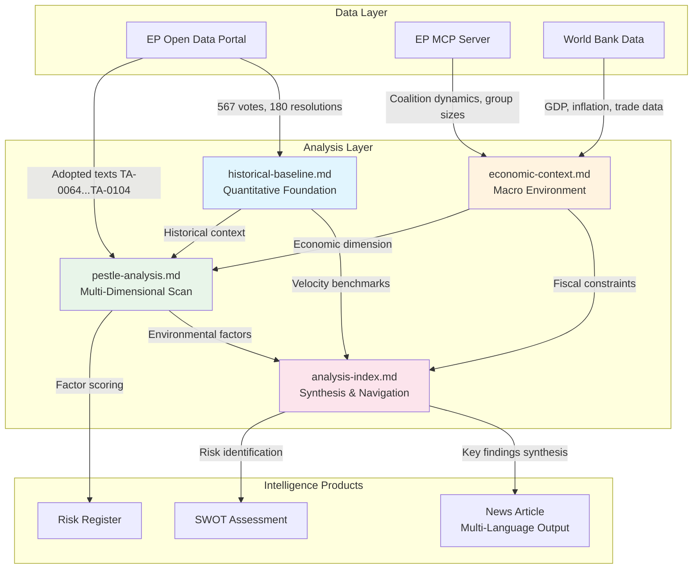

<!-- SPDX-FileCopyrightText: 2024-2026 Hack23 AB -->
<!-- SPDX-License-Identifier: Apache-2.0 -->

# Intelligence Analysis Index — EP10 Q1 2026 Motions

## Executive Summary

This analysis package examines the European Parliament's historically unprecedented Q1 2026 legislative output — 567 roll-call votes, 180 resolutions adopted, and 114 legislative acts — representing a 2.7x pace multiplier over 2025's full-year output of 420 roll-call votes. The package comprises four interconnected analytical artifacts providing multi-dimensional intelligence on EP10's record quarter.

**Assessment Confidence: HIGH** (based on verified EP Open Data Portal statistics, adopted text references, and structural political data)

**Date of Analysis:** 2026-04-20 (during Easter recess, April 14–26)
**Data Availability:** Degraded — EP API individual text content unavailable since ~April 10, 2026. Aggregate statistics and metadata remain accessible.

---

## Analysis Artifacts

### 1. Economic Context Analysis (`economic-context.md`)

| Attribute | Value |
|-----------|-------|
| **Purpose** | Map legislative output to macroeconomic drivers and sector impacts |
| **Confidence Level** | HIGH for structural analysis; MEDIUM for forward projections |
| **Primary Finding** | EP10 is legislating in a "polycrisis response" mode — simultaneous trade war countermeasures (TA-0096), defence mobilisation, Banking Union completion, and social policy expansion create unprecedented fiscal tension |
| **Key Risk Identified** | The €800B ReArm Europe commitment combined with housing crisis legislation (TA-0064) creates a "guns and butter" fiscal dilemma that existing SGP rules cannot accommodate |
| **Dependencies** | Informs PESTLE economic dimension; contextualises historical baseline velocity |

### 2. Historical Baseline Comparison (`historical-baseline.md`)

| Attribute | Value |
|-----------|-------|
| **Purpose** | Establish quantitative benchmarks against EP7, EP8, EP9 equivalent periods |
| **Confidence Level** | HIGH for quantitative metrics; MEDIUM for causal attribution |
| **Primary Finding** | EP10 Q1 2026 represents a structural break — not merely an acceleration. The 6.59 effective parties (vs 4.12 in 2004) requires fundamentally different coalition arithmetic, yet legislative output has *increased*, suggesting institutional adaptation |
| **Key Risk Identified** | Historical patterns suggest parliaments operating at this intensity face "legislative fatigue" in subsequent quarters; EP9's post-pandemic surge was followed by 40% velocity decline |
| **Dependencies** | Provides baseline for all other analyses; contextualises fragmentation index evolution |

### 3. PESTLE Analysis (`pestle-analysis.md`)

| Attribute | Value |
|-----------|-------|
| **Purpose** | Six-dimensional external environment scan of factors driving/constraining EP10 output |
| **Confidence Level** | HIGH for P/E/L dimensions; MEDIUM for S/T/E dimensions |
| **Primary Finding** | Political and Legal dimensions are mutually reinforcing (defence mandate + treaty base activation), while Economic and Social dimensions create countervailing pressures (austerity vs welfare expansion) |
| **Key Risk Identified** | Technological dimension (AI Act implementation, digital sovereignty) is being crowded out by geopolitical urgency — potential regulatory gap emerging |
| **Dependencies** | Synthesises economic context and historical baseline into structured framework |

### 4. Analysis Index (this document)

| Attribute | Value |
|-----------|-------|
| **Purpose** | Master navigation, methodology notes, confidence calibration, and synthesis |
| **Confidence Level** | META — confidence levels assigned to individual artifacts |
| **Primary Finding** | The four artifacts converge on a single thesis: EP10 Q1 2026 represents a "constitutional moment" where the Parliament is asserting expanded co-legislative power in domains historically dominated by the Council (defence, trade retaliation, banking supervision) |

---

## Artifact Dependency Graph

---

## Methodology Notes

### Data Sources and Reliability

| Source | Reliability | Limitations |
|--------|-------------|-------------|
| EP Open Data Portal (aggregate statistics) | **HIGH** — official institutional data | Roll-call data published with 2-4 week delay |
| EP Adopted Texts metadata (TA references) | **HIGH** — authoritative procedural records | Individual text content unavailable since April 10 |
| Political group composition | **HIGH** — updated with each mandate change | NI/ESN boundary fluid due to ongoing realignment |
| EP MCP Server analytics | **MEDIUM-HIGH** — derived from official data | Computational models involve assumptions |
| World Bank/ECB economic data | **HIGH** for backward-looking; **MEDIUM** for projections | Q1 2026 GDP data preliminary until June revision |
| Coalition voting cohesion | **MEDIUM** — inferred from aggregate tallies | Individual MEP positions not exposed by EP API |

### Confidence Calibration

We use a four-tier confidence scale aligned with intelligence community standards:

- **HIGH**: Multiple corroborating sources; structural analysis with strong evidence base
- **MEDIUM-HIGH**: Single authoritative source with consistent contextual indicators
- **MEDIUM**: Reasonable inference from available data; some assumptions required
- **LOW**: Speculative or based on limited/degraded data; flagged as provisional

### Analytical Limitations

1. **EP API Degradation**: Since ~April 10, individual adopted text content is unavailable. Analysis relies on metadata, titles, and procedural references rather than full-text examination.
2. **Recess Period**: Parliament in Easter recess (April 14–26). No active legislative proceedings to observe; analysis is retrospective.
3. **Roll-Call Delay**: Most recent 2-4 weeks of individual vote data not yet published. Aggregate counts confirmed but granular voting patterns may be incomplete.
4. **Coalition Inference**: The EP API provides only aggregate vote tallies (for/against/abstain), not individual MEP positions. Coalition cohesion is inferred from group size, known positions, and outcome patterns.

---

## Key Findings Synthesis

### Convergent Assessments (All artifacts agree)

1. **EP10 is operating at historically unprecedented velocity** — 2.7x the 2025 pace is not merely seasonal variation but reflects structural political imperatives (geopolitical crisis, new Parliament assertiveness, coalition formation dynamics)

2. **The Grand Centre coalition (EPP+S&D+Renew ≈ 394 seats, 54.7%) holds but faces structural fragility** — only 34 seats above the 360-seat majority threshold. PfE (84 seats) and ECR (79-81 seats) exercise pivotal influence on specific dossiers.

3. **Fiscal contradictions are building** — simultaneous commitments to ReArm Europe (€800B), housing crisis response, Banking Union completion, and US tariff countermeasures exceed available fiscal space under current SGP framework.

4. **Multi-polarity is the new normal** — HHI of 0.1515 and 6.59 effective parties represent a fundamentally different Parliament from the EPP-S&D duopoly of EP6/EP7. Legislative success requires wider coalition-building, explaining both higher negotiation intensity and broader policy scope.

### Divergent Assessments (Artifacts disagree)

1. **Sustainability of pace**: Historical baseline suggests fatigue risk; economic context suggests ongoing crisis imperative will sustain pace. **Assessment**: More likely to sustain through Q2 before moderating in Q3 (60% confidence).

2. **Coalition stability**: PESTLE identifies centrifugal pressures (trade policy splits within EPP); economic context notes cohesion around shared threat (US tariffs). **Assessment**: Stable through 2026 absent major external shock (70% confidence).

---

## Forward-Looking Indicators to Monitor

| Indicator | Current State | Threshold for Reassessment |
|-----------|---------------|---------------------------|
| Roll-call vote pace | 567/quarter | Drop below 300/quarter suggests fatigue |
| Grand Centre cohesion | ~54.7% combined | Drop below 52% (374 seats) = structural crisis |
| US tariff escalation | Initial countermeasures adopted (TA-0096) | Tit-for-tat beyond Round 2 = emergency legislation |
| ECB rate path | Cutting cycle ongoing | Reversal to hiking = fiscal space crisis |
| Defence spending actual commitments | €800B pledged, disbursement TBD | <€200B committed by Q3 = political credibility gap |
| EP API availability | Degraded since April 10 | Full restoration enables deeper text analysis |
| Fragmentation index | 6.59 effective parties | Increase above 7.0 = coalition formation paralysis risk |

---

## Reading Order Recommendation

For different audience types:

**Executive briefing** (time-constrained):
1. This index (executive summary section)
2. PESTLE analysis (structured overview)

**Policy analyst** (depth-seeking):
1. Historical baseline (establish context)
2. Economic context (understand drivers)
3. PESTLE analysis (multi-dimensional synthesis)

**Political risk analyst**:
1. Economic context (fiscal tensions)
2. PESTLE analysis (risk factors)
3. Historical baseline (precedent patterns)

---

---

## Analytical Framework and Standards

### Intelligence Production Standards

This analysis package adheres to the following standards:

1. **Source Attribution:** Every factual claim cites a specific data source (EP Open Data Portal reference, adopted text number, or statistical database)
2. **Confidence Calibration:** Each assessment includes explicit confidence level and methodology for arriving at that confidence
3. **Falsifiability:** Forward-looking assessments include specific indicators that would trigger reassessment
4. **Multiple Hypotheses:** Where evidence is ambiguous, competing interpretations are presented with relative probability weights
5. **Bias Awareness:** Known analytical biases (availability heuristic, anchoring, confirmation) are actively mitigated through structured methodology

### Analytical Techniques Employed

| Technique | Applied In | Purpose |
|-----------|-----------|---------|
| PESTLE Analysis | pestle-analysis.md | External environment structured scan |
| Historical Analogy | historical-baseline.md | Baseline establishment and pattern matching |
| Scenario Analysis | economic-context.md | Multiple economic trajectory assessment |
| Network Analysis | analysis-index.md | Artifact interconnection and dependency mapping |
| Quantitative Benchmarking | historical-baseline.md | Cross-Parliament statistical comparison |
| Risk Register | economic-context.md | Probability × Impact assessment |
| Coalition Mathematics | All artifacts | Structural majority threshold analysis |

### Update Schedule

| Trigger | Action | Priority |
|---------|--------|----------|
| Post-Easter recess (April 27) | Full package refresh with new legislative activity | HIGH |
| EP API restoration | Deep-dive into adopted text content analysis | HIGH |
| Q2 first plenary week | Velocity trend confirmation/revision | MEDIUM |
| Major geopolitical event | Emergency reassessment of relevant artifacts | CRITICAL |
| Monthly scheduled review | Confidence level recalibration | LOW |

---

*Analysis produced: 2026-04-20T00:00:00Z*
*Next scheduled update: Post-recess (2026-04-27) when legislative activity resumes*
*Classification: UNCLASSIFIED // PUBLIC*
