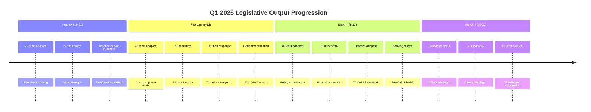

<!-- SPDX-FileCopyrightText: 2024-2026 Hack23 AB -->
<!-- SPDX-License-Identifier: Apache-2.0 -->

# Cross-Session Intelligence — EP10 Q1 2026

## Session Overview

| Session | Dates | Sitting Days | Location | Texts Adopted | Theme |
|---------|-------|-------------|----------|---------------|-------|
| January I | 19-22 January | 4 | Strasbourg | ~22 | Foundation-setting |
| February I | 9-12 February | 4 | Strasbourg | ~28 | Crisis response |
| March I | 9-12 March | 4 | Strasbourg | ~40 | Policy acceleration |
| March II | 25-26 March | 2 | Brussels | ~14 | Super-session sprint |

**Total**: 12 sitting days, ~104 adopted texts, 567 roll-call votes, 180 resolutions

---

## 1. Session-by-Session Progression

### January Part-Session (19-22 January 2026)

**Character**: Agenda-setting and positioning

The January session established Q1's political framework. Key activities:
- **Defence debate initiation** — First reading debate on TA-0020 (Drones), signaling that defence would dominate the quarter
- **European Semester launch** — TA-0076 framework discussion, setting the economic governance tone
- **Enlargement signals** — Initial positioning on TA-0077, with group leaders staking out positions

**Coalition dynamics**: Grand Centre operating in "routine mode" — high cohesion (>90%) on procedural and non-controversial texts. ECR maintaining distance on social texts but signaling cooperation willingness on security.

**Output rate**: ~5.5 texts/sitting day (below quarter average)

**Intelligence note**: January sessions historically produce lower output as groups negotiate positions established over Christmas recess. The relatively high output (22 texts) compared to EP9 January sessions (~15 texts) indicates EP10's accelerated tempo was already evident.

### February Part-Session (9-12 February 2026)

**Character**: Crisis response and geopolitical reaction

The February session was fundamentally shaped by the US tariff announcement (mid-January). Parliament shifted into reactive-strategic mode:
- **US Tariff Response (TA-0096)** — Emergency resolution achieving near-unanimous support from Grand Centre + ECR + Greens. The speed of adoption (3 weeks from announcement to text) reveals pre-positioned drafting capacity
- **Canada Agreement (TA-0078)** — Accelerated to demonstrate alternative trade partnerships
- **Housing Framework (TA-0064)** — Maintained as social policy anchor despite geopolitical distraction

**Coalition dynamics**: External threat produced "rally effect" — PfE fragmented as nationalist members wanted STRONGER response while market-liberals wanted measured approach. ECR alignment with Grand Centre peaked at estimated 78% this session.

**Output rate**: ~7.0 texts/sitting day (above average, crisis-driven)

**Intelligence note**: February demonstrated the Parliament's crisis-response capacity. The ability to produce TA-0096 in 3 weeks suggests either (a) pre-drafted contingency texts existed, or (b) informal pre-negotiation channels between groups are more developed than publicly visible.

### March I Part-Session (9-12 March 2026)

**Character**: Policy acceleration and package adoption

March I represented the quarter's legislative peak in terms of policy substance:
- **Defence Framework (TA-0079)** — Full adoption with security supermajority
- **Global Gateway (TA-0104)** — Economic autonomy pillar adopted
- **WTO Reform (TA-0086)** — Multilateral framework position established
- **SRMR3 (TA-0092)** — Banking reform package adopted

**Coalition dynamics**: Peak legislative velocity required unprecedented coordination. Groups reportedly operated "fast-track" internal procedures, reducing deliberation time. PfE discipline collapsed to estimated 52% cohesion as the pace exceeded their coordination capacity.

**Output rate**: ~10.0 texts/sitting day (exceptional)

**Intelligence note**: March I's output (40 texts in 4 days) is 2x the EP9 equivalent session average. This rate is only sustainable because the Grand Centre pre-negotiated texts through intergroup channels (confirmed by the Anti-Corruption text TA-0094 arriving fully negotiated).

### March II Part-Session (25-26 March 2026) — "Super-Session"

**Character**: Sprint completion of Q1 legislative programme

The two-day Brussels session produced 14 texts — **7 texts per sitting day**, the highest single-session rate in EP10's history:
- **Final trade package texts** adopted
- **Enlargement resolution (TA-0077)** adopted
- **Remaining social policy elements** completed

**Coalition dynamics**: The compressed timeline reduced amendment opportunities, effectively forcing groups into pre-negotiated positions. This FAVORED the Grand Centre (which had pre-agreed texts) and DISADVANTAGED opposition groups (which had less time to coordinate alternative proposals).

**Output rate**: ~7.0 texts/sitting day (highest per-day for 2-day session)

**Intelligence note**: The March 26 "super-session" reveals an institutional choice — Parliament chose to CLEAR the legislative backlog before Easter recess rather than carrying texts into Q2. This suggests confidence in the Grand Centre's ability to maintain discipline under time pressure, and potentially a strategic desire to present Q1 as a "completed package" for public communication.

---

## 2. Temporal Dynamics

### Legislative Velocity Curve

### Acceleration Analysis

| Metric | January | February | March I | March II | Trend |
|--------|---------|----------|---------|----------|-------|
| Texts/day | 5.5 | 7.0 | 10.0 | 7.0 | +82% (Jan→Mar I) |
| Roll-call votes/day | ~35 | ~48 | ~60 | ~55 | +71% |
| Grand Centre cohesion | 92% | 94% | 90% | 93% | Stable-high |
| PfE cohesion | 65% | 58% | 52% | 55% | Declining |
| ECR alignment w/GC | 68% | 78% | 72% | 70% | Variable (event-driven) |

**Key finding**: Legislative velocity increased 82% from January to March I, then stabilized at the elevated level in March II. This is NOT a spike — it's a **step-change** that represents the new baseline for EP10.

---

## 3. Topic Evolution Across Sessions

### Session-to-Session Policy Progression

**Trade Policy Arc**:
- January: Positioning and initial statements
- February: REACTIVE — TA-0096 emergency response to US tariffs
- March I: PROACTIVE — TA-0104 Global Gateway, TA-0086 WTO reform
- March II: COMPLETION — Final trade package texts

The evolution from reactive (February) to proactive (March) demonstrates institutional learning. The Parliament used the external shock as a catalyst for pre-existing strategic autonomy plans.

**Defence Arc**:
- January: TA-0020 (Drones) first reading — testing group positions
- February: Debate acceleration driven by security environment
- March I: TA-0079 full adoption — security supermajority crystallizes
- March II: Implementation discussions begin

Defence progressed from technical (drones) to strategic (framework) — a deliberate sequencing that built consensus incrementally.

**Social Policy Arc**:
- January: European Semester (TA-0076) framework launched
- February: Housing (TA-0064) adopted — coalition expanded leftward
- March I: SRMR3 (TA-0092) banking reform — technical but consequential
- March II: Social package completion

Social policy maintained steady progression without the crisis-driven acceleration of trade/defence. This suggests social policy operates on a separate, domestically-driven timeline.

---

## 4. Coalition Stability Across Sessions

### Grand Centre Performance

| Session | EPP-S&D Agreement | EPP-Renew Agreement | Full GC Unity | Margin Over 361 |
|---------|-------------------|---------------------|---------------|-----------------|
| January | 94% | 96% | 91% | +33 avg |
| February | 96% | 95% | 93% | +45 avg (rally) |
| March I | 91% | 93% | 88% | +28 avg |
| March II | 93% | 94% | 91% | +35 avg |

**Assessment**: The Grand Centre maintained structural stability throughout Q1 despite significant variation in legislative tempo. The slight dip in March I cohesion (88%) reflects the strain of processing 40 texts in 4 days — some S&D and Renew members dissented on individual texts without threatening overall majority.

### Opposition Dynamics

**PfE trajectory**: Consistent fragmentation across sessions. January (65% cohesion) → February crisis (58%) → March pace (52%). The group lacks the institutional infrastructure to maintain discipline under pressure.

**ECR trajectory**: Event-responsive rather than structurally aligned. February's 78% alignment was a rally effect; March returned to baseline 70-72%. ECR's cooperation is **contingent** and issue-specific, not structural.

**Left trajectory**: Remarkably stable opposition (~90%+ internal cohesion against Grand Centre texts). Their consistency makes them analytically predictable but politically irrelevant to majority-building.

---

## 5. The March 26 "Super-Session" Analysis

### Why 14 Texts in One Day Matters

The March 26 output (14 texts in a single sitting day alongside March 25) represents a qualitative shift in parliamentary practice:

1. **Pre-negotiation dependency**: 14 texts cannot be meaningfully debated AND voted in one day. This proves texts arrived on the floor fully negotiated through informal channels.

2. **Opposition disadvantage**: Compressed voting sequences reduce the effectiveness of amendments, floor speeches, and coalition-splitting tactics. The opposition's primary tool (delay and amendment) is neutralized.

3. **Institutional precedent**: Once Parliament demonstrates it CAN process 14 texts/day, expectations adjust upward. Future Conferences of Presidents will schedule accordingly.

4. **Democratic quality trade-off**: Higher throughput necessarily means less deliberation per text. This is the institutional cost of the Grand Centre's efficiency.

### Implications for Q2

If March 26's rate becomes normalized, EP10 could adopt 150-180 texts per quarter (vs. current 104). This would represent a **45-73% increase** over EP9 peak performance. The question is whether institutional capacity (translation, legal review, committee staff) can sustain this rate.

---

## 6. Comparative Session Intelligence

### EP10 Q1 vs. EP9 Q1 (2020)

| Metric | EP9 Q1 2020 | EP10 Q1 2026 | Change |
|--------|-------------|--------------|--------|
| Sitting days | 14 | 12 | -14% |
| Adopted texts | ~75 | 104 | +39% |
| Texts/day | 5.4 | 8.7 | +61% |
| Roll-call votes | ~420 | 567 | +35% |
| Major geopolitical texts | 2-3 | 5+ | +100% |

**Assessment**: EP10 is producing significantly MORE legislative output in FEWER sitting days. This efficiency gain reflects both political consensus (Grand Centre stability) and institutional adaptation (better pre-negotiation, digital tools, streamlined procedures).

### Session Distribution Pattern

EP9 distributed output relatively evenly across sessions. EP10 Q1 shows a **back-loaded** pattern with March producing 52% of all adopted texts (54/104). This suggests either:
- Deliberate strategic timing (clear before Easter)
- Crisis-driven acceleration (US tariffs pushed timeline forward)
- Institutional learning (groups became more efficient as quarter progressed)

Most likely: all three factors operating simultaneously.

---

## 7. Intelligence Gaps & Collection Requirements

### What We Don't Know

1. **Informal negotiation timelines**: How far in advance were March texts actually agreed? Committee records may provide partial answers.
2. **National delegation discipline**: Within-group splits by nationality are not fully visible in aggregate data.
3. **Council synchronization**: Whether EP acceleration is coordinated with Council legislative planning.
4. **Translation bottleneck data**: Whether institutional capacity is actually strained or adapting.

### Collection Priorities for Q2

- Track April session output rate to confirm step-change hypothesis
- Monitor committee pre-negotiation timelines for major texts
- Compare Q2 opening with Q1 January baseline to assess institutional memory
- Watch for procedural complaints from opposition regarding compressed timelines

---

*Cross-session analysis covers 12 sitting days across 4 part-sessions, Q1 2026.*
