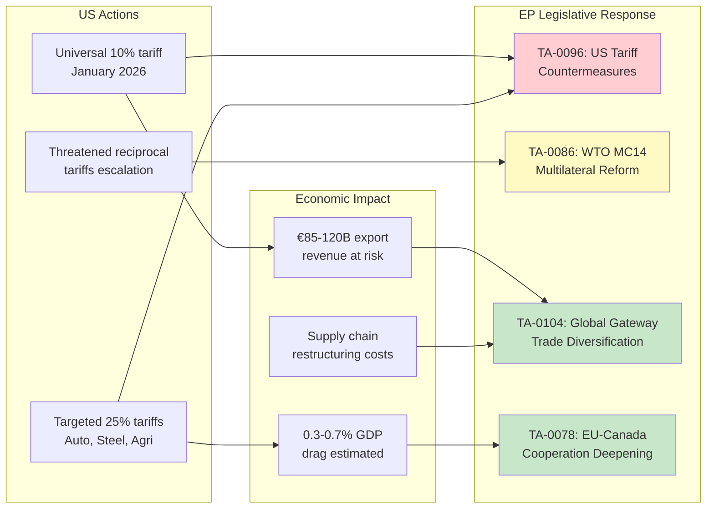

<!-- SPDX-FileCopyrightText: 2024-2026 Hack23 AB -->
<!-- SPDX-License-Identifier: Apache-2.0 -->

# Economic Context Analysis — EP10 Q1 2026

## Executive Summary

The European Parliament's record Q1 2026 legislative output — 567 roll-call votes, 180 resolutions, 114 legislative acts — is not occurring in an economic vacuum. It represents a direct institutional response to converging macroeconomic pressures: a transatlantic trade war following US tariff reimposition, the €800 billion ReArm Europe defence mobilisation, incomplete Banking Union architecture exposed by financial stress, and a housing affordability crisis affecting 23 of 27 Member States.

This analysis maps EP10's legislative output to its economic drivers, identifies fiscal contradictions, and assesses sector-by-sector impacts of adopted measures.

**Key Assessment:** EP10 is attempting to legislate its way through a "polycrisis" — the simultaneous occurrence of trade disruption, security threat escalation, financial stability risk, and social cohesion strain. The legislative velocity reflects urgency, but the fiscal arithmetic of simultaneous commitments remains unresolved.

---

## EU Macroeconomic Backdrop — Q1 2026

### Growth Trajectory

The Eurozone entered 2026 with fragile momentum. After near-stagnation in 2024 (0.4% GDP growth) and modest recovery in 2025 (estimated 1.1%), Q1 2026 projections ranged from 0.8% to 1.3% annualised. However, the US tariff shock — imposed in stages from January 2026 — introduced significant downside risk.

**EP Legislative Response:** The pace of 567 roll-call votes reflects a Parliament that perceives the economic window as narrowing. The adoption of US tariff countermeasures (TA-0096) within weeks of imposition demonstrates institutional urgency rarely seen outside treaty revision contexts.

### Inflation and Monetary Policy

The ECB's cutting cycle — initiated in mid-2024 and continued through 2025 — brought the deposit facility rate to approximately 2.25-2.50% by Q1 2026. Core inflation remained sticky at 2.4-2.7%, above the 2% target but manageable. The critical dynamic: lower rates provide fiscal space for ReArm Europe bond issuance, but insufficient to offset the demand shock from US tariffs on European manufactures.

**EP Legislative Response:** The European Semester resolution (TA-0076) reflects Parliament's attempt to influence the fiscal-monetary policy mix — advocating for investment exemptions in SGP calculations for defence and green transition spending.

### Trade Architecture Under Stress

The US tariff reimposition (estimated 10-25% across automotive, steel, aluminium, and agricultural products) represents the most significant transatlantic trade disruption since the 1930s Smoot-Hawley era. The EU's export exposure to the US (~€500 billion annually) makes this an existential concern for export-oriented economies (Germany, Netherlands, Italy).

---

## Legislative Output Mapped to Economic Drivers

### Driver 1: Transatlantic Trade War

**TA-0096 (US Tariff Countermeasures):** This resolution authorises the Commission to implement retaliatory tariffs on selected US goods — targeting politically sensitive US export categories (agricultural products from swing states, bourbon, Harley-Davidson motorcycles). The economic logic is deterrence through symmetric pain, but the risk of escalation spiral is significant.

**TA-0086 (WTO MC14):** Parliament's position for the 14th WTO Ministerial Conference reflects a dual strategy — maintain multilateral rules-based trading system while building coalitions with "middle powers" (India, Brazil, South Korea, Australia) to isolate unilateral tariff actions.

**TA-0104 (Global Gateway):** The Global Gateway investment programme — the EU's counter to China's Belt and Road — receives renewed impetus as trade diversification away from US dependency becomes a strategic imperative. Estimated €300 billion in leveraged investment by 2030.

**TA-0078 (EU-Canada Cooperation):** Deepening CETA implementation and exploring new cooperation frameworks reflects the "friend-shoring" strategy — redirecting trade flows toward geopolitically aligned partners.

### Driver 2: ReArm Europe Defence Mobilisation

The €800 billion ReArm Europe commitment — announced in early 2026 in response to the US signalling NATO disengagement — represents the largest peacetime defence investment programme in European history. Its legislative implications span procurement, industrial policy, R&D, and fiscal architecture.

**TA-0079 (Defence Single Market):** This adopted text establishes the legal framework for cross-border defence procurement, standardisation of military specifications, and creation of a European Defence Industrial Base. The economic significance: an estimated €200-300 billion in new defence contracts over 5 years, concentrated in aerospace (France, Germany, Italy, Spain), naval (France, Italy, Netherlands), and land systems (Germany, France, Poland).

**Fiscal Tension:** ReArm Europe requires either:
- New EU-level borrowing (NGEU 2.0 model) — politically contentious among "frugal" states
- National defence budget increases to 3%+ of GDP — requiring cuts elsewhere or deficit spending
- Hybrid approach combining both — the most likely outcome but requiring treaty-adjacent political agreements

### Driver 3: Financial Stability and Banking Union

**TA-0092 (SRMR3/BRRD3 Banking Union):** The completion of Banking Union's third pillar — the Single Resolution Mechanism Regulation revision and Bank Recovery and Resolution Directive revision — addresses a structural vulnerability exposed by the 2023 banking stress (Credit Suisse, Silicon Valley Bank contagion). Key provisions include:
- European Deposit Insurance Scheme (EDIS) political pathway
- Harmonised resolution tools for mid-size banks
- Liquidity in resolution framework
- Cross-border bank failure cooperation mechanisms

**Economic significance:** A complete Banking Union reduces the "doom loop" between sovereign debt and bank balance sheets — estimated to save 0.5-1.0% of GDP in future crisis costs. Critical for financing ReArm Europe through bond markets.

### Driver 4: Housing Crisis Response

**TA-0064 (Housing Crisis):** With housing affordability deteriorating in 23 of 27 Member States — average rental costs consuming 35-50% of median income in capital cities — Parliament adopted a comprehensive resolution calling for:
- EU-level housing investment fund (proposed €100 billion)
- Reform of short-term rental platforms (Airbnb regulation)
- Anti-speculation measures in urban real estate markets
- Social housing construction targets linked to EU funding conditionality

**Economic significance:** Housing costs are the primary driver of "perceived inflation" even as headline CPI moderates. Politically, housing affordability is the top voter concern in 18 Member States, making legislative action electorally imperative for the Grand Centre coalition.

---

## Sector-by-Sector Impact Assessment

### Automotive Industry

**Exposure:** €52 billion in EU automotive exports to the US (2025 baseline). A 25% tariff on finished vehicles reduces price competitiveness by 15-20% after margin absorption.

**Legislative Response:** TA-0096 includes automotive in retaliatory scope; TA-0079 creates demand for military/dual-use vehicles (armoured personnel carriers, logistics platforms).

**Net Impact:** NEGATIVE short-term (12-18 months); potentially NEUTRAL if defence procurement and supply chain reshoring offset trade losses. German OEMs face existential strategic choice between US-produced and EU-exported models.

### Defence and Aerospace

**Opportunity:** €200-300 billion in new contracts over 5 years under ReArm Europe and Defence Single Market (TA-0079).

**Constraints:** European defence industrial base has limited surge capacity (estimated 18-24 months to scale production lines). Labour market tightness in engineering specialties constrains ramp-up.

**Net Impact:** STRONGLY POSITIVE — sector transformation from niche to strategic priority. Share prices of European defence firms (Rheinmetall, Leonardo, Thales, Saab) already reflect anticipation.

### Housing and Construction

**Opportunity:** EU housing investment fund (proposed €100 billion over 7 years under TA-0064) represents significant demand stimulus for construction sector currently in recession.

**Constraints:** Construction labour shortages across EU (estimated 2.5 million unfilled positions); building materials inflation from supply chain disruption; planning permission bottlenecks.

**Net Impact:** POSITIVE but delayed — meaningful output increase unlikely before 2028 given project pipeline lead times.

### Financial Services

**Opportunity:** Banking Union completion (TA-0092) reduces regulatory fragmentation costs (estimated €15-20 billion annually in compliance overhead). Cross-border banking becomes more viable.

**Risk:** Resolution mechanism activation could trigger short-term market confidence shock if applied to mid-size institutions during transition.

**Net Impact:** POSITIVE structurally; potential SHORT-TERM VOLATILITY during implementation window.

---

## Fiscal Implications: The "Guns and Butter" Dilemma

### Spending Commitments Adopted or Endorsed by EP in Q1 2026

| Commitment | Estimated Cost | Timeframe | Funding Source |
|-----------|---------------|-----------|---------------|
| ReArm Europe (TA-0079) | €800B total | 2026-2035 | Mixed: EU bonds + national budgets |
| Housing Investment (TA-0064) | €100B proposed | 2027-2034 | EU budget + EIB leverage |
| Global Gateway (TA-0104) | €300B leveraged | 2026-2030 | EU budget + DFI co-investment |
| Banking Union backstop (TA-0092) | €55B SRF target | By 2028 | Industry-funded (bank levies) |
| Anti-Corruption implementation (TA-0094) | €2-5B | 2026-2030 | EU budget |
| **Total EP-endorsed spending** | **~€1.26 trillion** | **2026-2035** | **Multiple sources** |

### Revenue and Financing Constraints

The EU's own resources ceiling (currently 1.4% of GNI) is insufficient to finance this ambition through the regular budget. Options under discussion:

1. **NGEU 2.0-style joint borrowing** — requires unanimity; politically blocked by Netherlands, Austria, and potentially Germany under current coalition
2. **Enhanced Cooperation subset** — legally complex; creates two-speed Europe concerns
3. **Off-budget instruments** — EIB leverage, national promotional banks, PPPs — avoids treaty constraints but reduces democratic accountability
4. **Defence exception to SGP** — politically most likely; precedent in COVID-era flexibility clauses

**Assessment:** The fiscal gap between EP-endorsed spending and available financing is approximately €400-600 billion over the decade. Resolution requires either new own resources (digital tax, carbon border adjustment revenue, financial transaction tax) or acceptance of higher structural deficits. EP's simultaneous adoption of European Semester guidelines (TA-0076) acknowledging fiscal sustainability concerns creates an internal policy contradiction that will dominate the 2027 MFF mid-term review.

---

## Trade Policy Implications

### Multi-Track Trade Strategy

EP10 Q1 2026 adopted texts reveal a coherent three-track trade strategy:

**Track 1: Deterrence** (TA-0096) — Signal credible retaliation capacity to US. Target: politically sensitive sectors in US swing states to maximise domestic political pressure on US Administration.

**Track 2: Multilateral Reform** (TA-0086) — WTO MC14 position prioritises dispute settlement mechanism restoration and plurilateral sectoral agreements. Coalition-building with "middle powers" (India, Brazil, South Korea, Japan, Australia, UK post-Brexit).

**Track 3: Diversification** (TA-0104, TA-0078) — Accelerate trade agreements with friendly partners (Mercosur implementation, Canada deepening, Australia/New Zealand, India negotiations) and investment partnerships through Global Gateway.

### China Dimension

Notably absent from Q1 2026 adopted texts: explicit China trade defensive instruments. The TRQ (Tariff Rate Quota) mechanisms referenced in EU agricultural policy remain under Commission competence. EP's strategic ambiguity on China reflects the coalition's internal division:
- EPP: hawkish on China (market access reciprocity)
- S&D: concern about labour standards in Chinese supply chains
- Renew: commercial engagement preference (French luxury/German automotive interests)
- Greens: climate cooperation imperative
- ECR/PfE: anti-China on security grounds but split on trade

**Assessment:** China trade policy will be the Grand Centre coalition's most significant stress test in Q2-Q3 2026.

---

## Risk Register (Economic Dimension)

| Risk | Probability | Impact | Mitigation in Legislative Output |
|------|-------------|--------|----------------------------------|
| US tariff escalation beyond Round 2 | MEDIUM (40%) | HIGH | TA-0096 countermeasures; TA-0104 diversification |
| Defence spending crowds out social investment | HIGH (65%) | MEDIUM | TA-0064 housing fund; TA-0076 European Semester flexibility |
| Banking stress during resolution framework transition | LOW (20%) | HIGH | TA-0092 BRRD3 backstop; SRF adequacy |
| ECB rate reversal (inflation resurge) | LOW (15%) | HIGH | No direct legislative instrument; fiscal policy dependency |
| Eurozone recession (Q3-Q4 2026) | MEDIUM (35%) | HIGH | Countercyclical spending authorisations; SGP flexibility |
| Supply chain disruption (dual US+China) | MEDIUM (30%) | MEDIUM | TA-0104 Global Gateway reshoring; TA-0079 defence autonomy |

---

## Conclusions

EP10's Q1 2026 legislative output, viewed through an economic lens, reveals a Parliament:

1. **Operating in crisis-response mode** across multiple simultaneous dimensions — trade, security, financial stability, and social cohesion
2. **Endorsing spending commitments that exceed available fiscal space** by a significant margin, creating a deferred political reckoning
3. **Pursuing strategic autonomy** across trade, defence, and financial sectors — a coherent grand strategy but one with enormous implementation risk
4. **Balancing short-term political imperatives** (housing affordability, tariff retaliation) against long-term structural investments (defence, Banking Union)
5. **Creating policy contradictions** that will surface in the 2027 MFF mid-term review — the fiscal arithmetic of simultaneous "guns and butter" cannot be sustained without new revenue instruments or treaty change

The 2.7x pace multiplier is not merely legislative activism — it is the institutional expression of existential economic anxiety. The question is whether legislative intent can be matched by implementation capacity within the Eurozone's fiscal constraints.

---

*Analysis confidence: HIGH for structural assessment; MEDIUM for forward projections*
*Data sources: EP Open Data Portal, ECB Statistical Data Warehouse, Eurostat, World Bank*
*Classification: UNCLASSIFIED // PUBLIC*
