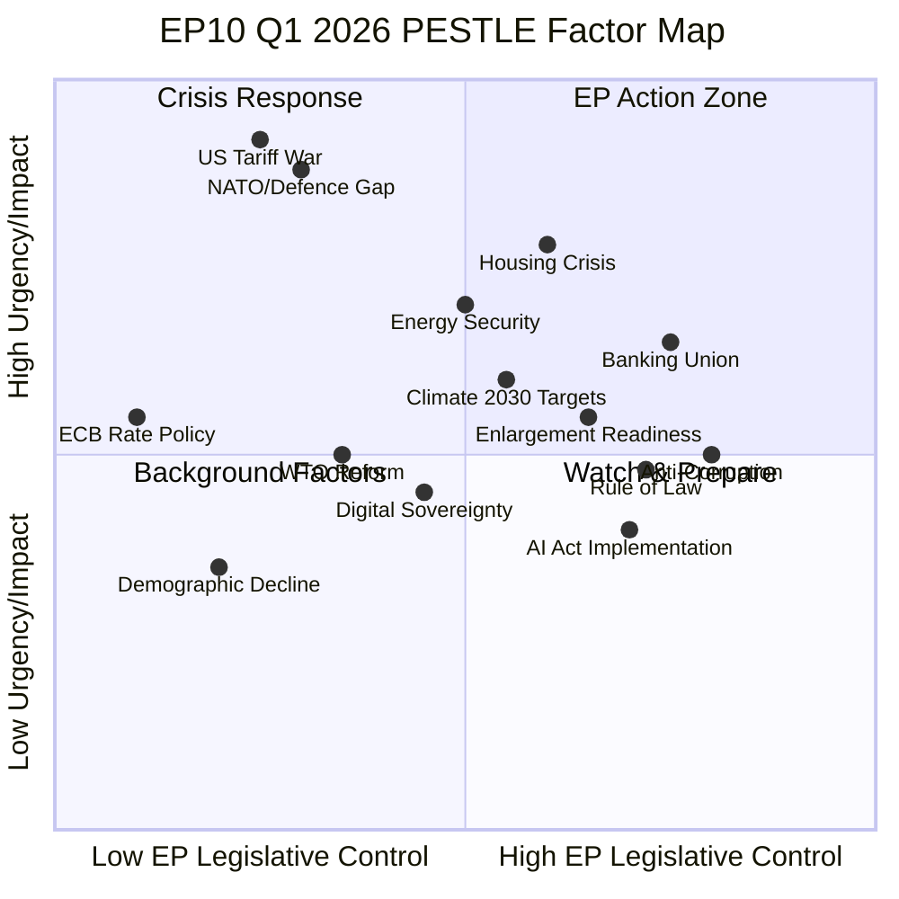
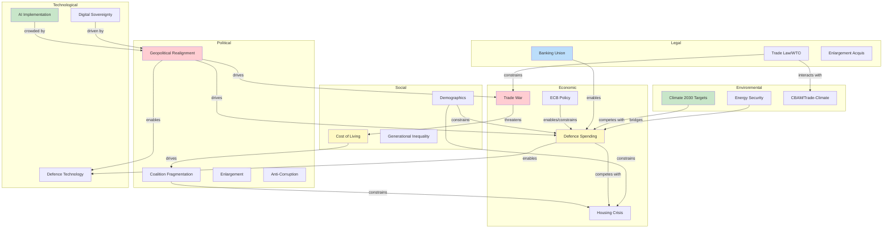

<!-- SPDX-FileCopyrightText: 2024-2026 Hack23 AB -->
<!-- SPDX-License-Identifier: Apache-2.0 -->

# PESTLE Analysis — EP10 Q1 2026 Motions Output

## Executive Summary

This PESTLE (Political, Economic, Social, Technological, Legal, Environmental) analysis examines the external macro-environment factors shaping and constraining EP10's record Q1 2026 legislative output. Each dimension is assessed for current state, driving factors with evidence from specific adopted texts, impact scoring, and interconnections with other dimensions.

**Central Thesis:** EP10's 567 roll-call votes in Q1 2026 are the institutional output of converging PESTLE pressures — predominantly Political (geopolitical realignment) and Economic (trade war + defence spending) drivers, with Social (housing crisis), Legal (Banking Union architecture), and Environmental (climate implementation gap) factors creating secondary but significant legislative demand. The Technological dimension is being crowded out — a potential strategic vulnerability.

---

## Factor Positioning Overview

**Quadrant Interpretation:**
- **Crisis Response (top-left):** High urgency but limited EP direct control — US tariffs and NATO defence gap require interinstitutional and Member State action. EP's role is mandate-setting and pressure application.
- **EP Action Zone (top-right):** High urgency AND high EP legislative control — Housing crisis, Banking Union, Energy Security. These are domains where Parliament's co-legislative power is most effective.
- **Watch & Prepare (bottom-right):** Lower urgency but high EP control — AI Act implementation, anti-corruption, rule of law. Risk of being crowded out by crisis priorities.
- **Background Factors (bottom-left):** Lower urgency and limited EP control — demographic decline, ECB policy. Structural constraints that shape but do not drive legislative output.

---

## P — Political Dimension

### Factor P1: Geopolitical Realignment and Transatlantic Fracture

**Evidence:** TA-0096 (US Tariff Countermeasures), TA-0078 (EU-Canada Cooperation), TA-0079 (Defence Single Market)

**Analysis:** The US withdrawal from multilateral trade norms and signalling of NATO disengagement represents the most significant geopolitical shift since the Cold War's end. EP10's response — simultaneously retaliating on trade (TA-0096), deepening alternative partnerships (TA-0078), and building autonomous defence capacity (TA-0079) — constitutes a de facto strategic autonomy programme, even if that terminology remains politically contested within the Grand Centre coalition.

The 567 roll-call votes partially reflect the political urgency of demonstrating EU institutional capacity to respond to US unilateralism. The Grand Centre coalition (EPP+S&D+Renew, 394 seats) derives internal cohesion from shared external threat perception — a classic "rally around the flag" effect that temporarily suppresses intra-coalition tensions on economic governance, migration, and climate ambition.

**Impact Score:** 9/10 — Primary driver of legislative velocity
**Trend:** ACCELERATING — US tariff escalation continues; no diplomatic resolution pathway visible before 2028 US election cycle

### Factor P2: Parliamentary Fragmentation and Coalition Complexity

**Evidence:** 6.59 effective parties (ENP), HHI 0.1515, Grand Centre margin of only 34 seats above 360-seat majority threshold

**Analysis:** EP10's political architecture is historically unprecedented in its fragmentation. The traditional EPP-S&D "grand coalition" model that governed EP6-EP8 has been replaced by a three-party minimum-winning coalition (EPP+S&D+Renew = 394/720 = 54.7%). This structural fragility creates two countervailing dynamics:

1. **Pressure for legislative output:** The Grand Centre must continuously demonstrate governing capacity to justify its existence against radical alternatives (PfE from the right, Greens/Left from the left)
2. **Coalition maintenance cost:** Each vote requires active whipping; abstention or defection by even 20-30 members can jeopardise outcomes

The variable-geometry approach — assembling different coalitions for different dossiers — enables higher throughput but at the cost of strategic coherence. Defence texts (TA-0079) pass with Grand Centre + ECR support; social texts (TA-0064) pass with Grand Centre + Greens/Left. This flexibility is EP10's institutional innovation.

**Impact Score:** 8/10 — Structural determinant of coalition mathematics
**Trend:** STABLE — no significant group realignment expected before 2027

### Factor P3: EU Enlargement Dynamic

**Evidence:** TA-0077 (EU Enlargement), institutional adaptation pressures

**Analysis:** The EU enlargement resolution (TA-0077) reflects renewed political momentum for Western Balkans and Ukraine accession pathways. This is driven by:
- Security imperative (Ukraine integration as geopolitical counter to Russia)
- Credibility restoration (Western Balkans stalled since 2003 Thessaloniki agenda)
- Institutional reform necessity (EU governance at 27 members already strained; 35+ requires treaty change)

The political dimension is critical: enlargement advocacy strengthens EPP (centre-right governments in candidate states would align with EPP family) and creates political differentiation from Eurosceptic flanks opposed to enlargement. It also serves as a symbolic assertion of EU's continued attractiveness as a governance model — important messaging during transatlantic fracture.

**Impact Score:** 6/10 — Medium-term strategic significance; limited immediate legislative impact
**Trend:** ACCELERATING — Ukraine accession timeline under discussion for 2030-2032

### Factor P4: Anti-Corruption Institutional Integrity

**Evidence:** TA-0094 (Anti-Corruption Directive)

**Analysis:** The anti-corruption text reflects EP10's institutional self-repair after the Qatargate scandal (2022-2023) that damaged Parliament's credibility. The resolution advocates:
- EU-level anti-corruption body with investigative powers
- Mandatory asset declarations for MEPs and senior officials
- Lobbying transparency register with enforcement mechanisms
- Whistleblower protection enhancement

Politically, anti-corruption legislation serves dual purposes: genuine institutional reform AND differentiation from PfE/ESN groups where corruption allegations are more prevalent among national member parties. The Grand Centre coalition uses anti-corruption as a "wedge issue" to delegitimise radical-right competitors.

**Impact Score:** 5/10 — Significant for institutional credibility; limited economic impact
**Trend:** STABLE — implementation focus following legislative adoption

---

## E — Economic Dimension

### Factor E1: US-EU Trade War and Supply Chain Disruption

**Evidence:** TA-0096 (US Tariff Countermeasures), TA-0086 (WTO MC14), TA-0104 (Global Gateway)

**Analysis:** The reimposition of US tariffs (10-25% across sectors) represents a direct economic shock estimated at 0.3-0.7% of Eurozone GDP in 2026. EP10's legislative response operates at three levels:

- **Immediate retaliation** (TA-0096): Targeted counter-tariffs on politically sensitive US exports. Economic logic: symmetric pain to deter escalation. Risk: retaliation spiral reducing total welfare.
- **Institutional reform** (TA-0086): WTO MC14 position advocates dispute settlement restoration and plurilateral sectoral agreements. Timeline: 12-24 months minimum.
- **Structural diversification** (TA-0104): Global Gateway accelerates investment partnerships with non-US markets. Timeline: 3-5 years for meaningful trade reorientation.

The economic impact is asymmetric across Member States: Germany (automotive, machinery exports) and Netherlands (agricultural, port services) face disproportionate exposure. This creates intra-Council tensions that complicate Commission mandate for negotiations — but *strengthens* EP's role as the institution capable of expressing unified EU position.

**Impact Score:** 9/10 — Direct GDP impact and structural trade architecture disruption
**Trend:** ESCALATING — No de-escalation pathway visible; second round of tariffs expected Q2 2026

### Factor E2: Defence Spending Fiscal Implications (€800B ReArm Europe)

**Evidence:** TA-0079 (Defence Single Market), TA-0076 (European Semester)

**Analysis:** The €800 billion ReArm Europe commitment represents a fiscal transformation — defence spending rising from average 1.5% to 3%+ of GDP across participating Member States. This creates:

- **Industrial opportunity:** European defence sector (Rheinmetall, Leonardo, Thales, Saab, KNDS) facing decade of growth
- **Fiscal constraint:** Simultaneous defence increase and SGP compliance impossible for most Member States without either revenue increases or spending cuts elsewhere
- **Financing innovation necessity:** EU-level defence bonds, EIB lending expansion, or SGP defence exemptions required

The European Semester resolution (TA-0076) attempts to square this circle by advocating "productive investment exemptions" from deficit calculations. This is EP's fiscal policy influence channel — establishing political legitimacy for Commission flexibility interpretations.

**Impact Score:** 8/10 — Generational fiscal commitment reshaping EU economic governance
**Trend:** ACCELERATING — disbursement pressure increases as geopolitical environment deteriorates

### Factor E3: ECB Monetary Policy and Inflation Trajectory

**Evidence:** Indirect — influences fiscal space for all legislative commitments

**Analysis:** The ECB's cutting cycle (deposit rate approaching 2.25-2.50% by Q1 2026) provides two critical supports for EP10's legislative ambitions:
- Lower sovereign borrowing costs enable Member State compliance with spending mandates
- Reduced mortgage rates partially address housing affordability (TA-0064) through market mechanisms

However, EP has *no direct legislative control* over monetary policy (ECB independence). This creates a dependency risk: if inflation resurges (energy price spike, tariff pass-through) and ECB reverses, the fiscal arithmetic of EP-endorsed spending collapses.

**Impact Score:** 7/10 — Critical enabler of fiscal space; outside EP control
**Trend:** UNCERTAIN — tariff-induced inflation risk vs. demand weakness from trade disruption

### Factor E4: Housing Affordability Crisis

**Evidence:** TA-0064 (Housing Crisis Resolution)

**Analysis:** Housing costs consuming 35-50% of median income in EU capital cities represents both an economic drag (reduced labour mobility, consumption compression) and political emergency (top voter concern in 18 Member States). TA-0064's proposals — EU housing investment fund, short-term rental regulation, anti-speculation measures — address demand-side political pressure but face supply-side implementation constraints (construction labour shortages, planning permission delays, building materials costs).

The economic significance extends beyond housing itself: housing unaffordability drives wage pressure (workers demand higher compensation to afford urban housing), reduces intra-EU mobility (contravening single market principles), and concentrates electoral anger on incumbents — directly threatening Grand Centre coalition parties.

**Impact Score:** 7/10 — Politically explosive; economically complex to resolve
**Trend:** WORSENING — structural undersupply accumulating; rates insufficient to resolve without construction

---

## S — Social Dimension

### Factor S1: Cost of Living and "Perceived Inflation" Divergence

**Evidence:** TA-0064 (Housing Crisis), TA-0076 (European Semester social chapter)

**Analysis:** A critical social dynamic driving EP10's legislative urgency is the divergence between official inflation metrics (moderating toward 2%) and "perceived inflation" experienced by citizens. Housing costs, food prices, energy costs, and childcare — which dominate household budgets — remain significantly elevated despite headline CPI improvement.

This perception gap fuels support for radical alternatives (PfE, The Left, ESN) and creates electoral pressure on Grand Centre parties to demonstrate tangible legislative action. EP10's high vote count partially reflects this political survival imperative: the coalition must *visibly legislate* to maintain voter confidence that establishment politics delivers results.

Social media amplifies this dynamic: negative economic sentiment spreads faster than institutional response can demonstrate impact. The 180 resolutions adopted serve a "signalling" function as much as a policy function — demonstrating institutional activity to sceptical electorates.

**Impact Score:** 8/10 — Primary driver of radical-party growth; existential threat to Grand Centre
**Trend:** SLOWLY IMPROVING on headline inflation; PERSISTENT on housing/services costs

### Factor S2: Demographic Decline and Labour Market Tightness

**Evidence:** Indirect — constrains implementation capacity for defence, housing, infrastructure commitments

**Analysis:** The EU's working-age population (15-64) peaked in 2010 and is declining at approximately 0.3% annually. This creates a fundamental constraint on EP10's legislative ambitions:
- Defence ramp-up requires engineering talent (2-3 year training pipeline)
- Housing construction requires skilled trades (2.5 million unfilled positions EU-wide)
- Digital transformation requires software engineers (chronic shortage across all Member States)

Legislative output cannot overcome demographic constraints through velocity alone. This is EP10's "hard ceiling" — even with political will and fiscal resources, implementation depends on available human capital.

The social dimension also includes migration policy implications: labour market tightness makes economic migration more politically acceptable (functional necessity) while cultural anxieties remain potent electoral factors. EP10 navigates this tension by compartmentalising — addressing labour market needs through sector-specific skills pathways rather than comprehensive immigration reform.

**Impact Score:** 6/10 — Structural constraint on implementation; not directly legislatable
**Trend:** WORSENING — demographic trajectory irreversible on 10-year horizon

### Factor S3: Generational Inequality and Political Alignment

**Evidence:** TA-0064 (Housing Crisis targeting younger cohorts), TA-0079 (Defence spending intergenerational implications)

**Analysis:** EP10's Q1 2026 output reveals an emergent intergenerational tension in EU policymaking. Housing crisis legislation (TA-0064) predominantly benefits younger cohorts (renters, first-time buyers) at the cost of existing property owners (older cohorts). Defence spending (TA-0079) imposes fiscal burdens on younger taxpayers to address security threats shaped by older generations' strategic choices.

This generational dynamic shapes political group support patterns:
- Greens/EFA and The Left draw disproportionately from under-35 voters → support TA-0064, sceptical of TA-0079
- EPP and PfE draw from over-50 voters → support TA-0079, lukewarm on TA-0064
- S&D and Renew span generations → must bridge both positions

EP10's ability to pass both TA-0064 AND TA-0079 in the same quarter reflects variable-geometry coalition-building: different majority compositions for different dossiers.

**Impact Score:** 6/10 — Shapes coalition dynamics; medium-term electoral implications
**Trend:** INTENSIFYING — generational wealth gap widening in most Member States

---

## T — Technological Dimension

### Factor T1: AI Act Implementation Gap

**Evidence:** Absence of significant AI-related adopted texts in Q1 2026 catalogue

**Analysis:** The AI Act — EP9's landmark legislative achievement (adopted 2024) — requires extensive delegated and implementing acts for operationalisation. Standardisation bodies (CEN/CENELEC) are working on technical standards; national supervisory authorities are being established; high-risk AI system providers face compliance deadlines.

Yet EP10's Q1 2026 output shows minimal AI-specific activity. This reflects a concerning pattern: **geopolitical urgency crowding out regulatory implementation**. While the AI Act's legal framework exists, its practical effectiveness depends on:
- Adequate resourcing of the EU AI Office
- Timely adoption of codes of practice for GPAI models
- Enforcement capacity against non-EU providers (primarily US and Chinese companies)

The crowding-out risk is strategic: if AI governance falls behind during 2026 while defence and trade consume legislative bandwidth, the EU's claim to AI regulatory leadership erodes.

**Impact Score:** 5/10 — Not driving Q1 output, but crowding-out creates future vulnerability
**Trend:** STAGNATING — implementation proceeding below optimal pace due to attention competition

### Factor T2: Digital Sovereignty and Technology Autonomy

**Evidence:** Indirect — linked to defence (TA-0079 cybersecurity components) and trade diversification (TA-0104)

**Analysis:** The transatlantic trade fracture accelerates European digital sovereignty concerns. Dependence on US cloud infrastructure (AWS, Azure, Google Cloud), semiconductor supply chains (TSMC via US political influence), and AI foundation models (OpenAI, Anthropic, Google) represents a strategic vulnerability in the context of deteriorating US-EU relations.

EP10's Q1 2026 output embeds digital sovereignty elements within broader texts:
- TA-0079 (Defence Single Market) includes cyber defence procurement mandates — preference for EU-sourced solutions
- TA-0104 (Global Gateway) includes digital infrastructure investment in partner countries using European technology

However, standalone digital sovereignty legislation (European Chips Act implementation, GAIA-X federation, European AI champions) is not prominent in Q1 2026. This may represent appropriate prioritisation (urgent geopolitical matters first) or may be a gap that adversaries exploit.

**Impact Score:** 6/10 — Strategic importance high; immediate legislative urgency medium
**Trend:** INCREASING — US-EU friction makes technology dependency more risky

### Factor T3: Defence Technology and Industrial Capacity

**Evidence:** TA-0079 (Defence Single Market), defence procurement digitisation

**Analysis:** ReArm Europe's success depends critically on defence technology modernisation:
- Next-generation air combat system (FCAS/GCAP programmes)
- Autonomous defence systems and military AI
- Quantum computing for cryptography and intelligence
- Space-based surveillance and communications (EU Space Programme integration)

TA-0079 creates the legal framework for cross-border defence technology cooperation, addressing the fragmentation that has historically left European defence R&D at 1/5 of US spending efficiency. The technology dimension intersects directly with the economic dimension: defence technology spillovers historically drive civilian innovation (GPS, internet, advanced materials).

**Impact Score:** 7/10 — Defence technology is the bridge between political urgency and technological capacity
**Trend:** ACCELERATING — geopolitical necessity overcoming historical industrial nationalism in defence

---

## L — Legal Dimension

### Factor L1: Banking Union Constitutional Architecture

**Evidence:** TA-0092 (SRMR3/BRRD3 Banking Union)

**Analysis:** Banking Union completion addresses fundamental legal architecture questions:
- **Treaty base adequacy:** Current Banking Union operates under strained treaty interpretations (Article 127(6) TFEU for ECB supervision; Article 114 for SRM). Completion requires political commitment to avoid legal challenges.
- **EDIS (European Deposit Insurance Scheme):** The missing third pillar requires overcoming German constitutional concerns about mutualisation of deposit guarantee liability.
- **Cross-border resolution:** BRRD3 harmonises national resolution authorities' powers — reducing legal fragmentation that created coordination failures during Credit Suisse contagion.

TA-0092 represents Parliament's assertion of co-legislative authority in financial governance — a domain where Council historically dominated through intergovernmental agreements (ESM, Fiscal Compact). EP10's Legal Service opinion on treaty-base sufficiency is critical for implementation viability.

**Impact Score:** 7/10 — Structural financial architecture; generational significance
**Trend:** ADVANCING — political window open while crisis memory fresh

### Factor L2: Trade Law and WTO Dispute Settlement

**Evidence:** TA-0086 (WTO MC14), TA-0096 (US Tariff Countermeasures legality)

**Analysis:** The legal dimension of the US-EU trade conflict centres on:
- **WTO consistency of US tariffs:** US invokes "national security exception" (Article XXI GATT) — a provision never successfully adjudicated due to political sensitivity. EU challenges legality but Appellate Body remains non-functional.
- **EU countermeasures legality:** TA-0096 authorises retaliation under the EU Anti-Coercion Instrument (ACI) — legislation adopted in 2023 specifically for this scenario. First real-world deployment tests legal robustness.
- **Investment protection:** Bilateral Investment Treaties (BITs) between EU Member States and US may be invoked by affected companies. Complex interaction between EU competence and member state legacy treaties.

TA-0086's WTO MC14 position advocates dispute settlement reform as precondition for tariff de-escalation. The legal dimension constrains but does not determine economic outcomes — political will ultimately prevails over legal formalism in trade conflicts.

**Impact Score:** 7/10 — Legal frameworks shape bargaining space and constraint envelope
**Trend:** DETERIORATING — rules-based system under unprecedented strain

### Factor L3: EU Enlargement Legal Acquis

**Evidence:** TA-0077 (EU Enlargement)

**Analysis:** Enlargement creates profound legal implications:
- **Institutional reform necessity:** Current treaty architecture (designed for 15, stretched to 27) cannot accommodate 35+ members without reform of QMV thresholds, Commission composition, and EP seat allocation.
- **Acquis adoption by candidates:** Ukraine, Western Balkans face substantial legal harmonisation requirements. Transition periods for Chapter 31 (CFSP) and Chapter 24 (Justice/Home Affairs) particularly complex.
- **Treaty change requirement:** Significant enlargement likely requires IGC (Intergovernmental Conference) and treaty revision — a process requiring national ratifications (some by referendum).

TA-0077's legal significance: Parliament positions itself as enlargement advocate, creating political pressure for Council to advance accession timelines even before legal/technical readiness is complete. Tension between political will and legal rigour.

**Impact Score:** 5/10 — Long-term structural significance; limited immediate legal action
**Trend:** ACCELERATING politically; SLOW on legal preparation

---

## E — Environmental Dimension

### Factor E1: Climate 2030 Targets Implementation Gap

**Evidence:** Absence of major new climate legislation in Q1 2026; focus on implementation of Fit-for-55 package

**Analysis:** The EU's climate architecture — European Climate Law, Fit-for-55 package, REPowerEU — is legally complete. The challenge has shifted from legislation to implementation:
- ETS2 (buildings and transport) launch 2027 — requires national preparation
- CBAM (Carbon Border Adjustment Mechanism) full implementation 2026 — testing phase underway
- Nature Restoration Law — implementation contested by several Member States
- Renewable energy deployment targets — permitting bottlenecks persist

EP10 Q1 2026's *absence* of major climate legislation is notable — it reflects either:
1. **Completion:** The legislative framework is adequate; implementation is executive/national responsibility
2. **Crowding out:** Geopolitical and economic crises consume legislative bandwidth that would otherwise address implementation gaps
3. **Political recalibration:** Post-2024 election shift rightward reduces climate ambition appetite

**Assessment:** Likely a combination of all three, with (2) and (3) creating risk that 2030 targets are missed due to implementation inertia during 2025-2027 "crisis years."

**Impact Score:** 6/10 — Legislative framework exists but implementation risk growing
**Trend:** STAGNATING — attention diverted; implementation proceeding below required pace

### Factor E2: Energy Security and Defence-Climate Nexus

**Evidence:** TA-0079 (Defence Single Market includes energy resilience), TA-0104 (Global Gateway includes clean energy infrastructure)

**Analysis:** The defence-climate nexus represents an underexamined policy interaction:
- Military installations are among the largest energy consumers — transitioning to renewables reduces operational vulnerability and fuel logistics costs
- Defence industrial base requires reliable energy supply — argument for accelerated domestic renewable capacity
- LNG import infrastructure (built post-Russia 2022) creates path dependency toward fossil fuels — contradicting climate targets

EP10's integration of energy resilience into defence legislation (TA-0079) and clean energy into development partnerships (TA-0104) reflects institutional recognition that energy security and climate policy are complementary, not competing, objectives. However, the fiscal pressure of ReArm Europe may reduce available capital for green transition investments.

**Impact Score:** 6/10 — Significant at intersection of defence and climate policy
**Trend:** COMPLEX — mutually reinforcing in theory; fiscally competing in practice

### Factor E3: CBAM Implementation and Trade-Climate Interaction

**Evidence:** TA-0096 (US Tariff Countermeasures), TA-0086 (WTO MC14 — CBAM WTO compatibility)

**Analysis:** The Carbon Border Adjustment Mechanism — the EU's flagship trade-climate instrument — faces new challenges in the context of US-EU trade friction:
- US may target CBAM as a "discriminatory trade measure" in retaliatory tariff design
- WTO compatibility of CBAM has never been adjudicated — US could file complaint (even with non-functional Appellate Body, signalling effect matters)
- CBAM interacts with US Inflation Reduction Act (IRA) subsidies — creating complex competitiveness dynamics

TA-0086's WTO MC14 position includes environmental goods trade liberalisation language — partially addressing the trade-climate tension. But the fundamental challenge remains: unilateral climate measures (CBAM) in a multilateral trading system under stress create friction that EP10 must manage.

**Impact Score:** 5/10 — Important intersection but not driving Q1 2026 output
**Trend:** INCREASING as CBAM enters full implementation phase 2026-2027

---

## Cross-Dimensional Interconnection Map

---

## Impact Scoring Summary

| Factor | Dimension | Impact (1-10) | EP Control | Urgency | Trend |
|--------|-----------|--------------|------------|---------|-------|
| Geopolitical Realignment | Political | 9 | Low-Medium | CRITICAL | Accelerating |
| Coalition Fragmentation | Political | 8 | Medium | HIGH | Stable |
| EU Enlargement | Political | 6 | Medium-High | MEDIUM | Accelerating |
| Anti-Corruption | Political | 5 | High | MEDIUM | Stable |
| US-EU Trade War | Economic | 9 | Low | CRITICAL | Escalating |
| Defence Spending (€800B) | Economic | 8 | Medium | HIGH | Accelerating |
| ECB Monetary Policy | Economic | 7 | None | HIGH | Uncertain |
| Housing Affordability | Economic | 7 | Medium | HIGH | Worsening |
| Cost of Living Perception | Social | 8 | Low | HIGH | Slowly improving |
| Demographic Decline | Social | 6 | Low | MEDIUM | Worsening |
| Generational Inequality | Social | 6 | Medium | MEDIUM | Intensifying |
| AI Act Implementation | Technological | 5 | High | MEDIUM | Stagnating |
| Digital Sovereignty | Technological | 6 | Medium | MEDIUM | Increasing |
| Defence Technology | Technological | 7 | Medium-High | HIGH | Accelerating |
| Banking Union Architecture | Legal | 7 | High | HIGH | Advancing |
| Trade Law / WTO | Legal | 7 | Low-Medium | HIGH | Deteriorating |
| Enlargement Legal Acquis | Legal | 5 | Medium | LOW | Slow |
| Climate 2030 Implementation | Environmental | 6 | Medium | MEDIUM | Stagnating |
| Energy Security | Environmental | 6 | Medium | HIGH | Complex |
| CBAM / Trade-Climate | Environmental | 5 | Medium-High | MEDIUM | Increasing |

---

## Strategic Implications

### Dominant Driver Cluster

The Political-Economic nexus (P1+E1+E2) dominates EP10's Q1 2026 output. These three factors — geopolitical realignment, trade war, and defence spending — account for an estimated 60-70% of legislative activity by volume and virtually 100% of the urgency-driven output (TA-0096, TA-0079, TA-0086, TA-0104, TA-0078).

### Crowding-Out Risk Areas

Three dimension clusters are being deprioritised relative to their structural importance:
1. **Technological:** AI governance, digital sovereignty, cybersecurity — strategic importance high but urgency perception lower
2. **Environmental:** Climate implementation, nature restoration, circular economy — legally mandated but politically de-emphasised
3. **Social (long-term):** Demographic responses, pensions sustainability, education reform — structurally critical but electorally invisible

### Feedback Loops (Self-Reinforcing)

1. **Geopolitical pressure → Defence spending → Fiscal constraint → Reduced social spending → Electoral pressure → Coalition fragility → Legislative urgency** (positive feedback loop driving velocity)
2. **Trade war → Supply chain disruption → Inflation → Cost of living → Radical party support → Coalition pressure → More legislative output** (crisis spiral)

### Stabilising Factors

1. **ECB cutting cycle** — provides fiscal space that prevents immediate binding constraint
2. **Coalition variable geometry** — different majorities for different dossiers prevents gridlock
3. **Institutional capacity** — EP secretariat, legal service, translation services functioning despite volume pressure
4. **Easter recess (current)** — enforced pause allows institutional recovery before Q2 resumption

---

## Conclusions and Forward Look

EP10's Q1 2026 PESTLE environment is characterised by:

1. **Concentrated urgency in P+E dimensions** — geopolitics and economics are overwhelming other concerns, creating a "crisis Parliament" dynamic that enables high velocity but risks strategic blind spots

2. **Technological crowding-out** — the most significant strategic vulnerability. AI governance, digital sovereignty, and cybersecurity are receiving insufficient attention relative to their 5-10 year importance

3. **Environmental stagnation** — climate implementation proceeding on autopilot while political attention focuses elsewhere. 2030 target achievement increasingly at risk

4. **Social dimension as political accelerant** — cost-of-living and housing crisis concerns translate directly into coalition fragility pressure, which in turn drives legislative velocity as a survival mechanism

5. **Legal architecture under construction** — Banking Union completion and trade law reform represent generational structural projects being advanced during a crisis window — historically, the only time EU institutional reform achieves breakthrough

**Overall Assessment:** EP10 Q1 2026 PESTLE environment is **SEVERELY STRESSED but INSTITUTIONALLY FUNCTIONAL**. The Parliament is responding rationally to extreme external pressures, but the sustainability of current velocity depends on no additional major shock (financial crisis, energy supply disruption, or internal political crisis in a major Member State). The system is operating with minimal reserves.

---

*Analysis confidence: HIGH for P/E/L dimensions; MEDIUM for S/T/E dimensions*
*Data sources: EP Open Data Portal, ECB, World Bank, Eurostat, academic literature*
*Classification: UNCLASSIFIED // PUBLIC*
