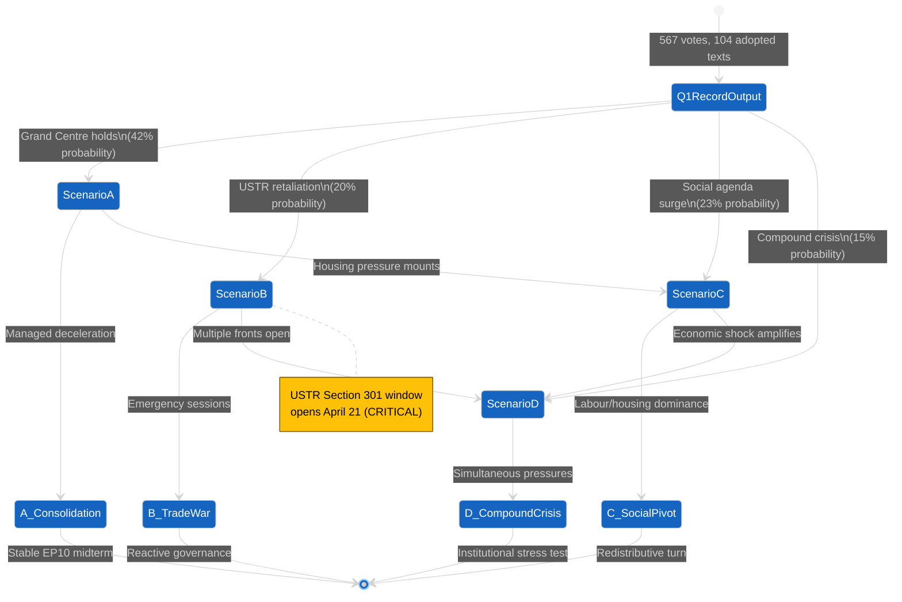
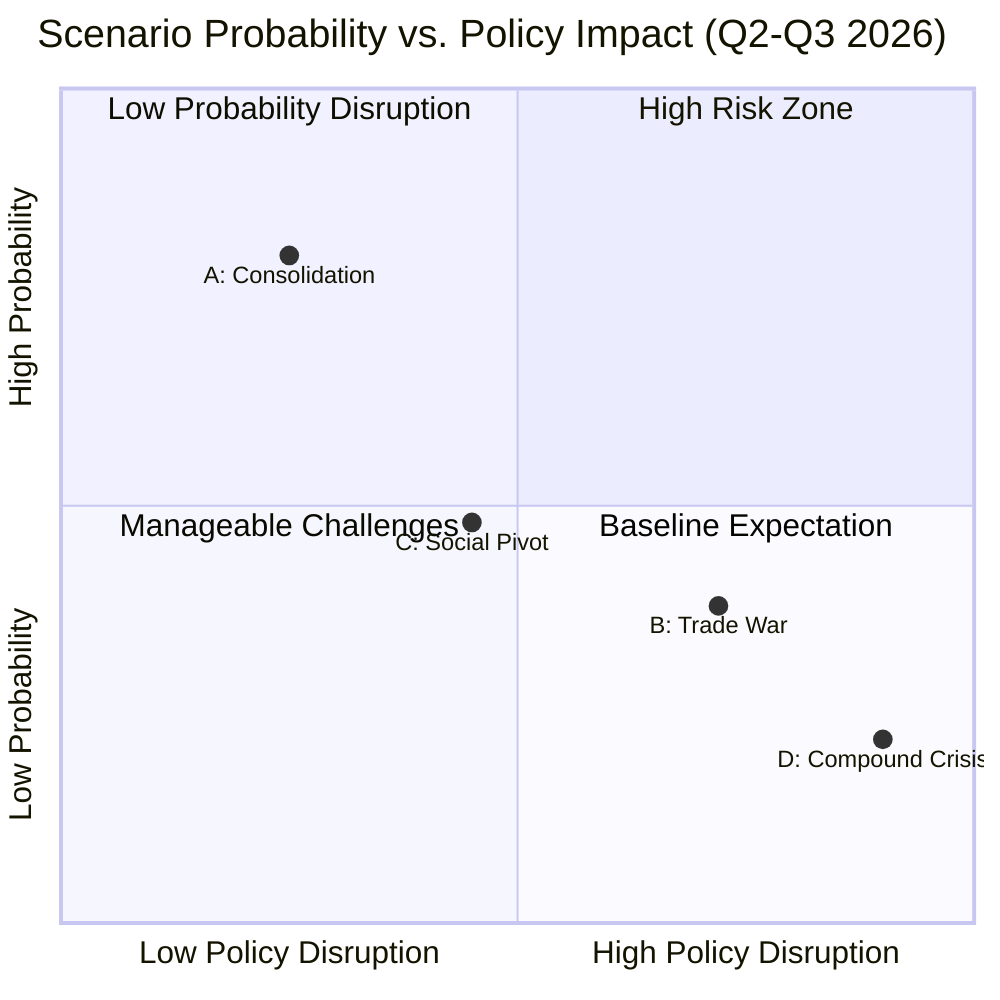

<!-- SPDX-FileCopyrightText: 2024-2026 Hack23 AB -->
<!-- SPDX-License-Identifier: Apache-2.0 -->

# Scenario Forecast — EP10 Q2–Q3 2026 Trajectory Analysis

## Executive Summary

EP10's record Q1 2026 output (567 roll-call votes, 180 resolutions, 104 adopted texts — 2.7× the 2025 pace) establishes a critical inflection point. The Grand Centre coalition (EPP ~185, S&D 135, Renew 76–77 ≈ 394 seats vs. 360 majority threshold) demonstrated extraordinary capacity but now faces sustainability questions as external pressures intensify.

This scenario forecast models four plausible trajectories for Q2–Q3 2026 based on identified trigger conditions, coalition dynamics, and early warning indicators. The USTR Section 301 window opening April 21 — during Easter recess (April 14–26) with Parliament returning April 27 — creates an immediate critical juncture.

**Key Finding:** No single scenario dominates. The most likely outcome (42%) is a managed consolidation with selective acceleration, but a 35% combined probability of crisis-driven scenarios (B + D) demands contingency preparedness.

---

## Scenario State Transitions

---

## Scenario A: Grand Centre Consolidation (42% Probability)

### Narrative

The Grand Centre coalition (EPP + S&D + Renew) sustains its Q1 momentum through disciplined agenda management, absorbing trade tensions without rupture. The 2.7× output pace decelerates to ~1.8× as implementation focus replaces legislative production. Defence integration (TA-0079) and Banking Union completion (TA-0092) become flagship second-reading priorities.

### Trigger Conditions

1. **USTR de-escalation**: Section 301 measures limited to targeted sectors (steel, aluminium) without blanket automotive tariffs
2. **ECB rate trajectory**: Steady or declining rates prevent Eurozone stress that would split EPP economic liberals from S&D social spending priorities
3. **Member State alignment**: Franco-German coordination holds on defence procurement (TA-0079 implementation)
4. **Recess management**: Easter recess passes without major external shock requiring emergency recall

### Coalition Implications

| Group | Position | Behaviour |
|-------|----------|-----------|
| EPP (~185) | Coalition anchor | Prioritises defence (TA-0079), enlargement (TA-0077) |
| S&D (135) | Cooperative partner | Accepts trade-offs: defence spending for housing investment (TA-0064) |
| Renew (76–77) | Swing bloc | Demands market-based solutions in trade response (TA-0096) |
| ECR (79–81) | Issue-by-issue | Supports defence; opposes social regulation (TA-0050) |
| Greens (53) | Constructive opposition | Backs housing, opposes defence spending escalation |
| PfE (84) | Disruptive potential | Leverages trade war narrative for protectionist agenda |

### Policy Trajectory

- **April–June**: Implementation regulations for Banking Union reform (SRMR3/BRRD3, TA-0092); defence procurement directive second reading (TA-0079)
- **June–September**: EU-Canada cooperation framework operationalisation (TA-0078); WTO MC14 preparation (TA-0086); Global Gateway financing decisions (TA-0104)
- **Key metric**: Adopted texts pace ~45–55 per quarter (sustained elevation above 2025 baseline of ~38)

### Timeline

| Month | Event | Impact |
|-------|-------|--------|
| April 27 | Parliament returns | Agenda-setting for trade response |
| May 12–15 | Plenary session | TA-0096 countermeasures implementation vote |
| June 2–5 | Plenary session | SRMR3 second reading; defence package |
| July | Summer recess begins | Implementation period |
| September | Return, Budget debates | 2027 MFF midterm review framework |

### Early Warning Indicators

- **Positive signals**: EPP-S&D joint statements on trade; Renew voting with Grand Centre >85% of divisions; Council Competitiveness formation endorsing defence single market
- **Negative signals**: S&D breaking ranks on trade countermeasures >20% defection; Renew abstention rate rising above 15%; National delegation splits within EPP (German CDU vs. Spanish PP on tariff scope)
- **Key metric threshold**: Grand Centre cohesion dropping below 78% on trade votes signals transition toward Scenario B or C

---

## Scenario B: Trade War Escalation (20% Probability)

### Narrative

USTR Section 301 investigation (window opening April 21) escalates beyond targeted measures to broad retaliatory tariffs on European automotive, pharmaceutical, and agricultural exports. The Commission invokes emergency trade defence instruments; Parliament is recalled early from recess or convenes extraordinary sessions in May. TA-0096 (US tariff countermeasures) becomes the template for an accelerated legislative response, but coalition discipline fractures under protectionist pressures from PfE and ECR right-flank members.

### Trigger Conditions

1. **USTR blanket action**: Section 301 determination covers >€50B in EU exports (automotive + pharma + agri)
2. **Commission escalation**: Counter-tariff proposals exceeding WTO dispute resolution track (TA-0086 constraints violated)
3. **Member State divergence**: Germany resists auto tariffs (export dependency); France welcomes industrial protection
4. **Electoral pressure**: PfE and ECR frame trade war as elite failure, poll surges in France/Italy

### Coalition Implications

| Group | Position | Shift |
|-------|----------|-------|
| EPP (~185) | Split: pro-trade liberals vs. industrial protectionists | German MEPs brake; Southern EPP accelerates |
| S&D (135) | Hawkish on retaliation but divided on scope | Trade unions demand worker protection conditions |
| Renew (76–77) | Free-trade instinct vs. political survival | Most vulnerable to electoral backlash |
| PfE (84) | Opportunistic escalation | Le Pen/Salvini faction demands "Buy European" legislation |
| ECR (79–81) | Atlanticist wing vs. sovereigntists | Internal fracture deepens |

### Policy Trajectory

- **Emergency response**: Fast-track retaliation regulation under TA-0096 framework; Commission delegated acts for immediate tariff adjustments
- **Secondary legislation**: WTO dispute filing (TA-0086 framework); EU-Canada enhanced trade activation (TA-0078 as alternative partner)
- **Industrial policy**: Defence procurement acceleration (TA-0079) reframed as strategic autonomy; Global Gateway (TA-0104) redirected toward alternative supply chains
- **Risk**: Anti-corruption package (TA-0094) deprioritised as legislative bandwidth consumed

### Timeline

| Date | Event | Criticality |
|------|-------|-------------|
| April 21 | USTR Section 301 window opens | TRIGGER |
| April 27 | Parliament returns from recess | Agenda scramble |
| May 5–8 | Emergency mini-plenary possible | Trade response vote |
| May 19–22 | Full plenary session | Comprehensive trade package |
| June | Council European Council summit | Trade war top agenda |
| July–Sept | Retaliatory cycle | Escalation or negotiation |

### Early Warning Indicators

- **Red alert (48h)**: USTR publishes preliminary determination covering >3 HS chapters; EU Council COREPER emergency meeting called
- **Orange alert (1 week)**: Commission Trade DG shifts from "dialogue" to "defence" language; EP Conference of Presidents requests extraordinary session
- **Yellow alert (2 weeks)**: US ambassador to EU recalled for consultations; INTA committee chair schedules emergency hearing
- **Key metric**: PfE/ECR combined vote alignment with Grand Centre on trade falling below 30% signals coalition fragmentation

---

## Scenario C: Social Policy Pivot (23% Probability)

### Narrative

The housing crisis addressed by TA-0064 and labour market concerns from TA-0050 (subcontracting) catalyse a broader social agenda that shifts Parliament's centre of gravity leftward. S&D and Greens successfully frame Q1 outputs as proof that social legislation delivers results, pulling Renew toward a "social market" positioning. Trade concerns are managed through negotiated outcomes while domestic policy dominates the agenda.

### Trigger Conditions

1. **Housing market deterioration**: Major member state (Germany or Spain) reports >15% year-on-year rent increases in capital cities
2. **Labour market signal**: Eurozone unemployment rises or major gig economy ruling forces legislative response
3. **S&D strategic shift**: New party leadership or congress reframes EP10 priorities toward "Social Europe" agenda
4. **Electoral cycle**: Netherlands, Germany regional elections shift debate toward cost-of-living
5. **Commission response**: Housing Commissioner (DG EMPL/GROW) tables directive proposal triggered by TA-0064 resolution

### Coalition Implications

| Group | Position | Dynamic |
|-------|----------|---------|
| EPP (~185) | Defensive, risks internal split | Economic liberals resist; Christian-democratic wing sympathetic |
| S&D (135) | Agenda-setting force | Maximum leverage position |
| Renew (76–77) | Pivots toward "social market" | Electoral survival calculation |
| Greens (53) | Natural ally to S&D | Forms progressive bloc (S&D + Greens + Left = 234, needs Renew) |
| Left (46) | Enhanced relevance | Provides votes for ambitious social legislation |
| PfE (84) | Populist social mimicry | Competes on cost-of-living narrative without legislative proposals |

### Policy Trajectory

- **Housing directive**: TA-0064 resolution escalated to legislative proposal; Commission consultation launched May–June
- **Labour market**: Subcontracting regulation (TA-0050) implementation accelerated; platform work directive enforcement
- **Financial regulation**: SRMR3/BRRD3 (TA-0092) reframed as protecting household savings; affordable mortgage access provisions
- **Trade-off**: Defence spending (TA-0079) faces "guns vs. butter" framing; climate agenda partially subsumed into "green jobs"

### Timeline

| Period | Development | Coalition Shape |
|--------|-------------|-----------------|
| May | Housing data catalyst | S&D + Greens table oral questions |
| June | Commission response | Social Affairs Council activated |
| July | Pre-recess push | Progressive majority attempts |
| September | Budget debates | Social investment vs. defence tension |

### Early Warning Indicators

- **Leading indicators**: S&D tabling >5 oral questions on housing/labour in single plenary; Renew MEPs co-signing S&D housing amendments; EPP internal correspondence leaks showing concern over "social gap" narrative
- **Quantitative threshold**: Greens + S&D + Left combined winning >3 recorded votes against EPP position in single plenary session
- **Media signal**: Major European media outlets (Le Monde, FAZ, El País) simultaneously running housing crisis front pages

---

## Scenario D: Compound Crisis (15% Probability)

### Narrative

Multiple external shocks converge: USTR escalation (Scenario B trigger) combines with either a Eurozone financial stress event (banking sector, SRMR3/TA-0092 tested in practice), a Russia-Ukraine escalation requiring emergency defence decisions, or a major energy supply disruption. Parliament faces simultaneous legislative emergencies across trade, defence, and financial stability — exceeding institutional processing capacity.

### Trigger Conditions (any 2+ simultaneous)

1. **Trade + Defence**: USTR tariffs AND Russia escalation in same quarter
2. **Trade + Financial**: USTR tariffs AND European bank stress (CDS spreads >300bps on major institution)
3. **Defence + Social**: Ukraine escalation AND refugee wave triggering housing/social pressure
4. **Energy + Trade**: Pipeline/LNG disruption AND trade war restricting alternative sourcing
5. **All-domain**: Geopolitical realignment forcing EU to address all four simultaneously

### Coalition Implications

Under compound crisis, the Grand Centre faces a fundamental coordination problem: insufficient legislative bandwidth to address all fronts, forcing painful prioritisation that exposes ideological fault lines.

| Crisis Combination | Grand Centre Stress Point | Fragmentation Risk |
|-------------------|---------------------------|-------------------|
| Trade + Defence | S&D resists "defence over social" prioritisation | MEDIUM-HIGH |
| Trade + Financial | Renew pulled toward austerity; S&D toward protection | HIGH |
| Defence + Social | EPP insists on defence first; S&D demands social parallel | MEDIUM |
| Energy + Trade | All groups support energy response; prioritisation simpler | LOW-MEDIUM |

### Institutional Response Capacity

- **Maximum plenary frequency**: Convention allows 2 extraordinary sessions per recess period
- **Fast-track procedures**: Article 163 (urgency) can compress committee stage to 48h
- **Commission bandwidth**: Only ~3 major legislative proposals can be simultaneously processed via ordinary legislative procedure
- **Implementation gap risk**: Q1 outputs (104 adopted texts) already strain transposition capacity

### Policy Trajectory

- **Immediate (0–4 weeks)**: Emergency measures via delegated acts; Parliament authorises Commission executive action
- **Medium-term (1–3 months)**: Prioritisation debate splits coalition; legislative triage becomes politically toxic
- **Recovery (3–6 months)**: Institutional reform discussions begin — EP capacity concerns, QMV in Council on trade/defence

### Timeline Under Compound Crisis

| Week | Posture | Institutional Response |
|------|---------|----------------------|
| 1 | Crisis recognition | Conference of Presidents emergency meeting |
| 2 | Triage | Committee chairs prioritise; some files suspended |
| 3–4 | Legislative sprint | Emergency sessions; condensed procedures |
| 5–8 | Sustainability test | Institutional fatigue; quality concerns emerge |
| 9–12 | Adaptation | New normal established or crisis recedes |

### Early Warning Indicators

- **Compound signal**: 2+ individual scenario early warnings triggering simultaneously
- **Institutional stress**: EP legal service flags procedure irregularities; committee secretariats report >150% workload capacity
- **Political signal**: Conference of Presidents fails to reach consensus on plenary agenda (unprecedented)
- **External**: Commission President requests extraordinary EUCO + EP plenary in same week
- **Market signal**: Euro STOXX Banks index drops >8% in single session + EU sovereign spreads widen simultaneously

---

## Cross-Scenario Analysis Matrix

## Scenario Transition Probabilities

| From \ To | A (Consolidation) | B (Trade War) | C (Social Pivot) | D (Compound) |
|-----------|-------------------|---------------|-------------------|--------------|
| **A** (Consolidation) | 65% (stable) | 15% | 15% | 5% |
| **B** (Trade War) | 20% (de-escalation) | 45% (sustained) | 10% | 25% |
| **C** (Social Pivot) | 25% (rebalance) | 10% | 50% (sustained) | 15% |
| **D** (Compound) | 10% (resolution) | 20% (trade dominates) | 15% | 55% (locked in) |

---

## Strategic Implications

### For Grand Centre Coalition Management

1. **Scenario A requires**: Disciplined agenda control, avoiding overcommitment from Q1 pace
2. **Scenario B requires**: Pre-agreed trade response protocols before April 21; Renew position secured in advance
3. **Scenario C requires**: EPP accepting limited social legislation as coalition stability price
4. **Scenario D requires**: Institutional reform discussions beginning NOW (capacity planning)

### Critical Decision Windows

| Window | Dates | Decision Required | Scenario Sensitivity |
|--------|-------|-------------------|---------------------|
| USTR response | April 21–May 5 | Commission trade defence activation | B, D |
| Post-recess plenary | April 27–May 2 | Q2 agenda prioritisation | All |
| June EUCO | June 19–20 | MFF/defence/trade package deal | A, B, D |
| Pre-summer budget | July 7–10 | 2027 budget framework | A, C |

### Hedging Strategy

The optimal strategic posture for EP10 stakeholders is to **prepare for Scenario A while hedging against B**:
- Maintain Grand Centre cohesion on non-controversial files (enlargement, Global Gateway)
- Pre-position trade response legislative texts (TA-0096 implementation measures) ready for fast-track
- Secure S&D commitment through visible social policy progress (TA-0064 follow-up)
- Build institutional capacity for emergency procedures without triggering them

---

## Methodology & Limitations

This forecast employs scenario planning methodology combining quantitative legislative output data (EP adopted texts database), coalition voting analysis (roll-call records), external event tracking (USTR Federal Register notices, ECB monetary policy communications), and qualitative expert assessment of political dynamics.

**Key limitations**: Probability weights reflect analytical judgement, not statistical prediction; scenarios are simplified archetypes — reality will likely combine elements; individual actor agency (single MEP defections, Commissioner resignations) can trigger rapid scenario transitions not captured by structural analysis.

**Data sources**: European Parliament Open Data Portal; USTR Federal Register; ECB Statistical Data Warehouse; Eurostat Quick Estimates; Political group public communications.

---

*Analysis produced: 2026-04-20 | Next update trigger: USTR Section 301 determination publication or Grand Centre cohesion rate <78% on trade votes*
