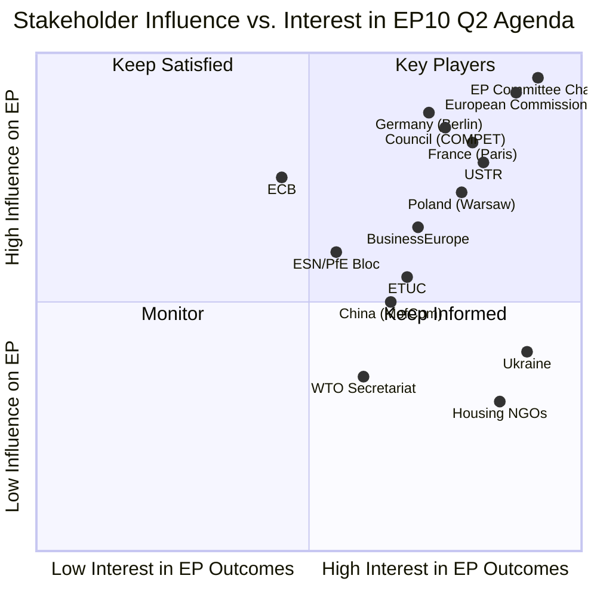
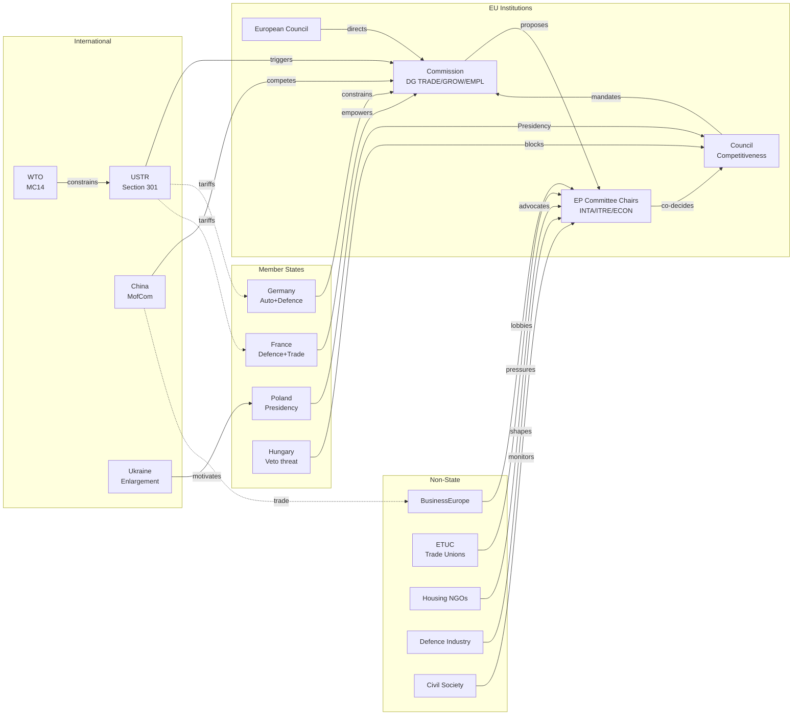

<!-- SPDX-FileCopyrightText: 2024-2026 Hack23 AB -->
<!-- SPDX-License-Identifier: Apache-2.0 -->

# Stakeholder Map — EP10 Q1 2026 Motions Intelligence

## Executive Summary

This comprehensive stakeholder mapping identifies 18 principal actors whose interests, power, and strategic positions shape the legislative environment emerging from EP10's record Q1 2026 output. Unlike standard institutional analysis, this map traces specific linkages between stakeholders and adopted texts (TA references), assesses influence dynamics, and projects stakeholder behaviour into Q2–Q3 2026.

**Central Finding:** EP10's Q1 output has activated an unusually wide stakeholder constellation. The US tariff countermeasures (TA-0096), defence single market (TA-0079), and housing crisis resolution (TA-0064) collectively engage stakeholders who normally operate in separate policy silos — forcing cross-domain coalition building unprecedented in EP10's mandate.

---

## Stakeholder Influence-Interest Matrix

---

## Category I: EU Institutional Actors

### 1. European Commission (DG TRADE, DG GROW, DG EMPL)

| Dimension | Assessment |
|-----------|-----------|
| **Power** | 9/10 — Exclusive right of legislative initiative; delegated act authority for trade measures |
| **Interest** | 9/10 — Q1 outputs directly mandate Commission implementation actions |
| **Position** | Implementer-in-chief; simultaneously overwhelmed and empowered by 104 adopted texts |
| **Strategy** | Selective implementation sequencing; uses TA-0096 trade mandate to consolidate executive authority |
| **TA Linkages** | TA-0096 (countermeasures implementation), TA-0079 (defence procurement directive), TA-0092 (SRMR3 delegated acts), TA-0104 (Global Gateway financing) |

**Key Dynamics**: DG TRADE holds the critical position on USTR Section 301 response. Commissioner Dombrovskis' team has pre-drafted retaliatory tariff schedules referencing TA-0096 framework. DG GROW faces tension between defence procurement (TA-0079, requiring industrial consolidation) and anti-corruption provisions (TA-0094, adding compliance costs). DG EMPL activated by TA-0064 housing resolution but lacks legislative instrument without new proposal.

**Q2 Projection**: Commission will invoke TA-0096 authority within 72h of USTR action; will table housing communication (non-legislative) by June; defence directive implementation regulation by May.

---

### 2. Council of the EU (Competitiveness & Foreign Affairs Formations)

| Dimension | Assessment |
|-----------|-----------|
| **Power** | 8/10 — Co-legislator; determines implementation speed via qualified majority |
| **Interest** | 8/10 — Member State capitals drive Council positions on trade and defence |
| **Position** | Cautious accelerator; QMV facilitates Grand Centre alignment on trade |
| **Strategy** | Use Polish Presidency (Jan–Jun 2026) to advance enlargement (TA-0077) and Eastern flank priorities |
| **TA Linkages** | TA-0077 (enlargement — Council decides accession), TA-0079 (defence — Council adoption required), TA-0086 (WTO — Council mandates Commission) |

**Key Dynamics**: Polish Council Presidency uniquely positioned to advance both enlargement (TA-0077) and defence (TA-0079) — national interest alignment with EU agenda. However, unanimity requirements on enlargement create Hungarian veto threat. Competitiveness Council formation most active on trade response coordination.

---

### 3. EP Committee Chairs (INTA, ITRE, EMPL, ECON)

| Dimension | Assessment |
|-----------|-----------|
| **Power** | 9/10 — Agenda-setting within Parliament; rapporteur appointment; emergency procedure activation |
| **Interest** | 10/10 — Direct institutional stake in all Q1 outputs |
| **Position** | Overburdened but empowered; Q1 output legitimises expanded mandates |
| **Strategy** | INTA chair drives trade response (TA-0096); ITRE chair on defence (TA-0079); ECON on banking (TA-0092) |
| **TA Linkages** | All adopted texts routed through committee system |

**Key Dynamic**: INTA committee holds the most critical position post-April 21. Chair's decision on whether to invoke Rule 163 (urgency procedure) for trade response determines legislative timeline. ECON committee simultaneously managing SRMR3/BRRD3 (TA-0092) implementation — bandwidth constraint if trade crisis escalates.

---

### 4. European Council (EUCO)

| Dimension | Assessment |
|-----------|-----------|
| **Power** | 8/10 — Sets strategic direction; convenes extraordinary summits; mandates Commission |
| **Interest** | 7/10 — Strategic level; engaged on trade and defence, not detailed legislation |
| **Position** | Framework provider; EP legislative output operationalises EUCO strategic guidance |
| **Strategy** | June 2026 summit will address trade/defence/enlargement package; seek "strategic autonomy" narrative |
| **TA Linkages** | TA-0077 (enlargement conclusions), TA-0079 (defence investment), TA-0096 (trade war mandate) |

---

## Category II: Member State Capitals

### 5. Germany (Berlin — Chancellery + BMWi + BMAS)

| Dimension | Assessment |
|-----------|-----------|
| **Power** | 9/10 — Largest economy; critical for defence spending and trade policy credibility |
| **Interest** | 9/10 — Auto industry directly threatened by USTR Section 301; housing crisis acute in Berlin/Munich |
| **Position** | Conflicted restrainer on trade escalation; driver on defence; progressive on housing |
| **Strategy** | Seeks negotiated USTR outcome; will brake EP trade retaliation if auto sector threatened |
| **TA Linkages** | TA-0096 (BMW/VW/Mercedes exposure), TA-0079 (Rheinmetall/KNDS beneficiary), TA-0064 (Berlin rent crisis) |

**Key Dynamic**: Germany's dual exposure — auto exports vulnerable to US tariffs (TA-0096) AND defence industry positioned to benefit from EU defence single market (TA-0079) — creates unique internal tension. German EPP delegation (29 MEPs) becomes swing factor on trade vote calibration.

---

### 6. France (Paris — Élysée + Quai d'Orsay + Bercy)

| Dimension | Assessment |
|-----------|-----------|
| **Power** | 8/10 — Security Council seat; defence industrial base; political agenda-setting |
| **Interest** | 8/10 — Defence agenda champion; trade protectionism domestic pressure; housing crisis (Paris) |
| **Position** | Hawkish on trade retaliation; lead on defence integration; supportive of housing |
| **Strategy** | Use EP outputs to advance "strategic autonomy" doctrine; leverage TA-0079 for French defence industry (Thales, Dassault, Naval Group) |
| **TA Linkages** | TA-0079 (French defence industrial base), TA-0096 (agricultural exports to US), TA-0064 (Paris housing), TA-0078 (EU-Canada — Québec dimension) |

---

### 7. Poland (Warsaw — Chancellery + MON + MSZ)

| Dimension | Assessment |
|-----------|-----------|
| **Power** | 7/10 — Council Presidency; eastern flank security credibility; growing economic weight |
| **Interest** | 9/10 — Council Presidency vehicle for enlargement (TA-0077) and eastern defence priorities |
| **Position** | Active broker; uses Presidency to advance Ukraine accession pathway and NATO/EU defence complementarity |
| **Strategy** | Enlargement as legacy priority (TA-0077); defence spending legitimisation (TA-0079); subcontracting rules concern (TA-0050, posted workers) |
| **TA Linkages** | TA-0077 (enlargement — Ukraine/Western Balkans), TA-0079 (eastern flank defence), TA-0050 (labour mobility implications) |

---

### 8. Italy (Rome — Palazzo Chigi + MISE)

| Dimension | Assessment |
|-----------|-----------|
| **Power** | 7/10 — Third-largest economy; PfE/ECR domestic politics shape EP group behaviour |
| **Interest** | 7/10 — Banking sector reform (TA-0092); trade exposure moderate; housing in major cities |
| **Position** | Pragmatic participant with domestic electoral constraints (Meloni government) |
| **Strategy** | Support Banking Union completion (TA-0092, Italian banks benefit); cautious on trade escalation; housing politically salient |
| **TA Linkages** | TA-0092 (Italian banking sector reform), TA-0094 (anti-corruption — domestic sensitivity), TA-0064 (Milan/Rome housing) |

---

### 9. Hungary (Budapest — PM Office + MFA)

| Dimension | Assessment |
|-----------|-----------|
| **Power** | 5/10 — Veto threat on unanimity files (enlargement, CFSP); limited on QMV trade |
| **Interest** | 6/10 — Enlargement veto leverage; trade war narrative (anti-US sanctions); EU funds conditionality |
| **Position** | Disruptive blocker on enlargement (TA-0077); transactional on other files |
| **Strategy** | Use enlargement veto threat to extract concessions on rule-of-law conditionality; PfE group coordination |
| **TA Linkages** | TA-0077 (enlargement veto), TA-0094 (anti-corruption — perceived targeting) |

---

## Category III: International Actors

### 10. United States (USTR + Commerce Department)

| Dimension | Assessment |
|-----------|-----------|
| **Power** | 8/10 — Unilateral tariff authority (Section 301); can trigger EU emergency response |
| **Interest** | 8/10 — EP trade countermeasures (TA-0096) directly target US economic interests |
| **Position** | Assertive bilateralist; views EP action as escalatory |
| **Strategy** | Section 301 window (April 21) as leverage tool; seek bilateral deal bypassing multilateral (WTO/TA-0086) framework |
| **TA Linkages** | TA-0096 (direct target), TA-0086 (WTO framework USTR circumvents), TA-0078 (EU-Canada as alternative) |

**Critical Intelligence**: USTR Section 301 investigation window opening April 21 during EP Easter recess creates 6-day period where EP cannot institutionally respond. Commission executive action fills the gap, but EP democratic legitimacy of response challenged. TA-0096 countermeasures mandate gives Commission pre-authorisation, partially mitigating this gap.

---

### 11. China (Ministry of Commerce + NDRC)

| Dimension | Assessment |
|-----------|-----------|
| **Power** | 6/10 — Economic weight; can amplify or dampen trade war; alternative partnership offers |
| **Interest** | 7/10 — EU trade policy affects Chinese exports; defence autonomy reduces dependency |
| **Position** | Strategic observer; seeks EU-US division as leverage |
| **Strategy** | Offer EU bilateral trade deals to undercut US-EU alignment; Global Gateway competition (TA-0104) |
| **TA Linkages** | TA-0096 (benefits from EU-US trade war), TA-0104 (Global Gateway competitor), TA-0079 (defence autonomy reduces China leverage) |

---

### 12. Ukraine (Presidential Office + MFA + EU Integration Office)

| Dimension | Assessment |
|-----------|-----------|
| **Power** | 4/10 — Limited formal institutional power; enormous moral/political leverage |
| **Interest** | 10/10 — Enlargement (TA-0077) is existential; defence (TA-0079) directly relevant |
| **Position** | Beneficiary and catalyst; Q1 outputs advance Ukrainian interests substantially |
| **Strategy** | Maximise enlargement momentum (TA-0077); support EU defence integration (TA-0079) as complementary to NATO; resist trade war distraction |
| **TA Linkages** | TA-0077 (enlargement — primary beneficiary), TA-0079 (defence — Ukraine as catalyst), TA-0104 (Global Gateway — reconstruction) |

---

### 13. WTO Secretariat (Geneva)

| Dimension | Assessment |
|-----------|-----------|
| **Power** | 3/10 — Dispute resolution capacity limited; convening power for MC14 |
| **Interest** | 8/10 — EP positions (TA-0086) shape EU negotiating mandate at MC14 |
| **Position** | System defender; EP support critical for multilateral trade order survival |
| **Strategy** | Leverage TA-0086 (WTO MC14 mandate) to maintain EP commitment to multilateral dispute resolution vs. bilateral retaliation (TA-0096 tension) |
| **TA Linkages** | TA-0086 (WTO MC14 preparation), TA-0096 (tension with multilateral approach) |

---

## Category IV: Non-State Actors

### 14. BusinessEurope / European Round Table for Industry

| Dimension | Assessment |
|-----------|-----------|
| **Power** | 7/10 — Corporate lobbying infrastructure; EPP/Renew access; implementation influence |
| **Interest** | 8/10 — Trade countermeasures (TA-0096) directly affect members; defence procurement (TA-0079) creates opportunities |
| **Position** | Cautious de-escalation on trade; enthusiastic on defence; concerned on subcontracting regulation (TA-0050) |
| **Strategy** | Lobby for targeted (not blanket) trade response; ensure defence procurement favours European champions; resist TA-0050 labour conditions |
| **TA Linkages** | TA-0096 (trade — prefer negotiation), TA-0079 (defence — procurement access), TA-0050 (subcontracting — compliance costs), TA-0066 (copyright/AI — tech sector) |

---

### 15. European Trade Union Confederation (ETUC)

| Dimension | Assessment |
|-----------|-----------|
| **Power** | 5/10 — S&D/Greens/Left access; social dialogue structures; strike threat (implementation leverage) |
| **Interest** | 8/10 — Housing (TA-0064), subcontracting (TA-0050), and trade (TA-0096 worker impact) central to agenda |
| **Position** | Demands social conditionality on all economic legislation; "no trade deal without labour chapter" |
| **Strategy** | Use TA-0064 and TA-0050 as springboard for broader social legislation; condition support for trade response on worker protection |
| **TA Linkages** | TA-0064 (housing — affordable housing for workers), TA-0050 (subcontracting — core demand), TA-0096 (trade adjustment funds for workers), TA-0092 (banking — pension fund protection) |

---

### 16. Housing Europe / FEANTSA / National Housing NGOs

| Dimension | Assessment |
|-----------|-----------|
| **Power** | 3/10 — Limited direct institutional access; growing public opinion leverage |
| **Interest** | 10/10 — TA-0064 directly responds to years of advocacy; implementation is existential |
| **Position** | Maximalist on housing directive ambition; coalition with ETUC on affordable housing |
| **Strategy** | Use TA-0064 momentum to push Commission legislative proposal; mobilise national advocacy for implementation pressure |
| **TA Linkages** | TA-0064 (housing crisis resolution — primary beneficiary), TA-0092 (banking — mortgage access), TA-0050 (construction worker conditions) |

---

### 17. European Defence Industry Association (ASD/BDSV)

| Dimension | Assessment |
|-----------|-----------|
| **Power** | 6/10 — Direct industrial capacity governments need; EPP access; national security framing |
| **Interest** | 9/10 — TA-0079 creates €billions in procurement opportunity; defence single market reshapes competitive landscape |
| **Position** | Enthusiastic supporter of TA-0079; lobbies for maximum scope and rapid implementation |
| **Strategy** | Ensure defence single market rules favour European primes over US competitors; resist "buy American" pressure; protect cross-border JV structures |
| **TA Linkages** | TA-0079 (defence single market — primary beneficiary), TA-0094 (anti-corruption — compliance concern in defence procurement) |

---

### 18. Civil Society / Transparency International EU / Access Info Europe

| Dimension | Assessment |
|-----------|-----------|
| **Power** | 4/10 — Moral authority; media access; oversight function; litigation capacity |
| **Interest** | 7/10 — Anti-corruption (TA-0094) and copyright/AI (TA-0066) central; democratic accountability of trade response |
| **Position** | Watchdog; demands transparency in defence procurement and trade negotiations |
| **Strategy** | Use TA-0094 anti-corruption framework to demand disclosure in defence contracts (TA-0079) and trade negotiations (TA-0096); AI copyright monitoring (TA-0066) |
| **TA Linkages** | TA-0094 (anti-corruption — primary vehicle), TA-0066 (copyright/AI transparency), TA-0079 (defence procurement transparency demands) |

---

## Stakeholder Interaction Network

---

## Stakeholder Alignment on Key Files

| Stakeholder | TA-0096 (Trade) | TA-0079 (Defence) | TA-0064 (Housing) | TA-0077 (Enlargement) | TA-0092 (Banking) |
|-------------|:---:|:---:|:---:|:---:|:---:|
| Commission | ✅ Implements | ✅ Implements | ⚠️ Communication only | ✅ Manages process | ✅ Delegated acts |
| Germany | ⚠️ Cautious | ✅ Industrial beneficiary | ✅ Supports | ✅ Supports | ✅ Supports |
| France | ✅ Hawkish | ✅ Champion | ✅ Supports | ✅ Supports | ⚠️ Cautious |
| Poland | ✅ Supports | ✅ Eastern flank | ⚠️ Lower priority | ✅ Champion | ⚠️ Neutral |
| Hungary | ⚠️ Opportunistic | ⚠️ Conditional | ⚠️ Low interest | ❌ Blocks | ⚠️ Neutral |
| USTR | ❌ Opposes | ⚠️ Watches | — | — | — |
| Ukraine | ✅ Supports | ✅ Beneficiary | — | ✅ Primary beneficiary | — |
| BusinessEurope | ⚠️ Targeted only | ✅ Procurement access | ⚠️ Market solutions | ✅ Market access | ✅ Supports |
| ETUC | ✅ With conditions | ⚠️ Jobs focus | ✅ Champion | ⚠️ Labour standards | ✅ Pension protection |
| Housing NGOs | — | — | ✅ Core demand | — | ⚠️ Mortgage access |

---

## Strategic Implications

### Critical Stakeholder Convergences

1. **Trade response coalition**: Commission + France + EP (INTA) + ETUC align on robust response; Germany + BusinessEurope brake
2. **Defence advancement**: France + Defence industry + Poland + EPP align on rapid TA-0079 implementation; Greens + Left + civil society scrutinise
3. **Social policy bloc**: ETUC + Housing NGOs + S&D + Greens push TA-0064/TA-0050 implementation; BusinessEurope + EPP economic wing resist

### Stakeholder Veto Points

- **Hungary on enlargement (TA-0077)**: Unanimity requirement gives single-actor veto
- **Germany on trade escalation (TA-0096)**: Largest economy can politically block Commission implementation
- **USTR on timeline**: US executive action pre-empts EP deliberative process during recess

---

*Analysis produced: 2026-04-20 | Classification: UNRESTRICTED | Stakeholder positions assessed from public statements, voting records, and institutional communications*
