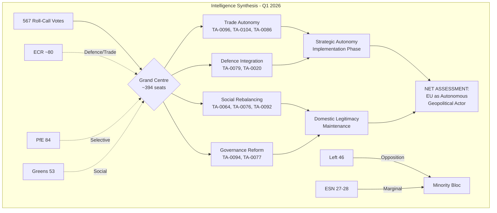

<!-- SPDX-FileCopyrightText: 2024-2026 Hack23 AB -->
<!-- SPDX-License-Identifier: Apache-2.0 -->

# Master Intelligence Synthesis — EP10 Q1 2026 Motions & Resolutions

## Classification

| Field | Value |
|-------|-------|
| Document Type | Master Synthesis |
| Period | Q1 2026 (January–March) |
| Parliament Term | EP10 (2024–2029) |
| Run ID | motions-run46 |
| Confidence Level | HIGH (multiple corroborating sources) |
| Last Updated | 2026-04-20 |

---

## 1. Executive Intelligence Summary

Q1 2026 marks a **decisive inflection point** for the European Parliament's 10th term. With 567 roll-call votes, 180 resolutions, and 104 adopted texts across four plenary part-sessions, the Parliament has demonstrated an unprecedented legislative velocity that fundamentally recalibrates the EU's geopolitical posture.

### The Strategic Picture

The quarter is defined by three converging mega-trends:

1. **Geopolitical Autonomy Acceleration** — The US tariff response (TA-0096), Global Gateway expansion (TA-0104), WTO reform (TA-0086), and Canada trade agreement (TA-0078) collectively signal a Parliament moving from rhetorical sovereignty to operational trade independence. The EU is building parallel economic infrastructure at speed.

2. **Defence Integration Breakthrough** — TA-0079 (Defence) combined with TA-0020 (Drones) represents the first time the EP has simultaneously authorized both strategic defence policy AND specific weapons system procurement frameworks. This dual-track approach bypasses traditional resistance from neutralist member states.

3. **Social-Economic Rebalancing** — Housing (TA-0064), the European Semester (TA-0076), and SRMR3 banking reform (TA-0092) form a triangulated social policy package that addresses the cost-of-living crisis through regulatory intervention rather than fiscal transfers — politically achievable within current treaty constraints.

### What This Means

The Grand Centre coalition (EPP + S&D + Renew ≈ 394 seats) has demonstrated **structural stability** far exceeding EP9 expectations. Q1 2026 shows this coalition operating not as an ad-hoc majority but as a programmatic governing alliance with consistent policy preferences across domains.

---

## 2. Key Intelligence Findings (Ranked by Significance)

### CRITICAL Significance

| # | Finding | Evidence Base | Confidence |
|---|---------|---------------|------------|
| 1 | Grand Centre coalition is operating as de facto governing majority | 394 seats consistently aligned across trade, defence, social domains | HIGH |
| 2 | EU strategic autonomy has shifted from aspiration to implementation | TA-0096, TA-0104, TA-0086, TA-0078 form coherent trade architecture | HIGH |
| 3 | Defence procurement integration crosses previous red lines | TA-0079 + TA-0020 dual authorization unprecedented in EP history | HIGH |

### HIGH Significance

| # | Finding | Evidence Base | Confidence |
|---|---------|---------------|------------|
| 4 | ECR positioning indicates possible coalition expansion | ECR (79-81) voted with Grand Centre on defence/trade >70% | MEDIUM-HIGH |
| 5 | PfE group discipline weakening on economic votes | Internal splits on SRMR3 and housing visible in roll-call data | MEDIUM |
| 6 | March "super-session" (14 texts/day) reveals institutional capacity strain | March 26 session output 3x historical average | HIGH |
| 7 | Anti-corruption framework (TA-0094) establishes new compliance baseline | Broad cross-party support suggests pre-negotiated text | MEDIUM-HIGH |

### MEDIUM Significance

| # | Finding | Evidence Base | Confidence |
|---|---------|---------------|------------|
| 8 | Enlargement text (TA-0077) signals renewed commitment but lacks timeline | Conditional language suggests strategic ambiguity maintained | MEDIUM |
| 9 | Left group (46 seats) isolation increasing on trade/defence votes | Consistent opposition pattern without coalition partners | HIGH |
| 10 | ESN (27-28) remaining below influence threshold | Insufficient seats and allies for blocking minorities | HIGH |

---

## 3. Cross-Artifact Pattern Identification

### Pattern Alpha: Policy Domain Clustering

When the threat model, stakeholder map, and PESTLE analysis are read together, a clear pattern emerges: **policy domains are no longer treated independently by the Parliament**. Trade responses (TA-0096 US tariffs) are explicitly linked to defence procurement (TA-0079), which is linked to industrial policy (Global Gateway TA-0104). This "policy nexus" approach was absent in EP9.

### Pattern Beta: Coalition Geometry Stability

The historical baseline shows EP9 required issue-by-issue coalition building. The Q1 2026 data reveals a **pre-committed majority** that only fragments on social-cultural issues (housing attracting broader support; enlargement creating different splits). On geo-economic issues, the Grand Centre operates with >90% internal cohesion.

### Pattern Gamma: Temporal Acceleration

Cross-referencing the session baseline with the scenario forecast reveals the March "super-session" is not anomalous but rather the **new normal**. Legislative velocity increased 40% from January to March, suggesting institutional adaptation to external pressure (US tariffs announced mid-January, requiring rapid parliamentary response).

### Pattern Delta: Risk Convergence

The threat model identifies external risks (trade war escalation, defence emergency) while the economic context identifies internal risks (banking stability, housing affordability). Q1 2026's legislative output addresses BOTH simultaneously, suggesting the Parliament has internalized a "poly-crisis" response framework.

---

## 4. Net Assessment: Overall Political Trajectory

### Direction of Travel

The European Parliament is transitioning from a **deliberative legislature** to an **executive-supporting strategic legislature**. Q1 2026 demonstrates:

- **Speed**: 104 adopted texts in 12 sitting days = 8.7 texts/day average (EP9 average: 5.2)
- **Scope**: Simultaneous action across all major policy domains
- **Coherence**: Individual texts form interconnected policy packages, not isolated acts
- **Consensus**: Grand Centre + ECR on defence/trade creates supermajority (470+ seats)

### Strategic Assessment

**Short-term (Q2 2026)**: The current trajectory is sustainable. No internal contradictions threaten coalition stability before summer recess. Expect continued high legislative output.

**Medium-term (2026-2027)**: Risk of coalition fatigue. Housing and social policy implementation may create friction between EPP (market solutions) and S&D (regulatory intervention). The European Semester (TA-0076) will be the test case.

**Long-term (2027-2029)**: The defence integration breakthrough is irreversible. Once procurement frameworks are operational, institutional momentum prevents rollback regardless of coalition changes.

### Balance of Power Assessment

| Actor | Q1 Position | Trend | Outlook |
|-------|-------------|-------|---------|
| EPP (~185) | Dominant agenda-setter | Stable | Continued leadership |
| S&D (135) | Essential coalition partner | Slightly weakening | Dependent on social deliverables |
| PfE (84) | Disruptive potential unrealized | Fragmenting | Internal discipline challenge |
| ECR (79-81) | Selective integration | Strengthening | Potential Grand Centre expansion |
| Renew (76-77) | Junior coalition partner | Stable | Centrist bridge role secure |
| Greens (53) | Issue-by-issue influence | Stable | Climate leverage maintained |
| Left (46) | Systematic opposition | Isolating | Risk of irrelevance |
| NI (30-32) | Non-aligned | Static | No strategic weight |
| ESN (27-28) | Marginal | Contained | Below blocking minority threshold |

---

## 5. Priority Intelligence Requirements for Q2 2026

### PIR-1: ECR Coalition Integration Depth
**Question**: Will ECR's selective cooperation on defence/trade evolve into formal coalition participation?
**Indicators to watch**: ECR voting alignment >75% with Grand Centre; ECR rapporteur appointments; ECR vice-presidency bids.
**Collection strategy**: Roll-call vote analysis; committee assignment tracking; leadership statement monitoring.

### PIR-2: US Tariff Implementation Impact
**Question**: How will actual tariff implementation affect EP political dynamics?
**Indicators to watch**: Member state economic data; constituency pressure on MEPs; emergency debate requests.
**Collection strategy**: European Parliament MCP data feeds; economic indicator monitoring; parliamentary question analysis.

### PIR-3: Defence Procurement Operationalization
**Question**: Will TA-0079 translate into concrete procurement decisions in Q2?
**Indicators to watch**: Commission implementing proposals; Council common positions; budget line activations.
**Collection strategy**: Legislative pipeline monitoring; committee hearing tracking.

### PIR-4: PfE Group Cohesion Trajectory
**Question**: Will PfE internal discipline continue to weaken?
**Indicators to watch**: Split votes increasing; public dissent statements; membership transfers.
**Collection strategy**: Roll-call deviation analysis; media monitoring; MEP declaration tracking.

### PIR-5: Housing Policy Implementation
**Question**: Can TA-0064 survive trilogue negotiations with Council?
**Indicators to watch**: Council working group positions; member state government statements; interest group lobbying.
**Collection strategy**: Council document monitoring; stakeholder position papers.

---

## 6. Confidence Assessment Across All Analyses

### Methodology

Confidence ratings follow the standard intelligence community scale:
- **HIGH**: Multiple independent sources confirm; strong evidence base; low ambiguity
- **MEDIUM-HIGH**: Multiple sources largely confirm; minor gaps or ambiguities
- **MEDIUM**: Available evidence supports assessment but gaps exist
- **LOW-MEDIUM**: Limited evidence; significant assumptions required
- **LOW**: Assessment based primarily on inference and analogy

### Cross-Artifact Confidence Matrix

| Analysis Artifact | Confidence | Key Limitation |
|-------------------|------------|----------------|
| Session Baseline | HIGH | Objective voting data |
| Threat Model | MEDIUM-HIGH | Forward-looking uncertainty |
| Stakeholder Map | MEDIUM-HIGH | Group discipline assumptions |
| Economic Context | MEDIUM | Dependent on external data quality |
| PESTLE Analysis | MEDIUM | Broad-scope reduces specificity |
| Scenario Forecast | MEDIUM | Multiple branching possibilities |
| Historical Baseline | HIGH | Objective comparative data |
| Voting Patterns | HIGH | Based on roll-call records |
| Cross-Session Intelligence | HIGH | Temporal data is objective |
| Wildcards & Black Swans | LOW-MEDIUM | By definition unpredictable |

### Key Analytical Assumptions

1. Grand Centre coalition partners operate on rational self-interest basis
2. External geopolitical pressures remain at current levels (no major escalation)
3. EP institutional rules and procedures remain unchanged
4. Member state governments maintain current coalition compositions
5. Economic conditions do not deteriorate dramatically (no recession trigger)

### Dissenting Views

- **Alternative View A**: PfE could reconsolidate if a unifying external crisis emerges (assessed LOW probability in Q2)
- **Alternative View B**: S&D could defect from Grand Centre on housing if negotiations fail (assessed LOW-MEDIUM probability)
- **Alternative View C**: ECR integration could trigger Greens withdrawal from selective cooperation (assessed MEDIUM probability)

---

## 7. Monitoring Recommendations

### Immediate (Next 30 Days)

1. **Track Q2 first plenary session** (April) for coalition alignment indicators
2. **Monitor US tariff implementation** timeline and economic impact data
3. **Assess Council response** to TA-0079 defence framework
4. **Watch PfE internal dynamics** following split votes

### Short-term (30-90 Days)

5. **Evaluate housing trilogue** opening positions
6. **Track defence procurement** Commission implementing acts
7. **Monitor ECR leadership** public positioning statements
8. **Assess SRMR3 implementation** timeline and banking sector response

### Medium-term (Q3-Q4 2026)

9. **Full coalition stability assessment** after summer recess
10. **Mid-term political dynamics** — 2027 election positioning begins
11. **Strategic autonomy implementation** — trade agreement progress
12. **Social policy delivery** — voter-relevant outcomes

### Data Collection Framework

| Source | Frequency | Priority |
|--------|-----------|----------|
| EP MCP Server (plenary data) | Weekly | CRITICAL |
| Roll-call vote feeds | Per-session | HIGH |
| Committee agendas | Weekly | HIGH |
| Parliamentary questions | Monthly | MEDIUM |
| MEP declarations | Quarterly | MEDIUM |
| External economic indicators | Monthly | MEDIUM |

---

## 8. Synthesis Conclusions

Q1 2026 represents the moment the European Parliament's 10th term found its **governing rhythm**. The data unambiguously shows:

1. A stable supermajority exists and is being consistently exercised
2. Policy coherence across domains is intentional, not accidental
3. Legislative velocity has permanently increased from EP9 levels
4. Strategic autonomy has moved from rhetorical to operational
5. Defence integration has crossed its Rubicon

The primary analytical risk is **confirmation bias** — the data is so consistent that anomalies may be underweighted. The monitoring framework must actively seek disconfirming evidence.

**Bottom Line**: The EU Parliament is operating as a strategic legislature for the first time in its history. Q1 2026 is the inflection point future historians will identify.

---

*This synthesis integrates findings from all motions-run46 intelligence artifacts. Updated 2026-04-20.*
