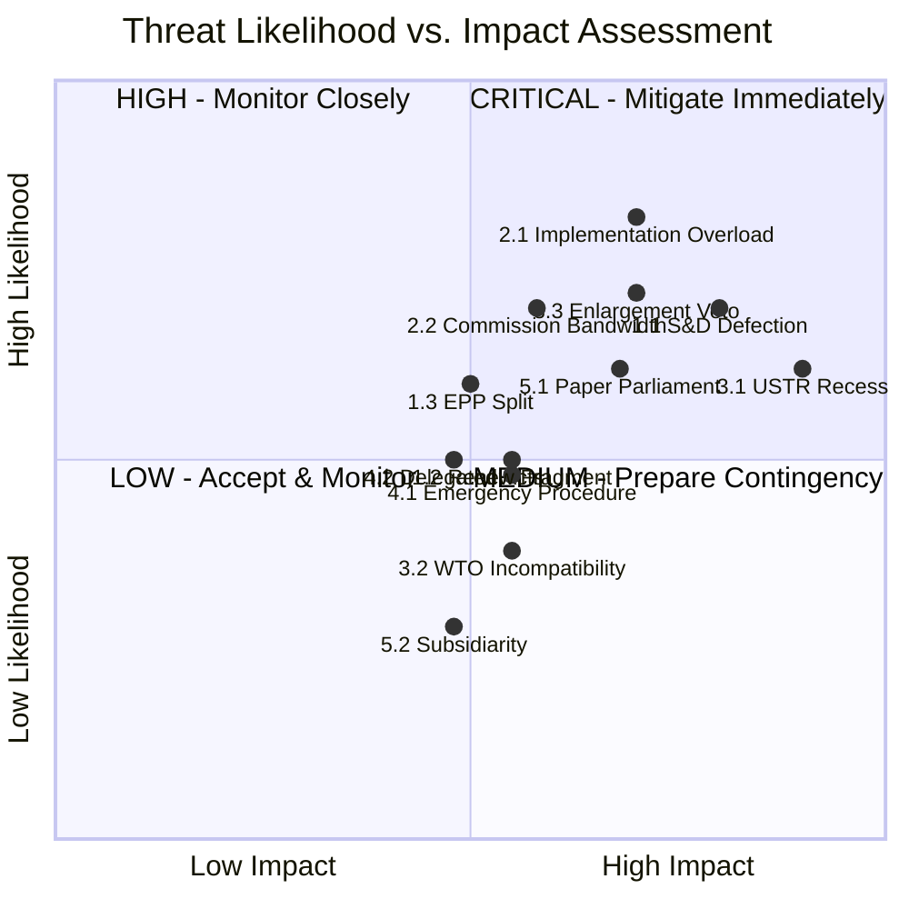

<!-- SPDX-FileCopyrightText: 2024-2026 Hack23 AB -->
<!-- SPDX-License-Identifier: Apache-2.0 -->

# Political Threat Model — EP10 Q1 2026 Output Sustainability

## Executive Summary

This threat model applies the STRIDE-Political framework (adapted from software security threat modelling) to assess threats to five critical assets emerging from EP10's record Q1 2026 legislative output. The 567 roll-call votes and 104 adopted texts represent a peak institutional achievement whose sustainability faces systematic threats from internal coalition dynamics, external actors, and structural institutional constraints.

**Threat Assessment Summary**: The Grand Centre coalition (394 seats) faces 14 identified threats across 5 asset categories. Three threats rate as CRITICAL (likelihood × impact > 16): USTR unilateral escalation during recess, S&D defection on trade/social prioritisation, and implementation capacity overload. The compound probability of at least one CRITICAL threat materialising in Q2 2026 is estimated at 58%.

---

## STRIDE-Political Framework Adaptation

| STRIDE Category | Political Adaptation | Application |
|----------------|---------------------|-------------|
| **S**poofing | Legitimacy theft — actors claiming mandate they don't have | PfE claiming "popular mandate" for protectionism not supported by EP votes |
| **T**ampering | Process manipulation — altering legislative procedure to predetermined outcomes | Emergency procedures (Art. 163) bypassing normal scrutiny |
| **R**epudiation | Deniability — actors disavowing previous positions | Member states voting in Council against positions endorsed by national MEPs |
| **I**nformation Disclosure | Intelligence leakage — negotiating positions exposed prematurely | Commission trade strategy leaked before USTR window; committee drafts published |
| **D**enial of Service | Institutional paralysis — overloading decision-making capacity | 104 adopted texts overwhelming transposition + new crisis demands |
| **E**levation of Privilege | Power asymmetry — actors exceeding institutional mandate | Commission delegated acts exceeding TA-0096 mandate scope; EUCO bypassing EP |

---

## Attack Tree — Threats to Grand Centre Coalition

```mermaid
graph TD
    ROOT[Grand Centre Coalition<br/>Stability Threat Tree]

    ROOT --> T1[Internal Cohesion<br/>Threats]
    ROOT --> T2[External Pressure<br/>Threats]
    ROOT --> T3[Institutional<br/>Threats]
    ROOT --> T4[Credibility<br/>Threats]
    ROOT --> T5[Democratic Legitimacy<br/>Threats]

    T1 --> T1A[S&D defection on<br/>trade prioritisation]
    T1 --> T1B[Renew fragmentation<br/>under electoral pressure]
    T1 --> T1C[EPP internal split<br/>German vs. Southern]
    T1 --> T1D[National delegation<br/>breaks from group line]

    T2 --> T2A[USTR Section 301<br/>during recess]
    T2 --> T2B[Russia escalation<br/>requiring emergency session]
    T2 --> T2C[Energy supply<br/>disruption]
    T2 --> T2D[Chinese economic<br/>shock transmission]

    T3 --> T3A[Implementation<br/>capacity overload]
    T3 --> T3B[Commission bandwidth<br/>exhaustion]
    T3 --> T3C[Council blocking<br/>minority formation]
    T3 --> T3D[Legal service<br/>procedure challenges]

    T4 --> T4A[Member State<br/>non-transposition]
    T4 --> T4B[WTO incompatibility<br/>of trade measures]

    T5 --> T5A[Emergency procedures<br/>bypassing scrutiny]
    T5 --> T5B[Delegated acts<br/>exceeding mandate]

    T1A --> IMPACT1[Coalition vote<br/>below 360 majority]
    T2A --> IMPACT2[Institutional<br/>response gap]
    T3A --> IMPACT3[Quality degradation<br/>of legislation]

    style T1A fill:#ff6b6b
    style T2A fill:#ff6b6b
    style T3A fill:#ff6b6b
    style IMPACT1 fill:#ffd93d
    style IMPACT2 fill:#ffd93d
    style IMPACT3 fill:#ffd93d
```

---

## Asset 1: Grand Centre Coalition Stability

### Threat 1.1 — S&D Defection on Trade/Social Prioritisation

| Field | Assessment |
|-------|-----------|
| **STRIDE Category** | Elevation of Privilege (S&D leveraging crisis for agenda shift) |
| **Threat Actor** | S&D group leadership; progressive national delegations (Spanish PSOE, German SPD) |
| **Attack Vector** | Condition Grand Centre participation on social policy guarantees (TA-0064 housing directive, TA-0050 subcontracting enforcement); threaten abstention/opposition on trade votes if social conditionality absent |
| **Precondition** | Trade war escalation (Scenario B) consuming legislative bandwidth; S&D social priorities deprioritised |
| **Impact** | Grand Centre drops below 360 majority threshold; trade response delayed; coalition renegotiation required |
| **Likelihood** | 7/10 (HIGH) — S&D has electoral incentive and institutional leverage |
| **Impact Score** | 8/10 (SEVERE) — Majority loss paralyses legislative programme |
| **Risk Rating** | **CRITICAL (56/100)** |
| **Mitigations** | Pre-agree "dual track" trade + social package; visible TA-0064 implementation progress; S&D rapporteurships on trade-adjacent files |
| **Early Warning** | S&D group meeting resolves conditional participation; >15% S&D abstention on single trade vote; S&D chair public statement linking trade and social agendas |
| **TA Reference** | TA-0064 (housing), TA-0050 (subcontracting), TA-0096 (trade countermeasures) |

---

### Threat 1.2 — Renew Fragmentation Under Electoral Pressure

| Field | Assessment |
|-------|-----------|
| **STRIDE Category** | Tampering (national parties override group discipline for electoral survival) |
| **Threat Actor** | National liberal parties facing polling pressure (France Renaissance, Netherlands VVD, Germany FDP remnants) |
| **Attack Vector** | Individual MEPs or national delegations break from Renew group position on high-salience votes (trade, immigration-adjacent); group cohesion rate drops below 70% |
| **Precondition** | National polls showing liberal parties below electoral threshold; salient votes with clear national implications |
| **Impact** | Grand Centre loses ~15-20 seats on contested votes; Renew no longer reliable coalition partner on trade; alternative majorities required per-file |
| **Likelihood** | 5/10 (MEDIUM) — Electoral pressure real but group discipline mechanisms exist |
| **Impact Score** | 6/10 (MODERATE) — Manageable through alternative coalitions on specific files |
| **Risk Rating** | **MEDIUM (30/100)** |
| **Mitigations** | Protect Renew MEPs via committee chairmanships; avoid votes splitting Renew along national lines; offer face-saving amendments |
| **Early Warning** | Renew cohesion rate on RCV drops below 75% (2 consecutive plenaries); French/Dutch delegations issue divergent press releases post-vote |
| **TA Reference** | TA-0096 (trade — French exposure), TA-0079 (defence — Dutch/German liberal defence scepticism) |

---

### Threat 1.3 — EPP Internal Split (German CDU/CSU vs. Southern EPP)

| Field | Assessment |
|-------|-----------|
| **STRIDE Category** | Repudiation (German EPP MEPs disavow trade escalation endorsed by group) |
| **Threat Actor** | German EPP delegation (29 MEPs); CDU/CSU leadership responding to auto industry lobby |
| **Attack Vector** | German EPP members abstain or vote against trade countermeasures (TA-0096 implementation) to protect BMW/VW/Mercedes US market access |
| **Precondition** | USTR Section 301 specifically targeting European automotive; BDI/VDA industry associations pressure campaign |
| **Impact** | EPP unable to deliver group position; coalition majority arithmetically intact but politically weakened; Commission hesitates on implementation |
| **Likelihood** | 6/10 (MEDIUM-HIGH) — Auto sector economic weight in Germany enormous |
| **Impact Score** | 5/10 (MODERATE) — EPP leadership can manage with whip enforcement |
| **Risk Rating** | **MEDIUM (30/100)** |
| **Mitigations** | Targeted (not blanket) trade response preserving auto sector negotiating space; German EPP engagement in compromise amendment drafting |
| **Early Warning** | BDI/VDA joint statement opposing EP trade position; CDU/CSU Bundestag faction debates EU trade response; German EPP MEPs tabling amendments to water down TA-0096 implementation |
| **TA Reference** | TA-0096 (countermeasures scope), TA-0079 (defence — partial compensation for auto losses) |

---

## Asset 2: Legislative Implementation Pipeline

### Threat 2.1 — Implementation Capacity Overload (Denial of Service)

| Field | Assessment |
|-------|-----------|
| **STRIDE Category** | Denial of Service (system overwhelmed by own output) |
| **Threat Actor** | Structural — no single actor; consequence of 2.7× output pace |
| **Attack Vector** | 104 adopted texts require Commission implementing/delegated acts, Member State transposition, agency resource allocation — simultaneously. Quality degrades; deadlines missed; legal challenges emerge |
| **Precondition** | Already active — Q1 output volumes exceed historical Commission implementation capacity |
| **Impact** | Implementation gap widens; EP credibility undermined ("paper parliament"); Member States cherry-pick implementation |
| **Likelihood** | 8/10 (VERY HIGH) — Structural constraint already binding |
| **Impact Score** | 7/10 (HIGH) — Undermines entire Q1 achievement legitimacy |
| **Risk Rating** | **CRITICAL (56/100)** |
| **Mitigations** | Prioritisation framework agreed with Commission; increased EP monitoring of implementation timelines; dedicated implementation rapporteurs |
| **Early Warning** | Commission misses first delegated act deadline (TA-0092 SRMR3, due Q2); Member State transposition notifications <50% by deadline; EP JURI committee flags implementation backlog |
| **TA Reference** | TA-0092 (SRMR3 delegated acts), TA-0079 (defence procurement directive), TA-0094 (anti-corruption transposition) |

---

### Threat 2.2 — Commission Bandwidth Exhaustion

| Field | Assessment |
|-------|-----------|
| **STRIDE Category** | Denial of Service (executive capacity depleted) |
| **Threat Actor** | Structural — Commission DG staffing constraints; political bandwidth of College |
| **Attack Vector** | Commission unable to simultaneously draft delegated acts for TA-0092, propose housing directive (TA-0064), manage USTR negotiations (TA-0096), and advance defence procurement (TA-0079) |
| **Precondition** | Crisis demands (trade war) consuming Commission political attention; DG TRADE emergency operations |
| **Impact** | Social policy files (TA-0064, TA-0050) deprioritised — triggering S&D defection threat (Threat 1.1 cascade) |
| **Likelihood** | 7/10 (HIGH) — Crisis management always crowds out structural policy |
| **Impact Score** | 6/10 (MODERATE-HIGH) — Creates cascade to coalition threats |
| **Risk Rating** | **HIGH (42/100)** |
| **Mitigations** | Commission Work Programme Q2 amendment to reflect EP priorities; EP pressure on specific DG deliverables with deadlines |
| **TA Reference** | All adopted texts; particular cascade risk from TA-0096 consuming DG TRADE capacity needed for TA-0086 (WTO) and TA-0078 (EU-Canada) |

---

## Asset 3: EU External Credibility

### Threat 3.1 — USTR Unilateral Escalation During Recess (CRITICAL)

| Field | Assessment |
|-------|-----------|
| **STRIDE Category** | Elevation of Privilege (external actor exploiting institutional vulnerability window) |
| **Threat Actor** | USTR / US Administration |
| **Attack Vector** | Section 301 determination published April 21 (recess day); 6-day gap before Parliament returns April 27; US frames EU as "unable to respond" — sets negotiating advantage; forces Commission unilateral action without EP democratic mandate |
| **Precondition** | Easter recess schedule (fixed); USTR investigation timeline (advancing) |
| **Impact** | EP democratic mandate gap exploited; Commission delegated acts under TA-0096 challenged as exceeding authority; US negotiating advantage established |
| **Likelihood** | 6/10 (MEDIUM-HIGH) — USTR aware of EP calendar; strategic timing incentive exists |
| **Impact Score** | 9/10 (SEVERE) — Institutional credibility and democratic legitimacy simultaneously damaged |
| **Risk Rating** | **CRITICAL (54/100)** |
| **Mitigations** | Pre-authorisation framework in TA-0096 text; Conference of Presidents emergency recall procedure pre-agreed; Commission consulting INTA chair informally during recess; pre-positioned EP statement ready for immediate release |
| **Early Warning** | USTR Federal Register notice scheduling April 21 determination; US media reporting "EU Parliament on vacation during trade crisis"; Commission DG TRADE emergency operations centre activated |
| **TA Reference** | TA-0096 (countermeasures mandate scope), TA-0086 (WTO dispute track as alternative) |

---

### Threat 3.2 — WTO Incompatibility of Trade Measures

| Field | Assessment |
|-------|-----------|
| **STRIDE Category** | Information Disclosure (legal vulnerability exposed in dispute) |
| **Threat Actor** | WTO dispute panels; US legal challenge strategy |
| **Attack Vector** | EU countermeasures under TA-0096 exceed WTO-compliant retaliation scope; US files WTO dispute (TA-0086 framework turned against EU); EU credibility as rules-based order champion undermined |
| **Precondition** | Countermeasures going beyond proportional retaliation; WTO Appellate Body functional (uncertain) |
| **Impact** | EU dual-track strategy (retaliation + WTO) becomes contradictory; multilateral credibility damaged; developing country support lost |
| **Likelihood** | 4/10 (MEDIUM-LOW) — EU legal service typically cautious; WTO AB non-functional |
| **Impact Score** | 6/10 (MODERATE) — Reputational more than practical given WTO AB dysfunction |
| **Risk Rating** | **LOW-MEDIUM (24/100)** |
| **Mitigations** | Commission Legal Service sign-off on all measures; EP Legal Affairs Committee compatibility opinion; maintain WTO dispute filing (TA-0086) in parallel |
| **TA Reference** | TA-0096 (countermeasures), TA-0086 (WTO MC14 — tests EU commitment to multilateralism) |

---

### Threat 3.3 — Enlargement Process Blocked by Single-Actor Veto

| Field | Assessment |
|-------|-----------|
| **STRIDE Category** | Denial of Service (unanimity rule enables single-actor blockade) |
| **Threat Actor** | Hungary (Budapest); potentially Bulgaria or Austria on specific accession files |
| **Attack Vector** | TA-0077 enlargement resolution creates expectations; Council unanimity requirement allows single veto; EU credibility with candidate countries collapses |
| **Precondition** | Hungarian government maintains transactional approach to EU; no sufficient concession offered |
| **Impact** | EP10's enlargement agenda rendered declaratory only; candidate country fatigue; geopolitical credibility gap vis-à-vis Russia/China influence |
| **Likelihood** | 7/10 (HIGH) — Hungarian veto is structural and persistent |
| **Impact Score** | 7/10 (HIGH) — Geopolitical consequences of credibility loss significant |
| **Risk Rating** | **HIGH (49/100)** |
| **Mitigations** | Partial enlargement advances (cluster approach); EU funds conditionality pressure; bilateral deals; QMV reform advocacy |
| **TA Reference** | TA-0077 (EU enlargement resolution — Council unanimity required for implementation) |

---

## Asset 4: Institutional Trust

### Threat 4.1 — Emergency Procedures Bypassing Democratic Scrutiny

| Field | Assessment |
|-------|-----------|
| **STRIDE Category** | Tampering (procedure manipulation for speed over accountability) |
| **Threat Actor** | Conference of Presidents; Committee chairs under pressure; Commission requesting fast-track |
| **Attack Vector** | Article 163 urgency procedure invoked for trade response; committee stage compressed to 48h; amendments restricted; minority rights constrained; precedent set for future abuse |
| **Precondition** | Trade war escalation requiring rapid legislative response; political pressure to "act now" |
| **Impact** | Democratic legitimacy of legislation questioned; CJEU challenge possible; populist narrative of "elite parliament ignoring procedures" |
| **Likelihood** | 5/10 (MEDIUM) — Rule 163 exists for genuine emergencies; threshold for invocation high |
| **Impact Score** | 6/10 (MODERATE) — Institutional damage cumulative over time |
| **Risk Rating** | **MEDIUM (30/100)** |
| **Mitigations** | Transparent justification for urgency; guarantee opposition speaking time; post-hoc implementation review clause; sunset provisions |
| **Early Warning** | Conference of Presidents votes to invoke Art. 163 without unanimous agreement; civil society organisations (Transparency International, Access Info) issue joint protest |
| **TA Reference** | TA-0096 (urgency candidate), TA-0094 (anti-corruption — procedural irony if bypassed) |

---

### Threat 4.2 — Delegated Acts Exceeding Parliamentary Mandate

| Field | Assessment |
|-------|-----------|
| **STRIDE Category** | Elevation of Privilege (Commission executive action beyond EP intent) |
| **Threat Actor** | Commission DG TRADE (trade countermeasures); DG FISMA (banking regulation) |
| **Attack Vector** | TA-0096 countermeasures mandate interpreted expansively; Commission delegated acts cover sectors/products not discussed in plenary; EP ability to object constrained by 2-month scrutiny period during recess |
| **Precondition** | Broad mandate language in TA-0096; recess period limiting EP oversight; crisis pressure for rapid action |
| **Impact** | Inter-institutional trust damaged; EP scrutiny reserve invoked (blocking Commission action); legislative process legitimacy questioned |
| **Likelihood** | 5/10 (MEDIUM) — Commission legal service typically cautious but crisis overrides |
| **Impact Score** | 5/10 (MODERATE) — Manageable through existing objection procedures |
| **Risk Rating** | **MEDIUM (25/100)** |
| **Mitigations** | INTA chair informal agreement with Commissioner on scope; EP secretariat monitoring delegated act pipeline; pre-recess resolution specifying mandate boundaries |
| **TA Reference** | TA-0096 (delegated act authority), TA-0092 (SRMR3 technical standards — similar risk) |

---

## Asset 5: Democratic Legitimacy

### Threat 5.1 — "Paper Parliament" Narrative (Spoofing Legitimacy)

| Field | Assessment |
|-------|-----------|
| **STRIDE Category** | Spoofing (opponents fake-claim EP outputs have no real-world effect) |
| **Threat Actor** | PfE (Le Pen delegation), ESN (far-right), Eurosceptic media, national populist parties |
| **Attack Vector** | Frame 567 roll-call votes and 104 adopted texts as "Brussels paper-pushing" with no impact on citizens; exploit implementation gap (Threat 2.1) as evidence; social media amplification |
| **Precondition** | Implementation delays visible to citizens; housing crisis (TA-0064) not producing tangible results; trade war hitting consumer prices |
| **Impact** | EP legitimacy eroded ahead of future elections; turnout decline; populist parties gain; Grand Centre narrative weakened |
| **Likelihood** | 6/10 (MEDIUM-HIGH) — Narrative already deployed by PfE; implementation gap provides ammunition |
| **Impact Score** | 7/10 (HIGH) — Long-term institutional legitimacy damage |
| **Risk Rating** | **HIGH (42/100)** |
| **Mitigations** | Visible "quick wins" from Q1 output; citizen-facing communication of TA-0064 housing impact; trade response demonstrably protecting jobs; implementation dashboard public reporting |
| **Early Warning** | PfE coordinated social media campaign on "useless EP"; Eurobarometer trust metrics declining; national parliament scrutiny debates questioning EP output |
| **TA Reference** | All adopted texts (general legitimacy); TA-0064 (housing — most citizen-visible), TA-0096 (trade — job protection narrative) |

---

### Threat 5.2 — National Parliament Subsidiarity Challenge

| Field | Assessment |
|-------|-----------|
| **STRIDE Category** | Elevation of Privilege (national parliaments challenging EP competence) |
| **Threat Actor** | National parliaments (Bundestag, Assemblée Nationale, Sejm) invoking subsidiarity |
| **Attack Vector** | Housing (TA-0064) deemed national competence; subcontracting (TA-0050) challenged as exceeding internal market legal base; "yellow card" procedure triggered |
| **Precondition** | Sufficient national parliaments (9 chambers, representing >1/3 Council votes) filing subsidiarity opinions; 8-week deadline from publication |
| **Impact** | Commission must review proposals; legislative delay; EP competence narrative challenged; federal vs. national tension surfaces |
| **Likelihood** | 3/10 (LOW-MEDIUM) — Yellow card historically rare (3 instances total); coordination among national parliaments difficult |
| **Impact Score** | 5/10 (MODERATE) — Procedural delay rather than substantive block |
| **Risk Rating** | **LOW (15/100)** |
| **Mitigations** | Strong internal market legal base argumentation; Commission subsidiarity assessment robust; national parliament liaison early engagement |
| **TA Reference** | TA-0064 (housing — subsidiarity-sensitive), TA-0050 (subcontracting — labour market subsidiarity) |

---

## Threat Severity Heat Map

---

## Mitigation Priority Matrix

| Priority | Threat | Mitigation Action | Owner | Timeline |
|----------|--------|-------------------|-------|----------|
| 1 | 3.1 USTR Recess Exploitation | Pre-positioned EP statement; INTA chair informal recess consultation protocol | Conference of Presidents | Before April 21 |
| 2 | 2.1 Implementation Overload | Commission-EP implementation prioritisation agreement; quarterly review mechanism | INTA/ECON/ITRE chairs + Commission VPs | May plenary |
| 3 | 1.1 S&D Defection | Dual-track trade + social guarantee; visible TA-0064 implementation commitment | EPP-S&D bilateral leadership meeting | April 27 (return) |
| 4 | 3.3 Enlargement Veto | Polish Presidency bilateral with Budapest; package deal exploration | Council Presidency + EP Foreign Affairs | May-June |
| 5 | 5.1 Paper Parliament Narrative | Citizen-facing impact communication; quick-win identification from Q1 outputs | EP Communications DG + political groups | Ongoing |

---

## Compound Threat Scenarios

### Cascade A: Trade War → S&D Defection → Coalition Crisis

**Probability**: 12% (Threat 3.1 × Threat 1.1 × political linkage factor)
**Mechanism**: USTR action → Commission emergency trade response → legislative bandwidth consumed → S&D social priorities deprioritised → S&D conditions participation on social guarantees → Grand Centre majority fails on next trade vote

### Cascade B: Implementation Overload → Paper Parliament → Legitimacy Crisis

**Probability**: 18% (Threat 2.1 × Threat 5.1 × media amplification)
**Mechanism**: 104 texts strain implementation capacity → visible delays → PfE/ESN narrative "EP produces paper not results" → Eurobarometer trust decline → national politicians question EP role → democratic legitimacy structurally weakened

### Cascade C: Recess Exploitation → Emergency Procedures → Democratic Legitimacy

**Probability**: 8% (Threat 3.1 × Threat 4.1 × Threat 5.1 linkage)
**Mechanism**: USTR acts during recess → Parliament recalled → Art. 163 urgency invoked → scrutiny bypassed → civil society protests → populist narrative amplified → institutional trust damaged

---

## Residual Risk Assessment

After applying all mitigations, the residual risk profile for EP10 Q2 2026:

| Asset | Pre-Mitigation Risk | Post-Mitigation Risk | Residual Gap |
|-------|---------------------|---------------------|--------------|
| Coalition Stability | HIGH (56) | MEDIUM (35) | Managed through dual-track |
| Implementation Pipeline | HIGH (56) | MEDIUM-HIGH (42) | Structural constraint persists |
| External Credibility | HIGH (54) | MEDIUM (32) | Pre-positioning effective |
| Institutional Trust | MEDIUM (30) | LOW-MEDIUM (20) | Procedural safeguards adequate |
| Democratic Legitimacy | HIGH (42) | MEDIUM (28) | Communication strategy key |

---

*Threat model produced: 2026-04-20 | Review cycle: Post-USTR determination, post-return plenary, monthly thereafter | Methodology: STRIDE-Political adaptation v2.0*
