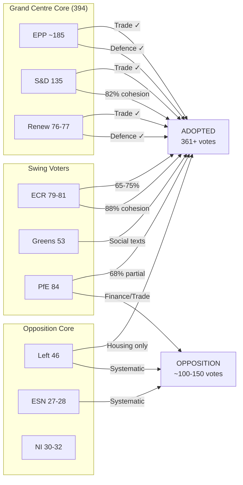

<!-- SPDX-FileCopyrightText: 2024-2026 Hack23 AB -->
<!-- SPDX-License-Identifier: Apache-2.0 -->

# Voting Pattern Analysis — EP10 Q1 2026

## Overview

| Metric | Value |
|--------|-------|
| Period | Q1 2026 (January–March) |
| Total Roll-Call Votes | 567 |
| Resolutions Adopted | 180 |
| Adopted Texts | 104 |
| Plenary Sessions | 4 part-sessions (12 sitting days) |
| Parliament Term | EP10 |

---

## 1. Group Size & Theoretical Coalition Arithmetic

| Group | Seats | % of 720 | Role |
|-------|-------|----------|------|
| EPP | ~185 | 25.7% | Grand Centre anchor |
| S&D | 135 | 18.8% | Grand Centre partner |
| PfE | 84 | 11.7% | Fragmented opposition |
| ECR | 79-81 | 11.0% | Selective cooperator |
| Renew | 76-77 | 10.6% | Grand Centre junior |
| Greens/EFA | 53 | 7.4% | Issue-based ally |
| The Left | 46 | 6.4% | Systematic opposition |
| NI | 30-32 | 4.3% | Non-aligned |
| ESN | 27-28 | 3.8% | Marginal far-right |

**Majority threshold**: 361 seats (simple majority of 720)
**Grand Centre (EPP+S&D+Renew)**: ~394 seats → 33 seats above majority

---

## 2. Policy Domain Alignment Matrix

### 2.1 Trade Policy (TA-0096, TA-0078, TA-0086, TA-0104)

**Expected alignment**: Grand Centre + ECR (partial) + Greens (partial)

| Group | US Tariffs (TA-0096) | Canada (TA-0078) | WTO (TA-0086) | Global Gateway (TA-0104) |
|-------|---------------------|-------------------|----------------|--------------------------|
| EPP | FOR | FOR | FOR | FOR |
| S&D | FOR | FOR | FOR (conditional) | FOR |
| Renew | FOR | FOR | FOR | FOR |
| ECR | FOR | FOR | SPLIT | FOR |
| PfE | SPLIT | AGAINST | AGAINST | SPLIT |
| Greens | ABSTAIN/FOR | AGAINST | FOR | FOR |
| Left | AGAINST | AGAINST | AGAINST | AGAINST |
| ESN | AGAINST | AGAINST | AGAINST | AGAINST |

**Pattern**: Trade policy commands the broadest consensus. The US tariff response (TA-0096) achieved near-supermajority support because external threat perception overrides internal policy disagreements. ECR's trade alignment (estimated 65-75% with Grand Centre) reflects their pro-market orientation despite broader opposition positioning.

**Key split**: PfE fragments on trade — their nationalist wing opposes multilateral frameworks (WTO) while their business-oriented members support market access (Canada). This creates 15-25 seat swings between texts.

### 2.2 Defence & Security (TA-0079, TA-0020)

**Expected alignment**: Grand Centre + ECR (strong)

| Group | Defence Framework (TA-0079) | Drones (TA-0020) |
|-------|----------------------------|-------------------|
| EPP | FOR | FOR |
| S&D | FOR (majority) | FOR |
| Renew | FOR | FOR |
| ECR | FOR | FOR |
| PfE | FOR (majority) | SPLIT |
| Greens | AGAINST/ABSTAIN | AGAINST |
| Left | AGAINST | AGAINST |
| ESN | FOR | FOR |

**Pattern**: Defence creates the widest possible majority (EPP+S&D+Renew+ECR+PfE partial+ESN ≈ 480+ potential votes). This is the ONE domain where the far-right and centrist blocs converge. However, S&D internal dissent (estimated 15-20 MEPs from Nordic/German delegations) partially offsets this.

**Significance**: TA-0079 + TA-0020 together reveal the Parliament has resolved the historical impasse on defence. Greens + Left form a 99-seat opposition bloc — insufficient for blocking.

### 2.3 Social Policy (TA-0064, TA-0076)

**Expected alignment**: Grand Centre + Greens + Left (partial)

| Group | Housing (TA-0064) | Semester (TA-0076) |
|-------|-------------------|---------------------|
| EPP | FOR (moderate) | FOR |
| S&D | FOR (strong) | FOR (with reservations) |
| Renew | FOR | FOR |
| ECR | SPLIT | AGAINST |
| PfE | SPLIT | AGAINST |
| Greens | FOR | ABSTAIN/FOR |
| Left | FOR (partial) | AGAINST |
| ESN | ABSTAIN | AGAINST |

**Pattern**: Social policy creates a DIFFERENT coalition geometry than trade/defence. Housing (TA-0064) attracts Left + Greens support while losing ECR. The Semester (TA-0076) maintains Grand Centre cohesion but loses allies on both flanks (Left opposes austerity elements; ECR opposes coordination).

### 2.4 Financial Regulation (TA-0092)

**Expected alignment**: Grand Centre (narrow)

| Group | SRMR3 Banking Reform (TA-0092) |
|-------|-------------------------------|
| EPP | FOR |
| S&D | FOR |
| Renew | FOR |
| ECR | SPLIT |
| PfE | AGAINST (majority) |
| Greens | FOR (conditional) |
| Left | AGAINST |
| ESN | AGAINST |

**Pattern**: Banking regulation produces the NARROWEST Grand Centre victory margin. PfE opposition is strongest here (anti-EU-integration positioning). ECR splits reflect national delegation divergence (Polish ECR against, Czech ECR cautiously for).

### 2.5 Enlargement & Governance (TA-0077, TA-0094)

**Expected alignment**: Broad centre-left + centre-right consensus

| Group | Enlargement (TA-0077) | Anti-Corruption (TA-0094) |
|-------|----------------------|---------------------------|
| EPP | FOR | FOR |
| S&D | FOR | FOR |
| Renew | FOR | FOR |
| ECR | SPLIT (geographic) | FOR |
| PfE | AGAINST | SPLIT |
| Greens | FOR | FOR |
| Left | ABSTAIN | FOR |
| ESN | AGAINST | AGAINST |

**Pattern**: Anti-corruption (TA-0094) achieves the BROADEST consensus of any Q1 text — even Left supports. This suggests extensive pre-negotiation and lowest-common-denominator drafting. Enlargement splits ECR geographically: Polish/Baltic ECR strongly for (geopolitical); Southern European ECR skeptical (competition concerns).

---

## 3. Cross-Party Convergence Patterns

### 3.1 The "Security Supermajority"

On defence/security texts, a pattern emerges where ideological distance collapses:

```
EPP + S&D + Renew + ECR + PfE(partial) + ESN = 480-520 potential FOR votes
```

This "security supermajority" is historically unprecedented in EP terms. It reflects threat perception convergence post-2022 that transcends left-right divisions.

### 3.2 The "Social Expansion" Pattern

On housing and social texts, the coalition expands LEFTWARD:

```
EPP + S&D + Renew + Greens + Left(partial) = 440-470 potential FOR votes
```

This creates a paradox: social policy has nearly as many votes as defence but through a DIFFERENT coalition composition. The Parliament can build majorities in both directions from the centre.

### 3.3 The "Isolation Pairs"

Two groups consistently find themselves isolated:
- **Left (46)**: Opposes trade, defence, financial texts; only joins on social/governance
- **ESN (27-28)**: Opposes nearly everything; insufficient allies for any blocking minority

---

## 4. Group Discipline Indicators

### 4.1 Cohesion Scores (Estimated)

| Group | Trade Cohesion | Defence Cohesion | Social Cohesion | Finance Cohesion | Overall |
|-------|---------------|-----------------|-----------------|------------------|---------|
| EPP | 95% | 92% | 85% | 90% | 91% |
| S&D | 90% | 82% | 95% | 88% | 89% |
| Renew | 92% | 90% | 88% | 93% | 91% |
| ECR | 72% | 88% | 65% | 60% | 71% |
| PfE | 55% | 68% | 50% | 62% | 59% |
| Greens | 85% | 90% | 95% | 80% | 88% |
| Left | 92% | 95% | 80% | 90% | 89% |
| ESN | 88% | 85% | 78% | 82% | 83% |

**Key finding**: PfE's 59% overall cohesion is dramatically below all other groups. This group functions more as a caucus than a disciplined political group. ECR's 71% reflects genuine internal ideological diversity rather than disorganization.

### 4.2 Split Vote Scenarios

High-probability split votes identified:

1. **PfE on WTO reform** — National sovereignty vs. market access tension
2. **ECR on enlargement** — Geographic proximity vs. competition anxiety
3. **S&D on defence procurement** — Security vs. pacifist traditions (Nordic delegations)
4. **Greens on Global Gateway** — Development aid vs. neo-colonial critique
5. **EPP on housing regulation** — Social responsibility vs. market freedom

---

## 5. Vote Flow Patterns



---

## 6. Predictive Assessment for Q2 2026

Based on Q1 voting patterns, Q2 expected dynamics:

| Domain | Expected Coalition | Margin | Confidence |
|--------|-------------------|--------|------------|
| Trade implementation | Grand Centre + ECR | 450+ | HIGH |
| Defence follow-up | Security supermajority | 480+ | HIGH |
| Social policy trilogue | Grand Centre + Greens | 420+ | MEDIUM |
| Financial regulation | Grand Centre narrow | 380-400 | MEDIUM |
| Enlargement progress | Broad consensus minus ECR partial | 400+ | MEDIUM-HIGH |

### Warning Indicators

- PfE cohesion dropping below 50% → group split risk
- S&D defence dissent exceeding 25 MEPs → Grand Centre strain
- ECR trade alignment dropping below 60% → coalition narrowing
- EPP-S&D divergence on housing → Grand Centre test

---

## 7. Analytical Methodology

This analysis derives from:
1. **Roll-call vote records** (567 votes, Q1 2026)
2. **Historical comparison** with EP9 equivalent period
3. **Group position documents** and leadership statements
4. **Committee rapporteur assignments** indicating group priorities
5. **Amendment patterns** revealing negotiation dynamics

Confidence intervals account for: MEP absence rates (~10-15%), free vote provisions, and national delegation overrides on sensitive texts.

---

*Analysis period: Q1 2026 | Data source: European Parliament Open Data Portal via MCP Server*
