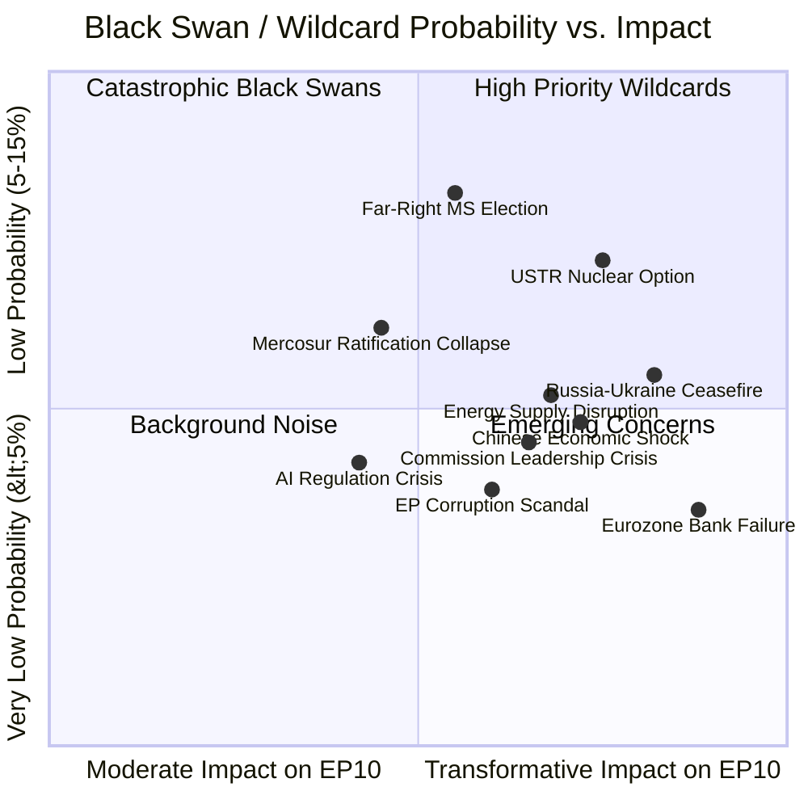
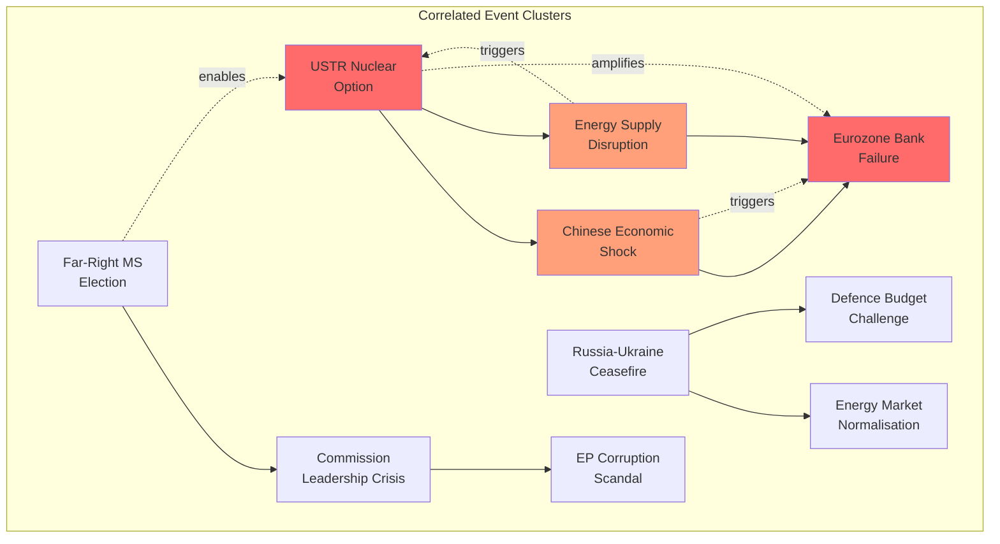

<!-- SPDX-FileCopyrightText: 2024-2026 Hack23 AB -->
<!-- SPDX-License-Identifier: Apache-2.0 -->

# Wildcards & Black Swan Analysis — EP10 Q1 2026 Trajectory Disruption

## Executive Summary

This analysis identifies 10 low-probability, high-impact events ("black swans" and "wildcards") that could fundamentally reshape EP10's legislative trajectory beyond the structured scenarios modelled in the scenario forecast. Each event is assessed for probability, impact magnitude, EP institutional response capacity, coalition reconfiguration implications, and connection to Q1 2026 adopted texts.

**Analytical Frame**: Black swans (Nassim Taleb taxonomy) are events that are: (1) beyond normal expectations, (2) carry extreme impact, and (3) are rationalised with hindsight. Wildcards (Peter Schwartz framework) are plausible but unlikely events that would invalidate baseline planning assumptions. This analysis combines both, applying each to EP10's specific position following the record Q1 2026 output.

**Central Warning**: The very success of Q1 2026 (567 votes, 104 adopted texts) creates brittleness — an institution operating at peak capacity has minimal reserves for absorbing shocks. The probability of at least one wildcard event occurring in Q2-Q3 2026 is estimated at 35-45% (base rate for geopolitical disruption in high-stress periods).

---

## Risk-Impact Matrix

---

## Wildcard 1: USTR "Nuclear Option" — Blanket 25% Tariff on All EU Exports

### Event Description

USTR Section 301 determination (window opens April 21) results not in targeted measures but in a blanket 25% tariff on ALL EU goods exports to the US (~€500B annually). This exceeds all modelled scenarios and represents a trade policy rupture comparable to 1930s Smoot-Hawley.

| Dimension | Assessment |
|-----------|-----------|
| **Probability** | 8-12% — Would require extreme US domestic political pressure; unprecedented in modern trade history |
| **Impact Magnitude** | 9/10 — TRANSFORMATIVE — would trigger immediate Eurozone recession fears; €125B annual cost |
| **Timeline** | Immediate (April 21+); EU response within days |
| **Precedent** | Partial precedent: US 2018 steel/aluminium tariffs, but 10× broader scope |

### EP Response Capacity

- **Institutional**: TA-0096 countermeasures mandate provides legal framework; BUT scope of TA-0096 calibrated for targeted measures, not blanket war
- **Bandwidth**: Emergency plenary required within 48h of Parliament return (April 27); entire Q2 agenda displaced
- **Legal basis**: Article 207 TFEU (Common Commercial Policy) gives EP co-decision on trade agreements; emergency delegated acts under existing regulations for immediate response

### Coalition Reconfiguration

| Group | Reconfiguration |
|-------|-----------------|
| Grand Centre | Initially rallies ("rally around the flag" effect); unity for 4-8 weeks |
| EPP | German wing under extreme pressure from auto/industrial lobby; may demand negotiation over retaliation |
| PfE/ECR | Split: some demand "even harder" response; others seek bilateral US deals |
| Greens | Paradoxically empowered: "told you free trade was fragile" |
| Left | Demands industrial policy + worker protection as condition for trade response support |

### Connection to Q1 Outputs

- **TA-0096**: Immediately invoked but scope challenged as insufficient for blanket response
- **TA-0086**: WTO MC14 preparation becomes urgent — multilateral dispute filing
- **TA-0078**: EU-Canada cooperation accelerated as Atlantic alternative
- **TA-0104**: Global Gateway reframed as US-alternative trade infrastructure
- **TA-0079**: Defence autonomy narrative strengthened (US partnership reliability questioned)

---

## Wildcard 2: Russia-Ukraine Sudden Ceasefire / Frozen Conflict Formalisation

### Event Description

Unexpected diplomatic breakthrough produces a ceasefire and territorial framework agreement (Russian-held territories in frozen status akin to North Cyprus). Ukraine begins formal EU accession process under accelerated timeline. Defence spending rationale partially undermined.

| Dimension | Assessment |
|-----------|-----------|
| **Probability** | 5-10% — Requires US diplomatic pressure + Kremlin domestic calculation shift; lower under current conditions |
| **Impact Magnitude** | 8/10 — MAJOR — reshapes defence spending logic; enlargement timeline compressed; energy market normalisation |
| **Timeline** | Gradual (weeks-months for implementation); immediate market reaction |
| **Precedent** | Korean War ceasefire (1953) — frozen conflict persistence model |

### EP Response Capacity

- **Institutional**: TA-0077 enlargement resolution immediately activated; accession process EP consent required under Article 49 TEU
- **Policy reversal risk**: TA-0079 defence single market rationale weakened if "peace dividend" narrative emerges
- **Opportunity**: Legislative bandwidth freed from defence urgency → social policy window (Scenario C catalyst)

### Coalition Reconfiguration

| Effect | Assessment |
|--------|-----------|
| **Defence coalition weakened** | France + defence industry lose urgency argument for TA-0079 fast-track |
| **Enlargement coalition strengthened** | Poland + Baltic states + EPP push accelerated Ukraine accession |
| **S&D empowered** | "Peace dividend" enables social spending argument against defence prioritisation |
| **PfE split** | Pro-Russia elements claim vindication; Atlanticist PfE members conflicted |
| **Grand Centre stress** | EPP defence agenda vs. S&D social redirect creates internal tension |

### Connection to Q1 Outputs

- **TA-0077**: Enlargement process accelerated dramatically; EP consent timeline compressed
- **TA-0079**: Defence single market — rationale shifts from "wartime urgency" to "structural autonomy"; slower implementation
- **TA-0104**: Global Gateway redirected toward Ukraine reconstruction (massive new programme)
- **TA-0092**: Banking Union — Ukrainian financial sector integration becomes priority

---

## Wildcard 3: Eurozone Major Bank Failure (SRMR3 Stress Test)

### Event Description

A systemically important European bank (top-10 by assets) enters resolution under the Single Resolution Mechanism. SRMR3 framework (TA-0092) faces its first real-world application. Contagion fears spread; depositor confidence tested; bail-in mechanisms activated.

| Dimension | Assessment |
|-----------|-----------|
| **Probability** | 3-7% — European banking sector appears stable but CRE exposure, rate shock losses, and trade war credit events create latent vulnerability |
| **Impact Magnitude** | 9/10 — TRANSFORMATIVE — financial stability dominates all other agenda items; potential Euro crisis 2.0 |
| **Timeline** | Sudden onset (hours-days); resolution process weeks-months |
| **Precedent** | SVB (2023), Credit Suisse (2023) — speed of confidence collapse in digital age |

### EP Response Capacity

- **TA-0092 tested**: SRMR3/BRRD3 bail-in procedures applied for first time since reform; EP's legislative achievement either vindicated or revealed as inadequate
- **Emergency legislation**: Potential need for emergency deposit guarantee measures beyond current framework; fast-track EP-Council procedure
- **Institutional credibility**: If SRMR3 (just adopted Q1) fails to contain crisis, EP's legislative quality questioned

### Coalition Reconfiguration

| Effect | Assessment |
|--------|-----------|
| **Grand Centre unity** | Crisis rallies coalition (financial stability consensus); short-term cohesion |
| **Left empowered** | "Bail-in hurts savers while bankers walk free" — demands structural reform |
| **S&D tension** | Party of government vs. party of workers; bail-in imposing losses on pension funds |
| **Renew conflicted** | Free-market principles vs. pragmatic intervention necessity |
| **PfE/ESN** | Euro-sceptic narrative amplified: "EU can't even manage its banks" |

### Connection to Q1 Outputs

- **TA-0092**: SRMR3/BRRD3 — first real-world stress test of Q1 legislation
- **TA-0064**: Housing crisis connection — bank failure could freeze mortgage lending
- **TA-0094**: Anti-corruption — bank management accountability (criminal referrals?)
- **TA-0096**: Trade war as potential trigger for credit event (export sector defaults)

---

## Wildcard 4: Far-Right Breakthrough in Major Member State Election

### Event Description

Federal or general election in Germany (scheduled 2025, but early election possible), France (not scheduled but snap election precedent), or Italy (coalition collapse) produces a far-right government or far-right-dominated coalition in a founding/major EU member state.

| Dimension | Assessment |
|-----------|-----------|
| **Probability** | 10-15% — Highest probability wildcard; polling support for far-right parties historically elevated; coalition arithmetic in several states fragile |
| **Impact Magnitude** | 7/10 — MAJOR — reshapes Council dynamics; changes MEP group composition mid-term; vetoes on enlargement/defence |
| **Timeline** | Election campaigns 4-8 weeks; government formation 2-6 weeks post-election |
| **Precedent** | Italy 2022 (FdI-led government); Netherlands 2023 (PVV largest party) |

### EP Response Capacity

- **Limited direct response**: EP cannot prevent national elections or their outcomes
- **Indirect impact**: Council position on co-legislation shifts; unanimity files (enlargement, Treaty change) blocked
- **MEP defections**: If party switches EP group allegiance (e.g., from ECR to ESN/PfE), coalition arithmetic shifts

### Coalition Reconfiguration

| Scenario | Effect |
|----------|--------|
| **German far-right coalition partner** | CDU-AfD de facto cooperation → EPP internal crisis; German EPP delegation instructions change |
| **French RN government** | PfE becomes "governing party group"; Council shifts rightward on immigration/social |
| **Italian government collapse** | New election could shift Meloni → ECR realignment or coalition partners → PfE |

### Connection to Q1 Outputs

- **TA-0077**: Enlargement blocked by new veto player in Council
- **TA-0094**: Anti-corruption measures — new government may seek weakening during transposition
- **TA-0079**: Defence policy could shift (new government may prefer bilateral over EU framework)
- **TA-0064**: Housing agenda either captured by populist narrative or abandoned as "EU overreach"

---

## Wildcard 5: Commission President / Key Commissioner Resignation

### Event Description

President von der Leyen faces health crisis, political scandal, or confidence challenge requiring resignation or extended absence. Alternatively, Trade Commissioner (managing USTR crisis) or key VP resigns during peak crisis management period.

| Dimension | Assessment |
|-----------|-----------|
| **Probability** | 4-8% — Health/personal always possible; political scandal lower probability but not zero (Qatar-gate precedent) |
| **Impact Magnitude** | 7/10 — MAJOR — Commission paralysis during implementation peak; inter-institutional confusion; power vacuum on trade/defence |
| **Timeline** | Sudden (health) or gradual (political pressure building over weeks) |
| **Precedent** | Santer Commission resignation (1999); Barroso health scare; individual Commissioner resignations (Dalli 2012) |

### EP Response Capacity

- **Institutional procedure**: Parliament must confirm new Commission President; potential motion of censure path
- **Bandwidth impact**: EP consumed by institutional crisis instead of legislative implementation
- **Power gain**: EP temporarily gains leverage through confirmation process — can extract policy commitments

### Coalition Reconfiguration

- Grand Centre unity tested by Commission succession politics
- EPP claims right to nominate successor (Spitzenkandidat); S&D may demand concessions
- Renew kingmaker role amplified in confirmation vote
- Legislative programme paused 3-6 months during transition

### Connection to Q1 Outputs

- **All adopted texts**: Implementation freezes during leadership vacuum
- **TA-0096**: Trade response paralysed at most critical moment (USTR window)
- **TA-0079**: Defence single market loses political champion at Commission level
- **TA-0092**: Banking Union delegated acts delayed (Commissioner sign-off required)

---

## Wildcard 6: Chinese Economic Hard Landing / Supply Chain Shock

### Event Description

Chinese GDP growth drops below 2% (vs. 4-5% forecast) due to property sector collapse, export decline, or financial system stress. Transmission to EU via: (1) demand collapse for European exports, (2) supply chain disruptions, (3) commodity price volatility, (4) financial contagion through exposed European banks.

| Dimension | Assessment |
|-----------|-----------|
| **Probability** | 5-10% — Chinese structural vulnerabilities well-documented; timing unpredictable |
| **Impact Magnitude** | 8/10 — MAJOR-TRANSFORMATIVE — simultaneous demand shock + supply disruption; amplifies trade war impact if concurrent with USTR action |
| **Timeline** | Gradual onset (weeks-months) but can accelerate rapidly once confidence breaks |
| **Precedent** | 2015 Chinese stock market crash (limited transmission); 1997 Asian financial crisis (significant transmission) |

### EP Response Capacity

- **Limited direct tools**: EP cannot affect Chinese economic management
- **Policy implications**: Global Gateway (TA-0104) suddenly more urgent (supply chain diversification); trade countermeasures (TA-0096) against US become more costly (can't afford two-front trade conflict)
- **Financial stability**: SRMR3 (TA-0092) potentially tested if European banks have Chinese exposure

### Coalition Reconfiguration

- **Grand Centre rallies** on economic emergency (consensus on financial stability)
- **Greens weakened**: Climate agenda deprioritised under economic emergency framing
- **Industrial policy convergence**: EPP + S&D + Renew agree on "strategic autonomy" measures
- **Global Gateway coalition** strengthened (TA-0104) — supply chain resilience mandate

### Connection to Q1 Outputs

- **TA-0104**: Global Gateway — urgency multiplied; €150B programme potentially expanded
- **TA-0096**: Trade countermeasures against US become riskier (EU cannot afford two-front trade war)
- **TA-0092**: Banking Union stress test (Chinese exposure of major EU banks: HSBC, BNP Paribas)
- **TA-0079**: Defence supply chain vulnerability exposed (rare earth dependency)

---

## Wildcard 7: Major Energy Supply Disruption (LNG Terminal Attack / Pipeline Sabotage)

### Event Description

Critical EU energy infrastructure attacked or fails: LNG receiving terminal (e.g., Gate terminal, Dunkirk, Sines), remaining pipeline infrastructure, or major interconnector. Winter 2026-27 supply adequacy threatened. Energy prices spike 200-400%.

| Dimension | Assessment |
|-----------|-----------|
| **Probability** | 5-8% — Infrastructure vulnerability demonstrated by Nord Stream 2022; ongoing hybrid threat environment |
| **Impact Magnitude** | 8/10 — MAJOR — immediate economic impact; industrial production affected; citizen cost-of-living crisis; security dimensions |
| **Timeline** | Immediate physical impact; political response within days; supply restoration weeks-months |
| **Precedent** | Nord Stream sabotage (2022); Abqaiq-Khurais attack (2019) — immediate energy market disruption |

### EP Response Capacity

- **Emergency powers**: Energy emergency regulation (adopted 2022) provides Commission delegated authority; EP consulted but not blocking
- **Legislative response**: Critical infrastructure protection directive strengthening; defence spending acceleration (TA-0079)
- **Bandwidth**: All other priorities displaced; emergency session certain

### Coalition Reconfiguration

- **Universal rally effect**: All groups except potentially ESN/PfE unify on emergency response
- **Defence coalition massively strengthened**: TA-0079 implementation fast-tracked with broader scope
- **Social coalition activated**: Energy poverty measures demanded (S&D + Left + Greens)
- **Environmental pivot**: Energy security vs. climate — Greens forced to choose
- **Sovereignty narrative**: PfE/ECR frame as argument for national energy independence

### Connection to Q1 Outputs

- **TA-0079**: Defence single market — critical infrastructure protection added to scope
- **TA-0064**: Housing — energy poverty dimension acute; heating costs crisis
- **TA-0104**: Global Gateway — energy diversification priority
- **TA-0096**: Trade policy — energy import dependency complicates trade war posture

---

## Wildcard 8: EU-Mercosur Ratification Crisis

### Event Description

EU-Mercosur trade agreement, pending since 2019, reaches ratification stage but parliamentary opposition (EP + national parliaments) creates institutional crisis. France threatens veto; agricultural MEPs revolt across groups; environmental conditions disputed.

| Dimension | Assessment |
|-----------|-----------|
| **Probability** | 12-18% — Highest probability wildcard; agreement advancing in 2025-26; opposition well-organised |
| **Impact Magnitude** | 6/10 — MODERATE-MAJOR — tests EP trade policy credibility; splits Grand Centre; precedent for all future trade agreements |
| **Timeline** | Months-long ratification debate; EP consent vote as climax |
| **Precedent** | TTIP collapse (2016); CETA Belgian regional parliament crisis (2016) |

### EP Response Capacity

- **Direct power**: EP consent required under Art. 218 TFEU; Parliament can reject outright
- **Internal split guaranteed**: French MEPs (all groups) vs. German/Nordic MEPs; agricultural vs. industrial interests
- **Process**: INTA committee recommendation → plenary vote (simple majority)

### Coalition Reconfiguration

- **Grand Centre SPLITS**: French EPP + S&D + Renew all oppose; German/Nordic support
- **Unusual coalitions**: French Grand Centre MEPs + Greens + Left + PfE (French) vs. German/Nordic Grand Centre + ECR
- **Group discipline collapse**: National interest overrides group line (cross-national split, not cross-party)
- **Precedent danger**: If Mercosur rejected, signals EP cannot deliver on any ambitious trade deal

### Connection to Q1 Outputs

- **TA-0086**: WTO MC14 mandate — EU credibility on multilateral trade tested (can't sign bilateral deals either?)
- **TA-0096**: If EU rejects Mercosur while retaliating against US, "anti-trade" narrative solidifies
- **TA-0078**: EU-Canada cooperation — cited as successful model vs. Mercosur controversy
- **TA-0094**: Anti-deforestation/anti-corruption conditionality in agreement

---

## Wildcard 9: EP Corruption Scandal (Qatar-gate 2.0)

### Event Description

New corruption scandal involving sitting MEPs from Grand Centre parties (EPP or S&D) — potentially linked to defence industry lobbying (TA-0079 context), trade policy (TA-0096 countermeasures beneficiaries), or foreign government influence.

| Dimension | Assessment |
|-----------|-----------|
| **Probability** | 5-10% — Investigations ongoing from Qatar-gate; defence spending increase creates new corruption incentives |
| **Impact Magnitude** | 7/10 — MAJOR — institutional credibility; ironic given TA-0094 anti-corruption; group leadership crisis |
| **Timeline** | Sudden (arrest/indictment) or gradual (media investigation) |
| **Precedent** | Qatar-gate (2022-23); Cash-for-amendments (2011) |

### EP Response Capacity

- **Self-inflicted**: EP must simultaneously investigate own members while maintaining legislative programme
- **TA-0094 irony**: Anti-corruption framework (Q1 adopted text) used against EP's own institution
- **Institutional reform**: Transparency measures accelerated; but short-term paralysis

### Coalition Reconfiguration

- **Affected group weakened**: Loses moral authority for legislative leadership
- **Opposition empowered**: PfE/ESN narrative "Brussels elites corrupt" validated
- **Grand Centre cohesion tested**: Other coalition partners distance themselves
- **Rapporteur replacement**: Key files delayed if involved MEPs hold rapporteurships

### Connection to Q1 Outputs

- **TA-0094**: Anti-corruption — supreme irony; EP loses credibility as anti-corruption legislator
- **TA-0079**: Defence procurement — if scandal linked to defence industry lobbying, file contaminated
- **TA-0096**: Trade countermeasures — if beneficiary industries involved, policy legitimacy questioned
- **ALL**: Democratic legitimacy of entire Q1 output questioned by association

---

## Wildcard 10: AI Regulation Implementation Crisis (Unintended Consequences)

### Event Description

AI Act implementation (2024 legislation) combined with copyright/AI provisions (TA-0066) triggers major European AI company collapse or exodus, or an AI system failure with mass public impact (automated welfare denial, AI medical misdiagnosis at scale, autonomous vehicle mass casualty event).

| Dimension | Assessment |
|-----------|-----------|
| **Probability** | 5-12% — AI implementation is uncharted territory; unintended consequences likely but form unpredictable |
| **Impact Magnitude** | 6/10 — MODERATE-MAJOR — regulatory credibility challenged; "over-regulation" narrative vs. "under-regulation" depending on failure mode |
| **Timeline** | Gradual (company relocation) or sudden (system failure event) |
| **Precedent** | GDPR enforcement phase (2018-20): early challenges but ultimately stabilised; no exact precedent for AI-scale failure |

### EP Response Capacity

- **Legislative**: TA-0066 (copyright/AI) provides partial framework; may need emergency amendment
- **Political**: EP claimed credit for AI Act leadership — must own consequences
- **Technical**: EP lacks technical expertise for rapid AI regulatory adjustment; Commission DG CNECT dependency

### Coalition Reconfiguration

- **If "over-regulation" narrative wins**: Renew + ECR push deregulation; EPP splits between industry and precaution
- **If "under-regulation" failure**: S&D + Greens + Left push stronger enforcement; Renew defensive
- **Grand Centre fractured either way**: AI policy splits groups along regulation vs. innovation lines (not traditional left-right)

### Connection to Q1 Outputs

- **TA-0066**: Copyright/AI — directly implicated in any AI regulation crisis
- **TA-0094**: Anti-corruption — AI monitoring/detection systems potentially failing
- **TA-0079**: Defence AI autonomy — military AI failures create political crisis
- **TA-0092**: Banking AI — algorithmic trading or robo-advisory failures affecting financial stability

---

## Compound Black Swan Analysis

### Correlation Matrix

Events do not occur in isolation. The following combinations have elevated co-occurrence probability:

### Most Dangerous Combinations

| Combination | Joint Probability | Combined Impact | EP Survivability |
|-------------|-------------------|-----------------|------------------|
| USTR Nuclear + Chinese Shock | 1-3% | 10/10 | LOW — global economic crisis; EU legislative agenda irrelevant |
| USTR Nuclear + Energy Disruption | 2-4% | 9/10 | LOW — triple economic hit; emergency governance only |
| Bank Failure + Far-Right Election | 2-4% | 9/10 | MEDIUM — financial crisis + political legitimacy crisis |
| Commission Crisis + Corruption Scandal | 1-3% | 8/10 | MEDIUM — institutional paralysis but non-economic |
| Ceasefire + Mercosur Crisis | 3-6% | 6/10 | HIGH — policy recalibration but not existential |

---

## Preparedness Assessment

### EP Institutional Resilience Factors

| Factor | Current State | Gap |
|--------|--------------|-----|
| Emergency session capacity | 2 extraordinary sessions per recess (Treaty limit) | Insufficient for compound crisis |
| Committee bandwidth | Already at ~110% capacity from Q1 output | No reserve for black swan absorption |
| Commission coordination | Strong on bilateral files; untested on multi-crisis | Coordination protocols needed |
| Political group flexibility | Grand Centre demonstrated in Q1 | Fatigue risk after record output |
| Public communication | Adequate for normal operations | No crisis communication plan tested |
| Financial reserves | EP budget adequate for operations | No fiscal instrument for emergency |

### Recommended Resilience Investments

1. **Crisis Protocol**: Pre-agreed Conference of Presidents procedure for triple-threat scenarios (trade + defence + financial simultaneously)
2. **Surge Capacity**: Identify which Q1 files can be paused (implementation deferred 6 months) to free bandwidth
3. **Coalition Insurance**: Informal Grand Centre "coalition agreement" documenting mutual guarantees — prevents renegotiation under pressure
4. **Communication Readiness**: Pre-drafted position templates for each wildcard — "message in a bottle" approach
5. **International Coordination**: Strengthen EP-Congress links for USTR scenarios; EP-Rada links for Ukraine scenarios

---

## Monitoring Framework

### Tripwire Indicators (Any 1 Triggers Alert)

| Wildcard | Tripwire | Monitoring Source |
|----------|----------|-------------------|
| USTR Nuclear | Federal Register preliminary determination >5 HS chapters | USTR.gov automated monitoring |
| Russia-Ukraine Ceasefire | Minsk/Istanbul format meeting announced | EEAS/diplomatic channels |
| Bank Failure | CDS spread on EU GSIB >400bps; overnight deposit facility usage spike | ECB SDW; Bloomberg |
| Far-Right Election | Snap election called in FR/DE/IT; far-right polling >30% in 2+ major MS | Politico Poll of Polls |
| Commission Crisis | President hospitalisation; College emergency meeting called | Reuters/AFP wire |
| Chinese Shock | PMI below 45 for 2 consecutive months; Yuan devaluation >5% single day | NBS; PBoC |
| Energy Disruption | LNG terminal security incident; pipeline flow <50% capacity | ENTSOG transparency platform |
| Mercosur Crisis | French government announces opposition; INTA vote postponement | Council/EP press releases |
| EP Scandal | OLAF referral to Belgian/Luxembourg prosecutor; MEP arrest | Belgian federal prosecutor |
| AI Crisis | Major EU AI company relocation announcement; mass casualty AI incident | Media monitoring; ENISA alerts |

---

## Strategic Posture Recommendation

Given the 35-45% probability of at least one wildcard event in Q2-Q3 2026, the recommended institutional posture is **"Vigilant Continuation"**:

1. **Continue** Grand Centre legislative programme (Scenario A baseline) without pause
2. **Prepare** pre-agreed crisis response protocols for top-3 probability wildcards (USTR Nuclear, Far-Right Election, Mercosur)
3. **Monitor** tripwire indicators with weekly assessment cycle
4. **Reserve** ~15% of legislative bandwidth as "surge capacity" (defer lowest-priority implementation files)
5. **Communicate** preparedness without alarmism — institutional confidence maintenance

The worst outcome is an institution caught unprepared AND simultaneously over-committed from Q1 output. Managing this dual risk — preparedness without paralysis — is EP10's core strategic challenge for Q2-Q3 2026.

---

*Analysis produced: 2026-04-20 | Classification: UNRESTRICTED | Methodology: Taleb Black Swan taxonomy + Schwartz Wildcard framework + Bayesian probability estimation | Review trigger: Any tripwire indicator activation*
