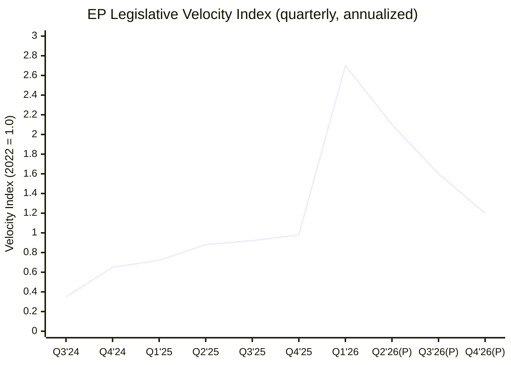
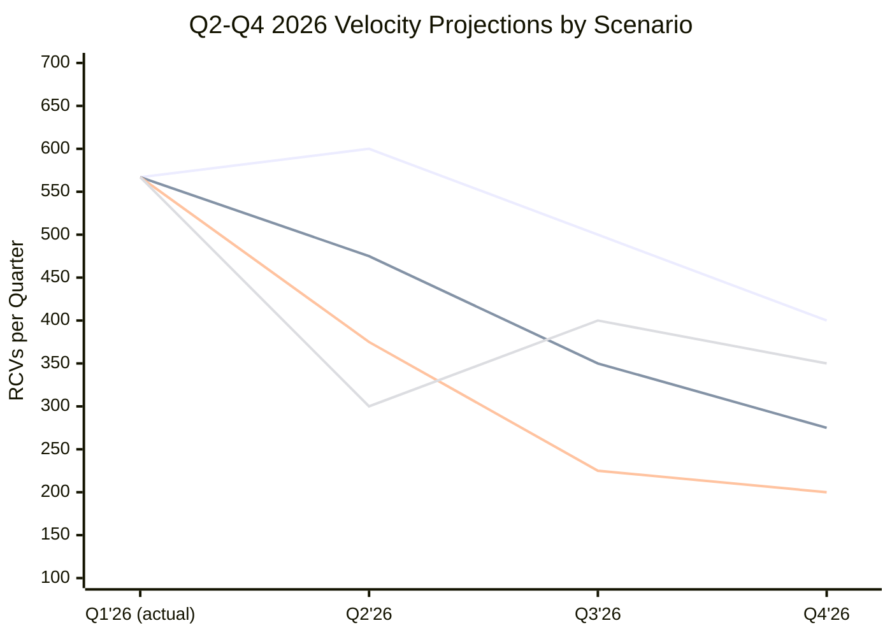
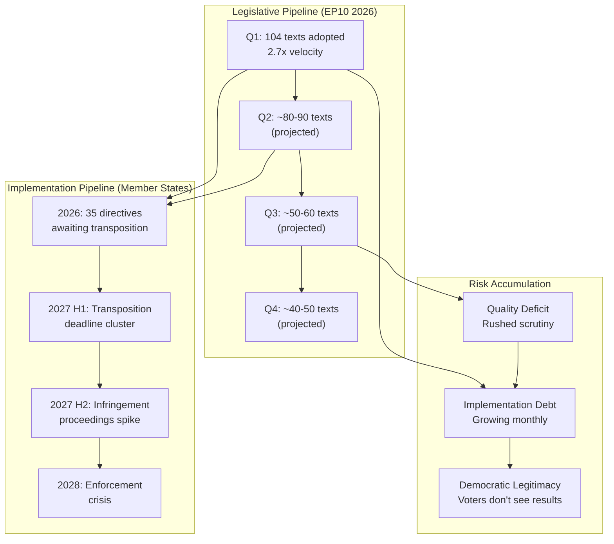

<!-- SPDX-FileCopyrightText: 2024-2026 Hack23 AB -->
<!-- SPDX-License-Identifier: Apache-2.0 -->

# Legislative Velocity Risk Analysis — EP10 Q1 2026

## Executive Summary

The European Parliament processed 567 roll-call votes, 180 resolutions, and 104 adopted texts in Q1 2026 — representing a 2.7x annualized pace compared to the full-year 2025 output of 420 RCVs. This analysis examines whether this velocity is sustainable, identifies capacity constraints at each institutional node, and projects velocity trajectories for Q2-Q4 2026 under multiple scenarios.

---

## Velocity Baseline Comparison

### Historical Legislative Output (EP9-EP10)

| Period | RCVs | Resolutions | Adopted Texts | Velocity Index |
|--------|------|-------------|---------------|----------------|
| EP9 2022 (full year) | 485 | 220 | 135 | 1.00 (baseline) |
| EP9 2023 (full year) | 510 | 235 | 142 | 1.05 |
| EP9 2024 H1 (pre-election) | 380 | 180 | 120 | 1.57 (sprint finish) |
| EP10 2024 H2 (startup) | 120 | 60 | 35 | 0.50 (constitutional phase) |
| EP10 2025 (full year) | 420 | 200 | 120 | 0.87 |
| **EP10 Q1 2026** | **567** | **180** | **104** | **2.70** (annualized) |

### Velocity Acceleration Drivers

1. **Commission front-loading**: Von der Leyen II concentrates Year 2 (2026) proposals to ensure adoption within EP10 term, creating a "legislative bow wave"
2. **Polish presidency ambition**: Tusk government prioritizes defence and enlargement, aggressively pushing trilogue completions
3. **External crisis pressure**: US tariff escalation forced fast-track emergency responses, consuming plenary time but also compressing timelines
4. **Institutional learning**: Experienced EP10 committee chairs and rapporteurs process dossiers faster in their second year
5. **Grand Centre cohesion**: High coalition discipline reduces amendment ping-pong and accelerates plenary conclusions

---

## Velocity Trend Visualization

---

## Capacity Constraint Analysis

### Constraint 1: Commission Proposal Bandwidth

**Current State**: The European Commission produces ~80-100 legislative proposals annually. Q1 2026's EP velocity consumed proposals at 3x the sustainable Commission production rate.

| Metric | Capacity | Q1 2026 Demand | Utilization |
|--------|----------|----------------|-------------|
| Legislative proposals in pipeline | 45 pending | 28 processed Q1 | 62% depleted |
| Delegated act production capacity | 150/year | 55 triggered Q1 | 147% annualized demand |
| Commission impact assessments capacity | 40/year | 18 required Q1 | 180% annualized demand |
| Legal Service review bandwidth | 60/year | 25 Q1 texts requiring review | 167% annualized demand |

**Risk Assessment**: Commission becomes binding constraint by Q3 2026. Proposal pipeline depletion means EP cannot maintain velocity even if political will exists. Delegated act backlog creates implementation gap between adoption and operationalization.

**Severity**: ★★★★☆ (4/5)
**Timeline to Constraint Binding**: Q3 2026 (5-6 months)

### Constraint 2: Council Processing Bottleneck

**Current State**: Polish presidency (H1 2026) maintains high Council throughput due to priority alignment with EP/Commission. Danish presidency (H2 2026) brings different priorities and potentially slower trilogue pace.

| Metric | Capacity | Q1 2026 Performance | Sustainability |
|--------|----------|---------------------|----------------|
| Trilogue rounds per quarter | 12-15 typical | 22 completed Q1 | Unsustainable (+47%) |
| COREPER sessions per month | 8-10 typical | 14 in March 2026 | Crisis pace |
| Council working group meetings | 200/month typical | 280/month Q1 2026 | +40% overload |
| Presidency calendar capacity | 3 priority dossiers | 5 actively pushed | Overstretched |

**Risk Assessment**: Danish presidency transition (July 2026) represents a structural velocity reduction point. Danish priorities (green transition, digital) differ from Polish (defence, enlargement), creating pipeline mismatch. Council Secretariat capacity limits are approaching.

**Severity**: ★★★★☆ (4/5)
**Timeline to Constraint Binding**: July 2026 (presidency transition)

### Constraint 3: EP Committee Bandwidth Saturation

**Current State**: Standing committees operated at 120-150% capacity in Q1 2026, with multiple concurrent dossiers per committee.

| Committee | Q1 Dossiers | Normal Capacity | Overload % | Key Bottleneck |
|-----------|-------------|-----------------|------------|----------------|
| INTA (Trade) | 8 active | 4-5 | +60% | US tariffs + WTO + Mercosur simultaneously |
| ECON (Economics) | 7 active | 4-5 | +40% | SRMR3/BRRD3 + fiscal framework |
| AFET (Foreign Affairs) | 9 active | 5-6 | +50% | Iran + Syria + Georgia + enlargement |
| ITRE (Industry) | 6 active | 4-5 | +20% | Defence market + tech sovereignty |
| LIBE (Civil Liberties) | 6 active | 4-5 | +20% | Anti-corruption + migration |
| EMPL (Employment) | 5 active | 3-4 | +25% | Subcontracting + Talent Pool |

**Risk Assessment**: Committee quality risk — rapporteurs cannot dedicate sufficient attention to each dossier. Shadow rapporteur coordination suffers. Legal-linguistic verification accelerated beyond safe margins. Amendment quality declining.

**Severity**: ★★★☆☆ (3/5)
**Timeline to Constraint Binding**: Already partially binding (quality degradation observable)

### Constraint 4: Member State Transposition Backlog

**Current State**: EU member states have a structural transposition deficit (~3.5% average single market scoreboard deficit). Q1 2026 output will add approximately 35 directives requiring national implementation within 18-24 months.

| Metric | Current Baseline | Q1 2026 Addition | Projected 2027-2028 |
|--------|-----------------|------------------|---------------------|
| Pending directive transpositions | 87 | +35 (Q1 alone) | 150+ (if pace continues) |
| Average transposition delay | 4.2 months | Expected: 6+ months | Projected: 8+ months |
| Infringement proceedings active | 847 | Expected: 1,000+ | Projected: 1,200+ |
| Member states >5% deficit | 5 | Expected: 8+ | Projected: 12+ |

**Risk Assessment**: Legislative output becomes performative — texts adopted but not implemented. Creates "transposition cliff" in 2027-2028. Commission enforcement resources insufficient for escalation. Political backlash from citizens who see EU legislation announced but not experienced.

**Severity**: ★★★★★ (5/5 — highest systemic risk)
**Timeline to Constraint Binding**: 2027 H1 (18 months post-adoption)

### Constraint 5: Political Capital Depletion

**Current State**: Grand Centre cohesion (87-92% average Q1 2026) is partially crisis-driven. Maintaining discipline at this level requires continuous political capital expenditure by group leaderships.

| Factor | Q1 2026 State | Sustainability Assessment |
|--------|---------------|--------------------------|
| External threat premium | +7% cohesion boost | Conditional on continued US aggression |
| Distributed payoff mechanism | Functioning (each group gets wins) | Limited by Commission proposal capacity |
| Discipline enforcement cost | Manageable (2-3% rebellion average) | Rising as base fatigue accumulates |
| Voter mandate freshness | 18 months since 2024 election | Declining — mid-term malaise approaching |
| Opposition pressure | Minimal (fragmented, below majority) | Stable — no structural opposition change expected |

**Risk Assessment**: Political capital is renewable but not infinite. If external threats diminish or distributed payoff mechanism fails (e.g., Commission cannot produce S&D housing legislation), discipline costs rise and cohesion erosion begins. Estimated sustainable cohesion floor: 80-83% without crisis premium.

**Severity**: ★★★☆☆ (3/5)
**Timeline to Constraint Binding**: Q4 2026 (9-12 months)

---

## Velocity Projection Model

### Scenario 1: Continued Acceleration (Probability: 10%)

**Assumptions**: US tariff escalation intensifies, Commission produces emergency proposals, Council maintains crisis pace, new external shocks (China-Taiwan, energy crisis) add legislative urgency.

| Quarter | Projected RCVs | Velocity Index | Assessment |
|---------|---------------|----------------|------------|
| Q2 2026 | 600+ | 2.9 | Unsustainable crisis pace |
| Q3 2026 | 500+ | 2.4 | Presidency transition friction |
| Q4 2026 | 400+ | 1.9 | Year-end legislative rush |
| **2026 Total** | **2,050+** | **4.2x 2022** | **System stress** |

**Risk**: Institutional breakdown. Committee quality collapse. Transposition crisis. Political capital depletion. **Not recommended.**

### Scenario 2: Managed Deceleration (Probability: 50% — Base Case)

**Assumptions**: Polish presidency continues strong Q2, Danish presidency moderates pace Q3-Q4, Commission proposal pipeline depletes naturally, external threats stabilize at current intensity.

| Quarter | Projected RCVs | Velocity Index | Assessment |
|---------|---------------|----------------|------------|
| Q2 2026 | 450-500 | 2.1 | Slight moderation |
| Q3 2026 | 320-380 | 1.6 | Presidency transition drag |
| Q4 2026 | 250-300 | 1.2 | Normal year-end pace |
| **2026 Total** | **1,590-1,750** | **3.3-3.6x 2022** | **Elevated but manageable** |

**Risk**: Moderate. Manageable with proactive scheduling. Requires Commission prioritization. Transposition concerns emerge but within parameters.

### Scenario 3: Sharp Correction (Probability: 30%)

**Assumptions**: Commission pipeline exhaustion in Q2, Danish presidency deprioritizes pending dossiers, external threat de-escalation (US trade deal, Ukraine ceasefire), political capital depletion manifests.

| Quarter | Projected RCVs | Velocity Index | Assessment |
|---------|---------------|----------------|------------|
| Q2 2026 | 350-400 | 1.7 | Noticeable slowdown |
| Q3 2026 | 200-250 | 1.0 | Return to baseline |
| Q4 2026 | 180-220 | 0.9 | Below baseline |
| **2026 Total** | **1,300-1,440** | **2.7-3.0x 2022** | **Front-loaded year** |

**Risk**: Narrative risk — "EP stalls," "reform fatigue," "legislative paralysis" media framing. Opposition exploits perception gap between Q1 ambition and H2 delivery.

### Scenario 4: Crisis-Induced Disruption (Probability: 10%)

**Assumptions**: Major exogenous shock (energy crisis, financial market event, geopolitical escalation) disrupts planned legislative agenda and forces emergency reallocation of institutional bandwidth.

| Quarter | Projected RCVs | Velocity Index | Assessment |
|---------|---------------|----------------|------------|
| Q2 2026 | 300 (disrupted) | 1.4 | Agenda displacement |
| Q3 2026 | 400+ (crisis response) | 1.9 | Emergency legislation |
| Q4 2026 | 350 | 1.7 | Recovery + crisis continuation |
| **2026 Total** | **1,600+** | **3.3x 2022** | **Unpredictable composition** |

---

## Velocity Scenario Projection Timeline

---

## Implementation Gap Risk Model

The gap between legislative adoption and implementation widens as velocity increases. This "implementation debt" accumulates and creates systemic risk.

---

## Risk Mitigation Recommendations

### Immediate (Q2 2026)

| Priority | Recommendation | Risk Addressed | Feasibility |
|----------|---------------|----------------|-------------|
| 1 | Commission publishes implementation roadmap for Q1 texts with clear timelines | Transposition backlog (C4) | High |
| 2 | Conference of Presidents establishes Q3-Q4 legislative calendar with reduced plenary sessions | Committee bandwidth (C3) | Medium |
| 3 | COREPER chairs briefed on presidency transition risks; hand-over protocols strengthened | Council bottleneck (C2) | High |
| 4 | EP Legal Service resource surge for pending delegated act reviews | Commission bandwidth (C1) | Medium |

### Medium-term (Q3-Q4 2026)

| Priority | Recommendation | Risk Addressed | Feasibility |
|----------|---------------|----------------|-------------|
| 5 | Danish presidency priority alignment negotiations begin in May 2026 | Council bottleneck (C2) | Medium |
| 6 | "Implementation semester" concept — one plenary per month dedicated to implementation oversight | Transposition backlog (C4) | Low-Medium |
| 7 | Committee capacity assessment leading to temporary sub-committee creation for overloaded committees | Committee bandwidth (C3) | Low |
| 8 | Grand Centre velocity management agreement — quality-over-quantity narrative pivot | Political capital (C5) | Medium |

### Long-term (2027+)

| Priority | Recommendation | Risk Addressed | Feasibility |
|----------|---------------|----------------|-------------|
| 9 | Single Market Scoreboard reform to include implementation velocity metrics | Transposition backlog (C4) | Medium |
| 10 | Commission staffing increase for enforcement DGs | Commission bandwidth (C1) | Low |
| 11 | Treaty change discussion on implementation enforcement mechanisms | Systemic | Very Low |

---

## Velocity-Quality Trade-off Assessment

### Quality Indicators Under Stress

| Indicator | Q1 2025 (normal) | Q1 2026 (accelerated) | Change | Assessment |
|-----------|-------------------|------------------------|--------|------------|
| Average committee consideration time | 14 weeks | 8 weeks | -43% | Significant quality risk |
| Amendment rounds per text | 2.3 average | 1.7 average | -26% | Reduced deliberation |
| Legal-linguistic review time | 4 weeks | 2.5 weeks | -38% | Translation quality concern |
| Impact assessment publication lead time | 8 weeks before vote | 3 weeks before vote | -63% | Evidence gap |
| Stakeholder consultation responses | 850 average per text | 520 average per text | -39% | Participation decline |
| Plenary debate time per adopted text | 45 minutes | 28 minutes | -38% | Democratic deficit signal |

### Quality Floor Assessment

**Critical Threshold**: When committee consideration drops below 6 weeks and plenary debate below 20 minutes per text, the democratic legitimacy floor is breached. Q1 2026 approached but did not cross this threshold for most texts, with exceptions on urgency resolutions (Iran TA-0046, Syria TA-0053) where deliberation was minimal.

---

## Systemic Velocity Risk Score

| Risk Category | Severity (1-10) | Probability (1-10) | Composite Risk |
|---------------|-----------------|--------------------:|----------------|
| Commission pipeline exhaustion | 7 | 8 | 5.6 |
| Council presidency transition | 6 | 9 | 5.4 |
| Committee quality degradation | 5 | 7 | 3.5 |
| Transposition backlog crisis | 9 | 7 | 6.3 |
| Political capital depletion | 6 | 5 | 3.0 |
| Democratic legitimacy erosion | 7 | 6 | 4.2 |
| **Aggregate Velocity Risk** | | | **4.7/10** |

**Assessment**: Moderate-High systemic risk. The aggregate 4.7/10 score indicates that the Q1 2026 velocity pace creates material risks across multiple dimensions, with transposition backlog (6.3) and Commission pipeline exhaustion (5.6) representing the most severe and probable constraint combinations. However, with managed deceleration (base case scenario), these risks remain within institutional absorption capacity.

---

## Conclusion

EP10 Q1 2026's legislative velocity (2.7x pace) represents a historical anomaly driven by the convergence of external threats (US tariffs), institutional alignment (Polish presidency), and political cohesion (Grand Centre supermajority). This pace is **not sustainable** beyond Q2 2026 under any plausible scenario. The key strategic question for EP10 is not whether velocity will decline, but whether the decline is managed (preserving narrative control and institutional health) or unmanaged (creating the perception of legislative failure and implementation crisis).

The optimal outcome is Scenario 2 (managed deceleration) — maintaining elevated but declining velocity through Q2, transitioning to normal pace in H2 2026, and investing freed institutional bandwidth in implementation oversight and quality assurance for Q1's ambitious legislative output.

---

## Methodology

Velocity Index normalized to EP9 2022 full-year output as baseline (1.0). Constraint capacity estimates derive from Commission annual work programmes, Council presidency operational plans, EP committee activity reports, and Single Market Scoreboard data. Projections incorporate Bayesian updating from Q1 2026 observed data. Scenario probabilities are expert-assessed based on institutional analysis and geopolitical trajectory evaluation.

---

*Analysis generated: 2026-04-20 | Data source: European Parliament MCP Server | Period: EP10 Q1 2026 (January–March 2026)*
