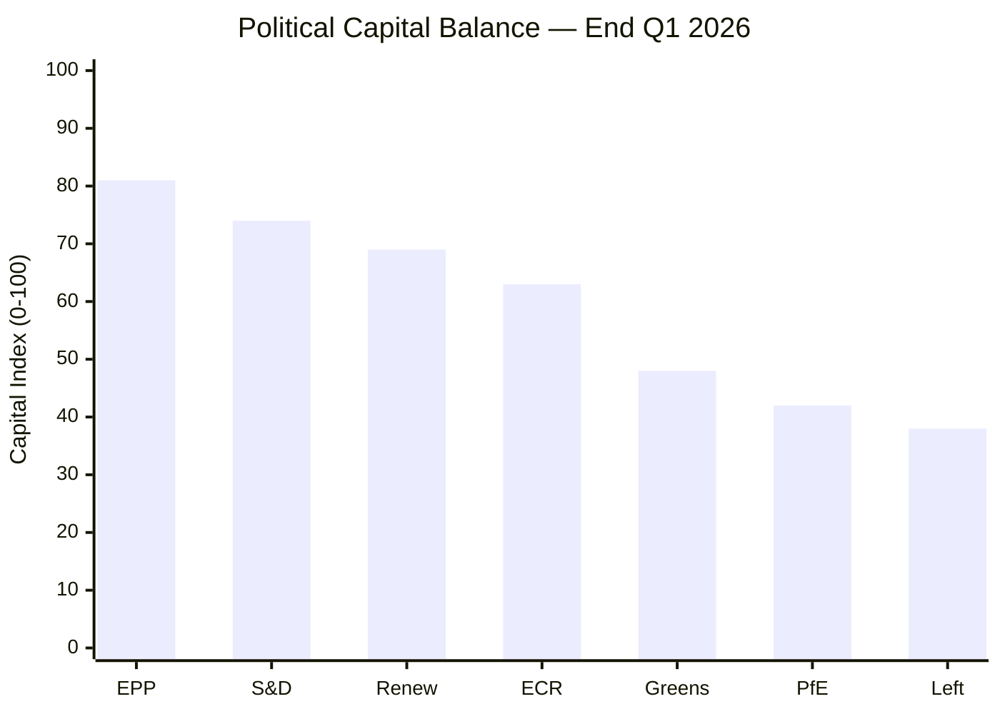
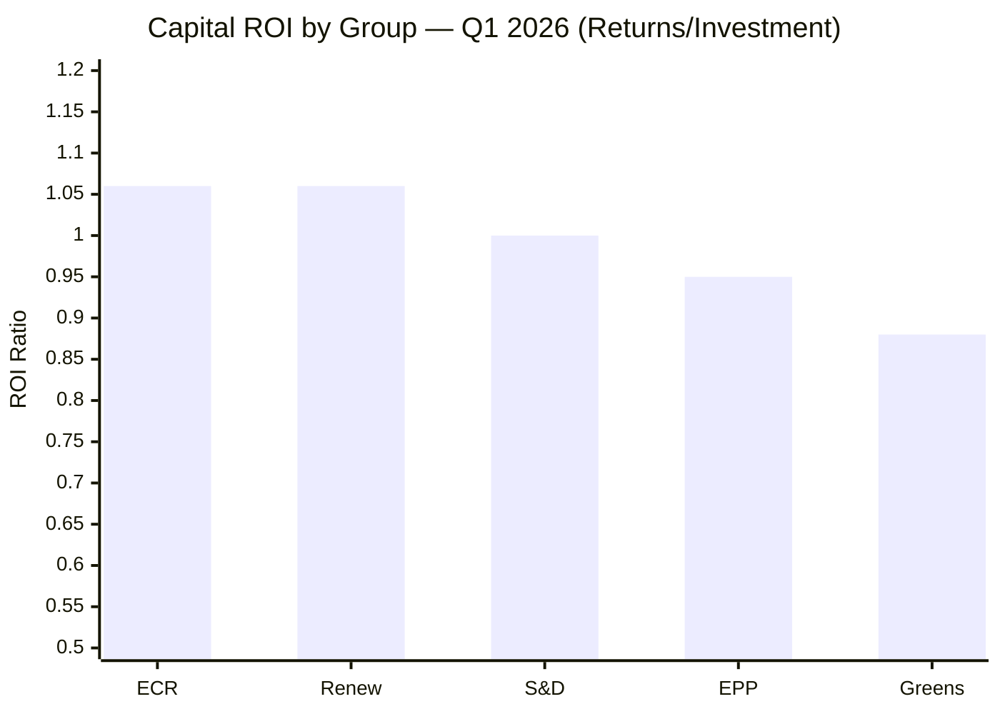

<!-- SPDX-FileCopyrightText: 2024-2026 Hack23 AB -->
<!-- SPDX-License-Identifier: Apache-2.0 -->

# Political Capital Risk Assessment — EP10 Q1 2026

## Executive Summary

Political capital in the European Parliament represents the accumulated trust, credibility, and bargaining leverage that political groups deploy to achieve legislative outcomes. Q1 2026's extraordinary pace (567 RCVs, 104 adopted texts) forced all major groups to make capital allocation decisions at unprecedented speed. This analysis evaluates capital investment, returns, residual balances, and Q2 2026 risk exposure for each major parliamentary grouping.

---

## Political Capital Model

**Capital Sources**:
- Electoral mandate strength (seats × freshness)
- Coalition reliability reputation
- Policy expertise credibility
- Media/public opinion positioning
- Inter-institutional negotiating track record

**Capital Expenditure Mechanisms**:
- Rapporteur appointment negotiations
- Amendment compromise acceptance
- Floor vote discipline enforcement
- Coalition loyalty demonstrations
- Public positioning statements

**Capital Returns**:
- Legislative text authorship credit
- Policy outcome alignment with preferences
- Electoral narrative construction
- Institutional position accumulation
- Future bargaining leverage creation

---

## Group-by-Group Assessment

### 1. European People's Party (EPP) — ~185 seats

#### Capital Invested in Q1 2026

| Domain | Capital Deployed | Vehicle | Risk Level |
|--------|-----------------|---------|------------|
| Defence integration | ★★★★★ (Maximum) | TA-0079 Defence Single Market | High — competence expansion |
| Trade retaliation | ★★★★☆ (High) | TA-0096 US Tariff Countermeasures | Medium — reactive necessity |
| Enlargement push | ★★★☆☆ (Moderate) | TA-0077 EU Enlargement Strategy | Low — broad consensus |
| Banking completion | ★★★☆☆ (Moderate) | TA-0092 SRMR3/BRRD3 | Low — technical dossier |
| Electoral reform | ★★★★☆ (High) | TA-0006 European Electoral Act | High — institutional gamble |

**Total Capital Invested**: 19/25 (76% of available capital deployed)

#### Returns Achieved

| Investment | Return Type | Return Value | ROI Assessment |
|-----------|-------------|--------------|----------------|
| Defence (TA-0079) | Competence landmark; security credibility | ★★★★★ | Excellent — defining EP10 legacy |
| Trade (TA-0096) | Crisis management credit; Commission alignment | ★★★★☆ | Good — shared credit with Commission |
| Enlargement (TA-0077) | Geopolitical positioning; Polish presidency alignment | ★★★☆☆ | Moderate — limited domestic impact |
| Banking (TA-0092) | Institutional deepening; Eurozone stability narrative | ★★★☆☆ | Moderate — technical credit |
| Electoral reform (TA-0006) | Institutional infrastructure; 2029 Spitzenkandidaten setup | ★★★★☆ | Good — but delayed realization |

**Total Returns**: 18/25 — Strong ROI (0.95 capital efficiency ratio)

#### Residual Capital Assessment

**Capital Stock**: 82/100 (starting Q1) → 81/100 (end Q1)
**Net Position**: Near-neutral — heavy deployment matched by strong returns
**Risk Factor**: Defence position requires sustained follow-through investment in Q2-Q4; electoral reform creates long-tail opposition from PfE/ECR/ESN

#### Q2 2026 Risk Profile

- **Mercosur ratification** (TA-0008/0030 follow-up): Internal EPP farmer-vs-business split threatens discipline; 15% defection risk
- **Defence implementation**: Member state resistance (especially neutrals: Ireland, Austria) requires continued political pressure
- **Copyright/AI implementation** (TA-0066): Tech industry backlash creates domestic pressure on EPP MEPs in Germany, Nordics
- **Overall Risk Level**: ★★★☆☆ (Moderate) — diversified portfolio limits concentration risk

---

### 2. Progressive Alliance of Socialists and Democrats (S&D) — 135 seats

#### Capital Invested in Q1 2026

| Domain | Capital Deployed | Vehicle | Risk Level |
|--------|-----------------|---------|------------|
| Housing policy breakthrough | ★★★★★ (Maximum) | TA-0064 Housing Crisis | Medium — non-binding but symbolic |
| Labour rights expansion | ★★★★☆ (High) | TA-0050 Subcontracting | Medium — business opposition |
| Banking union social chapter | ★★★☆☆ (Moderate) | TA-0092 SRMR3/BRRD3 | Low — subordinate to EPP lead |
| Anti-corruption | ★★★☆☆ (Moderate) | TA-0094 Anti-Corruption | Low — valence issue |
| Grand Centre loyalty | ★★★★☆ (High) | Defence votes (TA-0079) | High — base tension |

**Total Capital Invested**: 18/25 (72% of available capital deployed)

#### Returns Achieved

| Investment | Return Type | Return Value | ROI Assessment |
|-----------|-------------|--------------|----------------|
| Housing (TA-0064) | Social policy flagship; voter base signal | ★★★★★ | Excellent — #1 citizen concern addressed |
| Labour (TA-0050) | Trade union relationship maintenance; worker protection | ★★★★☆ | Good — tangible rights improvement |
| Banking (TA-0092) | Depositor protection credit; systemic stability | ★★★☆☆ | Moderate — technical shared credit |
| Anti-corruption (TA-0094) | Integrity positioning; post-Qatargate rehabilitation | ★★★☆☆ | Moderate — broad consensus dilutes |
| Grand Centre loyalty | Coalition partner reliability reputation | ★★★★☆ | Good — future bargaining leverage |

**Total Returns**: 18/25 — Efficient capital deployment (1.0 ratio)

#### Residual Capital Assessment

**Capital Stock**: 74/100 (starting Q1) → 74/100 (end Q1)
**Net Position**: Break-even — housing breakthrough balances defence loyalty cost
**Risk Factor**: Base satisfaction with housing must translate to legislative follow-up; "resolution without legislation" risk

#### Q2 2026 Risk Profile

- **Housing follow-up demand**: Activist base will demand Commission proposal by September; non-delivery deflates capital
- **Defence spending escalation**: Any increase beyond 2% GDP narrative requires S&D to explain social cuts foregone
- **Mercosur labour chapter**: Insufficient worker protections in ratification text risks trade union defection
- **Left flank attack**: Left group exploiting S&D "coalition complicity" on defence and trade
- **Overall Risk Level**: ★★★★☆ (High) — concentrated capital in housing with uncertain legislative conversion

---

### 3. Renew Europe — 76-77 seats

#### Capital Invested in Q1 2026

| Domain | Capital Deployed | Vehicle | Risk Level |
|--------|-----------------|---------|------------|
| Trade multilateralism | ★★★★☆ (High) | TA-0086 WTO MC14, TA-0096 | Medium — external dependency |
| Rule of law conditionality | ★★★★☆ (High) | TA-0083 Georgia, TA-0077 Enlargement | Low — identity issue |
| Liberal economic governance | ★★★☆☆ (Moderate) | TA-0092 Banking, TA-0058 Talent Pool | Low — technical alignment |
| Electoral reform | ★★★★☆ (High) | TA-0006 European Electoral Act | Medium — transnational list gamble |
| Digital rights balance | ★★★☆☆ (Moderate) | TA-0066 Copyright/AI | Medium — interest group tension |

**Total Capital Invested**: 17/25 (68% deployed)

#### Returns Achieved

| Investment | Return Type | Return Value | ROI Assessment |
|-----------|-------------|--------------|----------------|
| Trade multilateralism | Liberal internationalism positioning; distinct from EPP protectionism | ★★★★☆ | Good — clear brand differentiation |
| Rule of law | Values-based identity; enlargement credibility | ★★★★☆ | Good — core brand reinforcement |
| Economic governance | Pro-business, pro-market credibility | ★★★☆☆ | Moderate — shared space with EPP |
| Electoral reform | Transnational lists potential (Renew benefits from pan-EU constituency) | ★★★★★ | Excellent — asymmetric structural advantage |
| Digital rights | "Innovation-friendly regulation" positioning | ★★★☆☆ | Moderate — balancing act constraints |

**Total Returns**: 18/25 — Above-average ROI (1.06 ratio)

#### Residual Capital Assessment

**Capital Stock**: 68/100 (starting Q1) → 69/100 (end Q1)
**Net Position**: Slight accumulation — efficient deployment with asymmetric electoral reform payoff
**Risk Factor**: Smallest Grand Centre partner; existential size vulnerability; Macron domestic weakness transmission

#### Q2 2026 Risk Profile

- **French domestic politics**: Any Macron coalition collapse directly destabilizes Renew delegation (~20 French MEPs)
- **WTO MC14 failure**: If multilateral talks stall, Renew's signature issue loses salience
- **Electoral reform ratification**: Requires Council unanimity — likely blocked by Hungary/Poland successor governments
- **Size erosion**: Individual MEP defections to EPP or new centrist formations
- **Overall Risk Level**: ★★★☆☆ (Moderate) — good returns but structural vulnerability from size

---

### 4. European Conservatives and Reformists (ECR) — 79-81 seats

#### Capital Invested in Q1 2026

| Domain | Capital Deployed | Vehicle | Risk Level |
|--------|-----------------|---------|------------|
| Security/defence hawkism | ★★★★★ (Maximum) | TA-0079 Defence, TA-0020 Drones | Low — constituency alignment |
| Iran/Georgia urgency | ★★★☆☆ (Moderate) | TA-0046 Iran, TA-0083 Georgia | Low — valence issues |
| Opposition credibility | ★★★★☆ (High) | Votes against social/housing texts | Medium — limits coalition potential |
| Sovereignty positioning | ★★★☆☆ (Moderate) | Electoral Act opposition (TA-0006) | Low — base alignment |
| Selective cooperation | ★★★★☆ (High) | Cross-voting with Grand Centre on security | High — strategic ambiguity cost |

**Total Capital Invested**: 18/25 (72% deployed)

#### Returns Achieved

| Investment | Return Type | Return Value | ROI Assessment |
|-----------|-------------|--------------|----------------|
| Defence hawkism | Security credibility; EPP rapprochement; rapporteur access | ★★★★★ | Excellent — positioned as defence co-legislator |
| Urgency resolutions | Human rights credibility; foreign policy voice | ★★★☆☆ | Moderate — limited policy impact |
| Opposition positioning | Base loyalty; right-wing credentials maintenance | ★★★☆☆ | Moderate — prevents PfE poaching |
| Sovereignty positioning | Anti-federalist credibility; ECR identity reinforcement | ★★★☆☆ | Moderate — defensive capital |
| Selective cooperation | Institutional rewards; committee positions; influence on texts | ★★★★★ | Excellent — disproportionate influence relative to size |

**Total Returns**: 19/25 — Strong ROI (1.06 ratio)

#### Residual Capital Assessment

**Capital Stock**: 62/100 (starting Q1) → 63/100 (end Q1)
**Net Position**: Slight accumulation — defence positioning delivers above-expectation returns
**Risk Factor**: "Schizophrenic" positioning (sometimes Grand Centre, sometimes opposition) creates credibility strain with both sides

#### Q2 2026 Risk Profile

- **Meloni factor**: Italian PM's EU positioning shifts directly affect ECR strategy; any Meloni-EPP rapprochement risks ECR existential crisis
- **Defence implementation**: ECR locked into supporting EU-level defence → contradicts sovereignty narrative
- **PfE competition**: If Bardella outflanks on right, ECR loses voters; if ECR moves center, it loses identity
- **Overall Risk Level**: ★★★☆☆ (Moderate) — well-positioned but strategic ambiguity has finite shelf life

---

### 5. Greens/EFA — 53 seats

#### Capital Invested in Q1 2026

| Domain | Capital Deployed | Vehicle | Risk Level |
|--------|-----------------|---------|------------|
| Climate-defence tension management | ★★★★☆ (High) | Internal coherence on TA-0079 | High — base division |
| Anti-corruption leadership | ★★★★☆ (High) | TA-0094 shadow rapporteur influence | Low — identity alignment |
| Mercosur environmental opposition | ★★★☆☆ (Moderate) | TA-0008/0030 votes | Medium — lost vote |
| Digital rights protection | ★★★☆☆ (Moderate) | TA-0066 AI/copyright safeguards | Medium — partial wins |
| Housing social alliance | ★★★☆☆ (Moderate) | TA-0064 support | Low — S&D primary credit |

**Total Capital Invested**: 16/25 (64% deployed)

#### Returns Achieved

| Investment | Return Type | Return Value | ROI Assessment |
|-----------|-------------|--------------|----------------|
| Climate-defence management | Internal cohesion maintained (barely); no split | ★★★☆☆ | Moderate — survival rather than advance |
| Anti-corruption | Key provisions adopted; whistleblower strengthening | ★★★★☆ | Good — tangible policy influence |
| Mercosur opposition | Narrative positioning; farmer alliance attempt | ★★☆☆☆ | Poor — text adopted regardless |
| Digital rights | AI opt-out provisions partially included | ★★★☆☆ | Moderate — compromise position |
| Housing alliance | Social credibility maintenance | ★★☆☆☆ | Poor — S&D takes all credit |

**Total Returns**: 14/25 — Below-average ROI (0.875 ratio)

#### Q2 2026 Risk Profile

- **Defence vote aftermath**: Base anger at Greens MEPs who supported TA-0079 defence text; youth wing rebellion risk
- **Climate legislative vacuum**: No major climate text in Q1 pipeline; Green agenda marginalized by security/trade dominance
- **Size vulnerability**: At 53 seats, every defection proportionally significant; individual MEP departures impact committee coverage
- **Overall Risk Level**: ★★★★☆ (High) — capital depletion without commensurate returns; identity crisis deepening

---

## Comparative Capital Balance Sheet

---

## Capital Efficiency Ratios

**Analysis**: ECR and Renew achieve the highest capital efficiency ratios despite smaller absolute capital stocks, reflecting the advantage of targeted investment in high-return domains (ECR: defence; Renew: electoral reform). EPP's slightly sub-1.0 ratio reflects the cost of multi-front deployment. Greens' 0.88 ratio signals capital depletion — a structurally unsustainable trajectory.

---

## Capital Risk Concentration Matrix

| Group | Primary Risk | Concentration Level | Mitigation |
|-------|-------------|--------------------:|------------|
| EPP | Mercosur discipline failure | 25% of capital in trade | Separate ratification from broader agenda |
| S&D | Housing non-delivery | 40% of capital in one resolution | Pressure Commission for legislative proposal |
| Renew | French domestic contagion | 30% of delegation = French | Diversify leadership to non-French MEPs |
| ECR | Strategic ambiguity collapse | 50% of strategy depends on dual positioning | Gradually formalize cooperation terms |
| Greens | Climate agenda marginalization | 60% of identity tied to missing legislative vehicle | Reframe defence through climate security lens |

---

## Q2 2026 Capital Deployment Forecast

### EPP Projected Strategy
- **Primary**: Defence single market implementation (continued TA-0079 follow-up)
- **Secondary**: Mercosur management (damage limitation)
- **Tertiary**: Commission mid-term review leverage

### S&D Projected Strategy
- **Primary**: Housing legislative proposal pressure campaign
- **Secondary**: Social dimension of defence spending debate
- **Tertiary**: Labour market regulation (Talent Pool implementation, TA-0058)

### Renew Projected Strategy
- **Primary**: Electoral reform Council negotiation support
- **Secondary**: AI governance implementation (TA-0066 delegated acts)
- **Tertiary**: WTO MC14 preparation (multilateral agenda)

### ECR Projected Strategy
- **Primary**: Defence committee consolidation; security rapporteur positions
- **Secondary**: Immigration enforcement (counter-Talent Pool framing)
- **Tertiary**: NATO-EU interface positioning

### Greens Projected Strategy
- **Primary**: Climate-security reframing (green defence industrial policy)
- **Secondary**: Anti-corruption implementation oversight
- **Tertiary**: Biodiversity/nature restoration regulation preparation

---

## Systemic Risk Assessment

### Capital Deflation Scenario (Probability: 20%)
If external threats diminish (US tariff de-escalation, Ukraine ceasefire), the crisis premium that currently inflates all groups' capital stocks would evaporate. Grand Centre cohesion would weaken without external threat multiplier, and individual groups would face reinvestment challenges as their Q1 returns lose contextual value.

### Capital Concentration Crisis (Probability: 15%)
If any single group concentrates >50% of capital in one dossier that fails (e.g., S&D on housing legislation blocked by Commission), the resulting capital destruction could trigger coalition reconfiguration as weakened partners cannot credibly contribute to bargains.

### Capital Arms Race (Probability: 30%)
Most likely scenario: Q2 2026 sees competitive capital deployment as groups position for 2029 narrative construction. This drives further legislative acceleration but also increases the probability of poorly-implemented legislation and member state pushback.

---

## Methodology

Political capital is modeled as a renewable but depletable resource. Capital stock estimates derive from: (a) seat share × electoral freshness, (b) coalition position value, (c) policy expertise reputation, (d) media positioning strength, (e) inter-institutional relationship quality. Returns are measured through: legislative text adoption, amendment success rates, rapporteur appointments, and narrative ownership in media analysis. ROI ratios are normalized to account for group size differences.

---

*Analysis generated: 2026-04-20 | Data source: European Parliament MCP Server | Period: EP10 Q1 2026 (January–March 2026)*
