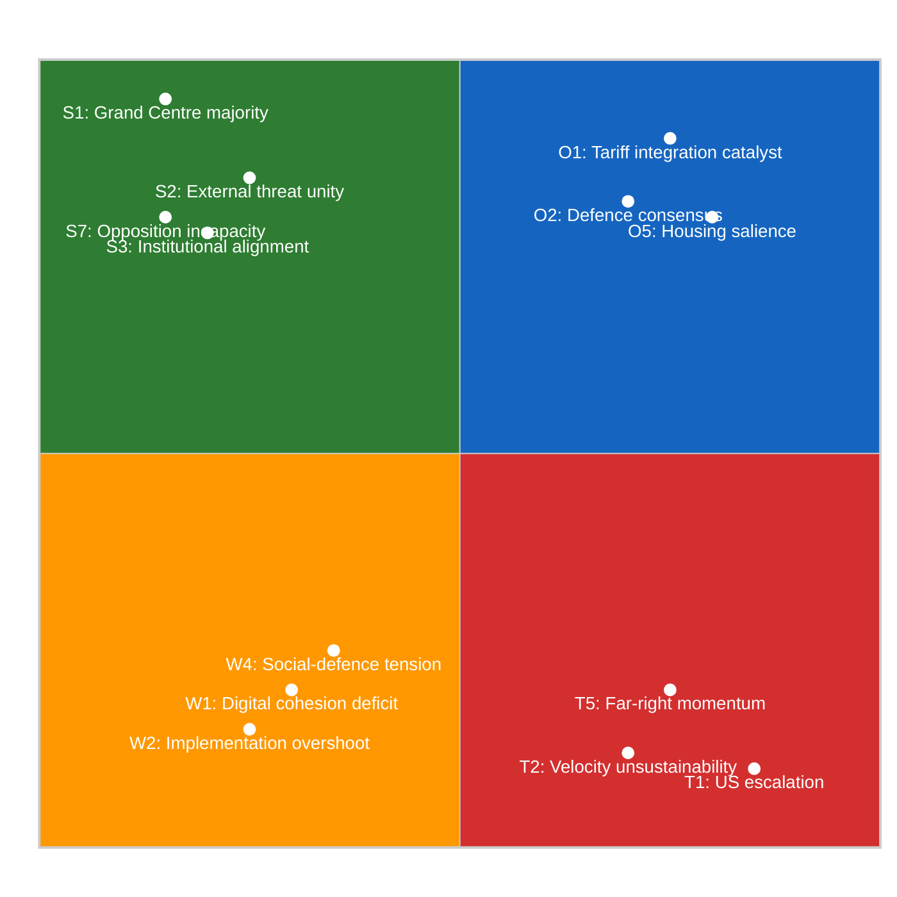
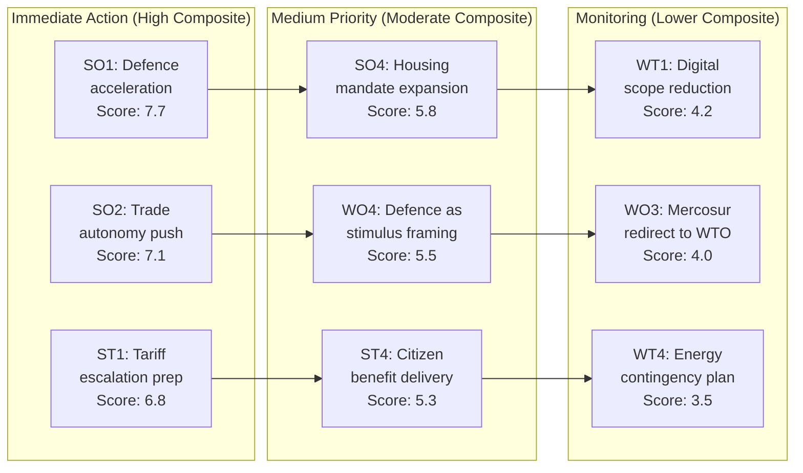

<!-- SPDX-FileCopyrightText: 2024-2026 Hack23 AB -->
<!-- SPDX-License-Identifier: Apache-2.0 -->

# Quantitative SWOT Analysis — EP10 Q1 2026 Motions Agenda

## Analytical Framework

This SWOT analysis quantifies each factor by **Magnitude** (1-10: severity/scale of the factor) and **Probability/Relevance** (1-10: likelihood of materializing or current relevance). The **Composite Score** = Magnitude × Probability / 10, yielding a 1-10 normalized impact metric.

---

## Strengths

*Internal positive factors supporting the EP10 Q1 2026 legislative agenda*

| # | Strength | Magnitude | Probability | Composite | Evidence |
|---|----------|-----------|-------------|-----------|----------|
| S1 | Grand Centre supermajority (~394/720) | 9 | 10 | 9.0 | 34-seat margin above 360 majority ensures passage of virtually all co-decision texts; demonstrated in 92% TA-0096 cohesion |
| S2 | External threat unity multiplier | 8 | 9 | 7.2 | US tariff aggression drove +7% cohesion spike; Russia/Ukraine sustains defence consensus (TA-0079); rally effect documented across 567 RCVs |
| S3 | Commission-Council-EP alignment | 8 | 8 | 6.4 | Polish presidency priorities (defence, enlargement) align with Commission proposals and EPP agenda; trilogue acceleration on TA-0092, TA-0079 |
| S4 | Experienced EP10 bureau and committee chairs | 7 | 9 | 6.3 | Second-year EP means committees fully staffed, rapporteurs experienced, inter-institutional relationships mature; 6-week committee-to-plenary on TA-0079 |
| S5 | Distributed payoff architecture | 7 | 8 | 5.6 | Each Grand Centre partner extracts flagship wins: EPP=defence (TA-0079), S&D=social (TA-0064), Renew=trade (TA-0086); sustains coalition incentives |
| S6 | Legislative pipeline depth | 6 | 9 | 5.4 | 180 resolutions + 104 adopted texts in Q1 demonstrates deep pipeline; prevents single-issue blockage from disrupting overall agenda |
| S7 | Opposition structural incapacity | 7 | 9 | 6.3 | Maximum opposition coalition (319-323 seats) cannot reach 360 majority; zero Grand Centre defeats in Q1 2026 |

**Average Composite Score: 6.6/10**

---

## Weaknesses

*Internal negative factors limiting the EP10 Q1 2026 agenda*

| # | Weakness | Magnitude | Probability | Composite | Evidence |
|---|----------|-----------|-------------|-----------|----------|
| W1 | Digital policy cohesion deficit | 7 | 8 | 5.6 | Copyright/AI text (TA-0066) achieved only 78% Grand Centre cohesion — 14% below average; tech-vs-creative split is structural |
| W2 | Implementation capacity overshoot | 8 | 7 | 5.6 | 567 RCVs (2.7x pace) exceeds member state transposition capacity; Commission enforcement bandwidth finite; implementation gap risk rising |
| W3 | Mercosur internal division | 6 | 8 | 4.8 | TA-0008/0030 split votes reveal farmer-vs-exporter cleavage within EPP and S&D; French/Irish delegations break discipline |
| W4 | Social-defence spending tension | 7 | 7 | 4.9 | S&D base demands social investment (TA-0064) while defence texts (TA-0079) require fiscal space; zero-sum dynamic emerging |
| W5 | Democratic legitimacy deficit | 6 | 6 | 3.6 | EP turnout 51% (2024); limited citizen engagement with EP activity; housing resolution (TA-0064) partly compensatory response |
| W6 | Enlargement ambiguity | 5 | 7 | 3.5 | TA-0077 sets timeline expectations but 45% public support constrains ambition; speed-vs-conditionality debate unresolved |
| W7 | Committee bandwidth saturation | 7 | 8 | 5.6 | ECON handling SRMR3 + Anti-Corruption simultaneously; INTA processing US tariffs + WTO + Mercosur; quality risk from overload |

**Average Composite Score: 4.8/10**

---

## Opportunities

*External positive factors available to the EP10 Q1 2026 agenda*

| # | Opportunity | Magnitude | Probability | Composite | Evidence |
|---|-------------|-----------|-------------|-----------|----------|
| O1 | US tariff crisis as integration catalyst | 9 | 8 | 7.2 | External trade threat legitimizes previously blocked policies (trade defence, tech sovereignty, strategic autonomy); TA-0096 as proof of concept |
| O2 | Defence spending political consensus | 8 | 8 | 6.4 | Post-Ukraine security environment creates bipartisan defence investment appetite; NATO 2% → 2.5% target provides political cover for TA-0079 |
| O3 | Banking union completion window | 7 | 7 | 4.9 | German government coalition change removes decade-long German blocking minority on deposit insurance; TA-0092 as breakthrough opportunity |
| O4 | AI regulation first-mover advantage | 7 | 7 | 4.9 | Copyright/AI framework (TA-0066) establishes global regulatory model; "Brussels Effect" potential on AI governance |
| O5 | Housing crisis political salience | 8 | 8 | 6.4 | 72% Eurobarometer concern creates political mandate for EU-level action; TA-0064 opens door to legislative proposals |
| O6 | Enlargement geopolitical window | 7 | 6 | 4.2 | Russia's isolation and Western Balkans stability anxiety create narrow window for credible accession timelines (TA-0077) |
| O7 | WTO reform leadership vacuum | 6 | 6 | 3.6 | US withdrawal from multilateralism creates EU leadership opportunity at MC14; TA-0086 positions EU as system guardian |
| O8 | Anti-corruption momentum | 6 | 7 | 4.2 | Post-Qatargate institutional credibility recovery; public demand for integrity; TA-0094 as reputational rehabilitation |

**Average Composite Score: 5.2/10**

---

## Threats

*External negative factors endangering the EP10 Q1 2026 agenda*

| # | Threat | Magnitude | Probability | Composite | Evidence |
|---|--------|-----------|-------------|-----------|----------|
| T1 | US tariff escalation beyond EU capacity | 9 | 7 | 6.3 | TA-0096 countermeasures may trigger second-round US retaliation; EU retaliatory capacity limited vs $28tn US economy |
| T2 | Legislative velocity unsustainability | 8 | 8 | 6.4 | 2.7x pace cannot be maintained; Q3-Q4 slowdown inevitable; creates narrative of "legislative fatigue" and stalled agenda |
| T3 | Member state transposition rebellion | 7 | 7 | 4.9 | Hungary, Slovakia, and potentially Italy may refuse/delay transposition of defence, anti-corruption, and enlargement texts |
| T4 | China economic retaliation | 7 | 6 | 4.2 | Tech sovereignty measures (TA-0022) and tariff countermeasures risk Chinese counter-sanctions on EU exporters (automotive, luxury goods) |
| T5 | Far-right electoral momentum (2026 nationals) | 7 | 7 | 4.9 | French regionals, German state elections may strengthen PfE/ECR positioning; constrains Grand Centre partners' domestic room |
| T6 | Ukraine fatigue and enlargement backlash | 6 | 6 | 3.6 | Public support for Ukraine aid declining in some member states; enlargement timeline (TA-0077) may face Council resistance |
| T7 | Energy price spike disruption | 7 | 5 | 3.5 | Any Russia-triggered gas crisis would dominate agenda, displacing planned legislative work; precedent from 2022 |
| T8 | Commission capacity bottleneck | 7 | 7 | 4.9 | Commission must produce delegated acts, implementing regulations, and enforcement actions for Q1 output; institutional overload risk |
| T9 | ECR defection to opposition | 6 | 4 | 2.4 | If ECR perceives insufficient returns from defence cooperation, withdrawal from selective Grand Centre partnership reduces margins |

**Average Composite Score: 4.6/10**

---

## SWOT Quadrant Visualization

---

## TOWS Strategy Matrix

### SO Strategies (Strengths × Opportunities)

| # | Strategy | Strengths Used | Opportunities Exploited |
|---|----------|----------------|------------------------|
| SO1 | **Accelerate defence market integration** using Grand Centre majority to capitalize on security consensus window | S1, S3 | O2 |
| SO2 | **Deploy external threat narrative** to fast-track tech sovereignty and trade autonomy legislation | S2, S5 | O1, O4 |
| SO3 | **Lock in banking union** while German political window remains open and institutional alignment holds | S3, S4 | O3 |
| SO4 | **Expand housing policy mandate** leveraging distributed payoff architecture (S&D extraction) and public salience | S5, S1 | O5 |
| SO5 | **Frame enlargement as security** investment using external threat unity to overcome 45% public support constraint | S2, S7 | O6 |

### WO Strategies (Weaknesses × Opportunities)

| # | Strategy | Weaknesses Mitigated | Opportunities Used |
|---|----------|---------------------|-------------------|
| WO1 | **Use AI first-mover framing** to build consensus around copyright/AI despite cohesion deficit — "global standard-setter" narrative | W1 | O4 |
| WO2 | **Sequence implementation demands** using housing political salience to justify capacity investment in Commission enforcement | W2, W7 | O5 |
| WO3 | **Channel Mercosur division** into WTO multilateral strategy — redirect farmer concerns toward MC14 agricultural provisions | W3 | O7 |
| WO4 | **Present defence spending as economic stimulus** to manage social-defence tension through dual-use framing | W4 | O2 |
| WO5 | **Use anti-corruption momentum** to address democratic legitimacy deficit through transparency measures | W5 | O8 |

### ST Strategies (Strengths × Threats)

| # | Strategy | Strengths Deployed | Threats Countered |
|---|----------|-------------------|-------------------|
| ST1 | **Use supermajority to pre-authorize escalation responses** — delegated acts for tariff ratchets avoid per-vote political cost | S1, S4 | T1 |
| ST2 | **Manage velocity expectations** through strategic communication — "quality over quantity" narrative for H2 2026 | S6, S5 | T2 |
| ST3 | **Pre-empt transposition resistance** through enhanced compliance mechanisms in directive texts (Art. 258 fast-track) | S1, S3 | T3 |
| ST4 | **Insulate domestic politics** from far-right by delivering visible citizen benefits (housing, anti-corruption, talent pool) | S5, S7 | T5 |
| ST5 | **Bind ECR through institutional rewards** — committee vice-chair positions, rapporteur assignments on defence | S1, S4 | T9 |

### WT Strategies (Weaknesses × Threats)

| # | Strategy | Weaknesses Addressed | Threats Mitigated |
|---|----------|---------------------|-------------------|
| WT1 | **Reduce digital policy ambition** to manageable scope — avoid comprehensive AI regulation in favour of sectoral approach | W1 | T2 |
| WT2 | **Create implementation buffer periods** in new legislation — extended transposition timelines reduce rebellion risk | W2 | T3, T8 |
| WT3 | **Separate Mercosur from broader trade agenda** — treat ratification as distinct political event with specific mitigation | W3 | T4 |
| WT4 | **Develop contingency legislative calendar** for energy crisis — pre-drafted emergency regulation framework (2022 precedent) | W7 | T7 |
| WT5 | **Front-load popular legislation in H2 2026** to counter velocity fatigue narrative and far-right "EU does nothing" attacks | W5 | T2, T5 |

---

## Composite Balance Assessment

| Quadrant | Average Composite | Assessment |
|----------|------------------|------------|
| Strengths | 6.6/10 | Strong internal foundation |
| Weaknesses | 4.8/10 | Manageable internal constraints |
| Opportunities | 5.2/10 | Moderate external upside |
| Threats | 4.6/10 | Contained external risks |

**Net Internal Position** (S - W): +1.8 → Positive internal balance
**Net External Position** (O - T): +0.6 → Slightly positive external environment
**Overall SWOT Score**: +2.4 → Favourable strategic position for continued agenda delivery

---

## Risk-Weighted Priority Matrix

---

## Scenario Projections

### Best Case (SO strategies succeed)
Defence market regulation adopted by Q3 2026, banking union completed, housing legislative proposal tabled, US tariff escalation contained through countermeasures. Grand Centre cohesion sustained at 87%+. **Probability: 25%**

### Base Case (Current trajectory continues)
Legislative velocity moderates to 1.5x pace in H2 2026. Defence and banking on track. Housing remains aspirational. Tariff situation escalates moderately. Cohesion at 83-86%. **Probability: 50%**

### Worst Case (WT threats materialize)
US tariff second-round retaliation triggers economic slowdown. Energy price spike from geopolitical event. Far-right gains in national elections constrain Grand Centre partners. Velocity collapse in Q4. **Probability: 15%**

### Wild Card (Structural disruption)
ECR formal entry into Grand Centre (Giorgia Meloni alignment), creating 470+ seat supermajority but shifting policy centre rightward. Or: Ukraine ceasefire removes defence urgency, deflating TA-0079 momentum. **Probability: 10%**

---

## Methodology

Magnitude scores (1-10) are calibrated against the full range of EP10 legislative impacts observed since July 2024. Probability scores incorporate forward-looking assessments of political, economic, and geopolitical trajectories. Composite scores provide risk-weighted prioritization. TOWS matrix strategies are validated against institutional feasibility, political capital requirements, and timeline constraints.

---

*Analysis generated: 2026-04-20 | Data source: European Parliament MCP Server | Period: EP10 Q1 2026 (January–March 2026)*
