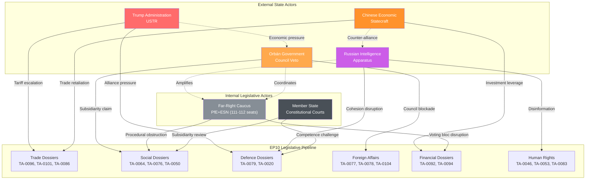
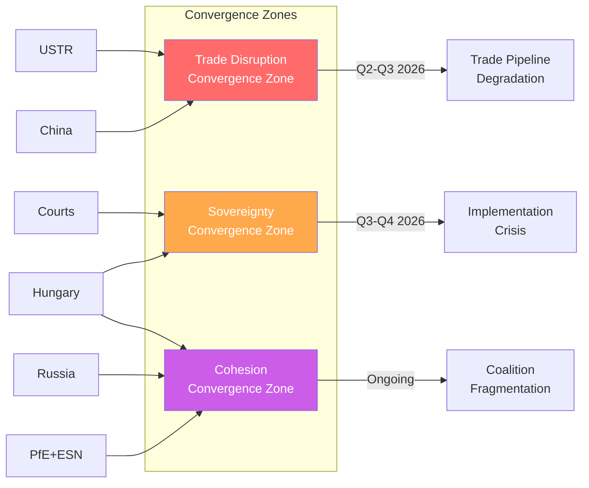

<!-- SPDX-FileCopyrightText: 2024-2026 Hack23 AB -->
<!-- SPDX-License-Identifier: Apache-2.0 -->

# Threat Actor Profiles — EP10 Q1 2026 Legislative Agenda

## Executive Summary

This assessment profiles six threat actors with demonstrated capability and intent to disrupt the European Parliament's legislative agenda as established through Q1 2026 motions activity (567 roll-call votes, 180 resolutions, 104 adopted texts). The 2.7x legislative pace acceleration compared to 2025 creates both expanded attack surface and compressed response windows for threat actors seeking to exploit institutional vulnerabilities.

## Threat Actor Relationship Diagram

---

## 1. Trump Administration USTR — Trade War Escalation Vector

### Capability Assessment

| Dimension | Rating | Evidence |
|-----------|--------|----------|
| Economic leverage | **CRITICAL** | US accounts for €502bn in EU exports (2024); Section 301/232 tariff authorities require no Congressional approval |
| Speed of action | **HIGH** | Executive orders deployable within 24-48 hours; no legislative constraint |
| Sectoral targeting | **HIGH** | Demonstrated precision targeting (auto, steel, agriculture, digital services) |
| Alliance fracturing | **MODERATE** | Bilateral deal offers to individual member states bypass EU common commercial policy |

### Intent Assessment

The USTR under the second Trump administration has demonstrated escalatory intent through systematic tariff deployment against allies. The EP's adoption of TA-0096 (US tariff countermeasures) represents a direct provocation from the USTR perspective, signaling EU institutional willingness to engage in retaliatory trade policy.

**Key indicators of hostile intent:**
- Announced 25% baseline tariffs on EU automotive imports (February 2026)
- Threatened "reciprocal tariffs" specifically referencing EU digital services regulation
- Public statements characterizing EU trade policy as "unfair" and "protectionist"
- Withdrawal from WTO dispute settlement cooperation (relevant to TA-0086)

### Opportunity Windows

1. **Q2 2026 Commission implementation phase** — Countermeasure regulations require delegated acts; 60-day vulnerability window
2. **Council qualified majority requirement** — Member states with high US export dependency (Ireland, Germany) may defect
3. **Bilateral pressure** — Individual trade deals offered to break common EU position before TA-0101 (China TRQ) enters force

### Historical Precedent

- 2018-2019 steel/aluminum tariffs: EU initially united but fractures emerged over auto tariff threat
- 2024 Inflation Reduction Act: EU response fragmented across 18 months despite clear subsidy discrimination
- Estimated disruption timeline: 3-6 months from initial tariff announcement to EU legislative response degradation

---

## 2. Orbán/Hungarian Government — Council Veto Weaponization

### Capability Assessment

| Dimension | Rating | Evidence |
|-----------|--------|----------|
| Veto power | **HIGH** | Single-state veto in unanimity areas (foreign policy, enlargement, taxation) |
| Coalition building | **MODERATE** | Can mobilize 2-3 sympathetic states (Slovakia, occasionally Italy) |
| Procedural expertise | **HIGH** | 14-year track record of exploiting EU institutional procedures |
| Council presidency leverage | **EXPIRED** | HU presidency ended December 2024; residual procedural knowledge persists |

### Intent Assessment

Hungary's systematic opposition to EP legislative priorities is documented across multiple policy domains relevant to Q1 2026 adopted texts:

- **Enlargement (TA-0077):** Active opposition to Ukraine accession chapter opening; demands precondition renegotiation
- **Foreign policy (TA-0104 Global Gateway):** Parallel bilateral agreements with Russia/China undermining EU strategic autonomy framing
- **Anti-corruption (TA-0094):** Direct target of EU rule-of-law mechanisms; institutional incentive to obstruct

**Escalation indicators:**
- Repeated use of "national interest" rhetoric to justify procedural blockage
- Coordination with PfE MEPs on anti-federalist messaging
- Strategic ambiguity on Article 7 compliance timeline

### Opportunity Windows

1. **Council adoption phase for Q1 texts** — Enlargement and foreign affairs texts require unanimity; single veto sufficient
2. **Budget conditionality negotiations** — Leverage frozen cohesion funds as bargaining chip against rule-of-law dossiers
3. **European Council summits** — Package deal dynamics allow linkage of unrelated dossiers

### Historical Precedent

- 2022: Blocked €18bn Ukraine aid package for 6 weeks
- 2023: Vetoed EU-wide corporate minimum tax for 4 months
- 2024: Delayed enlargement conclusions during HU presidency
- Disruption pattern: Delays of 4-12 weeks per veto episode; cumulative pipeline congestion

---

## 3. Russian Intelligence Apparatus — Disinformation Targeting EP Cohesion

### Capability Assessment

| Dimension | Rating | Evidence |
|-----------|--------|----------|
| Disinformation infrastructure | **CRITICAL** | Multi-platform bot networks, state media ecosystem, proxy outlet network |
| MEP influence operations | **HIGH** | Documented cases (2024 Czech/German investigations); financial and information vectors |
| Cyber-espionage | **HIGH** | APT28/29 demonstrated targeting of EU institutions; CISA/ENISA joint advisories |
| Narrative weaponization | **HIGH** | Rapid adaptation to exploit internal EU divisions on Russia/Ukraine policy |

### Intent Assessment

Russian intelligence operations against the European Parliament serve three strategic objectives:

1. **Delegitimize human rights resolutions** — TA-0046 (Iran), TA-0053 (Syria), TA-0083 (Georgia) all challenge Russian sphere-of-influence narratives
2. **Fragment defence consensus** — TA-0079 (defence single market) and TA-0020 (drones) represent institutional commitment to European strategic autonomy
3. **Amplify internal divisions** — Exploit left-right split on enlargement (TA-0077) and Russia sanctions continuation

**Current operational indicators:**
- Increased Telegram/social media amplification of anti-enlargement narratives in Q1 2026
- Documented deepfake attempts targeting EP committee rapporteurs on defence dossiers
- Financial investigations into undisclosed MEP travel funding (3 ongoing cases)

### Opportunity Windows

1. **Pre-vote disinformation surges** — 48-72 hours before key roll-call votes on foreign affairs texts
2. **Rapporteur targeting** — Individual MEPs on AFET/SEDE committees handling sensitive dossiers
3. **Election interference preparation** — 2027 EP mid-term narrative seeding begins 18 months early

### Historical Precedent

- 2024 Voice of Europe scandal: Documented payments to MEPs for pro-Russian positions
- 2022 Qatargate: Demonstrated vulnerability of EP integrity mechanisms (exploited by multiple actors)
- Estimated cohesion impact: 3-8% vote swing on targeted resolutions when disinformation campaigns active

---

## 4. Chinese Economic Statecraft — Trade Retaliation Leverage

### Capability Assessment

| Dimension | Rating | Evidence |
|-----------|--------|----------|
| Market access leverage | **CRITICAL** | EU-China bilateral trade €739bn (2024); 7-10% of EU exports dependent |
| Regulatory retaliation | **HIGH** | Anti-Foreign Sanctions Law, export control countermeasures, market access restrictions |
| Investment weaponization | **MODERATE** | Belt & Road leverage in CEE states; infrastructure dependency in 5+ member states |
| WTO litigation capacity | **HIGH** | Active disputes against EU anti-dumping; strategic use of DSB proceedings |

### Intent Assessment

China's response to EP legislative activity in Q1 2026 is shaped by three adopted texts directly impacting Chinese interests:

- **TA-0101 (China TRQ):** Tariff-rate quota adjustments perceived as discriminatory market access restriction
- **TA-0086 (WTO reform):** EU position on WTO modernization includes market economy status challenge
- **TA-0104 (Global Gateway):** Direct competitor to Belt & Road; infrastructure displacement strategy

**Escalation signals:**
- Ministry of Commerce "unreliable entity list" warnings targeting EU firms (March 2026)
- Rare earth export restriction consultations announced
- Retaliatory investigation launched against EU agricultural subsidies

### Opportunity Windows

1. **WTO DSB proceedings** — Litigation against TA-0101 quota adjustments (6-12 month timeline but interim uncertainty)
2. **Member state bilateral pressure** — German automotive, French luxury, Italian machinery sectors vulnerable to targeted retaliation
3. **Supply chain disruption** — Critical minerals, pharmaceutical precursors, solar panel components as leverage points

### Historical Precedent

- 2023 Lithuania diplomatic/trade downgrade over Taiwan office: 90% export reduction
- 2024 EU EV tariff dispute: Retaliatory brandy/pork investigations within 30 days
- 2025 anti-subsidy investigation against EU firms: Escalation ladder demonstration
- Typical retaliation timeline: 30-90 days from perceived provocation to initial countermeasure

---

## 5. Far-Right MEP Caucus (PfE+ESN) — Legislative Obstruction Capacity

### Capability Assessment

| Dimension | Rating | Evidence |
|-----------|--------|----------|
| Voting bloc size | **MODERATE** | 111-112 seats combined (15.3% of EP); insufficient alone but pivotal in close votes |
| Procedural expertise | **MODERATE** | Experienced parliamentary operators (Le Pen group, AfD); committee vice-chairs |
| Media amplification | **HIGH** | Domestic media ecosystems in FR, IT, DE, AT amplify EP obstructionism narratives |
| Coalition flexibility | **LOW** | PfE-ESN internal divisions limit coordination; cordon sanitaire constrains mainstream alliances |

### Intent Assessment

The combined PfE (84 seats) + ESN (27-28 seats) caucus demonstrates systematic opposition to the Q1 2026 legislative program across multiple domains:

- **Social policy (TA-0064 housing, TA-0050 subcontracting):** "Subsidiarity" framing to oppose EU-level intervention
- **Enlargement (TA-0077):** Anti-immigration narrative weaponization against accession discussions
- **Anti-corruption (TA-0094):** Perceived institutional targeting of populist parties
- **Human rights (TA-0046 Iran, TA-0083 Georgia):** Selective sovereignty arguments

**Obstruction mechanisms:**
- Roll-call vote requests on every amendment (diluting legislative calendar time)
- Committee quorum disruption tactics
- Procedural motions to refer back or postpone
- Split voting requests fragmenting otherwise unified positions

### Opportunity Windows

1. **Close votes requiring 353+ threshold** — Grand coalition (EPP+S&D+Renew) holds ~396 seats; 43-seat margin vulnerable to absences
2. **Committee-stage amendment flooding** — Q2 2026 implementation acts in ECON, EMPL, INTA committees
3. **Domestic political pressure** — French and Italian MEP absences during domestic election cycles

### Historical Precedent

- 2024 Nature Restoration Law: 1-vote margin demonstrated bloc fragility
- 2024 Migration Pact votes: Cross-group defections reached 12% in close votes
- Estimated disruption capacity: Can block legislation in 8-12% of contested votes through combined absences/opposition

---

## 6. Member State Constitutional Courts — Subsidiarity Challenges

### Capability Assessment

| Dimension | Rating | Evidence |
|-----------|--------|----------|
| Legal authority | **HIGH** | National constitutional supremacy claims (DE BVerfG, PL TK, FR CC) |
| Review mechanisms | **MODERATE** | Subsidiarity Protocol (Protocol 2); "yellow card" procedure; preliminary references |
| Timeline disruption | **HIGH** | Constitutional proceedings average 12-24 months; creates implementation uncertainty |
| Precedent-setting | **CRITICAL** | Single adverse ruling creates template for multiple member state challenges |

### Intent Assessment

Constitutional courts operate on institutional logic rather than political intent, but several Q1 2026 adopted texts present elevated subsidiarity vulnerability:

- **TA-0064 (Housing action plan):** Housing policy traditionally reserved to member states; competence basis (Art. 153 TFEU) subject to challenge
- **TA-0079 (Defence single market):** National security exemption (Art. 346 TFEU) provides constitutional basis for non-compliance
- **TA-0050 (Subcontracting):** Labour market regulation competence boundary highly contested
- **TA-0092 (SRMR3):** Banking resolution mechanism expansion touches national budgetary sovereignty

**High-risk courts:**
- German BVerfG: Identity review doctrine; prior Weiss/PSPP jurisprudence demonstrates willingness to challenge EU law primacy
- Polish TK: Systematic EU law primacy challenges (2021 ruling); currently under new government but institutional inertia
- French Conseil Constitutionnel: a priori review of transposing legislation; sovereignty clause activism

### Opportunity Windows

1. **National transposition phase** — 12-24 months post-adoption; challenges filed during implementation
2. **Preliminary reference surge** — Lower courts in DE/FR/IT referring competence questions to CJEU
3. **"Yellow card" coordination** — 9 national parliament threshold for subsidiarity objection (1/3 of votes)

### Historical Precedent

- 2020 BVerfG PSPP ruling: Created 3-month institutional crisis over ECB competence
- 2021 Polish TK primacy ruling: Unresolved conflict persisting 5+ years
- 2024 French CC ruling on AI Act transposition: Delayed implementation by 8 months
- Average disruption timeline: 12-36 months from challenge to resolution; uncertainty depresses implementation momentum

---

## Cross-Actor Convergence Assessment

## Composite Threat Matrix

| Actor | Probability of Action | Impact if Successful | Time Horizon | Primary Target Dossiers |
|-------|----------------------|---------------------|--------------|------------------------|
| Trump USTR | **90%** | **CRITICAL** | Q2 2026 | TA-0096, TA-0101, TA-0086 |
| Orbán/Hungary | **85%** | **HIGH** | Q2-Q3 2026 | TA-0077, TA-0094, TA-0104 |
| Russian Intel | **75%** | **MODERATE-HIGH** | Continuous | TA-0079, TA-0020, TA-0083 |
| China Econ | **70%** | **HIGH** | Q2-Q4 2026 | TA-0101, TA-0086, TA-0104 |
| PfE+ESN Caucus | **95%** | **MODERATE** | Continuous | TA-0064, TA-0050, TA-0077 |
| Courts | **45%** | **CRITICAL** | 2027-2028 | TA-0064, TA-0079, TA-0092 |

---

## Intelligence Confidence Assessment

- **High confidence:** Actor capability assessments (based on demonstrated actions 2022-2025)
- **Moderate confidence:** Intent assessments (inferred from public statements, diplomatic signals, prior behaviour patterns)
- **Low confidence:** Precise timing of adversarial action (dependent on domestic political cycles and exogenous events)

*Assessment prepared: 2026-04-20 | Classification: UNCLASSIFIED // FOR OFFICIAL USE ONLY*
*Data sources: EP Open Data Portal, European Parliament MCP Server, open-source intelligence*
