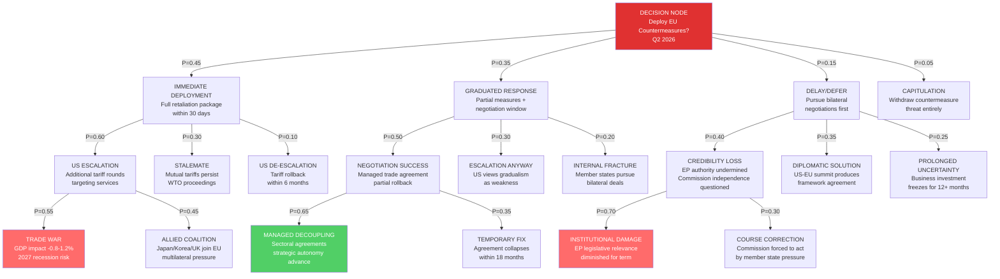
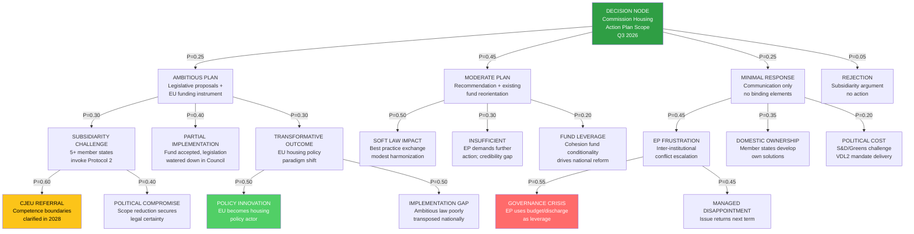
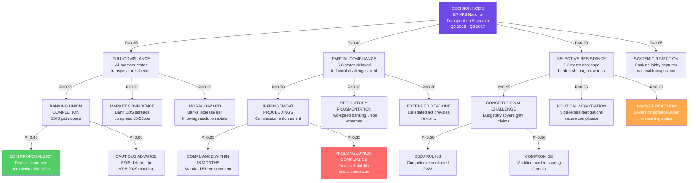
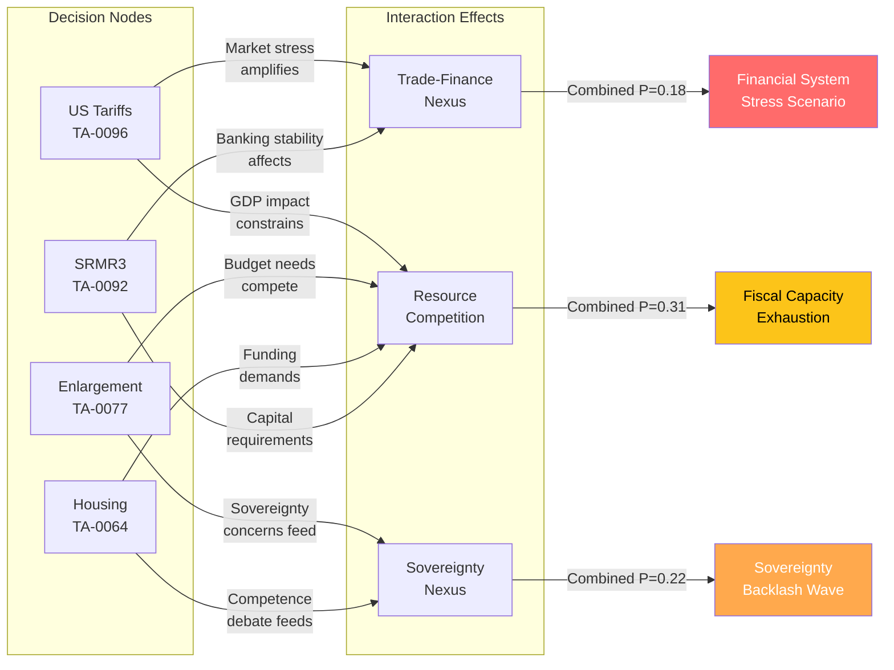

<!-- SPDX-FileCopyrightText: 2024-2026 Hack23 AB -->
<!-- SPDX-License-Identifier: Apache-2.0 -->

# Consequence Tree Analysis — EP10 Q1 2026 Key Decision Nodes

## Executive Summary

This document applies consequence tree methodology to four critical decision nodes emerging from Q1 2026 EP10 legislative activity. Each decision node represents a binary or multi-path choice point where institutional action (or inaction) cascades into divergent political, economic, and institutional outcomes. Probability assignments are derived from historical precedent analysis, current political dynamics assessment, and structural constraint evaluation.

**Analytical framework:** 3-level deep consequence branching with probability assignments at each node, calibrated against 567 roll-call votes and 104 adopted texts from Q1 2026.

---

## Decision Node 1: US Tariff Countermeasures Deployment (TA-0096)

### Context

EP adopted TA-0096 mandating Commission preparation of countermeasure instruments against US Section 301/232 tariffs. The decision node occurs when the Commission must choose deployment timing and scope following confirmed US tariff escalation in Q2 2026.

### Probability-Weighted Impact Assessment

| Scenario Path | Cumulative Probability | GDP Impact | Institutional Impact |
|---------------|----------------------|-----------|---------------------|
| Immediate → Escalation → Trade War | 0.45 × 0.60 × 0.55 = **14.9%** | -0.8 to -1.2% | HIGH — crisis governance activation |
| Immediate → Escalation → Allied Coalition | 0.45 × 0.60 × 0.45 = **12.2%** | -0.3 to -0.5% | POSITIVE — strategic autonomy validated |
| Graduated → Negotiation → Managed Decoupling | 0.35 × 0.50 × 0.65 = **11.4%** | -0.1 to -0.3% | MODERATE — pragmatic outcome |
| Delay → Credibility Loss → Institutional Damage | 0.15 × 0.40 × 0.70 = **4.2%** | -0.2% | CRITICAL — EP legitimacy crisis |

**Most likely outcome (26.3% combined):** Graduated response followed by either successful negotiation or escalation, resulting in managed trade friction with -0.2 to -0.5% GDP impact and preserved but tested institutional credibility.

---

## Decision Node 2: Enlargement Accession Chapter Opening (TA-0077)

### Context

TA-0077 established EP position supporting opening of accession negotiation chapters for Ukraine and Moldova. The decision node occurs at the European Council where unanimity is required, with Hungary's confirmed opposition creating a structural veto threat.

```mermaid
graph TD
    DN2["DECISION NODE<br/>Open Accession Chapters?<br/>June 2026 European Council"]

    DN2 -->|"P=0.30"| E1["FULL OPENING<br/>All requested chapters<br/>opened simultaneously"]
    DN2 -->|"P=0.40"| E2["PARTIAL OPENING<br/>2-3 technical chapters<br/>political deferred"]
    DN2 -->|"P=0.20"| E3["DELAYED<br/>Postponed to<br/>December 2026"]
    DN2 -->|"P=0.10"| E4["BLOCKED<br/>Hungarian veto<br/>no chapters opened"]

    E1 -->|"P=0.40"| F1["ACCELERATED INTEGRATION<br/>Ukraine reforms<br/>momentum sustained"]
    E1 -->|"P=0.35"| F2["ABSORPTION STRAIN<br/>EU institutional capacity<br/>stressed"]
    E1 -->|"P=0.25"| F3["BACKLASH<br/>Populist parties gain<br/>on anti-enlargement"]

    E2 -->|"P=0.55"| F4["INCREMENTAL PROGRESS<br/>Build political consensus<br/>for further chapters"]
    E2 -->|"P=0.25"| F5["FRUSTRATION<br/>Ukraine perceives<br/>insufficient commitment"]
    E2 -->|"P=0.20"| F6["PRECEDENT SET<br/>Graduated approach<br/>becomes template"]

    E3 -->|"P=0.45"| F7["GEOPOLITICAL RISK<br/>Russia exploits delay<br/>narrative of EU weakness"]
    E3 -->|"P=0.30"| F8["DIPLOMATIC RESET<br/>New conditions package<br/>Hungary accommodation"]
    E3 -->|"P=0.25"| F9["REFORM FATIGUE<br/>Ukraine reform momentum<br/>diminishes"]

    E4 -->|"P=0.50"| F10["CONSTITUTIONAL MOMENT<br/>Reform of unanimity<br/>rule gains urgency"]
    E4 -->|"P=0.30"| F11["BILATERAL WORKAROUND<br/>Individual state agreements<br/>outside EU framework"]
    E4 -->|"P=0.20"| F12["STRATEGIC FAILURE<br/>Enlargement policy<br/>abandoned de facto"]

    F1 -->|"P=0.60"| G1["2030 ACCESSION TARGET<br/>Realistic timeline<br/>institutional preparation"]
    F1 -->|"P=0.40"| G2["OVERCOMMITMENT<br/>Resources diverted from<br/>existing programmes"]

    F4 -->|"P=0.70"| G3["SUSTAINABLE PACE<br/>Broad political buy-in<br/>for gradual expansion"]
    F4 -->|"P=0.30"| G4["STAGNATION RISK<br/>Incrementalism becomes<br/>permanent postponement"]

    F10 -->|"P=0.55"| G5["TREATY CHANGE DEBATE<br/>2029 IGC momentum<br/>qualified majority push"]
    F10 -->|"P=0.45"| G6["INSTITUTIONAL PARALYSIS<br/>Veto preserved<br/>reform blocked"]

    style DN2 fill:#1971c2,color:#fff
    style G1 fill:#51cf66,color:#fff
    style G3 fill:#51cf66,color:#fff
    style G5 fill:#fcc419,color:#000
    style G6 fill:#ff6b6b,color:#fff
```

### Probability-Weighted Impact Assessment

| Scenario Path | Cumulative Probability | Geopolitical Impact | Institutional Impact |
|---------------|----------------------|--------------------|--------------------|
| Partial → Incremental → Sustainable | 0.40 × 0.55 × 0.70 = **15.4%** | POSITIVE — credible process | MODERATE — managed expectations |
| Full → Accelerated → 2030 Target | 0.30 × 0.40 × 0.60 = **7.2%** | VERY POSITIVE — strategic win | HIGH — institutional adaptation required |
| Delayed → Geopolitical Risk | 0.20 × 0.45 = **9.0%** | NEGATIVE — credibility gap | MODERATE — demonstrates institutional weakness |
| Blocked → Constitutional Moment → Treaty Change | 0.10 × 0.50 × 0.55 = **2.8%** | MIXED — short-term loss, long-term gain | TRANSFORMATIVE — if reform succeeds |

**Most likely outcome (15.4%):** Partial chapter opening followed by incremental progress, achieving sustainable pace with broad political consensus. This represents the EU's institutional preference for gradualism under constraint.

---

## Decision Node 3: Housing Action Plan Commission Response (TA-0064)

### Context

TA-0064 called on the Commission to develop a comprehensive EU Housing Action Plan addressing affordability, social housing investment, and short-term rental regulation. The decision node occurs when the Commission determines response scope, given housing policy's traditionally national competence character.

### Probability-Weighted Impact Assessment

| Scenario Path | Cumulative Probability | Social Impact | Institutional Impact |
|---------------|----------------------|--------------|---------------------|
| Moderate → Soft Law Impact | 0.45 × 0.50 = **22.5%** | LOW-MODERATE — incremental improvement | LOW — status quo preserved |
| Moderate → Fund Leverage | 0.45 × 0.20 = **9.0%** | MODERATE — indirect reform pressure | MODERATE — innovative governance tool |
| Ambitious → Partial Implementation | 0.25 × 0.40 = **10.0%** | MODERATE — visible EU action | MODERATE — demonstrates ambition-delivery gap |
| Ambitious → Subsidiarity Challenge → CJEU | 0.25 × 0.30 × 0.60 = **4.5%** | DELAYED — 2+ year legal uncertainty | HIGH — competence boundaries redefined |
| Minimal → EP Frustration → Governance Crisis | 0.25 × 0.45 × 0.55 = **6.2%** | NEGATIVE — citizen expectations unmet | HIGH — inter-institutional conflict |

**Most likely outcome (22.5%):** Moderate Commission response producing soft law impact through best practice exchange and modest harmonization. This reflects institutional caution on competence boundaries but delivers below EP ambition level.

---

## Decision Node 4: SRMR3 Banking Union Transposition (TA-0092)

### Context

TA-0092 represents the third revision of the Single Resolution Mechanism Regulation, expanding the scope of resolution tools and burden-sharing arrangements. The decision node occurs during member state transposition/implementation, where national banking authorities must operationalize expanded resolution powers.

### Probability-Weighted Impact Assessment

| Scenario Path | Cumulative Probability | Financial Stability Impact | Institutional Impact |
|---------------|----------------------|---------------------------|---------------------|
| Full Compliance → Banking Union Completion → EDIS | 0.35 × 0.55 × 0.40 = **7.7%** | VERY POSITIVE — systemic risk reduction | TRANSFORMATIVE — third pillar achieved |
| Full Compliance → Banking Union Completion → Cautious | 0.35 × 0.55 × 0.60 = **11.6%** | POSITIVE — framework strengthened | MODERATE — incremental progress |
| Partial → Infringement → Compliance | 0.40 × 0.50 × 0.65 = **13.0%** | MODERATE — delayed but achieved | LOW — standard enforcement cycle |
| Selective Resistance → Constitutional → CJEU | 0.20 × 0.45 × 0.50 = **4.5%** | NEGATIVE — uncertainty period | HIGH — fundamental questions reopened |
| Partial → Fragmentation | 0.40 × 0.30 = **12.0%** | NEGATIVE — two-speed risk | HIGH — undermines single market integrity |

**Most likely outcome (13.0%):** Partial initial compliance followed by infringement proceedings leading to eventual compliance within 18 months. This reflects the standard EU enforcement dynamic where political resistance eventually yields to legal pressure, but with meaningful delays.

---

## Cross-Decision Node Interaction Matrix

## Aggregate Risk Assessment

| Combined Scenario | Joint Probability | Systemic Impact | Recovery Timeline |
|-------------------|-------------------|-----------------|-------------------|
| Trade war + Banking fragmentation | 14.9% × 12.0% = **1.8%** | SYSTEMIC — 2008-style risk | 24-36 months |
| Enlargement blocked + Housing rejected | 10.0% × 6.2% = **0.6%** | INSTITUTIONAL — legitimacy crisis | 12-18 months |
| All four adverse outcomes simultaneously | <0.1% | CATASTROPHIC — EU governance failure | 36+ months |
| All four positive outcomes simultaneously | ~1.2% | TRANSFORMATIVE — integration leap | N/A (sustained benefit) |

**Central forecast:** Mixed outcomes across decision nodes, with 65-70% probability of at least one major adverse development and 85-90% probability of at least one positive outcome. The EU institutional framework's resilience is tested but not broken in the modal scenario.

---

*Assessment prepared: 2026-04-20 | Methodology: Multi-level consequence tree with Bayesian probability assignment*
*Data sources: EP Open Data Portal, ECB Financial Stability Review, Council voting records*
