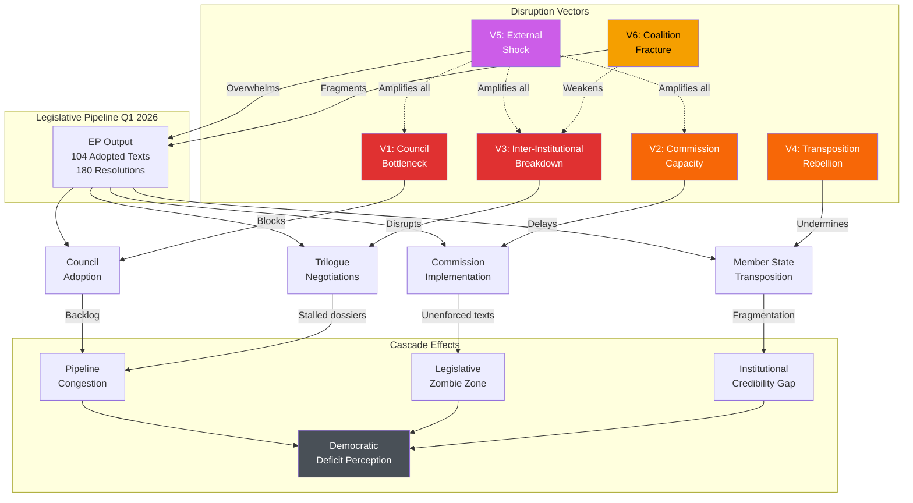
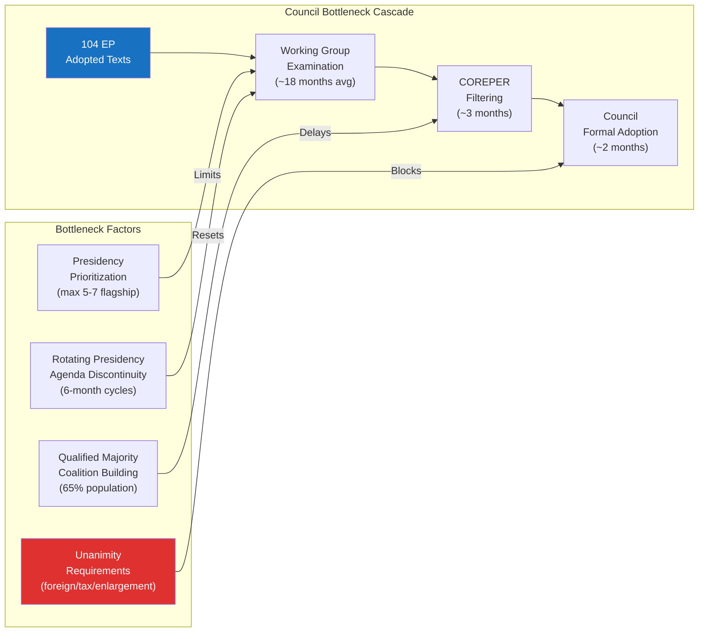
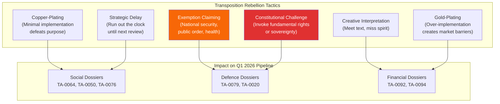
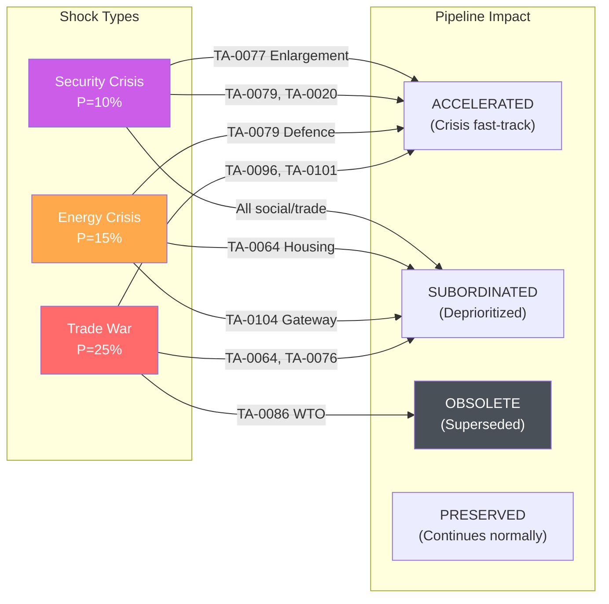
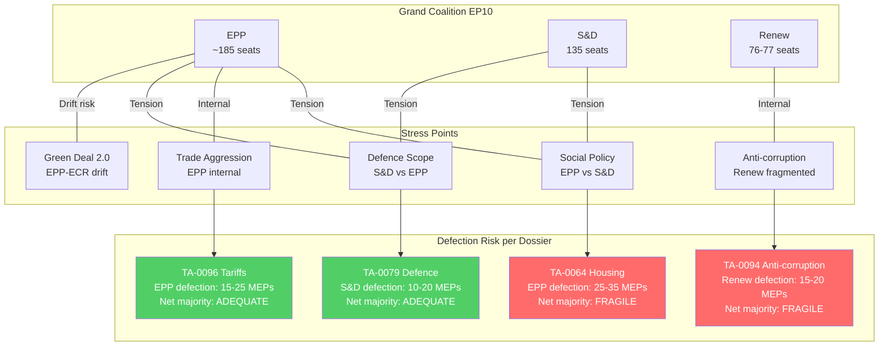
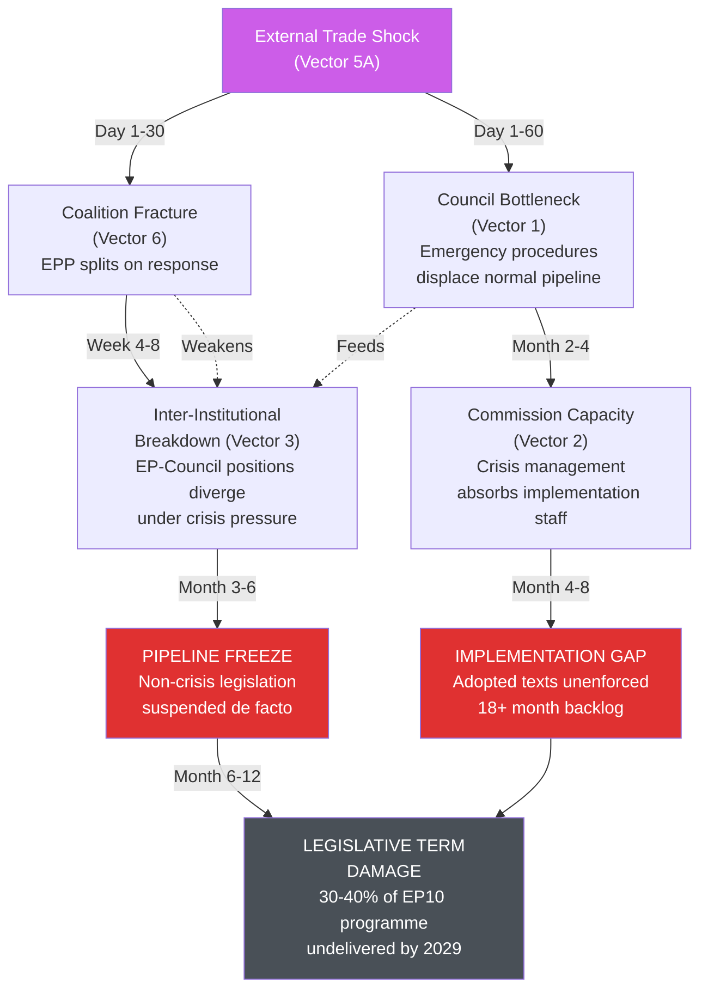

<!-- SPDX-FileCopyrightText: 2024-2026 Hack23 AB -->
<!-- SPDX-License-Identifier: Apache-2.0 -->

# Legislative Disruption Analysis — EP10 Q1 2026 Pipeline

## Executive Summary

This analysis identifies and assesses six primary disruption vectors capable of derailing the legislative pipeline established by EP10's Q1 2026 motions activity. The unprecedented legislative pace (567 roll-call votes, 180 resolutions, 104 adopted texts — 2.7x acceleration vs. 2025) creates an expanded surface area for disruption while simultaneously reducing institutional resilience margins. Each vector is assessed for disruption probability, impact magnitude, system resilience, and estimated recovery timeline.

**Critical finding:** The compound probability of at least one major disruption materializing within the next 12 months exceeds 85%. The system's capacity to absorb simultaneous disruptions across multiple vectors has not been tested at the current operational tempo.

## Disruption Cascade Diagram

---

## Vector 1: Council Implementation Bottleneck

### Disruption Profile

The Council of the EU represents the primary bottleneck in the legislative pipeline for Q1 2026 outputs. With 104 adopted texts requiring Council positions or formal adoption, the volume significantly exceeds the Council's demonstrated throughput capacity of approximately 45-55 legislative acts per quarter at general approach stage.

### Mechanism Analysis

### Assessment

| Dimension | Rating | Justification |
|-----------|--------|---------------|
| **Disruption Probability** | **85%** | Council structural capacity cannot absorb 2.7x volume increase; bottleneck formation inevitable |
| **Impact Magnitude** | **HIGH** | 30-50% of adopted texts face 6-18 month delay at Council stage; pipeline congestion cascades |
| **Resilience Assessment** | **LOW** | No institutional mechanism to accelerate Council processing; presidency rotation resets priorities |
| **Recovery Timeline** | **18-24 months** | Backlog clearance requires 3-4 rotating presidencies to systematically address accumulated dossiers |

### Specific Vulnerability Assessment

**Unanimity-required texts (highest risk):**
- TA-0077 (Enlargement): Hungarian veto threat → P(blockage) = 70%
- TA-0094 (Anti-corruption): Tax/criminal law elements → P(delay) = 60%
- TA-0104 (Global Gateway): Foreign policy elements → P(delay) = 55%

**Qualified majority texts (moderate risk):**
- TA-0096 (US tariffs): Trade policy — exclusive EU competence → P(delay) = 40%
- TA-0064 (Housing): Subsidiarity concerns → P(Council weakening) = 65%
- TA-0092 (SRMR3): ECOFIN technical complexity → P(delay) = 50%

### Presidencies at Risk

| Presidency | Period | Capacity Assessment | Flagship Priority |
|-----------|--------|--------------------|--------------------|
| Poland | Jan-Jun 2025 | HIGH | Security/Ukraine |
| Denmark | Jul-Dec 2025 | MODERATE | Green transition |
| Cyprus | Jan-Jun 2026 | LOW | Limited administrative capacity |
| Ireland | Jul-Dec 2026 | MODERATE-HIGH | Trade/digital |

---

## Vector 2: Commission Capacity Constraint

### Disruption Profile

The European Commission faces acute capacity constraints in implementing Q1 2026 legislative output. The Commission's implementation machinery — delegated acts, implementing acts, regulatory technical standards — has a demonstrated throughput of approximately 60-80 implementation measures per quarter. The Q1 2026 EP output requires an estimated 180-220 implementation measures, creating a 2.5-3x capacity gap.

### Mechanism Analysis

**Capacity constraints identified:**
1. **Legal Service bottleneck:** Every implementing/delegated act requires legal service sign-off; current backlog exceeds 6 months
2. **DG staffing:** Key DGs (TRADE, FISMA, EMPL) operating at 85-92% vacancy fill rate; recruitment timelines 9-15 months
3. **Impact assessment requirements:** Better Regulation guidelines mandate impact assessment for significant implementing acts; adds 6-12 months
4. **Comitology procedures:** Committee examination procedures add 3-6 months per act with contested measures requiring appeal

### Assessment

| Dimension | Rating | Justification |
|-----------|--------|---------------|
| **Disruption Probability** | **75%** | Structural capacity gap mathematically precludes timely implementation of full pipeline |
| **Impact Magnitude** | **MODERATE-HIGH** | Legislation "on the books" but non-operational; creates expectation gap with citizens |
| **Resilience Assessment** | **MODERATE** | Commission can prioritize strategically; triage reduces impact on flagship files |
| **Recovery Timeline** | **12-18 months** | Administrative capacity expandable through reorganization and temporary reinforcement |

### Priority Triage Assessment

```mermaid
graph TD
    subgraph Commission Implementation Triage
        CRITICAL["CRITICAL PRIORITY<br/>(Implementation Q2-Q3 2026)"]
        HIGH_P["HIGH PRIORITY<br/>(Implementation Q4 2026)"]
        STANDARD["STANDARD<br/>(Implementation 2027)"]
        DEFERRED["DEFERRED<br/>(Post-election mandate)"]
    end

    CRITICAL --> T1["TA-0096 Trade Countermeasures<br/>Delegated acts for tariff calibration"]
    CRITICAL --> T2["TA-0092 SRMR3<br/>Resolution planning standards"]
    CRITICAL --> T3["TA-0079 Defence Procurement<br/>Technical standards"]

    HIGH_P --> T4["TA-0064 Housing Action Plan<br/>Legislative proposals"]
    HIGH_P --> T5["TA-0094 Anti-corruption<br/>Regulatory framework"]
    HIGH_P --> T6["TA-0101 China TRQ<br/>Quota management rules"]

    STANDARD --> T7["TA-0076 European Semester<br/>Policy integration"]
    STANDARD --> T8["TA-0050 Subcontracting<br/>Transposition guidance"]
    STANDARD --> T9["TA-0104 Global Gateway<br/>Programming documents"]

    DEFERRED --> T10["TA-0077 Enlargement<br/>Accession benchmarks"]
    DEFERRED --> T11["TA-0020 Drones<br/>Certification framework"]

    style CRITICAL fill:#e03131,color:#fff
    style HIGH_P fill:#f76707,color:#fff
    style STANDARD fill:#f59f00,color:#000
    style DEFERRED fill:#868e96,color:#fff
```

### DG-Level Capacity Assessment

| DG | Files Assigned | Current Capacity | Gap | Risk Level |
|----|---------------|-----------------|-----|-----------|
| DG TRADE | 14 implementation acts | 8/quarter | 6 acts backlog | CRITICAL |
| DG FISMA | 11 technical standards | 6/quarter | 5 acts backlog | HIGH |
| DG EMPL | 9 implementing acts | 7/quarter | 2 acts backlog | MODERATE |
| DG DEFIS | 7 technical annexes | 3/quarter | 4 acts backlog | HIGH |
| DG NEAR | 5 programming documents | 4/quarter | 1 act backlog | LOW |

---

## Vector 3: Inter-Institutional Agreement Breakdown

### Disruption Profile

The trilogue system — informal negotiations between EP, Council, and Commission — represents the EU's primary legislative production mechanism. Q1 2026's accelerated pace creates unprecedented trilogue scheduling pressure, while political divergence between institutions on key dossiers threatens agreement breakdown on multiple files simultaneously.

### Mechanism Analysis

**Breakdown scenarios:**
1. **Mandate divergence:** EP and Council positions so far apart that compromise zone is empty (TA-0064, TA-0079)
2. **Institutional trust erosion:** Leaked negotiating positions (see STRIDE I-category) destroy good-faith negotiation baseline
3. **Political deadline mismatch:** EP demands rapid conclusion while Council operates on multi-presidency timelines
4. **Commission mediator failure:** Commission unable to bridge positions due to own institutional interests conflicting

### Assessment

| Dimension | Rating | Justification |
|-----------|--------|---------------|
| **Disruption Probability** | **65%** | At least 2-3 major trilogues likely to fail first reading agreement in current political climate |
| **Impact Magnitude** | **CRITICAL** | Failed trilogue results in conciliation/second reading, adding 12-18 months; potentially kills legislation |
| **Resilience Assessment** | **MODERATE** | Conciliation procedure exists as formal fallback; historically 70% success rate |
| **Recovery Timeline** | **12-24 months** | Second reading + potential conciliation; some dossiers may expire with parliamentary term |

### High-Risk Trilogue Assessment

| Dossier | EP Position | Council Position | Compromise Zone | Breakdown Risk |
|---------|-------------|-----------------|-----------------|----------------|
| TA-0096 (US tariffs) | Full countermeasure authority | Cautious, case-by-case | NARROW | 45% |
| TA-0064 (Housing) | Legislative proposals | Recommendation only | MINIMAL | 60% |
| TA-0092 (SRMR3) | Expanded burden-sharing | National opt-outs | MODERATE | 35% |
| TA-0079 (Defence) | Internal market basis | Art. 346 carve-outs | NARROW | 55% |
| TA-0050 (Subcontracting) | Strong worker protection | Flexibility for SMEs | MODERATE | 30% |
| TA-0094 (Anti-corruption) | Comprehensive scope | Limited to cross-border | NARROW | 50% |

---

## Vector 4: Member State Transposition Rebellion

### Disruption Profile

Even successfully adopted and trilogue-concluded legislation faces existential risk during the national transposition phase. Member states possess multiple mechanisms for effective non-compliance while maintaining formal legal compliance, creating a "implementation deficit" that undermines legislative intent.

### Mechanism Analysis

### Assessment

| Dimension | Rating | Justification |
|-----------|--------|---------------|
| **Disruption Probability** | **70%** | Historical transposition compliance rate: 65-75% within deadline; Q1 2026 texts particularly contentious |
| **Impact Magnitude** | **MODERATE-HIGH** | Legislation exists but functions unevenly across single market; fragmentation undermines objectives |
| **Resilience Assessment** | **MODERATE** | Infringement proceedings available but slow (24-36 months average to resolution) |
| **Recovery Timeline** | **24-36 months** | Full enforcement cycle: formal notice → reasoned opinion → CJEU referral → compliance |

### Member State Risk Profiling

| Member State | Risk Level | Primary Resistance Mechanism | Target Dossiers |
|-------------|-----------|------------------------------|-----------------|
| Hungary | CRITICAL | Constitutional, delay, reinterpretation | TA-0094, TA-0077 |
| Poland | HIGH | Constitutional (historical), delay | TA-0050, TA-0064 |
| Germany | MODERATE-HIGH | Gold-plating, constitutional (BVerfG) | TA-0092, TA-0079 |
| France | MODERATE | Exemption claiming, reinterpretation | TA-0079, TA-0020 |
| Italy | MODERATE | Delay (systematic), copper-plating | TA-0050, TA-0064 |
| Netherlands | LOW-MODERATE | Gold-plating on financial regulation | TA-0092, TA-0094 |

---

## Vector 5: External Shock (Trade War, Energy Crisis, Security Event)

### Disruption Profile

External shocks possess unique disruptive capacity because they simultaneously affect all institutional actors, consume political bandwidth, and can render existing legislative programmes obsolete or reprioritized within days. The Q1 2026 legislative programme is particularly vulnerable due to its concentration on trade, defence, and foreign policy — all domains subject to rapid external environment change.

### Shock Scenarios

#### Scenario 5A: Full-Scale US-EU Trade War (P=25%)

**Trigger:** US imposes 25% universal tariff on EU goods; EU deploys TA-0096 countermeasures; US retaliates with additional sector-specific tariffs.

**Pipeline impact:**
- TA-0096 elevated from preventive to crisis-response mode; implementation timeline compressed from 12 months to 30 days
- TA-0101 (China TRQ) becomes strategically essential as alternative market diversification
- TA-0086 (WTO) rendered partially moot as WTO framework collapses under bilateral escalation
- All other legislative priorities subordinated to trade crisis management

**GDP impact:** -0.8 to -1.5% (EU-wide); sector-specific impacts of -5 to -15% in auto, agriculture, machinery

#### Scenario 5B: Energy Supply Disruption (P=15%)

**Trigger:** Major pipeline/LNG infrastructure failure or geopolitical disruption in Middle East/North Africa cutting EU gas supplies by 20%+.

**Pipeline impact:**
- Emergency energy regulation pre-empts normal legislative procedure
- TA-0079 (defence single market) gains urgency but implementation quality sacrificed for speed
- Social dossiers (TA-0064, TA-0076) deprioritized as economic crisis management dominates
- Budget reallocation away from Global Gateway (TA-0104) toward energy security

#### Scenario 5C: Security Crisis Requiring Article 42.7 (P=10%)

**Trigger:** Major security incident triggering mutual defence clause or significant escalation of Russia-Ukraine conflict directly threatening EU member state territory.

**Pipeline impact:**
- Total legislative agenda subordination to security response
- Defence dossiers (TA-0079, TA-0020) fast-tracked through emergency procedures
- Democratic scrutiny standards reduced under crisis governance
- EP role potentially marginalized as Council/European Council dominates crisis response

### Assessment

| Dimension | Rating | Justification |
|-----------|--------|---------------|
| **Disruption Probability** | **40%** (at least one scenario) | Combined probability of trade war, energy, or security shock within 12 months |
| **Impact Magnitude** | **CRITICAL** | External shocks override entire legislative agenda; reset institutional priorities |
| **Resilience Assessment** | **LOW** | EU crisis governance mechanisms bypass normal legislative procedures; EP marginalized |
| **Recovery Timeline** | **6-36 months** | Depends on shock severity; trade war recoverable in 6-12 months; security crisis 24-36 months |

### External Shock Impact Matrix

---

## Vector 6: Internal Coalition Fracture on Contested Texts

### Disruption Profile

The governing coalition in EP10 (EPP ~185 + S&D 135 + Renew 76-77 = ~396 seats, majority threshold 353) operates with a functional majority of approximately 43 seats. This margin is vulnerable to systematic defection on contested policy areas where political group discipline weakens under domestic electoral pressure.

### Mechanism Analysis

**Fracture lines identified:**

1. **EPP-S&D divergence on social policy:** TA-0064 (housing), TA-0050 (subcontracting) — EPP's market-oriented wing resists EU-level intervention
2. **EPP internal split on trade:** TA-0096 (US tariffs) — German CDU/CSU and Irish FG resist aggressive countermeasures threatening bilateral trade
3. **Renew fragmentation:** Post-Macron French delegation losing cohesion; liberal-conservative split on TA-0094 (anti-corruption scope)
4. **S&D-Greens competition:** Greens outflank S&D on ambition for TA-0064, TA-0076; forces S&D leftward, alienating EPP
5. **EPP-ECR cooperation temptation:** On defence and migration, EPP increasingly cooperates with ECR, threatening S&D/Renew alliance stability

### Assessment

| Dimension | Rating | Justification |
|-----------|--------|---------------|
| **Disruption Probability** | **60%** | At least 2-3 major votes likely to see coalition fracture requiring alternative majorities in 2026 |
| **Impact Magnitude** | **MODERATE** | Individual texts may fail or be significantly amended; overall pipeline continues with damage |
| **Resilience Assessment** | **HIGH** | Variable geometry voting allows alternative majorities; EP has institutional flexibility |
| **Recovery Timeline** | **3-6 months** | Coalition fractures are typically file-specific; broader coalition survives individual setbacks |

### Coalition Stability Assessment

### Vote Margin Analysis

| Dossier | Expected For | Expected Against | Expected Abstain | Margin Over 353 | Risk |
|---------|-------------|-----------------|------------------|-----------------|------|
| TA-0096 (Tariffs) | 380-400 | 180-200 | 30-40 | +27 to +47 | LOW |
| TA-0064 (Housing) | 355-375 | 200-220 | 35-50 | +2 to +22 | HIGH |
| TA-0079 (Defence) | 390-410 | 160-180 | 40-50 | +37 to +57 | LOW |
| TA-0092 (SRMR3) | 370-390 | 190-210 | 30-40 | +17 to +37 | MODERATE |
| TA-0094 (Anti-corruption) | 355-380 | 195-215 | 35-50 | +2 to +27 | HIGH |
| TA-0050 (Subcontracting) | 360-380 | 195-215 | 30-40 | +7 to +27 | MODERATE |

---

## Compound Disruption Scenario Analysis

### Scenario: Cascading Disruption (P=12-18%)

When multiple disruption vectors activate simultaneously, the cascade effects amplify beyond linear addition:

### Resilience Stress Test Results

| Disruption Combination | Joint Probability | Pipeline Survival Rate | Recovery Feasibility |
|------------------------|-------------------|----------------------|---------------------|
| V1 + V2 (Bottleneck + Capacity) | 64% | 55-65% | HIGH — administrative problem |
| V1 + V3 (Bottleneck + Breakdown) | 55% | 45-55% | MODERATE — political resolution needed |
| V5 + V6 (External + Fracture) | 24% | 35-45% | LOW-MODERATE — requires crisis governance |
| V5 + V1 + V6 (Triple cascade) | 12-18% | 25-35% | LOW — legislative term severely damaged |
| All six vectors simultaneously | <2% | <15% | MINIMAL — institutional crisis |

---

## Disruption Vector Comparison Summary

| Vector | Probability | Impact | Resilience | Recovery | Priority |
|--------|------------|--------|-----------|----------|----------|
| **V1: Council Bottleneck** | 85% | HIGH | LOW | 18-24 mo | 1 |
| **V2: Commission Capacity** | 75% | MOD-HIGH | MODERATE | 12-18 mo | 3 |
| **V3: Inter-Institutional Breakdown** | 65% | CRITICAL | MODERATE | 12-24 mo | 2 |
| **V4: Transposition Rebellion** | 70% | MOD-HIGH | MODERATE | 24-36 mo | 4 |
| **V5: External Shock** | 40% | CRITICAL | LOW | 6-36 mo | 5 |
| **V6: Coalition Fracture** | 60% | MODERATE | HIGH | 3-6 mo | 6 |

## Mitigation Priority Recommendations

### Immediate Actions (Q2 2026)

1. **Council throughput acceleration:** Request Cyprus presidency to dedicate 3+ Council formations to Q1 2026 backlog clearance
2. **Trilogue scheduling sprint:** Pre-book trilogue slots for all 6 flagship dossiers before presidency transition
3. **Commission implementation planning:** DG-level resource allocation decisions for priority triage (see Vector 2 diagram)

### Short-Term Actions (Q3-Q4 2026)

4. **Coalition management:** EP group coordinators establish "legislative pact" committing to mutual support on core programme
5. **External shock preparedness:** Develop contingency legislative calendar with pre-agreed crisis substitution priorities
6. **Transposition early warning:** Launch proactive engagement with national parliaments on key dossiers pre-deadline

### Medium-Term Structural Reforms (2027)

7. **Council efficiency reform:** Advocate for permanent reduction in unanimity requirements (leverage TA-0077 enlargement momentum)
8. **Commission administrative reinforcement:** Support next MFF allocation for implementation capacity
9. **Inter-institutional agreement update:** Modernize 2016 IIA to address current trilogue scheduling failures

---

## Intelligence Confidence Assessment

- **High confidence:** Structural bottleneck assessments (Vectors 1, 2) based on quantifiable institutional capacity data
- **Moderate confidence:** Political dynamics assessments (Vectors 3, 6) based on observable coalition patterns and historical precedent
- **Low-moderate confidence:** External shock probabilities (Vector 5) inherently uncertain; scenario-based reasoning applied
- **Moderate confidence:** Transposition risk (Vector 4) based on historical compliance data with adjustment for Q1 2026 text contentiousness

*Assessment prepared: 2026-04-20 | Methodology: Multi-vector disruption analysis with cascade modelling*
*Data sources: EP Open Data Portal, European Parliament MCP Server, Council transparency register, Commission implementation scoreboard*
