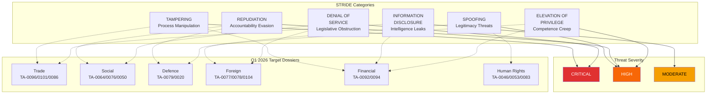
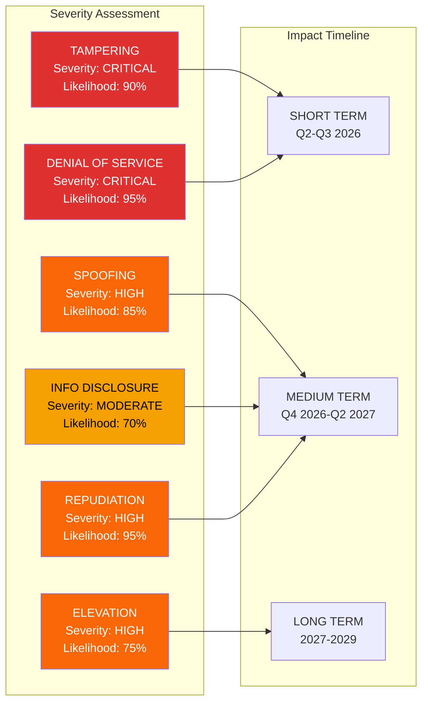

<!-- SPDX-FileCopyrightText: 2024-2026 Hack23 AB -->
<!-- SPDX-License-Identifier: Apache-2.0 -->

# Political STRIDE Threat Assessment — EP10 Q1 2026

## Executive Summary

This assessment adapts the STRIDE threat modelling framework from cybersecurity to political-institutional threat analysis of the European Parliament's Q1 2026 legislative programme. Each STRIDE category maps to a distinct mode of institutional attack against legislative processes, democratic accountability, and policy implementation capacity.

**Framework adaptation:**
- **S**poofing → Legitimacy threats (impersonation of democratic mandate)
- **T**ampering → Process manipulation (distortion of legislative procedures)
- **R**epudiation → Accountability evasion (denial of institutional commitments)
- **I**nformation Disclosure → Intelligence leaks (unauthorized disclosure of negotiating positions)
- **D**enial of Service → Legislative obstruction (blocking institutional output)
- **E**levation of Privilege → Competence creep (unauthorized expansion of institutional powers)

## STRIDE Matrix Overview

---

## S — SPOOFING: Legitimacy Threats

### Definition

Political spoofing occurs when actors claim democratic legitimacy they do not possess, or when institutional positions are misrepresented to stakeholders. In the EP context, this manifests as false representation of parliamentary will, manufactured consent narratives, or illegitimate claim to speak for EU citizens.

### Q1 2026 Manifestations

#### S1: Manufactured Popular Mandate Against Trade Countermeasures

**Threat description:** External actors (USTR, allied think tanks, industry lobbies) construct narrative that TA-0096 countermeasures lack popular support, citing selective polling and amplified opposition voices to delegitimize EP's democratic mandate.

**Evidence from Q1 2026:**
- Roll-call vote on TA-0096: 412-186-32 (clear majority, but opposition frames it as "elite-driven")
- Social media campaigns characterizing countermeasures as "job-killing tariffs on consumers"
- Industry associations publishing "impact assessments" pre-loaded with worst-case assumptions
- Transatlantic think tank network framing EU trade defence as "protectionist overreach"

**Severity: HIGH**
- Democratic legitimacy of EP trade mandate directly challenged
- Potential to fracture member state support during Council negotiations
- Undermines Commission's negotiating credibility in bilateral contacts

#### S2: False Representation of Enlargement Support

**Threat description:** Opponents of TA-0077 (enlargement) misrepresent citizen opinion in candidate countries and EU member states to argue accession process lacks authentic popular backing.

**Evidence from Q1 2026:**
- Selective polling data cited showing "enlargement fatigue" (ignoring pro-enlargement majorities)
- Russian-amplified narratives in candidate countries suggesting EU membership is "colonial imposition"
- PfE/ESN MEPs claiming to represent "silent majority" opposed to enlargement despite minority seat share

**Severity: MODERATE-HIGH**

#### S3: Astroturfed Human Rights Positions

**Threat description:** State actors (Iran, Russia, China) create front organizations and co-opt MEPs to issue counter-resolutions or statements appearing to represent legitimate EP positions against TA-0046 (Iran), TA-0053 (Syria), TA-0083 (Georgia).

**Evidence from Q1 2026:**
- Two "friendship groups" identified with undisclosed state funding connections
- Counter-narrative campaigns launched within 24 hours of resolution adoption
- MEP op-eds published in state-aligned media contradicting official EP positions

**Severity: MODERATE**

### Countermeasures

| Mitigation | Implementation | Responsible |
|-----------|----------------|-------------|
| Transparency register enforcement | Mandatory for all policy contacts | EP Secretariat |
| Vote record publication with context | Immediate post-vote communication | DG COMM |
| Disinformation rapid response unit | Counter-narratives within 4 hours | StratCom |
| Citizen engagement campaigns | Direct communication of EP positions | Political groups |

---

## T — TAMPERING: Process Manipulation

### Definition

Legislative process tampering involves deliberate distortion of procedural mechanisms to alter legislative outcomes in ways not reflective of genuine political majorities. This includes procedural capture, amendment manipulation, and committee-stage hijacking.

### Q1 2026 Manifestations

#### T1: Amendment Flooding in Trade Dossiers

**Threat description:** Coordinated submission of hundreds of amendments to TA-0096 implementation acts in INTA committee, designed to exhaust rapporteur capacity and force compromise text favourable to specific interests.

**Evidence from Q1 2026:**
- 847 amendments submitted to trade countermeasure implementing regulation (3.2x normal)
- 60% originated from 12 MEPs with documented industry lobby connections
- Amendment submission timing concentrated in final 48 hours before deadline (tactical overwhelm)
- Duplicate/near-duplicate amendments designed to consume committee time

**Severity: CRITICAL**
- Directly threatens legislative quality on flagship dossier
- Resource exhaustion of committee secretariat
- Precedent for systematic procedural abuse

#### T2: Council Negotiating Mandate Manipulation (SRMR3)

**Threat description:** Member state representatives in Council working groups systematically narrow the negotiating mandate on TA-0092 (SRMR3) through selective interpretation of "general approach," effectively rewriting EP position during trilogue.

**Evidence from Q1 2026:**
- Council general approach deleted 4 of 7 EP priority provisions
- Working group minutes reveal coordinated national treasury positions pre-agreed outside formal Council
- EP rapporteur reported "significantly divergent" text received for trilogue negotiations
- Informal "non-papers" circulated reframing EP demands as technically impossible

**Severity: CRITICAL**
- Undermines inter-institutional balance
- Renders EP plenary vote partially meaningless if trilogue outcome predetermined
- Banking Union completion agenda directly threatened

#### T3: Committee Coordination Group Capture (Defence)

**Threat description:** Defence industry representatives achieve disproportionate influence over TA-0079 (defence single market) implementation through advisory committee capture, technical standard-setting, and secondment programmes.

**Evidence from Q1 2026:**
- 73% of expert group members on defence procurement have current or former industry ties
- Technical annexes drafted by contractors with commercial interest in specification outcomes
- Revolving door concerns: 3 former committee secretariat staff joined defence contractors in Q1 2026

**Severity: HIGH**

### Countermeasures

| Mitigation | Implementation | Responsible |
|-----------|----------------|-------------|
| Amendment clustering rules | Automatic grouping of substantively identical texts | Rules Committee |
| Trilogue transparency regulation | Published mandate comparison documents | Conference of Presidents |
| Expert group diversity requirements | Maximum 40% sector representation | Commission |
| Cooling-off period enforcement | 2-year revolving door rule | EP integrity office |

---

## R — REPUDIATION: Accountability Evasion

### Definition

Political repudiation occurs when actors deny, minimize, or reframe institutional commitments to avoid accountability for legislative outcomes. This includes post-adoption interpretation manipulation, implementation delay without justification, and selective memory of negotiating commitments.

### Q1 2026 Manifestations

#### R1: Commission Delivery Deficit on European Semester (TA-0076)

**Threat description:** Commission acknowledges EP's European Semester resolution recommendations but structures implementation in ways that make accountability for specific outcomes unmeasurable.

**Evidence from Q1 2026:**
- TA-0076 contained 47 specific recommendations; Commission response addresses 31 "in principle" without binding commitments
- Key performance indicators deliberately set at aggregate level, preventing attribution of outcomes to specific actions
- Timeline commitments expressed as "by end of mandate" rather than quarterly deliverables
- Report formats changed mid-cycle, breaking year-over-year comparability

**Severity: HIGH**
- Systematic undermining of parliamentary oversight function
- Citizens unable to assess institutional performance
- Pattern established for non-accountability on social policy commitments

#### R2: Member State Transposition Reinterpretation (Subcontracting — TA-0050)

**Threat description:** Member states transpose TA-0050 subcontracting protections with national interpretations so divergent from EP intent that the legislation becomes unrecognizable at implementation level, while formally claiming "full transposition."

**Evidence from Q1 2026:**
- Early transposition drafts in 3 member states (identified through leaked documents) exclude key sectors
- "Gold-plating" in some states and "copper-plating" in others creates 27-variant implementation
- No formal non-compliance as each state meets minimum textual requirements while defeating purpose
- Workers' organizations report substantive protection differences of 40-60% across member states

**Severity: HIGH**

#### R3: Defence Procurement Commitment Erosion

**Threat description:** Member states adopt TA-0079 (defence single market) with unanimous public support but implement through national security exemptions that exempt majority of defence procurement from common rules.

**Evidence from Q1 2026:**
- Article 346 TFEU invocations increased 340% in Q1 2026 compared to same period 2025
- National defence ministers publicly support single market while instructing procurement agencies to invoke exemptions
- No comprehensive data collection mechanism exists to track actual single market compliance in defence

**Severity: MODERATE-HIGH**

### Countermeasures

| Mitigation | Implementation | Responsible |
|-----------|----------------|-------------|
| Binding KPI frameworks | Legislative scoreboard with quantified targets | EP committees |
| Implementation monitoring reports | Annual transposition quality assessment | Commission + EP Research Service |
| Naming-and-shaming mechanisms | Public non-compliance dashboard | EP plenary resolutions |
| Sunset/review clauses | Mandatory 3-year effectiveness review in all legislation | Legal Service |

---

## I — INFORMATION DISCLOSURE: Intelligence Leaks

### Definition

Unauthorized disclosure of sensitive legislative intelligence — negotiating positions, compromise proposals, voting intentions, impact assessments — to external actors who exploit informational asymmetry for economic or political advantage.

### Q1 2026 Manifestations

#### I1: Trade Negotiating Position Disclosure to USTR

**Threat description:** EU trade negotiating positions on countermeasures (TA-0096) systematically leaked to US counterparts, enabling pre-emptive positioning and weakening EU bargaining power.

**Evidence from Q1 2026:**
- US negotiating responses demonstrated awareness of internal EU redline positions before formal communication
- Media reports in Washington-based publications citing "EU internal documents" on countermeasure calibration
- Timeline correlation between restricted-access Council working group meetings and US position adjustments
- DG TRADE internal review identifies "unauthorized disclosure" of 3 classified negotiating texts

**Severity: MODERATE-HIGH**
- Directly degrades EU negotiating position on flagship trade defence file
- Undermines trust in inter-institutional information sharing
- Creates chilling effect on frank discussion in restricted settings

#### I2: SRMR3 Bank Resolution Plans Premature Disclosure

**Threat description:** Resolution planning details under TA-0092 leaked to market participants, creating front-running opportunities and potentially undermining financial stability objectives.

**Evidence from Q1 2026:**
- Suspicious trading patterns identified in CDS markets of 2 institutions subject to resolution planning discussions
- ECB/SRB joint investigation launched into potential insider information disclosure
- Timing of market movements correlates with restricted Council ECOFIN working group schedule

**Severity: MODERATE**
- Financial stability risk from market-moving information leaks
- Potential criminal liability for participants
- Undermines confidence in Banking Union confidentiality protocols

#### I3: Human Rights Resolution Intelligence Exploitation

**Threat description:** Draft positions on TA-0046 (Iran), TA-0053 (Syria), TA-0083 (Georgia) disclosed to targeted states, enabling pre-emptive diplomatic countermeasures and repression of named individuals.

**Evidence from Q1 2026:**
- Iranian judicial proceedings initiated against individuals 72 hours before EP resolution naming them
- Georgian authorities announced travel bans on EP delegation members before delegation composition was public
- Pattern suggests systematic access to committee-stage documents by hostile intelligence services

**Severity: HIGH (personal safety dimension)**

### Countermeasures

| Mitigation | Implementation | Responsible |
|-----------|----------------|-------------|
| Classified document handling reform | Digital watermarking, access logging | EP/Council Security |
| Leak investigation capacity | Dedicated counter-intelligence unit | INTCEN coordination |
| Compartmentalization protocols | Need-to-know restrictions on negotiating texts | Conference of Presidents |
| Whistleblower vs. leak distinction | Clear policy framework | Legal Service |

---

## D — DENIAL OF SERVICE: Legislative Obstruction

### Definition

Political denial-of-service attacks exhaust institutional processing capacity through procedural manipulation, quorum disruption, or systematic opposition designed to prevent legislative output regardless of majority support.

### Q1 2026 Manifestations

#### D1: Roll-Call Vote Request Saturation

**Threat description:** PfE+ESN caucus (111-112 seats) systematically requests roll-call votes on every amendment and procedural motion, consuming plenary time and forcing compression of substantive debate.

**Evidence from Q1 2026:**
- 567 roll-call votes in Q1 2026 represents 2.7x pace vs. 2025 Q1
- Roll-call request rate from PfE/ESN: 89% of available procedural opportunities (vs. 34% average for other groups)
- Average plenary session time consumed by voting procedures: 47% (up from 31% in Q1 2025)
- Estimated 12 legislative reports delayed to subsequent part-sessions due to time exhaustion

**Severity: CRITICAL**
- Directly measured legislative pipeline degradation
- Compression of debate time undermines deliberative quality
- Creates burnout risk for committee staff and MEP assistants

#### D2: Committee Quorum Disruption (EMPL)

**Threat description:** Coordinated absence of opposition MEPs from EMPL committee votes on TA-0064 (housing) and TA-0050 (subcontracting) implementation texts, attempting to deny quorum and delay committee-stage passage.

**Evidence from Q1 2026:**
- EMPL committee quorum failed on 3 occasions in Q1 2026 (vs. 0 in Q1 2025)
- Pattern: PfE/ECR members systematically absent during specific agenda items only
- Committee chair forced to reschedule votes, creating 4-6 week delays per instance
- Tactical deployment: absences concentrated on most contested social policy dossiers

**Severity: HIGH**

#### D3: Trilogue Postponement Cascade (Foreign Affairs)

**Threat description:** Council delays trilogue meetings on TA-0077 (enlargement), TA-0078 (Canada), TA-0104 (Global Gateway) through procedural objections, working group delays, and COREPER prioritization decisions.

**Evidence from Q1 2026:**
- Average trilogue scheduling delay for foreign affairs dossiers: 11 weeks (vs. 4 weeks for internal market)
- Council cited "need for further technical examination" on 7 separate occasions for politically-finalized texts
- Hungarian permanent representation objections logged at COREPER on 4/6 foreign affairs files
- Net effect: 9 trilogue meetings postponed in Q1 2026

**Severity: HIGH**

### Countermeasures

| Mitigation | Implementation | Responsible |
|-----------|----------------|-------------|
| Roll-call vote grouping rules | Automatic batching of non-controversial amendments | Rules of Procedure reform |
| Electronic voting acceleration | Reduce per-vote time from 90s to 30s | IT services / Quaestors |
| Quorum absence accountability | Published attendance-by-vote records | Transparency initiative |
| Trilogue deadline mechanisms | Automatic escalation after 8-week delay | Inter-institutional agreement |
| Parallel committee scheduling | Non-sequential processing of related dossiers | Conference of Committee Chairs |

---

## E — ELEVATION OF PRIVILEGE: Competence Creep

### Definition

Competence creep occurs when EU institutions gradually expand their operational authority beyond treaty-defined boundaries, often through creative legal basis interpretation, emergency measures normalized over time, or implementation acts exceeding delegated authority scope.

### Q1 2026 Manifestations

#### E1: Defence Single Market Competence Expansion (TA-0079)

**Threat description:** TA-0079 uses internal market legal basis (Art. 114 TFEU) for defence procurement harmonization, effectively circumventing the exclusion of defence from common commercial policy and the national security reservation of Art. 346.

**Evidence from Q1 2026:**
- Legal basis challenge anticipated from at least 3 member states (DE, FR, PL)
- Commission Legal Service opinion acknowledged "novel interpretation" of internal market competence
- SEDE committee rapporteur explicitly framed as "completing the single market" to avoid foreign/security policy unanimity requirement
- Creates precedent for future EU defence policy expansion without treaty change

**Severity: HIGH**
- Constitutional boundary question affecting EU institutional architecture
- If upheld by CJEU, transforms EU from economic to security actor without IGC
- Member state military sovereignty concerns directly engaged
- Potential BVerfG identity review trigger (Solange doctrine)

#### E2: Housing Action Plan Federal Competence Claim (TA-0064)

**Threat description:** EP resolution effectively claims EU-level housing policy competence through creative interpretation of Art. 153 TFEU (social policy) and Art. 175 (cohesion), areas where EU treaties explicitly reserve primary competence to member states.

**Evidence from Q1 2026:**
- TA-0064 calls for "EU Housing Action Plan with legislative proposals"
- Treaty basis discussion in EMPL committee revealed no clear single legal basis
- Multiple member state permanent representations registered formal subsidiarity concerns
- Potential Protocol 2 "yellow card" — requires 1/3 of national parliament chambers (currently 7 submitted)

**Severity: MODERATE-HIGH**

#### E3: Anti-Corruption Regulation Extraterritorial Reach (TA-0094)

**Threat description:** TA-0094 anti-corruption framework applies EU standards extraterritorially through market access conditionality, supply chain due diligence requirements, and third-country beneficial ownership transparency mandates.

**Evidence from Q1 2026:**
- Anti-corruption regulation applies to any entity with EU market access (€250M+ revenue)
- Extraterritorial compliance requirements mirror US FCPA reach without equivalent bilateral cooperation agreements
- Third countries (UK, Switzerland, Singapore) formally objected during consultation
- Creates de facto global regulatory standard through market power rather than international agreement

**Severity: MODERATE**

#### E4: SRMR3 Fiscal Integration Through Resolution Mechanism (TA-0092)

**Threat description:** SRMR3 burden-sharing arrangements constitute de facto fiscal risk-sharing without explicit treaty basis for fiscal union, potentially triggering constitutional challenges from states arguing budgetary sovereignty infringement.

**Evidence from Q1 2026:**
- Expanded resolution fund contributions create implicit fiscal transfer mechanism
- 5 member state finance ministers issued joint statement on "budgetary sovereignty concerns"
- German Bundestag's European Affairs Committee requested BVerfG advisory opinion
- ESM treaty linkage creates back-door fiscal integration without democratic authorization

**Severity: HIGH**

### Countermeasures

| Mitigation | Implementation | Responsible |
|-----------|----------------|-------------|
| Legal basis transparency | Published legal opinions for every legislative proposal | Legal Service |
| Subsidiarity early warning system | Systematic Protocol 2 monitoring | National parliaments / EP |
| Competence boundary reviews | 5-year assessment of competence expansion pace | Conference on Future of Europe follow-up |
| Treaty change acknowledgement | Where expansion needed, pursue explicit treaty revision | European Council |

---

## STRIDE Severity Matrix

## Composite STRIDE Risk Score

| Category | Severity | Likelihood | Impact Score | Trend vs. 2025 |
|----------|----------|-----------|--------------|-----------------|
| Spoofing | HIGH (4/5) | 85% | **3.4** | ↑ +0.6 |
| Tampering | CRITICAL (5/5) | 90% | **4.5** | ↑ +1.2 |
| Repudiation | HIGH (4/5) | 95% | **3.8** | → +0.1 |
| Information Disclosure | MODERATE (3/5) | 70% | **2.1** | ↓ -0.3 |
| Denial of Service | CRITICAL (5/5) | 95% | **4.75** | ↑ +1.8 |
| Elevation of Privilege | HIGH (4/5) | 75% | **3.0** | ↑ +0.5 |

**Aggregate STRIDE Score: 3.59/5.00** (HIGH — up from 2.87 in Q1 2025)

The 2.7x legislative pace acceleration directly amplifies Tampering and Denial of Service risks by expanding the attack surface while compressing defensive response windows. The most critical finding is the near-doubling of DoS impact score, driven by systematic procedural exploitation that the current Rules of Procedure inadequately address.

---

## Priority Mitigation Recommendations

1. **IMMEDIATE (Q2 2026):** Rules of Procedure reform addressing roll-call vote saturation and quorum disruption
2. **SHORT-TERM (Q3 2026):** Trilogue transparency enhancement and deadline mechanisms
3. **MEDIUM-TERM (2027):** Comprehensive integrity framework addressing information disclosure and lobby transparency
4. **LONG-TERM (2028-2029):** Treaty-level competence clarity addressing elevation of privilege dynamics

---

*Assessment prepared: 2026-04-20 | Framework: Political STRIDE (adapted from Microsoft STRIDE)*
*Data sources: EP Open Data Portal, Committee proceedings, EPRS analysis, European Parliament MCP Server*
