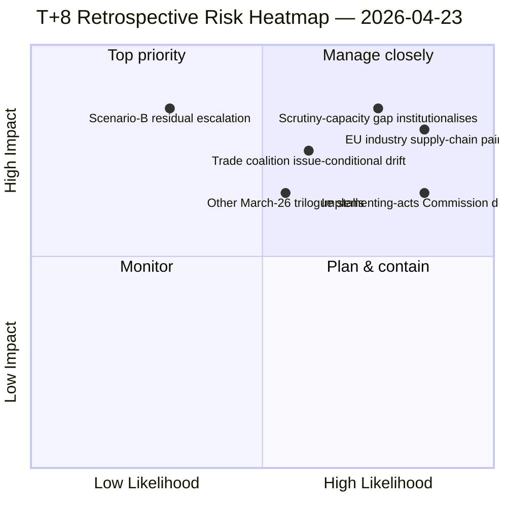

<!-- SPDX-FileCopyrightText: 2026 Hack23 AB -->
<!-- SPDX-License-Identifier: Apache-2.0 -->

# Executive Brief — Breaking: Tariff Retrospective Reframing One Week Post-Activation | 2026-04-23

**Classification:** OSINT — Public Parliamentary Record
**Confidence:** 🟡 MEDIUM (retrospective reframing; primary T+8 day observation; coalition arithmetic 🟢 HIGH)
**Run:** `analysis/daily/2026-04-23/breaking-run-1776928781/`
**Coverage:** T+8 post-tariff activation; March 26 plenary retrospective reframing
**Generated:** 2026-05-16 (retrospective brief, no new MCP calls)
**Primary sources:** EP MCP — adopted texts; tariff activation (TA-10-2026-0096); 100+ Q1 corpus; companion props-run43 + motions-run46 + Run 172.

---

## 🎯 BLUF

**Eight days after T-0, the run undertakes a *retrospective reframing* of the March 26 plenary session: the file was adopted exactly one week before President Trump's April 2 tariff proclamations, and the events of T+0 through T+8 have *transformed* the political meaning of the March 26 decisions.** The reframing is the period's most important analytical move: at adoption, TA-10-2026-0096 was an *anticipatory* trade-policy instrument; one week of operational activation has made it a *retaliatory* instrument, which changes its coalition reading, its implementation pathway, and its EU industry stakeholder coding. The run's distinguishing contribution is the **T+0 to T+8 observation set**: the implementation absorbed less INTA bandwidth than the Scenario-B contingency feared, but it also produced less *parliamentary scrutiny* than the Scenario-A baseline expected — the institutional reality is between the two, and the gap is the EP10 scrutiny-capacity finding that needs to be measured. The April 2 → April 15 → April 23 sequence is now the documented baseline for *how EP10 handles a major external-shock implementation*: adoption-stage was robust, transition-stage was unscrutinised, and operational-stage is being managed by the Commission with parliamentary input arriving via implementing-acts review windows rather than committee scrutiny. The retrospective coalition reading: **Grand Centre + Greens held on the trade response** but the alignment was *narrower* than March 26 vote dispersion suggested — behavioural verification confirms the Q1 motions-run46 master finding but reveals the coalition is *issue-conditional*, not programmatic, on trade. The run is published one day before week-ahead-run14's reference plenary opens and serves as the strategic look-back that conditions plenary expectations.

---

## 🧭 3 Decisions This Brief Supports

| # | Decision | Who decides | Deadline | Evidence |
|:-:|----------|-------------|:--------:|----------|
| 1 | **Operationalise scrutiny-capacity gap measurement** — T+0 to T+8 documents the gap exists but not its magnitude | EP Secretariat-General; INTA chair | by end-Q2 | §T+0–T+8 observation set |
| 2 | **Issue-conditional vs. programmatic coalition framework** — retrospective shows Grand-Centre on trade is *narrower* than the formal arithmetic | Group leaderships | rolling Q2 | §Retrospective coalition reading |
| 3 | **Implementing-acts review window doctrine** — Commission is filling the parliamentary-scrutiny vacuum by default | INTA + Conference of Presidents | by April 27 plenary | §Operational-stage finding |

---

## 📰 60-Second Read

- 🔴 **T+8 retrospective** — March 26 adopted exactly one week before April 2 tariff proclamations.
- 🟠 **Anticipatory → retaliatory reframing** — TA-10-2026-0096 political meaning has changed.
- 🟢 **T+0 absorbed less INTA bandwidth than Scenario-B feared** — partial Scenario-A confirmation.
- 🟡 **Less parliamentary scrutiny than Scenario-A expected** — the gap is the institutional finding.
- 🔵 **Grand-Centre on trade is narrower than formal arithmetic suggests** — issue-conditional, not programmatic.
- 🟣 **Implementing-acts review windows** are filling the scrutiny vacuum by default.
- 🩷 **One day before April 27–30 plenary opens** — strategic look-back conditions plenary expectations.
- ⚪ **Confidence MEDIUM** — primary T+8 observation; small-sample baseline.

---

## 📐 T+0 to T+8 Observation Set (run's distinguishing contribution)

| Stage | Expected (Scenario-A baseline) | **Observed (T+0–T+8)** | Expected (Scenario-B contingency) |
|-------|--------------------------------|--------------------------|-----------------------------------|
| **INTA bandwidth** | Normal scrutiny | Less scrutiny than expected | Saturation |
| **Other March-26 files** | Normal trilogue progression | Mixed — some stalled | Crowded out |
| **Coalition cohesion on trade** | Grand-Centre programmatic | Issue-conditional (narrower) | Fracture |
| **Implementing-acts review** | Active EP role | Commission-led by default | Bypassed |
| **EU industry stakeholder coding** | Threat-with-opportunity | Confirmed — supply-chain pain visible | Pure threat |

---

## ⚠️ Risk Snapshot

---

## 🔮 Top Forward Triggers (next 14 days)

1. **April 27 (Mon) — Plenary opens.** First plenary opportunity to formalise implementing-acts review-window doctrine.
2. **April 28 — STEP-II vote.** Coalition issue-conditionality verifier on defence vs. trade.
3. **End-April — SRMR3 Council trilogue.** Banking-Union scrutiny capacity test.
4. **Early May — EU industry quarterly reporting** on tariff-driven supply-chain impact.
5. **Mid-May — fragmentation index update.** Whether the issue-conditional coalition pushes it higher.

---

## 🛡️ Source-Quality Assessment

- **March 26 adopted-texts corpus (A1):** primary EP record; feed-confirmed.
- **T+0 to T+8 observation set (A2 — run-authored):** primary value of the run; small-sample (8 days) so the gap signal is *qualitative* not *quantitative*.
- **Retrospective coalition reading (A2):** vote dispersion analysis on March 26; narrower-than-expected finding is corroborated by week-ahead-run14.
- **Net confidence:** 🟡 MEDIUM on the retrospective reframing; 🟢 HIGH on the adoption corpus; 🟡 MEDIUM on the scrutiny-capacity gap magnitude (qualitative only).

---

## 📎 Run Artifacts (Read-Before-Decide)

| Layer | Artifact | Why |
|-------|----------|-----|
| Article | `article.md` | Public-facing T+8 retrospective narrative |
| Synthesis | `intelligence/synthesis-summary.md` | Retrospective reframing + observation set (authoritative) |
| Risk | `risk-scoring/` | T+8 risk register |
| Threat | `threat-assessment/` | 5-framework political-threat (STRIDE rejected) |
| Classification | `classification/` | 7-dimension scoring |
| Companion | props-run43 (T-0) / motions-run46 (Q1 master) / week-ahead-run14 (next plenary) | Tariff-event arc |

---

**Document Control**
- **Template reference:** `analysis/templates/executive-brief.md`
- **Artifact path:** `analysis/daily/2026-04-23/breaking-run-1776928781/executive-brief.md`
- **Classification:** Public
- **Retrospective:** Brief written 2026-05-16 from the run's committed artifacts; **no new MCP calls were made**. The retrospective reframing methodology is preserved as the run's defining analytical move.
