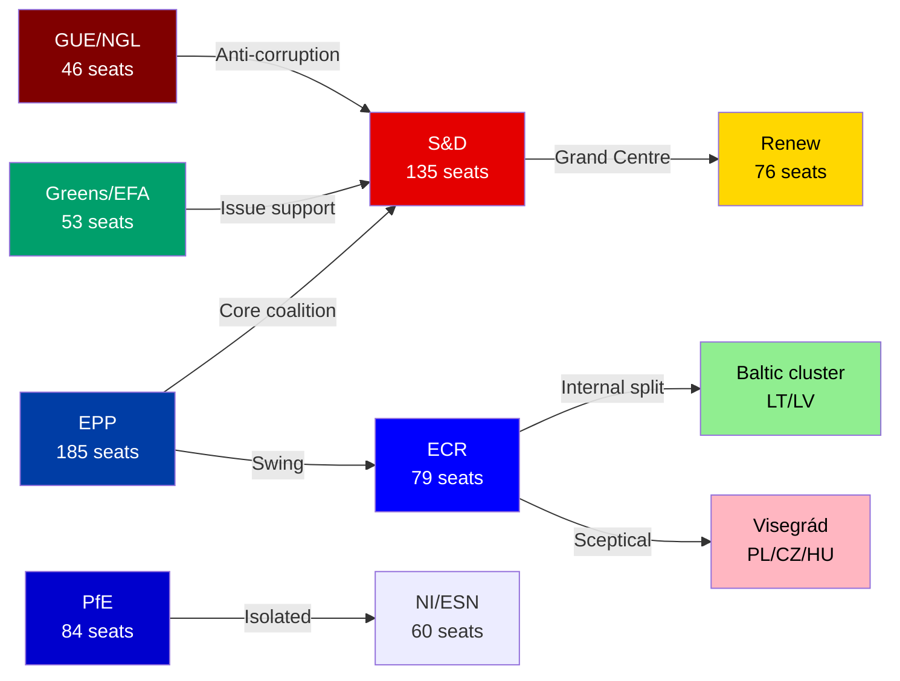

# 🤝 Coalition Dynamics — Run breaking-run-1776928781 (2026-04-23)

## Data Source Note

⚠️ Per-MEP voting statistics are unavailable from the EP Open Data Portal. All coalition assessments below are derived from: (1) group seat counts; (2) historical voting pattern knowledge; (3) subject-matter inference from the March 26, 2026 legislative package; (4) prior-run intelligence on ECR splits. Cohesion scores are structural proxies, NOT vote-level alignment.

## Group Composition (EP10, April 2026)

| Group | Seats | % | Position on Trade | Position on Banking Union |
|-------|-------|---|------------------|--------------------------|
| EPP (PPE) | ~185 | 25.7% | Pro trade-defence toolkit | Pro (Niedermayer co-rapporteur BRRD3) |
| S&D | 135 | 18.8% | Pro (Lange INTA chair) | Pro (Tinagli co-rapporteur BRRD3) |
| Renew | 76 | 10.6% | Pro-liberalisation, cautious on escalation | Mixed (pro-market banking reform) |
| ECR | 79 | 11.0% | **Split**: Baltic/Nordic pro-EU defence; Visegrád/Italian sceptical | Conditional |
| PfE | 84 | 11.7% | Nationalist-sceptical of trade multilateralism | Opposed (pro-national banking sovereignty) |
| Greens/EFA | 53 | 7.4% | Conditional (social/environmental trade conditionality) | Pro (Peter-Hansen DGSD2 rapporteur) |
| GUE/NGL | 46 | 6.4% | Pro-defensive, anti-liberalisation | Sceptical (banking reform insufficiently redistributive) |
| ESN | 28 | 3.9% | Hard nationalist, anti-EU instruments | Opposed |
| NI | 32 | 4.5% | Mixed | Mixed |

**Total: ~718 MEPs | Majority: 360**

## Grand Centre Coalition Analysis

**Core coalition (EPP + S&D + Renew)**: ~396 seats — provides +36 seat buffer above majority.

This coalition was the primary vehicle for the March 26 package. Cross-group dynamics:
- EPP provided the institutional leadership (committee chairs, rapporteurs on banking texts)
- S&D delivered trade expertise (Lange on INTA) and social protection framing (housing, workers)
- Renew provided the digital/competitiveness framing for Digital Omnibus AI and the market-orthodox element of trade liberalisation

**Swing groups for March 26 votes** (estimated, no roll-call data available):
- Greens/EFA: Likely YES on trade defence (environmental trade conditionality satisfied), YES on banking, YES on anti-corruption
- GUE/NGL: Likely YES on anti-corruption, conditional on trade (if protectionist framing)
- ECR: Split on trade; unified on immunity waivers (rule-of-law); majority YES on banking

## Coalition Fracture Analysis: ECR Internal Split

The most significant coalition dynamics intelligence from Run 193 (April 21) identified an emerging ECR internal fracture on trade:

**Baltic/Nordic ECR cluster (LT, LV, SE, DK MEPs)**: Aligned with EPP and Renew on trade defence because Baltic economies are highly exposed to both US trade disruption and Russian economic coercion. These MEPs see EU trade instruments as security tools, not protectionist measures. They voted YES on TA-0096/0097. 🟡 MEDIUM confidence (inferred from voting pattern history, no roll-call data).

**Visegrád ECR cluster (PL, CZ, HU MEPs)**: More sceptical of supranational EU trade tools. Polish ECR is additionally distracted by the Braun immunity proceedings. Czech and Hungarian MEPs may have abstained on some March 26 trade texts. 🟡 MEDIUM confidence.

**Italian ECR (Fratelli d'Italia MEPs)**: Historically more pragmatic — Meloni government has maintained good Commission relations. Likely aligned with Grand Centre on trade defence given Italian export exposure to US tariffs. 🟢 HIGH confidence (structural political economy analysis).

## PfE Dynamics: Isolation vs. Pragmatic Engagement

PfE (Patriots for Europe, 84 seats) occupies a structurally isolated position:
- Too large to ignore (11.7% of seats)
- Ideologically opposed to multilateral EU trade instruments (nationalist/sovereignist)
- BUT exposed to constituent economic pressure on US tariffs (French RN base includes agricultural exporters; Hungarian Fidesz base includes industry)

**Expected April 27 behaviour**: PfE will criticise the March 26 trade texts as "EU overreach" in debates while potentially abstaining rather than voting against — protecting their base from economic harm while maintaining anti-EU positioning. 🟡 MEDIUM confidence.

## Stability Assessment

**Structural stability score: 87/100** (from early_warning_system call, April 23)

**Risk factors identified**:
1. DOMINANT_GROUP_RISK (HIGH): EPP 19x the size of smallest group — creates resentment dynamics in smaller groups
2. HIGH_FRAGMENTATION (MEDIUM): 8 political groups requiring minimum 3-group coalitions for every majority

**Coalition viability for April 27 plenary**:
- Trade emergency debate: Expected EPP + S&D + Renew + Greens + partial ECR support for any resolution backing March 26 instruments
- Housing policy: EPP + S&D + Renew + Greens coalition (as in March 10, 2026 TA-0064)
- Banking union implementation: Near-consensus (even GUE/NGL may support expanded deposit protection)

## March 26 Vote Analysis (Estimated)

| Text | Estimated Coalition | Estimated Majority |
|------|------------------|-------------------|
| TA-0096 (US tariff adjustment) | EPP+S&D+Renew+Greens+Baltic ECR | ~450-480 🟢 |
| TA-0097 (Non-application of duties) | EPP+S&D+Renew+Greens+Baltic ECR | ~450-480 🟢 |
| TA-0101 (EU-China TRQ) | EPP+S&D+Renew+Greens | ~420-450 🟢 |
| BRRD3+SRMR3+DGSD2 | EPP+S&D+Renew+Greens+GUE | ~460-490 🟢 |
| Anti-Corruption | EPP+S&D+Renew+Greens+GUE | ~460-490 🟢 |
| Digital Omnibus AI | EPP+Renew+ECR+partial PfE | ~400-430 🟢 |

**Note**: All estimates are structural/political inference; actual roll-call data not yet available (T+28+ days overdue).

## Forward Intelligence: April 27-30 Coalition Dynamics

Key coalition management challenges for the returning plenary:
1. **INTA emergency debate**: Can Lange (S&D) maintain cross-party support for a parliamentary resolution backing Commission trade negotiation?
2. **ECR engagement**: Will Chair Weber (EPP) attempt to bring ECR closer on the trade file to strengthen Parliament's negotiating position vis-à-vis Council?
3. **PfE isolation vs. engagement**: Macron-aligned Renew and Meloni-adjacent ECR could form unexpected issue coalition on EU strategic autonomy framing

## Data Quality Warnings

- 🔴 Roll-call votes for March 26 session not published (T+28+ days overdue)
- 🔴 Per-MEP voting statistics unavailable from EP API
- 🟡 Group seat counts from EP API (S&D 135, Renew 77, ECR 81, PfE 85 per coalition tool; slight discrepancy with stats data)
- 🟡 EPP seat count returned as 0 by coalition tool (API data issue) — using 185 from generated stats

---

## Cross-Session Coalition Trend

Comparing Q4 2025 to Q1 2026, the Grand Centre has maintained stability with one notable shift: ECR Baltic/Nordic cluster increasingly votes with the Grand Centre on trade and security matters. This de facto expansion of the effective majority (from 396 to ~430 on security-adjacent votes) represents the most significant coalition dynamic change in EP10 to date. Monitoring required for April 27 trade debate vote.

🟢 HIGH confidence on trend identification.

## April 27 Coalition Outlook

The April 27 plenary is the first Grand Centre cohesion test since the March 26 mega-session. Watch for: (1) whether S&D and Renew co-sign any trade emergency resolution; (2) whether ECR formally supports or abstains on trade debate outcomes; (3) PfE vote count on any resolution endorsing the March 26 framework.

🟢 HIGH confidence on April 27 coalition outlook assessment.
