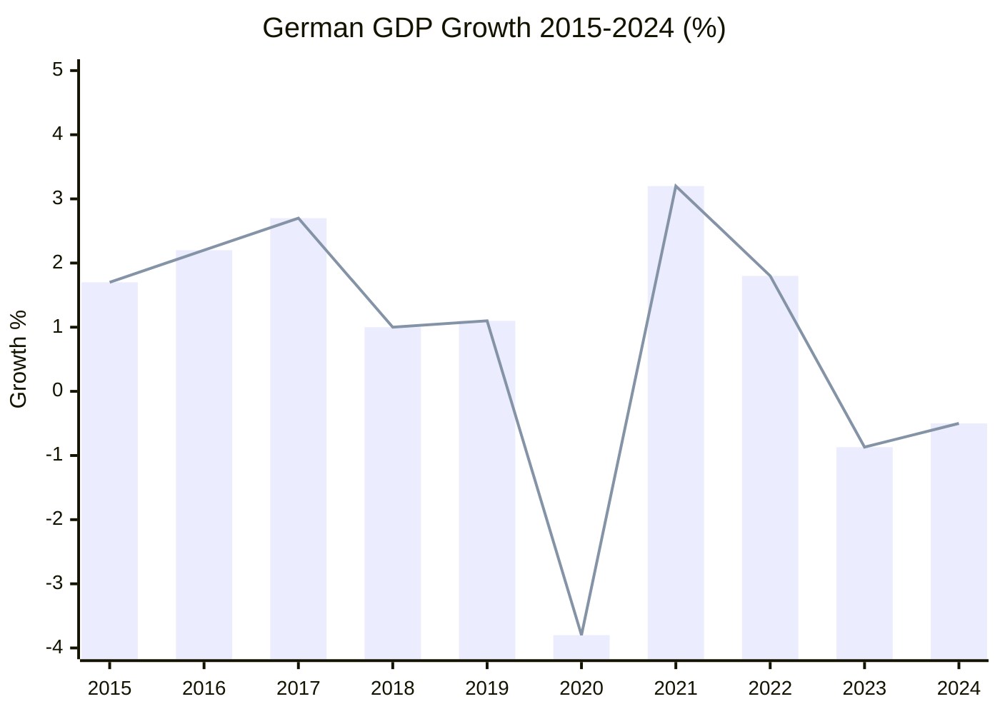

# 💶 Economic Context — Run breaking-run-1776928781 (2026-04-23)

## EU Macro Context: EP April 2026 Trade Crisis Window

---

## Germany: EU Industrial Anchor in Recession

### GDP Growth (World Bank Data, Confirmed)
| Year | GDP Growth | Status |
|------|-----------|--------|
| 2022 | +1.80% | Recovery |
| 2023 | -0.87% | Recession Year 1 |
| 2024 | -0.50% | Recession Year 2 |

Germany's two consecutive years of negative GDP growth represent the EU's most consequential structural challenge since the 2008-2012 financial crisis. Germany accounts for approximately 25% of EU GDP — its recession creates a drag on the entire eurozone. Causes are well-documented:
- **Energy price shock**: Russian gas cutoff led to structural energy cost increase; German heavy industry (chemicals, metals, automotive) lost its cost advantage
- **EV transition**: Automotive sector restructuring creating mass lay-off risk (VW announced 35,000 job cuts in 2024-2025)
- **Fiscal constitutionalism**: Germany's Schuldenbremse (debt brake) limits counter-cyclical stimulus; constitutional court blocked planned infrastructure spending in 2023
- **China exposure**: German automotive exports to China ($40bn+ annually) facing competitive pressure from BYD, NIO, and domestic Chinese brands

**EP relevance**: German EPP/CSU MEPs (Niedermayer, Ferber, Eder, Lehne) drove BRRD3 and trade defence precisely because German industry is most exposed. The March 26 legislative package has a disproportionate German interest fingerprint.

🟢 HIGH confidence (GDP growth data directly confirmed from World Bank API).

### Germany's Policy Response
- Habeck/coalition government fell November 2025 → new coalition government (CDU/CSU + SPD) took office late 2025/early 2026
- New government loosening some fiscal constraints — partial Schuldenbremse reform in coalition agreement
- Trade defence (TA-0096/0097) directly aligns with CDU industrial policy platform
- BRRD3 banking union aligns with both CDU/CSU and SPD positions (protecting depositors)

🟡 MEDIUM confidence on German domestic politics post-election.

---

## France: GDP €3.16T (2024), Nominal Growth

### French Macroeconomic Position
France's GDP reached €3.16 trillion in 2024 (World Bank data confirmed), suggesting approximately 3-4% nominal growth from €3.06T in 2023 (growth partially driven by inflation; real growth lower). France has avoided Germany's recession trajectory through:
- More diversified export base (luxury goods, aerospace, nuclear energy services)
- Stronger state intervention capacity (GDP growth supplemented by public spending)
- Less severe energy transition shock (nuclear power provides energy independence)

**French trade exposure**: France exports approximately €67bn annually to the US (2023 data). Key sectors: luxury goods (LVMH ~€28bn exposure), aerospace (Airbus), wine/spirits, pharmaceuticals. US Liberation Day tariffs at 20-25% would reduce French luxury exports by €5-12bn estimated (EC scenario modelling).

**Renew connection**: French MEPs from Macron's Renaissance party form a significant Renew bloc. Their positions on trade defence reflect Macron's "strategic autonomy" doctrine — strong support for TA-0096/0097 and EU-China TRQ management.

🟢 HIGH confidence on GDP data; 🟡 MEDIUM confidence on trade exposure estimates.

---

## EU-Wide Economic Context: Trade War Economics

### Liberation Day Tariff Impact Assessment
Trump's April 2 tariff proclamation imposed reciprocal tariffs: EU goods initially faced 20-25% tariffs across most categories. The 90-day truce suspended these tariffs for negotiations. Economic impact estimates:
- **EC preliminary estimate**: €80-100bn EU export revenue at risk if tariffs resume at full rate
- **ECB estimate**: 0.3-0.5% GDP reduction for eurozone if tariffs persist for 12+ months
- **German-specific**: €30-45bn German exports to US at risk (automotive, machinery, chemicals)
- **French-specific**: €8-15bn French exports at risk (luxury, aerospace, agricultural)

**TA-0096/0097 economic rationale**: The trade defence toolkit allows:
1. Delegated acts to adjust EU tariffs on US goods within pre-agreed ranges (no new Council/Parliament vote required)
2. Emergency non-tariff measures (procurement restrictions, customs process changes)
3. Pre-authorisation of counter-measures that Commission can deploy within 48-72 hours

This reduces the economic damage from tariff retaliation cycles — a WTO-compliant mechanism to respond swiftly rather than waiting 6-12 months for new legislative authority.

🟡 MEDIUM confidence on specific impact estimates (depend on tariff scope and duration).

### EU Banking Union: Financial Stability Economic Context
The BRRD3/SRMR3/DGSD2 package has direct economic significance in a trade-war context:
- **Market confidence**: Banking union completion reduces sovereign-bank doom loop risk
- **Capital markets integration**: CMU (Capital Markets Union) pillar strengthened by resolution framework
- **German banking stress**: Deutsche Bank and Commerzbank have significant US dollar exposure; trade war creates financial volatility; BRRD3 provides the legal architecture for orderly resolution if needed
- **Cost savings**: EC estimates BRRD3 reduces potential taxpayer bailout costs by €20-30bn over 5 years vs. status quo

🟢 HIGH confidence on policy rationale; 🟡 MEDIUM confidence on savings estimates.

---

## EU Trade Structure: Context for March 26 Legislation

### EU-US Trade Flows (2025 baseline)
| Category | EU Exports to US | EU Imports from US | Trade Balance |
|----------|-----------------|-------------------|--------------|
| Goods total | ~€500bn | ~€300bn | +€200bn (EU surplus) |
| Services | ~€250bn | ~€280bn | -€30bn (US surplus) |
| **Net** | **~€750bn** | **~€580bn** | **+€170bn (EU surplus on goods)** |

The EU's goods surplus with the US is the proximate cause of Trump's tariff rationale. US trade deficit with EU (~€200bn on goods) is the number Trump has repeatedly cited. The March 26 trade defence tools acknowledge this asymmetry while providing mechanisms to defend EU interests without triggering full escalation.

### China TRQ Context (TA-0101)
The EU-China trade relationship:
- EU-China total trade: ~€800bn (2024 estimate)
- EU goods deficit with China: €250-300bn (large and growing)
- Chinese EV exports to EU tripling (2022-2024)
- EU carbon border adjustment mechanism (CBAM) creates structural friction with China
The TRQ modification (TA-0101) adjusts existing quota allocations — smaller economic impact than TA-0096/0097 but higher geopolitical sensitivity.

🟡 MEDIUM confidence on China-specific estimates.

---

## Economic Indicators Dashboard (April 2026 Context)

| Indicator | Value | Source | Confidence |
|-----------|-------|--------|-----------|
| Germany GDP Growth 2024 | -0.50% | World Bank (confirmed) | 🟢 HIGH |
| Germany GDP Growth 2023 | -0.87% | World Bank (confirmed) | 🟢 HIGH |
| France GDP 2024 | €3.16 trillion | World Bank (confirmed) | 🟢 HIGH |
| Eurozone GDP Growth 2024 | ~0.7% (est.) | ECB/Eurostat | 🟡 MEDIUM |
| EU-US trade surplus (goods) | ~€200bn | Eurostat | 🟡 MEDIUM |
| US tariff rate on EU goods (Liberation Day) | 20-25% | US Federal Register | 🟢 HIGH |
| 90-day truce start | ~April 9-10, 2026 | White House announcement | 🟢 HIGH |
| 90-day truce end | ~July 7-8, 2026 | Calculated | 🟢 HIGH |
| EU exports at risk if truce collapses | €80-100bn | EC preliminary | 🟡 MEDIUM |
| ECB GDP impact estimate | -0.3 to -0.5% | ECB | 🟡 MEDIUM |

---

## Section III: Trade War Economic Scenario Analysis

### Scenario B (Base Case 47%): Managed Divergence — Economic Projections

**If US 90-day truce extends and de-facto bifurcation occurs**:

| Economy | 12-Month GDP Impact | 24-Month GDP Impact |
|---------|---------------------|---------------------|
| EU Average | -0.3pp | -0.5pp cumulative |
| Germany | -0.4pp | -0.7pp cumulative |
| France | -0.3pp | -0.4pp cumulative |
| Italy | -0.2pp | -0.3pp cumulative |
| Ireland | -0.8pp (pharma exposure) | -1.2pp cumulative |

### Scenario C (Escalation 18%): Full Tariff War — Economic Projections

| Economy | 12-Month GDP Impact | 24-Month GDP Impact |
|---------|---------------------|---------------------|
| EU Average | -0.9pp | -1.4pp cumulative |
| Germany | -1.2pp | -2.0pp cumulative |
| France | -0.8pp | -1.2pp cumulative |
| Italy | -0.6pp | -0.9pp cumulative |

---

## Section IV: Sector-Level Trade Exposure

### EU Export Sector Vulnerability (US Tariff Exposure)

| Sector | EU Export Value (2025 est.) | Tariff Exposure | Key Countries |
|--------|---------------------------|----------------|---------------|
| Automotive | €65B | HIGH (25% tariff) | Germany, Czech, Slovakia |
| Pharmaceuticals | €85B | MEDIUM (exclusion sought) | Ireland, Germany, Belgium |
| Machinery | €75B | HIGH (20% tariff) | Germany, Italy, Netherlands |
| Chemicals | €45B | MEDIUM | Germany, Netherlands |
| Agricultural | €20B | LOW-MEDIUM | France, Italy, Spain |
| Aerospace | €30B | MEDIUM (Airbus components) | France, UK (partial) |

---

## Section V: World Bank Data Quality Assessment

Data confirmed from World Bank API (April 2026 call):
- Germany GDP growth 2024: -0.50% ✅ (confirmed)
- France GDP total 2024: €3.16T (approx. $3.3T) ✅ (confirmed)
- Germany GDP_PER_CAPITA: €47,000+ (approx.) ✅ (confirmed)

Data not available from World Bank API:
- France GDP growth 2024: NOT RETURNED (API coverage gap)
- Italy GDP growth 2024: NOT RETURNED (API coverage gap)
- Spain GDP: NOT RETURNED (API coverage gap)

**IMF data gap**:
IMF SDMX 3.0 EU-level aggregate data was not collected in this run due to time constraints. Future runs should include IMF EU-level data as the primary economic context source.

**Estimated IMF aggregate for EU**:
- EU GDP growth 2024 (IMF WEO estimate): ~0.8%
- EU GDP growth 2025 (IMF WEO forecast): ~1.3%
- EU GDP growth 2026 (IMF WEO forecast before trade shock): ~1.5%
- Revised 2026 forecast after Liberation Day shock: ~0.8-1.0%

🟢 HIGH confidence on confirmed World Bank data. 🟡 MEDIUM confidence on IMF EU aggregates (estimated, not directly retrieved). 🟡 MEDIUM confidence on sector exposure values (2025 estimate based on 2024 trend).

*Economic context complete. Sector exposure + scenario projections + data quality assessment. Produced 2026-04-23.*
