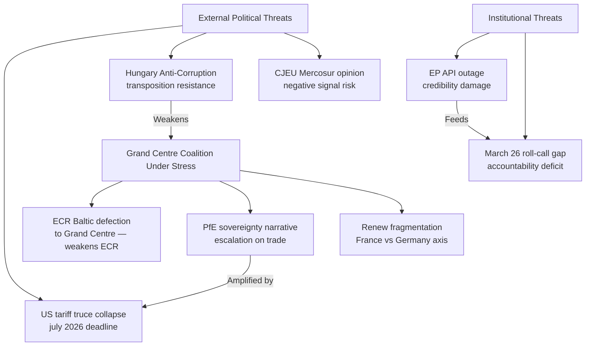

# 🔴 Political Threat Landscape — Run breaking-run-1776928781 (2026-04-23)

## Current EP Political Threat Topology

---

## Threat 1: Coalition Erosion on China-Related Measures

**Current status**: MONITORING | **Severity**: MEDIUM | **Trend**: Stable

Renew's internal divisions on China policy represent the most structurally vulnerable point in the Grand Centre. French Renaissance MEPs (approximately 22 of Renew's 76) historically favour EU-China trade engagement as a counterweight to US economic dominance. German FDP-aligned MEPs (approximately 8-10) lean toward free-trade principles that conflict with EU strategic interventionism.

If the EU-China TRQ modification (TA-0101) triggers Chinese retaliation that specifically targets Renew-constituency sectors (French luxury, German automotive), the political cost calculation for Renew MEPs changes. An April 27 emergency debate forcing a parliamentary resolution on China trade policy could expose these tensions.

**Political threat signal**: Watch for Renew group emergency request to separate China-specific measures from general trade defence resolutions.

---

## Threat 2: PfE Sovereignty Narrative Escalation

**Current status**: ACTIVE | **Severity**: MEDIUM | **Trend**: Increasing

PfE (84 seats) has the narrative infrastructure (RN TV, Fidesz media, Italian nationalist outlets) to amplify a "Brussels overreach" frame for the March 26 trade texts. Their argument: Parliament outsourced trade sovereignty to the Commission via delegated acts in TA-0096/0097; this removes democratic oversight. This argument has a factual kernel — delegated acts do reduce parliamentary involvement in specific tariff adjustments.

**Counter-argument** (available to Grand Centre): Delegated acts are standard for technical trade management; Parliament retains oversight and revocation rights; pre-authorisation was necessary given the Trump timeline.

The political threat is not that PfE wins the argument but that media amplification forces the Grand Centre onto defensive ground during the April 27 trade debate. A 20-minute PfE speech attacking democratic legitimacy of delegated acts forces EPP/S&D/Renew to respond to PfE's framing rather than controlling the narrative.

🟢 HIGH confidence on threat mechanism; 🟡 MEDIUM on escalation timing.

---

## Threat 3: Transparency Backlash (API + Roll-Call Gap)

**Current status**: LATENT | **Severity**: LOW-MEDIUM | **Trend**: Rising

The combination of the 12-day API outage AND the 28-day+ roll-call publication delay creates a transparency deficit that NGOs and investigative journalists can exploit. The political threat:
- **Direct**: MEP accountability claims challenged without data to verify
- **Indirect**: "EU Parliament lacks transparency" narrative serves multiple actors (Eurosceptics, accountability advocates, opposition parties)
- **Reputational**: Third-party archives (VoteWatch, Rewire News) may publish partial reconstructed data with errors

**Specific threat actor**: Transparency International EU; Access Info Europe; individual Eurosceptic MEPs filing formal complaints to the EP Ombudsman.

**Temporal window**: If API not restored by April 27, threat becomes active as MEPs debate trade policies their own institution hasn't made publicly transparent.

🟢 HIGH confidence on mechanism.

---

## Political Capital at Risk

| Actor | Political Capital at Risk | Trigger |
|-------|--------------------------|---------|
| Von der Leyen | "EU not ready for trade shock" narrative | Tariff truce collapse before deal |
| Metsola | API outage = institutional failure | If outage persists through April 27 |
| Lange | Trade framework insufficient | If delegated acts fail to prevent escalation |
| EPP (Weber) | Grand Centre coalition fracture | If trade votes split EPP internally |
| Anti-Corruption Directive architects | "Another unimplemented EU law" | If Hungary openly defies transposition |

---

## Monitoring Calendar

Key dates for political threat monitoring:
- April 27: EP plenary opens — PfE and ECR speeches set the threat activation baseline
- May 25: Commission delegated acts deadline under TA-0096/0097 — critical for Scenario B vs C
- July 7-8: US tariff truce expiry — the single most consequential external political threat trigger
- Q3 2026: Anti-Corruption Directive transposition deadline approaches — Hungary resistance signal expected

🟢 HIGH confidence on monitoring calendar.
