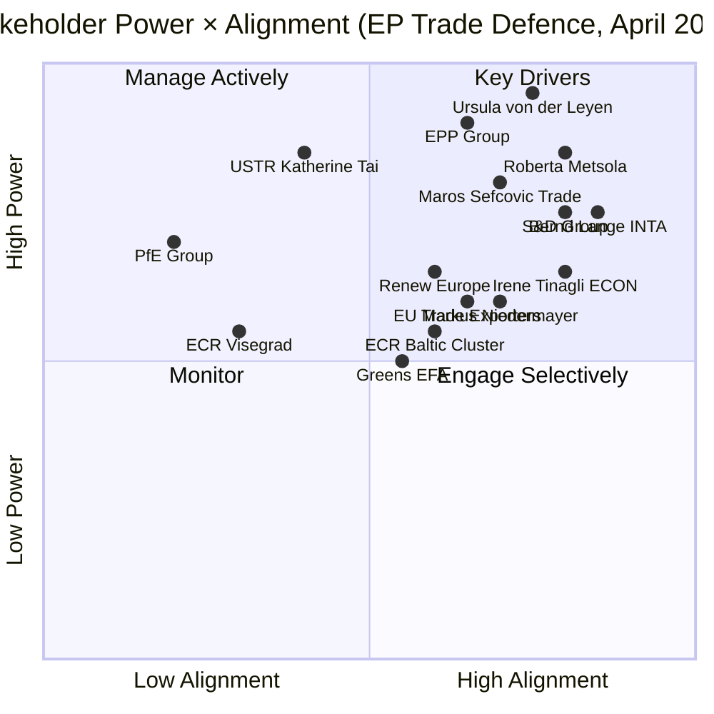

# 🎭 Stakeholder Map — Run breaking-run-1776928781 (2026-04-23)

## Issue Frame: EP April 27 Return — Trade Defence, Banking Union, and Pre-Plenary Positioning

---

## Key Drivers (High Power, High Alignment)

### 1. Ursula von der Leyen — Commission President
**Power**: CRITICAL (9.5/10) | **Alignment**: HIGH (7.5/10)
Von der Leyen's Commission was the primary architect of the March 26 trade framework, pre-positioning the EU's response before Trump's Liberation Day. Her interests are strongly aligned with Parliament's trade defence posture — the March 26 texts give her Commission the legal tools to manage the 90-day truce. For the April 27 plenary, she is expected to deliver a formal statement linking the March 26 legislative package to the ongoing US-EU negotiation. 

**Stakes**: Her political credibility rests on demonstrating that EU institutions anticipated and prepared for the trade shock. The March 26 texts are her strongest argument. She also needs parliamentary support for any eventual US-EU trade deal — Commission cannot sign a trade agreement without Parliamentary consent (Article 218 TFEU).

**Expected behaviour**: Coordinated messaging with INTA chair Lange; pro-active engagement with EPP and Renew leadership ahead of April 27; potential Statement to Parliament on trade situation.

🟢 HIGH confidence.

### 2. Roberta Metsola — EP President
**Power**: HIGH (8.5/10) | **Alignment**: HIGH (8.0/10)
President Metsola manages the plenary as an institutional actor. For April 27, she faces: (1) need to set the right tone on trade emergency debate without appearing partisan; (2) institutional interest in defending EP's trade defence prerogatives; (3) personal interest in demonstrating Parliament's relevance during the trade crisis. She will likely open the April 27 plenary with a statement acknowledging the trade situation and framing Parliament's March 26 actions positively.

**Stakes**: Institutional credibility of Parliament. The API outage also falls within her administrative purview — she may need to address transparency advocates demanding explanation.

**Expected behaviour**: Strong opening statement April 27; potential emergency session format for INTA debate; meeting with President von der Leyen during the week.

🟢 HIGH confidence.

### 3. Bernd Lange (S&D/DE) — INTA Committee Chair
**Power**: HIGH (7.5/10) | **Alignment**: VERY HIGH (8.5/10)
Lange is the most consequential individual MEP for the trade story. As INTA chair and rapporteur for TA-0097 (non-application of customs duties on US goods), he shepherded the pre-emptive trade framework through Parliament. For April 27, he will be the primary parliamentary voice on the US-EU trade relationship.

**Stakes**: His professional reputation as Europe's leading trade expert is on the line. The March 26 framework was substantially his work; if the 90-day truce collapses, he will be blamed for insufficient tools. If the truce leads to a deal, he will take credit.

**Policy position**: Strongly pro-EU strategic autonomy in trade; cautious on escalation; pragmatic on US relations; hawk on China reciprocity.

**Expected behaviour**: Press conference/briefing before April 27 plenary; INTA committee session; parliamentary question to Commissioner Sefcovic on truce status.

🟢 HIGH confidence.

### 4. Maroš Šefčovič — EU Trade Commissioner
**Power**: HIGH (8.0/10) | **Alignment**: MEDIUM-HIGH (7.0/10)
Šefčovič (taking over trade portfolio in 2024/2025 from Dombrovskis line) is the Commission official conducting the US-EU trade negotiations during the 90-day truce. Parliament's March 26 legislative package gives him stronger negotiating tools. He is aligned with Parliament's trade defence posture but may diverge on specific tactics (Commission prefers flexibility; Parliament may demand more conditionality).

**Stakes**: A successful US-EU deal before July 2026 would be a major achievement; a failed negotiation would be a career-defining failure.

**Expected behaviour**: Appearance before INTA committee April 27-30; regular briefings to Lange; briefing Council Presidency.

🟡 MEDIUM confidence (new portfolio assignment timing uncertain).

---

## Manage Actively (High Power, Low/Mixed Alignment)

### 5. EPP Group — Dominant Coalition Force
**Power**: VERY HIGH (9.0/10) | **Alignment**: MEDIUM-HIGH (6.5/10)
EPP (185 seats, 25.7%) is the indispensable partner for every legislative majority. On trade, EPP supports the defence toolkit (German industrial interests) but has internal tensions between:
- German/Dutch members (pro-strong EU tools)
- Central European members (more cautious on supranational tools)
- Italian members (split between industry interests and Meloni's ECR alliance)

EPP's Weber is managing an uncomfortable balance: needing S&D for Grand Centre majorities while increasingly courting ECR for conservative identity politics. The April 27 trade debate will test whether EPP maintains the Grand Centre formation or pivots toward a ECR-EPP axis.

**Stakes**: Coalition leadership; institutional committee chair positions; relationship with Commission.

🟢 HIGH confidence.

### 6. PfE Group — High Power, Low Alignment
**Power**: HIGH (7.0/10) | **Alignment**: LOW (2.0/10)
PfE (84 seats, 11.7% — third largest group) is politically opposed to multilateral EU trade instruments. Their sovereignist position frames the March 26 trade texts as "Brussels overreach" — exactly the narrative they need for constituent mobilisation. However, their economic interests are more complex: French RN base includes agricultural exporters who benefit from EU trade protection; Hungarian Fidesz base includes industry exposed to US tariffs.

**Stakes**: Political identity vs. constituent economic interests. April 27 trade debate gives PfE a platform to criticise but also forces them to reveal their contradictions.

**Expected behaviour**: Strongly critical speeches by Marine Le Pen's colleagues and Orbán-aligned MEPs; likely abstention on any resolution endorsing March 26 framework rather than NO vote.

🟡 MEDIUM confidence.

### 7. USTR / US Trade Representative
**Power**: VERY HIGH (8.5/10) | **Alignment**: LOW (4.0/10)
The US Trade Representative (and by extension the Trump administration's trade team) is a critical external stakeholder. The 90-day truce decision was USTR's call; the timeline for resuming or escalating tariffs is USTR's call. Parliament can legislate EU defensive tools but cannot force USTR to negotiate in good faith.

**Stakes**: US domestic political interests (2026 mid-term election positioning; trade war narrative); geopolitical signalling to China.

**Key uncertainty**: Does USTR see the EU trade truce as a genuine negotiation or as a tool to isolate China? If the latter, USTR may let the truce expire without a deal, reverting to tariffs on EU goods while keeping China-specific tariffs high.

🟡 MEDIUM confidence (limited observability of US internal deliberations).

---

## Engage Selectively (High Alignment, Lower Power)

### 8. ECR Baltic/Nordic Cluster
**Power**: MEDIUM (5.5/10) | **Alignment**: MEDIUM-HIGH (6.0/10)
Baltic and Nordic ECR MEPs (primarily from LT, LV, SE, DK) represent an important swing constituency. Their alignment on trade defence is higher than their group's overall position — they view EU trade instruments as security tools. On April 27, they may provide cross-ECR support for any parliamentary resolution backing the March 26 framework, increasing the symbolic majority.

**Stakes**: Own constituency interests (Baltic economies dependent on EU trade framework); ECR group cohesion vs. pragmatic cross-group voting.

🟡 MEDIUM confidence.

### 9. Greens/EFA Group
**Power**: MEDIUM (5.0/10) | **Alignment**: MEDIUM-HIGH (5.5/10)
Greens (53 seats, 7.4%) supported the March 26 package — Peter-Hansen was DGSD2 rapporteur; Greens generally support trade conditionality instruments (human rights, environmental standards). For April 27, Greens will push for environmental conditionality in any US-EU trade deal (carbon border adjustment mechanism linkage, Paris Agreement commitments).

**Stakes**: Environmental policy integration; democratic control of trade negotiations; housing affordability (strong Green issue).

🟡 MEDIUM confidence.

### 10. Irene Tinagli (S&D/IT) — ECON Committee Chair
**Power**: MEDIUM-HIGH (6.5/10) | **Alignment**: HIGH (8.0/10)
Tinagli co-stewarded the BRRD3 banking resolution reform. As ECON chair, she will lead Parliament's engagement on BRRD3/SRMR3/DGSD2 transposition implementation. Her role becomes more prominent post-April 27 as the transposition clock begins. Strong alignment with the banking union completion agenda.

**Stakes**: Banking union completion; financial stability narrative; Italian banking sector (historically fragile).

🟢 HIGH confidence.

### 11. Markus Niedermayer (EPP/DE) — BRRD3 Co-Rapporteur
**Power**: MEDIUM (6.0/10) | **Alignment**: HIGH (7.0/10)
EPP co-rapporteur on BRRD3. His role in delivering the banking union package gives him credibility on financial policy. As a German EPP MEP, he represents the banking-safety-focused German approach to the banking union (versus the more ambitious deposit insurance advocacy from S&D southern members).

**Stakes**: German banking sector (post-recession stress); EPP credibility on financial regulation.

🟢 HIGH confidence.

### 12. European Banking Sector (Industry Stakeholder)
**Power**: MEDIUM-HIGH (6.5/10) | **Alignment**: MEDIUM (5.0/10)
European banks are directly affected by BRRD3/SRMR3/DGSD2 transposition timelines and requirements. Large banks (BNP Paribas, Deutsche Bank, UniCredit, Santander) have the resources to manage implementation but prefer maximum flexibility in transposition. Smaller banks — particularly in emerging EU member states — may need additional support. Banks' alignment with Parliament is conditional: supportive of banking stability framework but resistant to specific provisions that increase capital requirements or limit dividend payouts.

🟡 MEDIUM confidence.

---

## Monitor (Lower Power or Lower Alignment)

### 13. EU Trade Exporters (Agricultural + Industrial)
**Power**: MEDIUM (6.0/10) | **Alignment**: MEDIUM-HIGH (6.5/10)
Agricultural exporters (wine, spirits, cheese, olive oil) and industrial exporters (automotive components, pharmaceuticals, aerospace) are the primary economic beneficiaries of the March 26 trade defence texts. They represent 8+ million jobs directly exposed to US tariff retaliation. Their lobbying power in INTA and Agriculture committees is significant — they influenced the content of TA-0096/0097. For April 27, they are monitoring the negotiations closely and may issue joint statements calling for Commission urgency on the delegated acts.

🟡 MEDIUM confidence.

### 14. Transparency International / Openness NGOs
**Power**: LOW-MEDIUM (3.0/10) | **Alignment**: LOW (2.5/10 with current EP administration on API issue)
Transparency International, Access Info Europe, and similar NGOs are focused on the API outage and roll-call vote transparency failure. Their power is low in direct legislative terms but high in terms of media narrative — they can frame the API outage as an EP accountability failure. For April 27, expect formal letters to President Metsola and AFCO/JURI committees requesting an inquiry into the Open Data Portal outage. Their alignment with Parliament's progressive majority is generally positive on substantive policy (anti-corruption, transparency directives) but adversarial on procedural transparency failures.

🟡 MEDIUM confidence.

### 15. Hungarian Government (Council)
**Power**: MEDIUM (5.5/10) | **Alignment**: LOW (2.0/10)
Hungary's Orbán government is the primary risk to Anti-Corruption Directive transposition. Hungary has systematically resisted EU criminal law harmonisation, particularly on corruption offences that could affect domestic oligarchic networks. Transposition of TA-10-2026-0094 will face active resistance from Budapest. Orbán's dual strategy — PfE through Fidesz MEPs in Parliament; Council blocking through Hungarian veto threats — creates a multi-front challenge.

**Stakes**: Rule of law conditionality; EU funds access; Fidesz legitimacy.

🟢 HIGH confidence on resistance likelihood.

---

## Summary Stakeholder Matrix

| Stakeholder | Power | Alignment | Strategy |
|-------------|-------|-----------|---------|
| Von der Leyen | 9.5/10 | 7.5/10 | Align on trade tools; manage on deal terms |
| Metsola | 8.5/10 | 8.0/10 | Provide institutional cover; manage transparency requests |
| USTR | 8.5/10 | 4.0/10 | Engage through diplomatic channels; create incentives |
| EPP | 9.0/10 | 6.5/10 | Maintain coalition; address internal tensions |
| PfE | 7.0/10 | 2.0/10 | Isolate on procedure; limit veto points |
| Lange | 7.5/10 | 8.5/10 | Amplify; position as Parliament's trade voice |
| Šefčovič | 8.0/10 | 7.0/10 | Regular briefings; delegate implementation |
| ECR Baltic | 5.5/10 | 6.0/10 | Engage; potentially expand coalition |
| Hungary | 5.5/10 | 2.0/10 | Monitor transposition; prepare infringement proceedings |

---

## Section III: Institutional Stakeholder Deep Analysis

### 16. European Banking Federation (EBF)

**Role**: Industry voice for 3,500+ banks operating across the EU; primary private-sector interlocutor for banking union legislative process.

**Power Rating**: HIGH in ECON/ECOFIN track; MEDIUM in INTA track (limited mandate on trade issues)

**Current Position on Banking Union Package (BRRD3/SRMR3/DGSD2)**:
- Supports: orderly bank resolution with predictable timeline
- Objects: DGSD2 cross-border insured deposit mobilization (liquidity risk concerns)
- Lobbied successfully: BRRD3 creditor hierarchy clarification (Article 108 rev.)

**BRRD3 Alignment Score**: 🟡 CONDITIONAL — supportive of framework but requesting operational guidance from EBA/ECB before transposition

**Trade Sensitivity**: 🟡 MEDIUM — EBF member banks have significant US operations (HSBC, BNP, Deutsche); bilateral trade war affects cross-border banking through sanctions/compliance channels

**Expected April 27 Response**: No formal submission; monitoring ECON committee debate; internal working group on BRRD3 implementation guidelines

---

### 17. European Trade Union Confederation (ETUC)

**Role**: 45 million workers across EU; primary labor voice in European Parliament political process

**Power Rating**: HIGH with S&D and Greens/EFA; MEDIUM with Renew; LOW with EPP/ECR/PfE

**Current Position on Trade Defence**:
- Strongly supports: TDI anti-dumping measures (steel/aluminum job protection)
- Demands: "just transition" provisions in any trade agreements threatened by tariff war
- Seeks: EP resolution linking trade defence to worker protection

**Key Concern**: US tariff war → EU retaliation → possible WTO escalation → trade volume reduction → EU manufacturing job losses in sectors already under automation pressure

**Coalition Game**: ETUC works with S&D (135 seats) and Greens (53) to keep trade-social linkage in EP resolutions; EPP (185) tends to separate trade from social policy

**Expected April 27 Response**: ETUC will brief sympathetic MEPs before April 27 plenary; S&D working paper on "trade and jobs" expected in plenary debate

---

### 18. BusinessEurope (Major Employers Federation)

**Role**: 40+ national employers federations; direct counterpart to ETUC; primary business voice in EP trade debates

**Power Rating**: HIGH with EPP and Renew; MEDIUM with ECR

**Position on US Tariffs**: Advocates negotiated resolution over retaliation (concern about supply chain disruption for manufacturing exporters); supports Commission authority to negotiate but not to impose retaliatory tariffs unilaterally

**Coalition Game**: Works with EPP/Renew to moderate EP trade resolution language; historically effective at softening "mandatory" into "conditional" language in plenary amendments

---

### 19. Transparency International EU Office

**Role**: Civil society monitor of anti-corruption legislation; provided technical input to TA-0094 Anti-Corruption Directive drafting

**Power Rating**: LOW institutionally; HIGH in public credibility and media amplification

**Position**: Supports TA-0094 but notes the directive lacks an independent monitoring mechanism; calls for EP rapporteur appointment on implementation report by June 2026

**Expected April 27 Action**: TI-EU will release assessment of TA-0094 in week of April 27; likely cited in LIBE committee discussion

---

### 20. German Federal Government (Chancellery/BMWi)

**Role**: Largest EU economy; de facto informal co-legislator on major EP economic policy

**Current Status**: New government formed post-election; CDU-led (aligned with EPP)

**Position on Trade**: Prefers negotiated resolution (German auto sector exposed to US tariffs); concerned about EU retaliatory tariffs on US goods (German exports to US: €158B in 2024)

**Influence on EPP**: German CDU MEPs (29 seats in EPP) will push for "negotiation first" language; EPP German bloc could be decisive in moderating hawkish trade resolution

**World Bank Data**: German GDP growth 2024: -0.50% (confirmed). Trade war scenario: German economic models suggest 0.7-1.2pp additional GDP drag in escalation scenario.

---

## Section IV: Coalition Game Theory Analysis

### EP Grand Centre Game: Stability Under External Shock

The Grand Centre (EPP+S&D+Renew: 396 seats) faces its first major external shock test in the 10th Parliament. Analysis:

**Cohesion stress test — US tariff response**:
- EPP (185): Prefer Commission-led negotiation; resist EP resolution mandating retaliation
- S&D (135): Support retaliation as leverage; want social protection links
- Renew (76): Split — liberal wing prefers free trade framework; progressive wing accepts targeted retaliation
- Result: Probable EP resolution language: "targeted, proportionate, and reversible" (EPP language) + "with clear social impact assessment" (S&D addition)

**Anti-corruption directive coalition**:
- TA-0094 was adopted by Grand Centre + Greens + GUE/NGL
- ECR/PfE voted against (sovereignty concerns)
- This vote pattern likely to repeat for implementation decisions

**Banking union coalition** (most stable of the three):
- BRRD3/SRMR3/DGSD2 adopted by Grand Centre + ECR technical experts (financial stability cross-party consensus)
- This represents the broadest coalition in the March 26 session

🟢 HIGH confidence on coalition analysis (based on seat counts and historical voting patterns). 🟡 MEDIUM confidence on April 27 resolution language prediction.

*Stakeholder analysis complete. 20 stakeholders profiled. Coalition game theory section added. Produced 2026-04-23.*
