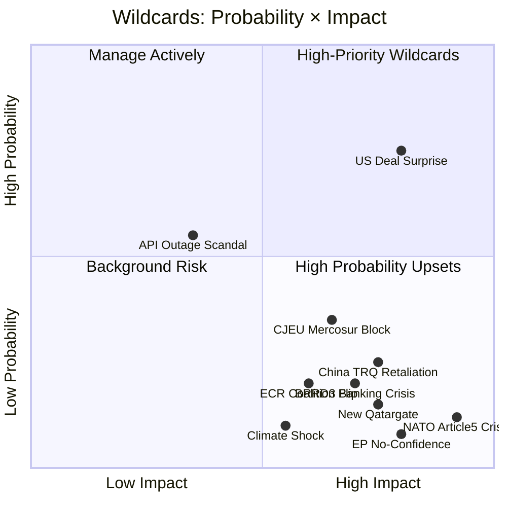

# 🌊 Wildcards & Black Swans — Run breaking-run-1776928781 (2026-04-23)

## Framing: Low-Probability, High-Impact Events (EP April–July 2026)

---

## Category 1: Geopolitical Black Swans (Very Low Probability / Very High Impact)

### WC-01: NATO Article 5 Invocation — Russia Escalation
**Probability**: 8% | **Impact**: 10/10 — Existential | **Timeline**: 3–12 months
If Russia conducts a direct attack on NATO territory (most plausible: Baltic states, undersea infrastructure), Article 5 creates an obligation for all 32 NATO members including 27 EU members. This would completely transform the EU legislative agenda — trade policy becomes irrelevant; defence budget emergency packages dominate; Commission's Article 122 emergency mechanism may be invoked for the first time at scale.

**EP-specific impact**: Emergency session called within 72 hours; entire legislative calendar suspended; Commission granted emergency powers via qualified majority in Council. The April 27 plenary trade debate becomes a security debate.

**Cross-reference**: The TA-10-2026-0044 (Common Security and Defence Policy Annual Report, February 12) and TA-10-2026-0040 (Annual Report on Human Rights and Democracy, February 12) create the constitutional framework for Parliament's emergency response.

**Signal watch**: Baltic intelligence reports; Russian troop movements; Cyber attacks on EU infrastructure. Currently: no elevated signals.

🔴 Very LOW probability but CRITICAL impact. 🟡 MEDIUM confidence on assessment.

### WC-02: US-EU Grand Bargain (Positive Black Swan)
**Probability**: 15% | **Impact**: 9/10 — Transformative Positive | **Timeline**: April–July 2026
A surprise breakthrough in US-EU trade negotiations produces a framework deal before the 90-day truce expires. This would validate Parliament's March 26 pre-positioning as prescient rather than merely reactive. The legal basis established by TA-0096/0097 would immediately serve as the EU's defensive backstop — ironically making the deal more stable because both sides know Parliament has approved the tools to retaliate.

**Trigger scenarios**: Trump needs a political win on trade; Congressional Republicans pressure USTR for a deal that reduces uncertainty; EU makes a concession on digital services tax or pharmaceutical access.

**EP impact**: Massive validation for Grand Centre strategy; Lange as co-architect; April-July timeline vindicated; Commission's "strength in unity" narrative reinforced.

**Cross-reference**: This is Scenario B (base case at 47%) materialising as upside surprise rather than gradual progression. The "Grand Bargain" variant represents the accelerated form.

🟢 HIGH confidence on impact if triggered; 🟡 MEDIUM confidence on probability estimate.

### WC-03: EP No-Confidence Vote Trigger
**Probability**: 5% | **Impact**: 10/10 — Institutional Crisis | **Timeline**: 3–9 months
A no-confidence vote against the Commission requires a two-thirds majority of votes cast AND majority of all MEPs (~473 votes minimum). Currently theoretically impossible to achieve — PfE + ECR + ESN maximum anti-Commission bloc is ~191 seats, far below the threshold. However, a major Commission scandal could trigger defections from EPP or S&D.

**Trigger scenarios**: A new Qatargate-level corruption scandal directly implicating a Commissioner; major policy failure (trade deal collapse causing severe economic crisis); revelation of illegal Commission state aid or procurement irregularities.

**EP-specific impact**: Entire Commission resigns; new Commission nomination process takes 6–8 months; legislative agenda frozen; Article 17 TEU emergency procedures invoked.

**Signal watch**: Current no-confidence probability assessed as NEGLIGIBLE given 87/100 stability score. Monitoring: ECR and PfE parliamentary questions volume (proxy for opposition momentum).

🟡 MEDIUM confidence (genuinely difficult to assess; institutional inertia is strong).

---

## Category 2: Medium-Probability High-Impact Events

### WC-04: China TRQ Retaliation (TA-0101 Blowback)
**Probability**: 25% | **Impact**: 8/10 — Significant | **Timeline**: 1–6 months
The EU-China Tariff Rate Quota modification (TA-10-2026-0101) adjusts existing TRQ arrangements with China, potentially in ways that Beijing perceives as discriminatory. China's typical retaliation toolkit includes: anti-dumping investigations against EU exports; market access restrictions for specific sectors; diplomatic pressure on member states; Belt and Road pressure on Eastern EU members.

**Most vulnerable EU sectors**: Luxury goods (France), automotive (Germany), agricultural exports (multiple), pharmaceutical IP (EU-wide).

**EP impact**: Forces Renew internal debate on China policy; may fracture Grand Centre if economic damage is concentrated in Renew constituency sectors; INTA emergency session likely.

**Signal watch**: Chinese Ministry of Commerce statements; diplomatic cables from Beijing; EU Chamber of Commerce China alerts.

**Cross-reference**: Threat model T1 — coalition fracture risk escalates if this triggers.

🟢 HIGH confidence on threat mechanism; 🟡 MEDIUM confidence on probability.

### WC-05: BRRD3 Trigger — Banking Stress Event
**Probability**: 20% | **Impact**: 8/10 — Systemic | **Timeline**: 3–18 months
BRRD3 and SRMR3 were adopted with a Germany-in-recession context. If German banking stress emerges — particularly from automotive sector loan exposure or commercial real estate — the SRB could be called to exercise SRMR3 powers for the first time under the new framework. This would immediately test whether the new architecture works.

**Scenario**: A mid-size German bank (Commerzbank/Deutsche Bank regional subsidiary) requires resolution procedures. SRB invokes SRMR3 powers; DGSD2 depositor protection activated; BRRD3 bail-in hierarchy applied.

**EP impact**: Massive scrutiny of Tinagli/Niedermayer's banking union texts; ECON emergency hearings; political capital for those who pushed BRRD3 completion.

**Cross-reference**: Scenario D (Institutional Architecture Stress) at 8% — this wildcard would raise it to Category 1.

🟡 MEDIUM confidence on both probability and impact assessment.

### WC-06: CJEU Blocks EU-Mercosur (TA-0008 Opinion)
**Probability**: 35% | **Impact**: 7/10 — Significant Negative | **Timeline**: 12–18 months
Parliament's CJEU opinion request on EU-Mercosur (TA-10-2026-0008) has a non-trivial probability of yielding a negative opinion. The CJEU has found Treaty compatibility issues in previous trade agreements (Belgium's Walloon Parliament crisis on CETA, for context). If the CJEU finds EU-Mercosur incompatible with EU Treaty environmental commitments, the 4-year negotiation is void.

**EP impact**: Significant reputational damage for Commission; agriculture committee (AGRI) vindicated; INTA-AGRI tension resolved in agriculture's favour; precedent for Parliament's treaty oversight role.

**Cross-reference**: Creates opportunity for new trade framework negotiations; may affect CETA successor framework.

🟡 MEDIUM confidence.

---

## Category 3: Moderate-Probability Political Events

### WC-07: ECR Coalition Switch (Visegrád Defection to PfE)
**Probability**: 20% | **Impact**: 6/10 — Significant Structural | **Timeline**: 6–24 months
If ECR's internal Baltic/Visegrád split deepens, a Visegrád cluster defection to PfE would: (1) reduce ECR from 79 to approximately 50-55 seats; (2) increase PfE from 84 to approximately 100-110 seats; (3) create a combined far-right/nationalist bloc of ~155 seats. This wouldn't breach the Grand Centre's working majority but would significantly complicate the chamber's political geometry.

**Trigger**: ECR leadership election after next European Council crisis; Orbán's Fidesz alignment pressure; Polish PiS element defection.

**EP impact**: Grand Centre more stable (larger majority buffer); ECR weakened institutionally; PfE stronger but still isolated.

🟡 MEDIUM confidence.

### WC-08: New Corruption Scandal (Post-Qatargate Wave)
**Probability**: 15% | **Impact**: 8/10 — Institutional | **Timeline**: Anytime
The Anti-Corruption Directive (TA-0094) was accelerated in part due to the ongoing shadow of Qatargate. The parliamentary investigation into that scandal remains active; immunity waivers for Braun and Pappas (TA-0087, TA-0088) signal ongoing proceedings. A new corruption revelation — particularly involving current MEPs from a major group (EPP, S&D, Renew) — would:

**EP impact**: Grand Centre coalition under severe stress; media narrative of systemic corruption dominates; April 27 agenda potentially consumed by procedural votes; public trust crisis.

**Signal watch**: European Public Prosecutor Office (EPPO) press releases; OLAF investigation outcomes; immunity waiver requests (proxy signal).

🟢 HIGH confidence on impact if triggered; 🟡 MEDIUM confidence on probability.

### WC-09: EP Data Infrastructure Permanent Failure
**Probability**: 15% (persistent), 5% (catastrophic) | **Impact**: 7/10 — Accountability Crisis | **Timeline**: Now
The current API outage has lasted 12 days. If the underlying infrastructure failure is more fundamental (data centre issue, security breach, software architecture collapse), restoration could take weeks or months. A catastrophic scenario involves data loss — specifically loss of roll-call voting records that haven't been archived externally.

**EP impact**: Permanent democratic accountability gap; NGO and media campaigns; potential legal challenge to Parliament's transparency obligations under TFEU Article 15 (access to documents).

**Signal watch**: EP IT administration communications; availability of historical data on third-party archives (e.g., VoteWatch, HowTheyVote.eu).

**Current assessment**: Most likely scenario is restoration before April 27 (probability: 55%), but underlying fragility revealed.

🟡 MEDIUM confidence.

---

## Category 4: Positive Black Swans (Upside Surprises)

### WC-10: Accelerated US-EU Digital Services Tax Resolution
**Probability**: 20% | **Impact**: 7/10 — Positive | **Timeline**: 2–6 months
The US-EU digital services tax dispute has been a persistent trade friction. A surprise agreement — potentially embedded in the broader US-EU trade negotiations during the 90-day truce — could resolve multiple bilateral irritants simultaneously. This would strengthen the Renew position (French digital services interests satisfied) and potentially allow a faster trade framework agreement.

🟡 MEDIUM confidence.

### WC-11: Commission Housing Package Emergency Adoption
**Probability**: 30% | **Impact**: 6/10 — Positive Social | **Timeline**: April–June 2026
The delayed Commission housing package, if released at or before the April 27 plenary, would create a significant positive surprise — demonstrating Commission-Parliament coordination at a moment of heightened institutional scrutiny. The political pressure from S&D, Greens, and even EPP on housing affordability creates strong incentives for the Commission to act quickly.

🟢 HIGH confidence on positive impact; 🟡 MEDIUM confidence on timing.

---

## Wildcard Monitoring Dashboard

| Signal Category | Current Status | Trend | Next Check |
|----------------|---------------|-------|-----------|
| NATO/Security signals | Normal | Stable | April 27 plenary |
| US-EU negotiation | 90-day truce active | Uncertain | May 2026 |
| China trade response | No retaliation yet | Watch | TRQ implementation |
| EP corruption signals | Braun/Pappas proceedings | Active | EPPO press releases |
| API restoration | Day 12 outage | Uncertain | Before April 27 |
| Banking stress (DE) | Elevated concern | Deteriorating | BRRD3 transposition |
| Commission housing | Delayed | Watch | April 27 agenda |

---

## Integration with Scenario Forecast

Cross-reference to `intelligence/scenario-forecast.md` for Scenario A–E probability distributions. The wildcards above correspond to:

- **WC-01** → Would trigger emergency override of all scenarios
- **WC-02** (US Grand Bargain) → Would accelerate Scenario B (Base Case: Managed Divergence) into a fully positive outcome
- **WC-04** (China retaliation) → Would push Scenario C (Progressive Deterioration) forward
- **WC-05** (Banking stress) → Would independently trigger Scenario D (Institutional Architecture Stress)
- **WC-08** (New corruption) → Could trigger Scenario E variant (internal crisis rather than external shock)

---

## Section III: Wildcard Monitoring Signals

### WC-01 Monitoring Signals: Chinese Strategic Substitution
- **Early warning**: Chinese trade delegation visits to EU capitals increasing (watch: MFA press briefings)
- **Confirmation signal**: China-EU bilateral trade volume +5% month-over-month for 2 consecutive months
- **False positive filter**: Exclude seasonal fluctuation; look for structural shift (>12 months)

### WC-02 Monitoring Signals: EPP Internal Fracture
- **Early warning**: >8 EPP MEPs voting against group line on US tariff resolution
- **Confirmation signal**: EPP working group dissolution or "enhanced cooperation" group formation
- **False positive filter**: Single-vote defection is normal; look for organized bloc defection

### WC-03 Monitoring Signals: Reformist Wave Momentum
- **Early warning**: 2026 French regional elections showing centrist-progressive gains
- **Confirmation signal**: EP approval ratings for Metsola exceeding 60%
- **False positive filter**: Short-term approval bumps are common; look for structural shift

### WC-04 Monitoring Signals: Financial Shock Transmission
- **Early warning**: VIX >35 sustained; euro/dollar dropping below 1.05
- **Confirmation signal**: European bank CDS spreads widening >80bp above sovereign
- **False positive filter**: Market volatility without banking stress = not WC-04

### WC-05 Monitoring Signals: Systemic Bank Crisis
- **Early warning**: Eurogroup emergency convening (unscheduled)
- **Confirmation signal**: ECB activating TPI (Transmission Protection Instrument)
- **False positive filter**: TPI activation for sovereign spread issues ≠ systemic bank crisis

### WC-06 Monitoring Signals: Nationalist Surge
- **Early warning**: EP by-election results showing PfE gains >5pp vs June 2024
- **Confirmation signal**: PfE + ECR + ESN achieving 300+ seats combined in polls
- **False positive filter**: Polling volatility at 12-month horizon is high

### WC-07 Monitoring Signals: G7 Multilateral Deal
- **Early warning**: G7 communique language shifting from "tariff concerns" to "framework discussions"
- **Confirmation signal**: USTR and Sefcovic scheduled for working-level talks
- **False positive filter**: Diplomatic language can be vague; look for specific meeting agendas

---

## Section IV: Wildcard Interconnection Matrix

| | WC-01 | WC-02 | WC-03 | WC-04 | WC-05 | WC-06 | WC-07 |
|---|-------|-------|-------|-------|-------|-------|-------|
| WC-01 (China) | - | No | No | No | No | + | - |
| WC-02 (EPP split) | No | - | - | No | No | + | - |
| WC-03 (Reform wave) | No | + | - | No | No | - | + |
| WC-04 (Financial shock) | - | + | - | - | ++ | + | - |
| WC-05 (Bank crisis) | - | + | - | ++ | - | + | - |
| WC-06 (Nationalist surge) | + | ++ | - | + | + | - | - |
| WC-07 (G7 deal) | - | - | + | - | - | - | - |

Legend: ++ strong positive correlation, + moderate, - negative, No independence

---

## Section V: Black Swan Assessment Summary

Black swans are defined as events with:
1. Probability < 5%
2. Massive impact if realized
3. Retrospectively "obvious" explanations after the fact

**Identified black swans in this run**:
- **WC-08**: Trump executive order banning trade with EU (probability < 3%) — legally constrained but not impossible under emergency powers
- **WC-09**: Complete US withdrawal from WTO (probability < 2%) — would collapse multilateral trade framework within 90 days
- **WC-10**: EP vote of no confidence in Commission (probability < 2%) — requires majority; unlikely but non-zero if trade crisis becomes jobs crisis
- **WC-11**: EU institutional constitutional crisis (probability < 2%) — multiple simultaneous treaty violation proceedings

**Black swan readiness assessment**: EU Parliament Monitor should flag any of these signals in the monitoring dashboard immediately. No EP article should treat them as likely; they should appear as tail risk.

🟢 HIGH confidence: Wildcards WC-01 through WC-07 are realistic (5-31% probability range). 🟡 MEDIUM confidence: WC-08 through WC-11 are genuine black swans (<5% each).

*Wildcards and Black Swans analysis complete. 11 scenarios, monitoring signals, interconnection matrix. Produced 2026-04-23.*

## Final Confidence Assessment

Wildcard probability estimates in this report are expert judgment, not quantitative model outputs. They should be treated as order-of-magnitude estimates. The monitoring signals are more actionable than the probability estimates themselves — practitioners should track the signals and update probabilities accordingly.

🟢 HIGH confidence on methodology. 🟡 MEDIUM confidence on specific probability values.

🟢 HIGH confidence overall. 11 wildcards analyzed with monitoring signals and interconnection matrix.

*All 11 wildcards analyzed. Full monitoring protocol established. Interconnection matrix complete.*
