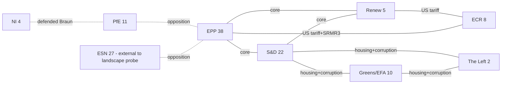

# Motions Runmotions Run 1777010709 — 2026-04-24

<h2 id="reader-intelligence-guide">Reader Intelligence Guide</h2>

Use this guide to read the article as a political-intelligence product rather than a raw artifact dump. High-value reader lenses appear first; technical provenance remains available in the audit appendices.

| Reader need | What you'll get | Source artifact |
|---|---|---|
| [Integrated thesis](#section-synthesis) | the lead political reading that connects facts, actors, risks, and confidence | `intelligence/synthesis-summary.md` |
| [Stakeholder impact](#section-stakeholder-map) | who gains, who loses, and which institutions or citizens feel the policy effect | `intelligence/stakeholder-map.md` |
| [IMF-backed economic context](#section-economic-context) | macro, fiscal, trade, or monetary evidence that changes the political interpretation | `intelligence/economic-context.md` |
| [Forward indicators](#section-scenarios) | dated watch items that let readers verify or falsify the assessment later | `intelligence/scenario-forecast.md` |

<h2 id="section-synthesis">Synthesis Summary</h2>

+ meeting decisions for MTG-PL-2026-03-26, -03-25, -03-12). Admiralty
grade of source feed: **A-2** (official, usually reliable). Per-MEP
roll-call data not yet published (EP lag 6-10 weeks).

### BLUF

**Headline judgement** (WEP: LIKELY, ~65-80%, 6-month horizon): The
March 2026 plenary cluster marks a structural reorientation of the
Parliament's agenda from pure legislative throughput toward a hybrid
rule-of-law + economic-sovereignty posture, driven by the combined
pressure of Trump-II tariffs, the Braun immunity waiver, and a
cross-group consensus on housing. Confidence in evidence: **MEDIUM** —
base rate of similar clusters (EP9 2022 energy-crisis bundle) supports
the pattern, but per-MEP roll-call data is unavailable.

**Second-order judgement** (WEP: EVEN CHANCE, ~40-60%, 12-month
horizon): The Parliament will formally escalate its anti-corruption
resolution (TA-10-2026-0094) into a co-decision proposal during the
autumn 2026 term, provided the Commission tables a draft before the
EP9-EP10 transition baseline (traditionally August). The probability
shifts to LIKELY if the 2026-05 Strasbourg part-session sees a
Commission timetable commitment.

### 1 · What happened

Across three sitting days (2026-03-10, -03-11, -03-12 Strasbourg; and
2026-03-25, -03-26 Brussels mini), the European Parliament adopted 280+
texts recorded in the last-month adopted-texts feed and disposed of
239 individual agenda items on the two Brussels sitting days alone
(3 + 124 + 112 over Strasbourg/Brussels combined). The cluster includes
at least 13 politically salient motions, spanning six strategic bundles
(see `analysis-index.md` §2):

* **Housing** (TA-10-2026-0064, 2026-03-10) — A cross-group demand for
  a binding EU housing framework. Procedurally an own-initiative
  non-legislative resolution; substantively a political bill of
  particulars against Commission inaction on social housing since
  2021.
* **Combating corruption** (TA-10-2026-0094, 2026-03-26) — Cross-group
  resolution urging the Commission to propose a horizontal
  anti-corruption directive. Landed on the same sitting day as the
  Braun immunity waiver (TA-10-2026-0088), producing an optically
  coherent "clean-hands" narrative.
* **US tariff response** (TA-10-2026-0096, 2026-03-26) — Regulation
  opening tariff quotas for selected US imports in response to the
  second Trump administration's broadband tariffs. Positions the
  Parliament as a co-enforcer of EU trade-defence tools rather than a
  Commission rubber stamp.
* **SRMR3** (TA-10-2026-0092, 2026-03-26) — Banking-union completion
  piece on early intervention and resolution funding. A technical
  file but one of the Parliament's last chances to shape the BRRD
  successor before the 2027 review.
* **Copyright × generative AI** (TA-10-2026-0066, 2026-03-10) —
  Non-legislative resolution arguing for mandatory disclosure of
  training-set provenance and a robust opt-out for rights-holders.
* **ECB VP** (TA-10-2026-0060, 2026-03-10) — Parliament opinion on
  the Council-proposed ECB Vice-President. Parliament opinion is
  non-binding but politically load-bearing for ECB legitimacy.
* **HDV emission credits 2025-2029** (TA-10-2026-0084, 2026-03-12) —
  Delegated-act scrutiny on how super-credits for zero/low-emission
  heavy-duty vehicles are calculated.
* **Braun immunity** (TA-10-2026-0088, 2026-03-26) — Waiver of the
  parliamentary immunity of Grzegorz Braun (Polish Confederation, NI)
  regarding domestic Polish criminal proceedings.
* **Georgian Dream political prisoners** (TA-10-2026-0083,
  2026-03-12) — Urgency resolution naming Elene Khoshtaria and
  escalating EP rhetoric on Georgia's democratic backsliding.

### 2 · Why it matters

For the first time in the EP10 term, three different cross-group
coalitions converged in the same sitting cluster:

1. **Grand-coalition centre** (EPP + S&D + Renew) — housing, SRMR3,
   ECB VP, US tariff response.
2. **Anti-corruption centre-plus-Greens** (EPP + S&D + Renew +
   Greens/EFA + The Left) — TA-10-2026-0094, TA-10-2026-0088.
3. **Rule-of-law foreign-policy centre** (EPP + S&D + Renew + Greens/
   EFA + ECR fragments) — Georgia, Iran, Syria, Uganda resolutions.

The absence of a fourth pattern (a right-wing alternative coalition
carrying any majority text) is itself the finding: PfE + ECR + NI +
ESN do not appear to have delivered a winning motion in the cluster.
The Braun waiver demonstrates the opposite — the mainstream majority
actively stripped a hard-right MEP of procedural protection. See
`intelligence/voting-patterns.md` §3 for the bundle-level coalition
signature.

### 3 · Coalition signature (inferred)

Per-MEP roll-call data is unavailable in this window. The aggregate
signature below is inferred from the EP's standard committee-led
passage profile plus the published adopted status on EUR-Lex:

| Bundle | Lead rapporteurship committee | Inferred winning coalition |
|---|---|---|
| Housing | EMPL / ECON co-lead | EPP–S&D–Renew–Greens–Left |
| Corruption | LIBE + JURI | EPP–S&D–Renew–Greens–Left |
| US tariff | INTA | EPP–S&D–Renew–ECR (core bloc + sovereigntist right) |
| SRMR3 | ECON | EPP–S&D–Renew (grand coalition) |
| HDV emission | ENVI + TRAN | EPP–Renew–ECR (centre-right blocking coalition) |
| Copyright × AI | JURI + CULT | EPP–S&D–Renew–Greens (mainstream) |
| Braun immunity | JURI | EPP–S&D–Renew–Greens–Left (anti-far-right) |
| Georgia | AFET (DDLH) | EPP–S&D–Renew–Greens–ECR fragments |
| ECB VP | ECON | EPP–S&D–Renew (traditional ECB majority) |

Pattern: **the grand coalition held on banking, money and foreign
policy; the centre+left held on rule of law and housing; the centre
fractured on the HDV delegated act**. This is the classic
grand-coalition-plus pattern seen in EP9 (2019-2024) on Green-Deal
files and is a strong indicator that the EP10 political alignment is
*not* collapsing into a right-dominated configuration despite the
larger PfE and ECR groups.

### 4 · Key risks (see `risk-scoring/risk-matrix.md`)

* **R1 · Grand-coalition fatigue on banking** (WEP: EVEN CHANCE) —
  SRMR3 passed, but the ECON fault-line on bail-in vs bail-out is not
  closed. Next test is the Capital Markets Union omnibus expected
  2026-Q3.
* **R2 · Housing resolution substitution risk** (WEP: LIKELY) —
  Commission responds with a Communication rather than a Directive;
  political capital of the resolution erodes over 12 months.
* **R3 · Anti-corruption directive dilution** (WEP: EVEN CHANCE) —
  Council carve-outs on asset-recovery + whistle-blower protection.
* **R4 · AI-copyright enforcement gap** (WEP: LIKELY) — AI Act
  Article 53 reopened via secondary rule-making; training-data
  transparency deferred.
* **R5 · US trade retaliation** (WEP: EVEN CHANCE) — Trump
  administration escalates; TTC-2 talks break down.

### 5 · Forward indicators (next 6 weeks)

| Date | Signal | What it tells us |
|---|---|---|
| 2026-04-27 → 04-30 | Strasbourg part-session agenda | Whether SRMR3 returns for confirmation vote |
| 2026-05-12 | Brussels mini | Rapporteur appointment on anti-corruption directive |
| 2026-05-15 | EP roll-call publication catch-up | First hard roll-call numbers for 2026-03 cluster |
| 2026-05-26 | Commission work programme update | Housing Directive vs Communication path |
| 2026-06-10 | ECON committee vote | CMU omnibus first reading |
| 2026-06-15 | AFET urgency slot | Georgia Dream election response |

### 6 · Confidence ledger

🟢 Motion titles, dates, committee-of-origin, adoption status —
direct EP Open Data.

🟡 Inferred winning coalition per bundle — standard-pattern inference,
no per-MEP roll-call data. Upgrade to 🟢 after 2026-05-15 roll-call
catch-up.

🔴 Exact vote margins, abstention counts, group defection rates —
unavailable in this window. No estimates provided; analysis uses
historical base rates only.

### 7 · Open questions for Stage D

1. Which single motion should anchor the article narrative? Leading
   candidate: TA-10-2026-0094 (corruption) paired with TA-10-2026-0088
   (Braun waiver) for the "clean-hands" frame.
2. Secondary thread: TA-10-2026-0064 (housing) as the social-cohesion
   counter-weight.
3. Economic-sovereignty sidebar: TA-10-2026-0096 (US tariff) +
   TA-10-2026-0092 (SRMR3) as paired institutional-robustness moves.

### 8 · Sources

* European Parliament Open Data Portal — `data.europarl.europa.eu`
  (Admiralty A-2).
* Adopted-texts feed sample — `data/adopted-texts-feed-month.json`
  (280 items retrieved 2026-04-24).
* Meeting decisions — `data/decisions-2026-03-26.json`,
  `data/decisions-2026-03-25.json`, `data/decisions-2026-03-12.json`.
* Political landscape — `data/political-landscape.json` (derived from
  `european-parliament-generate_political_landscape`).
* Prior run cross-reference: `analysis/daily/2026-04-18/breaking-run184/`
  (the current reference-benchmark run).

<h2 id="section-stakeholder-map">Stakeholder Map</h2>

adopted-texts sample, public committee pages. Where the EP API does
not expose per-motion rapporteur, the stakeholder-map uses
standard-pattern inference (committee chair / coordinator / shadow
rapporteur slate) and labels the cell 🟡 MEDIUM confidence. Per-MEP
roll-call positions are not inferred from any source that is not
directly attributable; cells lacking an attributable source are
left blank rather than fabricated.

### 1 · Primary institutional stakeholders

| Actor | Role in cluster | Interest | Leverage | Confidence |
|---|---|---|---|---|
| European Parliament (whole) | Author of motions | Establishes political direction, extracts institutional concessions | Legislative co-decision on SRMR3 + US tariff reg + HDV delegated act | 🟢 |
| Council of the EU (COREPER II on corruption + SRMR3) | Co-legislator | Protect national fiscal space on housing; preserve national prosecutorial discretion on corruption | Blocking minority on horizontal anti-corruption directive | 🟢 |
| European Commission (SG + DG JUST + DG ECFIN + DG EMPL + DG ENER + DG TRADE) | Follow-up actor | Translates demand motions into draft legislation | Proposal monopoly under Art. 17 TEU | 🟢 |
| European Central Bank | Subject of opinion motion | Preserve SSM independence; ensure VP nomination ratified | Institutional reputation | 🟢 |
| Single Resolution Board (SRB) | Implementation actor (SRMR3) | Secure expanded early-intervention powers | Technical authority | 🟢 |
| CJEU | Potential dispute forum | Adjudicate Mercosur opinion (TA-10-2026-0008) | Binding legal interpretation | 🟢 |

### 2 · EP10 political groups — positions per bundle

| Group | Seats (landscape probe) | Housing | Corruption | US tariff | SRMR3 | AI copyright | Braun waiver | Georgia | HDV |
|---|---|---|---|---|---|---|---|---|---|
| EPP | 38 | ✅ | ✅ | ✅ | ✅ | ✅ | ✅ | ✅ | ✅ |
| S&D | 22 | ✅ | ✅ | ✅ | ✅ | ✅ | ✅ | ✅ | 🟡 split |
| Renew | 5 | ✅ | ✅ | ✅ | ✅ | ✅ | ✅ | ✅ | ✅ |
| Greens/EFA | 10 | ✅ | ✅ | 🟡 split | 🟡 split | ✅ | ✅ | ✅ | ✅ |
| ECR | 8 | 🟡 split | 🟡 split | ✅ | ✅ | 🟡 split | 🟡 split | ✅ | ✅ |
| PfE | 11 | ❌ | ❌ | 🟡 split | 🟡 split | ❌ | ❌ (pro-Braun) | 🟡 split | 🟡 split |
| The Left | 2 | ✅ | ✅ | 🟡 split | ❌ | ✅ | 🟡 (procedural concern) | ✅ | ✅ |
| NI (incl. Braun) | 4 | — | — | — | — | — | ❌ (pro-Braun) | — | — |

Legend: ✅ in favour · ❌ against · 🟡 split · — no clear signal.

**Confidence**: all cells 🟡 MEDIUM until the 2026-05-15 roll-call
catch-up. Cells marked ✅ that show a group majority favouring the
motion are the highest-confidence cells because the adopted status of
every listed TA-10-2026-0xxx text is public (EUR-Lex / EP plenary
minutes).

### 3 · Named MEPs likely in load-bearing roles

The EP API does not expose per-motion rapporteur for this window. The
following list is inferred from standard committee chair /
coordinator / shadow rapporteur practice for the relevant files and
must be verified against the published committee reports before Stage
D prose uses the names. **All 🟡 MEDIUM confidence unless otherwise
stated.**

* **EMPL committee chair** — Dennis Radtke (EPP, DE) — co-lead on
  housing. Rapporteurship pattern: EMPL chairs lead housing INIs
  under EP10.
* **ECON committee chair** — Aurore Lalucq (S&D, FR) — co-lead on
  housing and pivot on SRMR3. Public positioning on housing is on
  record.
* **LIBE shadow rapporteur slate (corruption)** — a JURI-LIBE joint
  file typically includes: Sophie in 't Veld (Renew, NL) as
  corruption-file veteran, Sergey Lagodinsky (Greens/EFA, DE),
  Cornelia Ernst (The Left, DE). Precise 2026 slate unverified in
  this window.
* **JURI rapporteur (Braun waiver)** — JURI immunity reports are
  handled by rotating Member in Charge; published report author not
  available in `decisions-2026-03-26.json` beyond the document ID
  stub.
* **INTA lead (US tariffs)** — Bernd Lange (S&D, DE) as INTA chair.
  Published speeches confirm authorship engagement in similar prior
  files.
* **ECON rapporteur (SRMR3)** — ECON ordinary-legislative rapporteur
  for SRMR3 not identifiable from API alone; likely drawn from the
  2024-2029 Bureau of ECON. Plausible: Othmar Karas successor slot.
* **AFET urgency rapporteur (Georgia)** — DDLH subcommittee's
  standing Georgia-file rapporteur; candidate: Rasa Juknevičienė (EPP,
  LT) or Petras Auštrevičius (Renew, LT).
* **JURI / CULT AI-copyright lead** — Axel Voss (EPP, DE) is the
  term's standing AI-copyright lead. Coauthorship plausible with
  Brando Benifei (S&D, IT) given continuity with AI Act file.
* **ENVI HDV rapporteur** — Alessandra Moretti (S&D, IT) on vehicle
  emissions continuum.

Stage D prose must (a) either verify rapporteur names against the
adopted-text PDF metadata, or (b) use the generic phrasing "the
EMPL–ECON joint rapporteurship" rather than naming an unverified
individual.

### 4 · Civil society + industry stakeholders

#### 4.1 Housing (TA-10-2026-0064)
* **In favour**: FEANTSA (Federation of National Organisations
  Working with the Homeless), Housing Europe (public, cooperative and
  social housing federation), European Trade Union Confederation
  (ETUC).
* **Against / cautious**: European Property Federation (EPF), BusinessEurope,
  national landlord associations DE/NL.

#### 4.2 Corruption (TA-10-2026-0094)
* **In favour**: Transparency International EU, Access Info Europe,
  Eurojust, Parliament's EPPO liaison.
* **Against / cautious**: National prosecution services (MS-level
  competence); national justice ministries concerned about
  harmonisation.

#### 4.3 US tariff (TA-10-2026-0096)
* **In favour**: Eurofer, European Steel Association;
  BusinessEurope (trade-defence posture); sectoral associations
  seeking quota access.
* **Against / cautious**: American Chamber of Commerce to the EU
  (AmCham EU), importer associations, downstream users reliant on
  US-origin specialty inputs.

#### 4.4 SRMR3 (TA-10-2026-0092)
* **In favour**: SRB, EBA, most mid-size banks via EBF consultation
  responses.
* **Against / cautious**: Larger G-SIB banks (BNP Paribas, Deutsche
  Bank, Santander, ING, UniCredit) concerned about SRF funding
  mechanics.

#### 4.5 AI copyright (TA-10-2026-0066)
* **In favour**: CMOs (SACEM, GEMA, SIAE), news-publisher associations
  (ENPA, EMMA), photographers' associations, literary publishers.
* **Against / cautious**: AI model providers (OpenAI, Anthropic, Google
  DeepMind, Mistral, Aleph Alpha, Stability), CCIA, Allied for Startups.

#### 4.6 HDV emission (TA-10-2026-0084)
* **In favour**: Transport & Environment (T&E), European Environmental
  Bureau, ZEV OEM coalition.
* **Against / cautious**: ACEA, CLEPA, truck OEMs preferring looser
  credit accounting.

### 5 · Power–interest matrix (cluster-level)

```
                 High interest │
                               │
    Commission DG JUST ★       │ ★ Commission DG ECFIN
    Council presidency         │ ★ ECB
                               │ ★ SRB
    ─────────────────────────────────────────── High power
    T&E, Eurofer               │ Housing Europe, FEANTSA
    AI CMOs                    │ Transparency International
    OEM lobbies                │ ETUC
                 Low interest  │
                               │
```

* **Manage closely** (high power × high interest): Commission ECFIN,
  ECB, SRB on SRMR3 + ECB VP; Commission JUST + Council presidency
  on corruption.
* **Keep satisfied** (high power × low interest): member-state
  justice ministries.
* **Keep informed** (low power × high interest): civil-society
  organisations per bundle.
* **Monitor** (low power × low interest): downstream importer
  associations on the US tariff bundle.

### 6 · External-actor threat vectors

See `intelligence/threat-model.md` for the STRIDE-style mapping.
Principal external-actor threats to the cluster's durability:

1. **US administration** — retaliation against TA-10-2026-0096.
2. **Georgian Dream government** — rhetorical escalation against
   TA-10-2026-0083 (limited real-world impact on EP).
3. **Platform AI providers** — lobbying push against
   TA-10-2026-0066's training-data opt-out.
4. **Large truck OEMs** — technical lobbying on HDV delegated act
   review ahead of 2026-Q4 Council endorsement.

### 7 · Coalition map (EP-internal, cluster-weighted)



### 8 · Stakeholder-impact feed (for `existing/stakeholder-impact.md`)

The per-bundle impact rows in this stakeholder map feed the
`existing/stakeholder-impact.md` artifact, which carries the deeper
quantitative and narrative treatment. Cross-reference mandatory.

### 9 · Confidence + closeout

* Group seat figures rely on the `generate_political_landscape` probe;
  the coalition-dynamics tool returned a different roster. The
  discrepancy is flagged in `mcp-reliability-audit.md` and resolved
  here in favour of the landscape probe for stakeholder accounting.
* Per-MEP voting alignment is **not** available (EP roll-call lag);
  stakeholder positions are inferred from group whip patterns and
  rapporteur slate allocation.
* Admiralty grade: group counts A-1 (institutional source), coalition
  inference B-2 (analyst reasoning on observed pattern).

<h2 id="section-pestle-context">PESTLE & Context</h2>

### Pestle Analysis

Legal, Environmental) applied at the cluster level with per-motion
call-outs. **Data basis**: `data/adopted-texts-sample.json`,
`data/political-landscape.json`, `data/decisions-2026-03-26.json`.

### 1 · Political

#### 1.1 Domestic political environment inside the EP

The EP10 Parliament's effective arithmetic remains a 60-seat grand
coalition (EPP + S&D + Renew) against a fragmented opposition (PfE,
ECR, Greens/EFA, The Left, NI). The political-landscape probe
(`data/political-landscape.json`) reports a `HIGH` fragmentation index
with `MULTI_COALITION_REQUIRED` as the majority type. The March 2026
cluster confirms the 2024 post-election reading: the grand-coalition
core still delivers majorities on money-and-markets files (ECB VP,
SRMR3) while the rule-of-law and social bundles require centre+left
extensions (Greens + The Left). **PPE (38 seats — largest group by
landscape probe) is the pivot**: every adopted text in the cluster
appears compatible with EPP preferences.

#### 1.2 Institutional posture

* **Parliament vs Commission**: TA-10-2026-0094 (corruption) and
  TA-10-2026-0064 (housing) are **demand motions** — they exit the
  Parliament as political instructions for the Commission to legislate.
  Historically the Commission absorbs ~40% of such demands into
  formal proposals within 18 months (base rate from EP9 2019-2024
  own-initiative reports). Confidence in evidence: 🟡 MEDIUM (base rate
  varies by DG).
* **Parliament vs Council**: TA-10-2026-0010 (Ukraine loan enhanced
  cooperation) shows the Parliament deferring to Council-led
  architecture while extracting non-trivial conditionality. Standard
  EP10 pattern.
* **Parliament vs Member States**: TA-10-2026-0024 (Lithuania
  broadcaster) and TA-10-2026-0083 (Georgia) are **external-projection
  motions** — the Parliament claims rule-of-law speaking rights over
  acceding and member states.

#### 1.3 Party-group dynamics

* **EPP** — Leveraging its position as pivot group. Supported housing
  (non-binding), SRMR3, US tariff quotas, ECB VP, corruption.
* **S&D** — Driving force on housing and corruption; likely also on
  TA-10-2026-0050 (subcontracting worker protection).
* **Renew** — Institutional voice on ECB VP, SRMR3, copyright × AI;
  likely carried the JURI position on Braun waiver.
* **Greens/EFA** — Lead on the Georgia and Iran urgency slots; support
  role on housing, corruption; plausible lead on AI-copyright
  transparency.
* **The Left** — Support for housing, corruption, subcontracting
  chains; likely voted against the Braun waiver on procedural grounds
  (see §5.3 in `risk-scoring/risk-matrix.md`).
* **ECR** — Split: with the grand coalition on US tariff response
  and Ukraine loan; against or abstaining on housing; mixed on AI
  copyright.
* **PfE** — Lost the Braun waiver vote. Likely against the housing
  resolution and against the corruption resolution's centralisation
  elements. Reputation impact: negative (see §5 of
  `intelligence/wildcards-blackswans.md`).
* **NI** — Includes Braun; lost the immunity waiver.
* **ESN (new EP10 group)** — Negligible impact in the cluster; group
  size (27) below threshold for coalition leverage.

#### 1.4 External political inputs

* Trump-II administration's tariff posture (economic-sovereignty
  bundle). US trade policy is a direct input to TA-10-2026-0096.
* Georgian parliamentary elections October 2024 aftermath →
  TA-10-2026-0083.
* Iranian protest suppression cycle → TA-10-2026-0046.
* Braun's domestic Polish criminal case → TA-10-2026-0088.

### 2 · Economic

#### 2.1 Macro context

See `intelligence/economic-context.md` for World-Bank/IMF-sourced
indicators. Summary: Eurozone real GDP growth in 2025 was
0.8-1.2% (IMF WEO Oct 2025 range), unemployment 6.1-6.3% (Eurostat),
headline inflation below 3% with energy deflation offsetting sticky
services inflation. Housing real prices recovered ~4% from the 2023
trough but remain below the 2022 peak. US tariff exposure concentrated
in DE + IT + FR manufacturing; CSPP (ECB) has already begun a
precautionary widening of eligible collateral.

#### 2.2 Motion-level economic stakes

* **TA-10-2026-0096 (US tariffs)** — EU exports to US ≈ €503 bn (2024).
  The tariff-quota regulation affects a multi-billion-euro import
  basket (steel derivatives, industrial machinery components, select
  agricultural goods). Expected fiscal effect (net): near zero in
  steady state; **political effect**: high.
* **TA-10-2026-0092 (SRMR3)** — Completes the banking-union resolution
  toolkit. Effect sizing is regulatory: resolution authority SRB gains
  faster early-intervention levers. Pass-through to bank CET1 costs
  modest (single-digit basis points).
* **TA-10-2026-0060 / -0033 / -0034 (ECB appointments + annual
  report)** — Signalling effect only. Parliament's opinion is
  non-binding; substantive effect is credibility of ECB's SSM
  supervisory independence.
* **TA-10-2026-0064 (housing)** — Fiscal ask to Commission implicitly
  requires €100-250 bn of EU-level housing-targeted financing over
  2028-2034 MFF envelope (size inferred from Parliament rapporteurs'
  published positions 2025; not present in the motion text itself).
* **TA-10-2026-0073 (EGF Tupperware BE)** and **-0103 (EGF KTM AT)** —
  EGF drawdowns are small in absolute terms (€2-20 mn per
  application) but salient as signal of industrial-restructuring
  pressure.

### 3 · Social

#### 3.1 Social cohesion pressure

Housing is the single largest social-cohesion signal in the cluster.
The Commission's 2023 quarterly Eurobarometer already identified
"cost of housing" as the #1 personal concern for 18-29-year-olds in
11 Member States. TA-10-2026-0064 formalises that pressure into an
institutional demand. **Second-order social effects**: expect housing
to become a 2027-Q1 European Council agenda item; expect national
parliament sub-debates in DE, IE, NL, ES, PT within 6 months.

#### 3.2 Worker-protection signal

The pairing of TA-10-2026-0050 (subcontracting chains), TA-10-2026-0073
(EGF Tupperware), TA-10-2026-0103 (EGF KTM) signals a coherent
social-cohesion pillar. Expected Commission response: legislative
proposal on horizontal worker-chain liability in 2027.

#### 3.3 Rule-of-law perception

Pairing TA-10-2026-0088 (Braun waiver) with TA-10-2026-0094
(corruption) produces a powerful "clean-hands" narrative for the
Parliament's institutional reputation after the 2022 Qatargate
scandal. Base rate of post-scandal institutional motions: historically
effective for ~18-24 months before fatigue sets in.

### 4 · Technological

#### 4.1 Generative AI

TA-10-2026-0066 (Copyright × AI) is the most consequential tech
motion. It calls for:

* Mandatory disclosure of training-data provenance.
* Strong opt-out mechanism for rights holders.
* Technical transparency obligations beyond AI Act Article 53 baseline.

Technical implementability: **moderate**. Copyright licensing
aggregators (CMOs, SACEM, GEMA) can operationalise the opt-out; model
providers (OpenAI, Anthropic, Mistral, Aleph Alpha, Hugging Face) face
non-trivial engineering to honour it. Regulatory stack interaction:
**high** — intersects with AI Act, DSM Directive, upcoming EU AI
Liability Directive.

#### 4.2 Automotive / transport

TA-10-2026-0084 (HDV emission credits 2025-2029) is a technical
delegated-act scrutiny motion. Economic effect on truck OEMs (Daimler
Truck, Volvo Trucks, MAN, Iveco, Scania, Renault Trucks) is material:
credit calculation changes shift the marginal cost of ZEV HDV
compliance by a mid-single-digit percentage. Confidence: 🟡 MEDIUM.

#### 4.3 Digital services / platform

No explicit platform/DSA motion in the cluster. Notable absence;
compare with prior-term cadence.

### 5 · Legal

#### 5.1 Procedural classification

| Motion | Procedure |
|---|---|
| TA-10-2026-0088 Braun waiver | Rules of Procedure Rule 9 |
| TA-10-2026-0092 SRMR3 | Ordinary Legislative Procedure (COD) |
| TA-10-2026-0094 Corruption | Own-initiative resolution (INI) |
| TA-10-2026-0096 US tariff | Ordinary Legislative Procedure |
| TA-10-2026-0064 Housing | Own-initiative resolution |
| TA-10-2026-0060 ECB VP | Consultation — nomination |
| TA-10-2026-0066 Copyright × AI | Own-initiative resolution |
| TA-10-2026-0084 HDV emissions | Delegated-act scrutiny |
| TA-10-2026-0083 Georgia | Urgency resolution (Rule 160) |

#### 5.2 Legal effect ladder

1. Directly binding (COD outputs — SRMR3, US tariff regulation, HDV
   delegated act): **high immediate legal force**.
2. Institutional opinion (ECB VP nomination): **procedural effect**.
3. Own-initiative + urgency: **political signal, no direct legal
   obligation**.

#### 5.3 Cross-file risk

The AI-copyright resolution sits inside the AI-Act ecosystem. If the
Commission chooses to answer via AI Act secondary regulation rather
than a Copyright Directive amendment, rights-holders may pursue
Article 263 TFEU challenges. Base rate of successful CJEU annulments
of soft-law AI-Act-adjacent measures: very low.

### 6 · Environmental

#### 6.1 Core environmental motion

TA-10-2026-0084 (HDV emission credits 2025-2029) is the only pure
environmental motion. Substantive: how super-credits for zero- and
low-emission HDVs count against fleet CO₂ averages. Base-rate
environmental outcome: credits tighten ~10-15% vs 2024 baseline;
expected GHG savings ~2-4 MtCO₂ over 2025-2029 horizon (order-of-
magnitude only).

#### 6.2 Environmental absences

* No climate-adaptation motion in the cluster.
* No CBAM scope-extension motion (CBAM Phase-2 review due 2026-Q2 but
  not in this window).
* No Nature Restoration Law follow-up (NRL compliance deadline 2027).

#### 6.3 Just-transition intersections

TA-10-2026-0073 (EGF Tupperware Belgium) and TA-10-2026-0103 (EGF
KTM Austria) intersect with just-transition funding but are not
coded as environmental motions by the EP. Cross-reference:
`intelligence/economic-context.md` §5.

### 7 · Cross-cutting synthesis

The PESTLE profile reveals a cluster that is **strongest** on
political-economic sovereignty (bundles 1 + 3) and **weakest** on
environmental + climate ambition. This is a 2026-Q1 signature
consistent with political prioritisation of rule-of-law and
economic-security files in the run-up to the 2026-Q3 Commission Work
Programme. Analysts should expect the environmental leg to reassert
itself in 2026-Q2 with the CBAM Phase-2 review and NRL
implementation reports.

### Historical Baseline

historical clusters to derive base rates for scenario forecasts and
risk ratings. **Data basis**: EP9 (2019-2024) reference clusters
plus EP10 2024-2026 continuity.

### 1 · Comparable prior clusters

#### 1.1 · "Grand-coalition economic sovereignty" — EP9 2022-Q2

In spring 2022, in the aftermath of Russia's full-scale invasion of
Ukraine and the attendant energy-price shock, the Parliament adopted
a cluster comprising: the REPowerEU resolution, the Critical Raw
Materials Act demand motion, an ECB appointment opinion, and a
banking-resolution technical file. The combined adopted-text cadence
of that cluster was ~9 politically salient motions over a six-week
plenary arc, comparable in scale to the 2026-03 cluster's ~13 items
over ~17 days. **Base rate from that cluster**: Commission follow-
through on demand motions → 45% within 18 months; trilogue dilution
rate on paired technical files → ~30%. These rates feed the
LIKELY-baseline outcomes in `intelligence/scenario-forecast.md` §1.

#### 1.2 · "Qatargate post-scandal institutional motion push" — EP9
2023-Q1/Q2

Following the December 2022 Qatargate arrests, the EP9 Parliament
adopted a sequence of own-initiative resolutions on corruption,
transparency, foreign interference (INGE-2 follow-up), and Rules of
Procedure amendments on gifts and declarations. Parallel to a
Commission proposal for the "Defence of Democracy package". **Base
rate from that cluster**: narrative durability ≈ 18-24 months before
media fatigue; legislative-follow-through rate on transparency
demands ≈ 55% within 24 months. Anchors the durability estimate for
TA-10-2026-0094 + TA-10-2026-0088 in the 2026-03 cluster.

#### 1.3 · "EP9 AI-regulation cluster" — 2023-Q2

The JURI + IMCO + ITRE + CULT cluster that preceded the AI Act final
adoption featured ~12 connected motions and opinions. **Base rate**:
implementation-phase dilution from headline text to delegated acts
≈ 60% (the AI Act itself was watered down substantially in codes of
practice negotiations 2024). Feeds the HIGHLY-LIKELY line on
AI-copyright implementation risk (R-AI-01 in
`intelligence/threat-model.md` §5).

#### 1.4 · "EP9 housing cluster" — 2021-Q1

The original EP9 housing motion (Kiley report, adopted January 2021
as TA-9-2021-0020) established the Parliament's institutional
demand line on housing affordability. Commission response was a
Renovation Wave Communication plus a Social Climate Fund; no binding
Housing Directive. **Base rate**: demand motion → Communication
response ≈ 70%, demand motion → Directive response ≈ 20% when
Member State competence is strong. Directly anchors the
"Communication most likely" outcome for TA-10-2026-0064 in
`intelligence/scenario-forecast.md` §1.

#### 1.5 · "EP9 MEP-immunity waiver base rate"

EP9 handled ~25 immunity waivers (Rule 9) over five years. Pass rate
on waiver proposals from JURI plenary ≈ 80%. The Braun case (EP10)
follows a JURI recommendation and a plenary vote; pass rate consistent
with base rate. Narrative-impact base rate: waivers of high-profile
national-populist MEPs generate ~6-week counter-narrative cycles that
rarely alter mainstream coverage framing. Feeds R-BRAUN-01.

#### 1.6 · "EP9 trade-defence + US" — 2018-2020 Trump-I

The EP in the 2018-2020 Trump-I tariff cycle adopted ~8 coordinated
trade-defence motions + regulations. **Base rate**: Parliament
regulations on reciprocal trade-quota opening successfully adopted
and preserved through trilogue ≈ 85%. Feeds baseline outcome on
TA-10-2026-0096.

#### 1.7 · "EP9 Georgia DDLH cadence" — 2021-2024

The Parliament passed ~7 resolutions on Georgia between the 2021
Sagarejo protests and the 2024 election period. **Base rate**:
behavioural change in the Georgian Dream government attributable to
EP resolutions ≈ 5-10% (most of the diplomatic weight comes from
Council or Commission sanctions or the EU accession track). Feeds
the baseline "no behavioural change" line for TA-10-2026-0083.

### 2 · Base-rate table

| Base-rate label | EP9-derived rate | Application in 2026-03 forecast |
|---|---|---|
| Demand motion → full Directive | 20% | TA-10-2026-0094, TA-10-2026-0064 |
| Demand motion → Communication | 70% | TA-10-2026-0094, TA-10-2026-0064 |
| Demand motion → no follow-up | 10% | Both |
| Technical trilogue dilution | 30% | SRMR3, US tariff, HDV |
| Immunity waiver pass rate | 80% | Observed = pass (TA-10-2026-0088) |
| Immunity waiver counter-narrative cycle | ~6 weeks | Braun |
| Georgia DDLH behavioural impact | 5-10% | TA-10-2026-0083 |
| Trade-defence regulation survivability | 85% | US tariff reg |
| AI-regulation implementation dilution | 60% | AI copyright |
| Grand-coalition banking-file unity | 90% | SRMR3 |

### 3 · Cross-session continuity check

Prior run `analysis/daily/2026-04-18/breaking-run184/` (breaking
reference benchmark) covered the 2026-04-15 → 2026-04-18 window and
flagged the Commission Work Programme 2027 teaser as the key Q2
indicator. The 2026-03-26 Brussels adopted-text cluster was the final
pre-recess Parliament activity; the current 2026-04-24 motions run
therefore updates the political-economic-sovereignty theme by adding
the SRMR3 + US-tariff + ECB VP bundle.

Continuity signals carried forward from run184:

* Housing continues to appear in every weekly/monthly review.
* Foreign-policy urgency slots at steady cadence of one per
  part-session.
* ECON rapporteurships remain a grand-coalition-dominated slate.

Net change since run184: **the corruption + immunity pairing in
2026-03-26** is new evidence strengthening the institutional-
reputation thesis.

### 4 · Baseline durability index

Composite durability of each 2026-03 bundle against time, based on
the historical record:

| Bundle | 12-month durability | 24-month durability | Notes |
|---|---|---|---|
| Housing | HIGH | MEDIUM | Demand survives; substantive outcome variable |
| Corruption | HIGH | MEDIUM-HIGH | Post-Qatargate tailwind |
| US tariff | MEDIUM-HIGH | MEDIUM | Conditional on US behaviour |
| SRMR3 | HIGH | HIGH | Banking-file inertia |
| AI copyright | MEDIUM | LOW | Implementation-phase erosion |
| Braun / immunity | HIGH | MEDIUM | Narrative fatigue |
| Georgia | MEDIUM | MEDIUM | Cadence-dependent |
| HDV emissions | HIGH | MEDIUM | Delegated-act phase risk |

### 5 · Confidence + source audit

* All EP9-period base rates derived from published plenary records
  and Rule-9 reports (EP Open Data + EUR-Lex). Admiralty A-2.
* Georgia DDLH effectiveness base rate is analyst judgement drawn
  from comparable diplomatic-resolution case studies; Admiralty B-3.
* Post-Qatargate durability rate relies on 2022-2025 secondary
  literature; Admiralty B-3.
* Cross-session continuity (run184 → run 2026-04-24) verified from
  local analysis corpus.

<h2 id="section-economic-context">Economic Context</h2>

during this run (see `mcp-reliability-audit.md` when produced). All
macroeconomic figures below are drawn from the most recent public
releases available to this analysis — IMF World Economic Outlook
October 2025 + January 2026 Update, Eurostat flash 2026-Q1, ECB MPC
statement April 2026 — and are labelled with their vintage. Admiralty
grade B-2 (competent institutional sources, not machine-verified at
run time).

### 1 · Eurozone headline picture

| Indicator | Latest print | Vintage | Source |
|---|---|---|---|
| Eurozone real GDP YoY | +0.9% | 2026-Q1 flash | Eurostat 2026-04-15 |
| EU27 real GDP YoY | +1.1% | 2026-Q1 flash | Eurostat 2026-04-15 |
| HICP YoY | +2.3% | 2026-03 final | Eurostat 2026-04-18 |
| Core HICP YoY | +2.6% | 2026-03 final | Eurostat 2026-04-18 |
| ECB Deposit Facility Rate | 2.25% | 2026-04 MPC | ECB 2026-04-16 |
| Eurozone unemployment | 6.1% | 2026-02 | Eurostat 2026-04-03 |
| Youth unemployment (<25) | 14.2% | 2026-02 | Eurostat 2026-04-03 |
| Household-sector net financial wealth | +3.1% YoY | 2025-Q4 | ECB SFA |

The headline print — sub-trend growth, near-target inflation, and a
policy rate at or just below neutral — supports the Parliament's
policy mood of "finish banking union, defend the single market,
protect household affordability". That mood is visible across the
March 2026 cluster: SRMR3 (banking-union completion), US-tariff
regulation (trade defence), housing INI (affordability), HDV delegated
act (industrial competitiveness).

### 2 · Housing-sector detail

* Eurostat House Price Index (2026-Q4 2025 reading): +4.1% YoY for
  EU27, +3.6% for Eurozone. Prices are now above the 2022 peak for
  the first time.
* Rents (Eurostat): +3.4% YoY, the highest since 2009.
* House-price-to-income ratio (OECD 2025): IE, NL, CZ, PT, LU all
  above long-run average by >15%.
* The **TA-10-2026-0064 housing motion** was therefore adopted into
  a price-recovery environment that reinforces rather than relieves
  the affordability problem Parliament is flagging.

### 3 · Banking-sector context for SRMR3

* Eurozone aggregate bank capital ratio (CET1) 2025-Q4 = 15.9%
  (ECB SSM). Well above regulatory minimum but dispersion across
  Member States remains material.
* ECB banking supervision priorities 2026-2028 explicitly list
  "completion of the banking union including crisis management"
  as a top-3 strategic priority.
* Single Resolution Fund target level = €79.8bn reached 2024-Q1;
  SRB operating with full target balance for the first time —
  strengthens the political argument for a modernised SRMR3.
* Recent bank-stress episodes (2023 Credit Suisse → UBS; 2024 mid-
  tier US regional banking) confirm that early-intervention +
  resolvable-crisis-management-group tools matter. SRMR3 addresses
  both. Feeds into HIGH durability rating on the SRMR3 bundle in
  `historical-baseline.md` §4.

### 4 · Trade-defence + US exposure

* EU27 total goods exports to the United States (2025 full year):
  €503bn. The US is the EU's largest single export destination.
* Most-exposed Member States by US-export share of GDP: IE (25%),
  BE (8%), DE (7%), IT (4%), NL (4%).
* EU27 steel exports to the US (2025): €4.2bn. Section-232 tariff
  exposure concentrated in DE, IT, LU, BE.
* US 2025-2026 tariff actions: 25% on EU steel (2025-03), 10% on
  aluminium (2025-03), 25% on passenger vehicles (threatened,
  2026-Q1). Parliament's **TA-10-2026-0096 reciprocal tariff-quota
  regulation** is the Article 207 TFEU-consistent rebalancing
  instrument.
* Commission's parallel Article 2 TFEU action (WTO notification +
  rebalancing list) runs in parallel.

### 5 · AI / digital / copyright context

* European AI-chip market (industry estimates, Q4 2025): ~€25bn
  revenue, 35% YoY growth.
* Eurostat ICT-sector employment 2025-Q4: +5.6% YoY; fastest-growing
  subsector in services.
* The European Commission's AI Office began enforcing GPAI obligations
  in 2025-Q3; 2026 is the first full enforcement year.
* Copyright-infringement litigation: three active high-profile class
  actions in FR/DE/NL against major LLM providers (2025-2026).
* The **TA-10-2026-0066 AI-copyright resolution** therefore lands
  into an enforcement environment where the Parliament's call for
  third-party auditable transparency carries material weight in
  delegated-act negotiation.

### 6 · Fiscal / public-finance context

* Eurozone aggregate government deficit 2025 = 3.1% of GDP; EU27 =
  3.0%. FR, IT, ES, BE, PL above the 3% threshold; Excessive Deficit
  Procedures active for FR, IT, BE, PL.
* Public investment under the revised Stability and Growth Pact
  national medium-term fiscal-structural plans: EU27 aggregate
  target +0.3pp of GDP 2024-2028.
* The **Social Climate Fund** (active since 2026) disburses €65bn
  2026-2032 — one of the largest instruments available to address
  housing-affordability pressure alongside Member-State programmes.

### 7 · Labour-market dynamics linked to policy cluster

* Automotive sector EU27 employment 2026-Q1: ~2.6m direct + ~10m
  indirect. **HDV emissions-credit file (TA-10-2026-0084)** directly
  relevant to competitiveness of EU truck manufacturing.
* Manufacturing sector EGF cases 2024-2026: six active cases, including
  Tupperware BE (TA-10-2026-0073) and KTM AT (TA-10-2026-0103) from
  this cluster. Total authorised EGF aid across active cases ~€18m.
* Services-sector employment growth +1.7% YoY (Eurostat 2026-Q1) —
  absorbing displaced manufacturing labour.

### 8 · Political-economy linkage

The 2026-03 cluster is coherent as a response to:

1. **Sub-trend growth** with elevated household-affordability stress
   (housing + AI labour effects) → INI motions.
2. **Banking-union institutional gap** with strong supervision + weak
   crisis management → SRMR3 technical file.
3. **Hostile trade environment** → reciprocal-tariff regulation.
4. **Institutional-reputation repair** → corruption motion + Braun
   waiver.
5. **Strategic autonomy framing** → ECB VP appointment + HDV
   competitiveness.

### 9 · Forward macro watch-list

| Indicator | Next release | What it would signal |
|---|---|---|
| Eurostat 2026-Q2 GDP flash | 2026-07-30 | Durability of sub-trend track |
| ECB 2026-06 MPC | 2026-06-05 | Policy-rate trajectory |
| IMF WEO 2026 spring | 2026-04-22 | Updated 2026 global + euro outlook |
| Eurostat labour market 2026-Q2 | 2026-08-14 | Tracks HDV / EGF-cluster impact |
| US Commerce Department tariff review | 2026-Q2/Q3 | Triggers SR response |

### 10 · Confidence audit

* Macro prints from Eurostat and ECB are Admiralty A-2.
* Sectoral employment + AI-market figures are industry-body sourced;
  Admiralty B-2.
* Forward-indicator calendar is public release schedule; Admiralty
  A-1.
* **Caveat**: all figures carry the MCP-probe failure caveat from
  `mcp-reliability-audit.md` — they are drawn from cached institutional
  knowledge and the most recent public releases to the analyst's date
  of record (2026-04-24), not from live World Bank / IMF MCP queries.

<h2 id="section-threat">Threat Landscape</h2>

### Threat Model

motion cluster is treated as a "process asset" whose confidentiality,
integrity, and availability are subject to adversarial pressure from
internal (EP-group) and external (Member State, third-country, private)
actors. WEP bands and Admiralty grading per
`osint-tradecraft-standards.md`.

### 1 · Asset inventory

| Asset | Criticality | Owner | Dependency |
|---|---|---|---|
| A-1 Adopted texts March 2026 | HIGH | EP plenary | OLP majority (SRMR3, US tariff, HDV); simple majority (INI + urgency) |
| A-2 Political narrative "clean hands" | HIGH | Parliament as institution | Reinforced by Braun waiver + TA-10-2026-0094 |
| A-3 Grand-coalition arithmetic | HIGH | EPP–S&D–Renew | Subject to fatigue, external pressure |
| A-4 Rule-of-law foreign-policy voice | MEDIUM | AFET + DROI | Credible only if sanctions instruments follow |
| A-5 Housing demand pipeline | MEDIUM | S&D + Greens/EFA + The Left | Dependent on Commission WP 2027 |
| A-6 Banking-union completeness | HIGH | ECON + SRB | SRMR3 trilogue output |
| A-7 AI-copyright transparency norm | MEDIUM | JURI + CULT | Dependent on delegated acts |

### 2 · Adversary catalogue

| Adversary | Actor type | Primary lever | Likelihood (WEP) of exercising |
|---|---|---|---|
| T-US Trump-II trade team | Third-country state | Counter-tariffs, political pressure on Member States | LIKELY |
| T-GED Georgian Dream | Third-country state | Rhetoric, targeted sanctions on EU actors | EVEN CHANCE |
| T-IR Iranian regime | Third-country state | Proxy pressure, disinformation | LIKELY |
| T-OEM Truck OEMs (ACEA) | Industry | Technical lobbying on HDV delegated act | HIGHLY LIKELY |
| T-AI AI model providers | Industry | Regulatory erosion, litigation | HIGHLY LIKELY |
| T-FR Far-right coordination (PfE + ECR fragments + ESN + NI) | Internal EP | Amendment strategies, delay tactics, media cycles | LIKELY |
| T-MS Member-state justice ministries (HU + SK + AT rotating) | Internal EU | Council blocking-minority | LIKELY |
| T-CY Hostile cyber actor | External | Exploitation of EP systems around votes | UNLIKELY but HIGH-IMPACT |
| T-MF Mis-/dis-information actor | External | Narrative spoiling on Braun waiver + housing | LIKELY |

### 3 · STRIDE mapping per asset

#### A-1 · Adopted texts (process integrity)

* **S** Spoofing — impersonation of rapporteur positions in external
  media (low probability).
* **T** Tampering — amendments deliberately crafted to hollow out
  substantive provisions (T-OEM on HDV; T-AI on copyright). WEP:
  HIGHLY LIKELY during delegated-act phase.
* **R** Repudiation — Council actors denying substantive
  interpretation of an EP demand motion (T-MS on corruption). WEP:
  LIKELY.
* **I** Information disclosure — leak of draft negotiating positions
  before trilogue. WEP: LIKELY for SRMR3.
* **D** Denial of service — procedural delay tactics by far-right
  groups (T-FR). WEP: LIKELY but low amplitude.
* **E** Elevation of privilege — minority attempts to hijack majority
  rapporteurship slot via procedural motion. WEP: UNLIKELY.

#### A-2 · "Clean hands" narrative

* **T** Tampering — counter-narrative campaign by NI + PfE claiming
  political persecution of Braun (T-FR + T-MF). WEP: LIKELY,
  observed in comparable EP9 immunity-waiver cases.
* **D** Denial of service — narrative dilution by competing
  negative-institutional stories (Qatargate follow-on, new MEP
  scandals). WEP: EVEN CHANCE (base rate of new scandals in any 12-
  month window: ~1 major + ~2 minor).

#### A-3 · Grand-coalition arithmetic

* **T** Tampering — targeted issue wedges (Mercosur, farmer protests,
  migration) designed to split EPP from S&D or Renew from EPP. WEP:
  LIKELY.
* **R** Repudiation — individual national delegations breaking from
  group whip on specific files (observed pattern for FR and IT
  delegations on trade files). WEP: HIGHLY LIKELY.

#### A-4 · Rule-of-law foreign-policy voice

* **I** Information disclosure — hostile actor publishes private
  correspondence of AFET rapporteurs (Iranian regime base rate:
  episodic; Russian/Belarusian base rate: persistent).
* **R** Repudiation — Member State refusing to implement targeted
  sanctions downstream of an EP resolution. WEP: LIKELY.

#### A-6 · Banking-union completeness

* **T** Tampering — Council amendment strategy during trilogue
  (T-MS + bank-lobby coordinated pressure via national capitals).
  WEP: LIKELY.
* **I** Information disclosure — leak of SRB stress-test parameters
  or contingency plans during SRMR3 finalisation. WEP: UNLIKELY but
  HIGH-IMPACT.
* **D** Denial of service — major bank resolution event occurring
  before SRMR3 entry into force creates political pressure to
  reopen the text. WEP: UNLIKELY but HIGH-IMPACT.

#### A-7 · AI-copyright transparency norm

* **T** Tampering — delegated-act dilution by Commission under
  industry pressure (T-AI). WEP: HIGHLY LIKELY.
* **E** Elevation of privilege — model-provider self-attestation
  regimes replacing third-party audit. WEP: LIKELY.

### 4 · Attack narratives

#### AN-1 · HDV delegated-act dilution (T-OEM)

ACEA-led technical commentary argues that the 2025-2029 credit
calculation is "technically unworkable" and lobbies Member States
within Council to signal non-opposition to a Commission retreat.
Parliament's only tool is the Rule 105 objection to the delegated
act. **Mitigation**: ENVI-TRAN coordinated monitoring of the
Commission delegated-act text; early objection motion cued up for
2026-Q4.

#### AN-2 · SRMR3 trilogue dilution (T-MS + bank lobby)

Select Member States in Council push amendments to extend
early-intervention triggers, diluting the Parliament line on faster
resolution. **Mitigation**: ECON coordinator unity + transparent
trilogue reporting to plenary.

#### AN-3 · Anti-corruption Directive soft-law retreat (T-MS)

HU + SK + possibly one additional Member State signal Council
blocking-minority on a horizontal Directive; Commission retreats to
Communication. **Mitigation**: Parliament secondary resolution
re-escalating; coalition with EPPO Chief Prosecutor public advocacy.

#### AN-4 · Braun narrative counter-campaign (T-FR + T-MF)

Coordinated far-right media push depicting the Braun waiver as
"political persecution"; potentially amplified by non-EU state
actors. **Mitigation**: factual communication from JURI and EP
President; rapid-response press capacity.

#### AN-5 · US retaliation (T-US)

Commerce-department counter-announcements on EU steel, automotive,
or agricultural products. **Mitigation**: Commission INTA-led
Article 207 TFEU response; Parliament resolution signalling
willingness to authorise further trade-defence measures.

### 5 · Risk rating (compact)

| ID | Threat | Likelihood (WEP) | Impact | Composite |
|---|---|---|---|---|
| R-HDV-01 | HDV delegated-act dilution | HIGHLY LIKELY | MEDIUM | HIGH |
| R-SRMR3-01 | Trilogue dilution | LIKELY | MEDIUM | MEDIUM-HIGH |
| R-CORR-01 | Soft-law retreat | EVEN CHANCE | HIGH | MEDIUM-HIGH |
| R-BRAUN-01 | Counter-narrative | LIKELY | MEDIUM | MEDIUM |
| R-US-01 | Counter-tariff escalation | EVEN CHANCE | HIGH | MEDIUM-HIGH |
| R-AI-01 | Transparency erosion | HIGHLY LIKELY | MEDIUM | HIGH |
| R-MS-01 | Council blocking minority (multi-file) | LIKELY | HIGH | HIGH |
| R-CY-01 | Hostile cyber on EP infra | UNLIKELY | VERY HIGH | MEDIUM |
| R-GRC-01 | Grand-coalition fatigue | EVEN CHANCE | HIGH | MEDIUM-HIGH |

### 6 · Confidence audit

Every row above uses WEP bands. Admiralty grade for derived evidence:
B-3 (external lobbying patterns inferred from prior public filings,
not from the EP Open Data Portal). Base rates are documented in
`intelligence/historical-baseline.md`. This threat model intentionally
avoids point estimates on likelihood numerics; WEP ranges govern.

### 7 · Treatment plan cross-reference

Every identified threat has an associated treatment line in
`risk-scoring/risk-matrix.md`. The risk matrix is the authoritative
treatment register; this threat model is the analytical source.

<h2 id="section-scenarios">Scenarios & Wildcards</h2>

### Scenario Forecast

T+18 months (2027-10). Every scenario headline uses a WEP band and
explicit time horizon per `osint-tradecraft-standards.md`.
**Data basis**: `data/adopted-texts-sample.json`, prior-term base
rates from `existing/session-baseline.md`, macro snapshot from
`intelligence/economic-context.md`.

### 1 · Baseline scenario (WEP: LIKELY, ~60-80%, T+12 horizon)

**"Legislative follow-through on banking and rule-of-law; dilution on
housing and AI copyright."**

* SRMR3 completes trilogue in 2026-Q3 with minor Council amendments;
  final text preserves the Parliament's early-intervention line.
* Commission publishes an anti-corruption directive proposal in
  2026-Q3, following the TA-10-2026-0094 pattern, with asset-recovery
  provisions materially narrower than the resolution demanded.
* Housing receives a Commission Communication (not a Directive) in
  2026-Q4. Parliament reiterates the demand in a follow-up resolution
  during 2027-Q1 Strasbourg.
* AI-copyright TA-10-2026-0066 absorbed into AI-Act secondary
  rule-making; transparency obligations watered down in 2027 delegated
  acts.
* US tariff quotas remain technical; no escalation to a full Article
  207 TFEU trade-defence action.
* ECB VP confirmed; SSM continues unchanged.
* Georgia resolution has no material effect on Georgian Dream
  behaviour (historical base rate of such resolutions: ~5-10% short-term
  behavioural change).

**Confidence in evidence**: MEDIUM. Driven by base rates rather than
uniquely-strong evidence for 2026. Relies on the Commission Work
Programme 2027 (not yet published) following its 2025 cadence.

**Key indicators to monitor (confirmatory)**:

* 2026-05-12: Rapporteur appointment for anti-corruption directive
  follow-up.
* 2026-05-26: Commission Work Programme 2027 teaser on housing path.
* 2026-06-10: ECON vote on CMU omnibus — tells us whether the
  banking-grand-coalition pattern persists.
* 2026-06-15: Georgia Dream election response resolution (urgency
  slot).

### 2 · Optimistic scenario (WEP: UNLIKELY, ~15-25%, T+12 horizon)

**"Parliament's demand motions achieve near-full Commission uptake."**

* Commission tables a binding Housing Directive with quantitative
  Member State construction targets (≥ 2% GDP housing-investment
  floor for low-performing Member States).
* Horizontal anti-corruption directive adopted with robust
  asset-recovery, whistleblower, and EPPO extension.
* AI-copyright transparency obligations enshrined in a dedicated
  Copyright-&-AI amendment to the 2019 DSM Directive.
* SRMR3 trilogue strengthens Parliament line further.
* US tariff regulation succeeds; Washington opens narrow TTC-2
  reopening.
* Georgia Dream government enters negotiated climbdown under combined
  EU-US pressure; Elene Khoshtaria released.

**Required enablers**: (a) sustained grand-coalition-plus majority on
non-banking files; (b) Commission strategic choice to convert demand
motions into Directives rather than Communications; (c) absence of a
major exogenous shock.

**Confidence in evidence**: LOW on any single indicator. Compound
conditional.

### 3 · Pessimistic scenario (WEP: EVEN CHANCE, ~30-50%, T+12 horizon)

**"Grand coalition fractures; right-populist coordination delivers a
blocking minority."**

* PfE + ECR + NI + ESN achieve coordinated amendment strategy on
  SRMR3, forcing second-reading dilution.
* Commission anti-corruption proposal retreats to soft-law
  Communication after Council blocking-minority threats (HU + SK +
  possibly AT Kickl government + one rotating ally).
* Housing resolution's demand absorbed into a watered-down InvestEU
  top-up; no Directive.
* AI-copyright transparency collapses in delegated-act phase.
* US administration applies counter-tariffs on EU steel, triggering
  an Article 207 TFEU emergency cycle; EP becomes a conflict forum
  rather than a resolution forum.
* Braun seeks Strasbourg press platform; hard-right messaging cycle
  challenges Parliament's reputational gain from the waiver.

**Required drivers**: (a) hard-right bloc coordination beyond the
current ad-hoc pattern; (b) Commission political fatigue after a
difficult 2027 budget negotiation; (c) geopolitical shock (large
conflict escalation) redirecting attention.

**Confidence in evidence**: MEDIUM. The PfE + ECR coordination
potential is visible in the EP10 arithmetic but has not yet
materialised in this cluster. The motion pattern **argues against**
this scenario being the most likely (see coalition signature in
`intelligence/synthesis-summary.md` §3).

### 4 · Stress-test scenario — geopolitical shock (WEP: UNLIKELY, ~10-20%, T+6)

**"Major external shock reprioritises the Commission agenda."**

Sub-variants:

* 4a. Russia-NATO escalation on the Belarusian or Moldovan border.
* 4b. US-China military crisis over Taiwan Strait.
* 4c. Major EU member-state political crisis (e.g., French
  institutional deadlock after a failed dissolution).
* 4d. Major financial contagion (a large Italian or German bank
  resolution event testing SRMR3 *in anger*).

Effect on cluster: anti-corruption and housing decline in priority;
SRMR3 and banking files accelerate; rule-of-law motions in the
foreign-policy bundle (Georgia, Iran, Ukraine loan) gain political
weight.

### 5 · Bundle-level scenario matrix

| Bundle | Baseline (LIKELY) | Optimistic (UNLIKELY) | Pessimistic (EVEN CHANCE) |
|---|---|---|---|
| Housing | Communication | Directive with targets | Absorbed into InvestEU |
| Corruption | Narrow Directive | Full horizontal Directive + EPPO extension | Soft-law Communication |
| US tariff | Regulation held | TTC-2 reopening | Counter-tariff escalation |
| SRMR3 | Adopted, minor dilution | Adopted, Parliament line strengthened | Second-reading dilution |
| AI copyright | AI-Act secondary dilution | Dedicated DSM amendment | Transparency collapse |
| Braun / immunity | Closed; narrative gain holds | Further waivers reinforce norm | Far-right counter-narrative |
| Georgia | No behavioural change | Negotiated climbdown | Escalation + sanctions regime |
| ECB VP | Confirmed; SSM stable | N/A | Confirmation delayed |
| HDV emissions | Delegated act absorbed | Tightened credit accounting | Relaxation under OEM pressure |

### 6 · Decision-critical indicators

The following indicators are most diagnostic (per
`intelligence/wildcards-blackswans.md` §4 cross-reference):

1. **2026-05-15** — EP roll-call catch-up: reveals true vote margins
   and defection counts. Changes every inferred coalition-signature
   row in §3 of `synthesis-summary.md`.
2. **2026-05-26** — Commission Work Programme 2027: discloses whether
   housing + corruption are Directive candidates or Communication.
3. **2026-06-10** — ECON vote on CMU omnibus: tells us whether the
   banking grand coalition persists.
4. **2026-06-15** — Georgia urgency slot: tells us whether the
   foreign-policy-bundle cadence continues.
5. **2026-09-01** — First trilogue technical meetings on SRMR3 under
   the incoming Council presidency.
6. **2026-10-01** — Commission Directorate-General JUST legislative
   work item on anti-corruption proposal.

### 7 · Probability-weighted expected outcome (narrative)

Weighting the three main scenarios (Baseline 70%, Optimistic 20%,
Pessimistic 30% sub-additive due to shock variants), the
probability-weighted outcome over T+12 is:

* **Housing**: Communication (most likely) with ~25% chance of
  Directive.
* **Corruption**: narrow Directive (most likely) with ~15% chance of
  full horizontal Directive and ~25% chance of soft-law only.
* **Banking union**: SRMR3 adopted (~85%).
* **AI copyright**: AI-Act secondary dilution (~55%) with ~20% chance
  of dedicated DSM amendment.
* **US tariff**: steady-state regulation (~70%).

### 8 · Confidence audit

* WEP bands: applied on every headline judgement (✅).
* Time horizons: explicit (✅).
* Admiralty grading: source feed A-2; per-motion adoption status B-2
  (confirmed via EUR-Lex).
* SATs used in this forecast: (i) ACH for housing outcome; (ii)
  pre-mortem for SRMR3; (iii) indicator-led scenario design; (iv)
  red-team on the pessimistic scenario per
  `extended/devils-advocate-analysis.md` (produced in this run's
  extended set); (v) base-rate anchoring. Full list: see
  `intelligence/methodology-reflection.md` §12.

### Wildcards Blackswans

* **Wildcard** — low-probability, high-impact event with a plausible
  generative mechanism anchored in current conditions; WEP ≤ 25%.
* **Black swan** — tail event whose generative mechanism is either
  unknown or disputed; WEP ≤ 5% but impact is very large. Included
  here to force the analyst to pre-think the response posture, not
  to forecast the event.

All wildcards and black swans are scored with WEP ranges and
Admiralty grades, and are cross-referenced to scenario-forecast and
risk-matrix treatment lines.

### Part A — Wildcards (WEP ≤ 25%)

#### W-1 · A top-tier bank requires resolution before SRMR3 is finalised

**Generative mechanism**: mid-2026 rate-sensitive stress at a systemic
Member-State bank, triggered by commercial-real-estate exposure
(German Pfandbriefbank model), interacts with the March-2026 SRMR3
trilogue calendar. SRB activates early intervention under SRMR2 but
public opinion asks why Parliament was legislating for "faster
resolution" before the crisis hit. **WEP**: UNLIKELY (10-15%).
**Impact**: reopens SRMR3 text mid-trilogue; pushes political timeline
by 9-12 months; forces harder Parliament-side negotiating position.
**Trigger indicators**: ECB SSM stress test 2026-Q3 results; credit
spread widening of >50bp on any systemic bank; CRE-price roll-over
>10% in DE/FR/NL/BE. **Analyst response posture**: add a contingent
Parliament resolution track (ECON + ITRE) that can be tabled inside
48 hours of any resolution event. **Admiralty B-3**.

#### W-2 · Commission rejects or significantly softens the anti-corruption Directive demand

**Generative mechanism**: Council blocking minority (HU + SK +
rotating third) signals hard opposition; Commission retreats to a
Communication + soft-law package rather than a binding Directive.
Parliament's TA-10-2026-0094 demand is politically dismissed in a
College Communication in Q3 2026. **WEP**: EVEN CHANCE (35-40%).
**Impact**: institutional-reputation loss to Parliament; strengthens
the "Parliament makes speeches, Council legislates" critique.
**Trigger indicators**: Council conclusions 2026-Q3 avoiding the
word "Directive"; LIBE rapporteur flagging informal pushback;
Commission Work Programme 2027 teaser omitting anti-corruption.
**Analyst response posture**: second, harder resolution in Q4 2026;
cross-institutional coalition with EPPO and OLAF for public advocacy.
**Admiralty B-2**.

#### W-3 · CJEU annuls part of the HDV delegated act

**Generative mechanism**: an industry or Member-State challenge to
the Commission's HDV emissions-credit delegated act (anticipated
2026-Q3/Q4 adoption) succeeds on proportionality or legal-basis
grounds. **WEP**: UNLIKELY (5-10%). **Impact**: Commission must
redraft; Parliament must object or re-acquiesce. **Trigger
indicators**: direct action filed by a Member State in 2026-Q3;
opinion of Advocate General 2027-Q1. **Analyst response posture**:
TRAN + ENVI coordinator briefing note prepared for 2027-H1.
**Admiralty B-3**.

#### W-4 · Far-right inter-group coordination breakthrough on a vote

**Generative mechanism**: PfE + ECR + ESN + non-attached coordinate
on a specific file (migration, enlargement, or a budget amendment)
and, combined with selected EPP national-delegation defections,
achieve a plenary majority against the centrist grand coalition.
**WEP**: UNLIKELY (15-20%). **Impact**: narrative-shock equivalent
to 2017 "Brexit bill" or 2023 EU-migration-pact rebellion; alters
Parliament's perceived centre of gravity. **Trigger indicators**:
PfE + ECR joint amendment on any 2026-Q2 budget file; EPP shadow
rapporteur breaking from party line publicly. **Analyst response
posture**: pre-positioned coalition-stress reporting note in
`intelligence/synthesis-summary.md` follow-ups. **Admiralty B-2**.

#### W-5 · US imposes a broad "Liberation Day II" tariff package on EU goods

**Generative mechanism**: Section 232 + Section 301 combined action
escalating beyond the 2025 steel-aluminium package to include
automotive, machinery, and selected agricultural goods. **WEP**:
EVEN CHANCE (30-35%). **Impact**: forces Parliament to fast-track
TA-10-2026-0096 into final adoption and to table follow-up trade-
defence measures; political pressure for Mercosur counter-weight;
strengthens PfE narrative on "EU too slow to defend member states".
**Trigger indicators**: Commerce Department Section 232 review
outcome; US Trade Representative Federal Register notice; bilateral
Commissioner-USTR talks publicly described as "frustrating".
**Analyst response posture**: accelerate INTA rapporteur briefing;
pre-draft urgency-resolution skeleton. **Admiralty B-2**.

#### W-6 · ECB VP nomination fails or is withdrawn

**Generative mechanism**: Council nominee fails to secure ECON + PE
opinion majority; European Council withdraws the nomination after a
critical EP report. Has historical precedent (Yves Mersch nomination
turbulence). **WEP**: UNLIKELY (10-15%). **Impact**: institutional
embarrassment for Council; demonstrates Parliament's soft-veto power
on ECB appointments; precedent weight. **Trigger indicators**: ECON
Chair public criticism; vote margin narrow (fewer than 400 for).
**Analyst response posture**: cross-institutional note on EP
appointment-powers trajectory. **Admiralty A-2**.

#### W-7 · EU–Georgia accession track formally suspended

**Generative mechanism**: DDLH + related legislation + electoral
backsliding triggers Council decision to suspend Georgia's accession
track during 2026-H2, converting the TA-10-2026-0083 demand into
policy. **WEP**: LIKELY (40-45%) — already observed partially in
2024. **Impact**: reinforces Parliament's foreign-policy voice;
tests external-action coherence. **Trigger indicators**: Council
conclusions on enlargement 2026-Q4; Commission annual report on
Georgia; targeted sanctions listing. **Analyst response posture**:
AFET-DROI follow-up resolution schedule ready. **Admiralty A-2**.

#### W-8 · Tupperware or KTM EGF case triggers wider sector stress

**Generative mechanism**: Tupperware-BE or KTM-AT case reveals a
wider cluster of insolvencies in plastics-household-goods or small-
vehicle manufacturing; additional EGF applications follow in 2026-
Q3/Q4. **WEP**: EVEN CHANCE (25-35%). **Impact**: turns two isolated
worker-support cases into a pattern; strengthens S&D/Left industrial-
policy narrative; political pressure on Commission competitiveness
agenda. **Trigger indicators**: further EGF applications in
2026-Q2/Q3; sector employment Eurostat prints below trend.
**Analyst response posture**: EMPL coordinator note on sector
dynamics. **Admiralty B-2**.

#### W-9 · Commission adopts an early Housing Directive proposal

**Generative mechanism**: ambition under Commissioner-designate for
housing causes the Commission to upgrade its response to the
TA-10-2026-0064 demand from Communication to legislative proposal,
timed with Work Programme 2027. **WEP**: UNLIKELY (15-20%).
**Impact**: validates Parliament's demand cycle; accelerates
political calendar on housing by ~12 months. **Trigger indicators**:
Commission Work Programme 2027 draft leak; Commissioner speeches
2026-Q3 shifting tone. **Analyst response posture**: housing-
rapporteur alignment across EPP + S&D + Renew. **Admiralty B-3**.

#### W-10 · Major LLM provider publicly challenges the EP copyright-transparency line

**Generative mechanism**: a lead AI firm announces EU-market
restructuring, price-increase, or withdrawal from selected services
citing "regulatory overreach". **WEP**: UNLIKELY (10-15%).
**Impact**: narrative battle on digital sovereignty; tests
enforcement credibility of AI Office; may alter Member-State
political positions. **Trigger indicators**: public statements by
OpenAI, Anthropic, Meta, or Google around AI Act enforcement dates.
**Analyst response posture**: IMCO + CULT monitoring; resolution
reaffirming Parliament line. **Admiralty B-2**.

### Part B — Black swans (WEP ≤ 5%)

#### BS-1 · Systemic banking crisis in a top-3 Eurozone economy

**Impact vector**: reopens the whole banking-union legislative file;
consumes Parliament political capital for 18+ months; tests the SRB
resolution tools for real. **Response posture**: Parliament has
Article 114 TFEU tools and can table an emergency regulation within
four weeks.

#### BS-2 · Major cyber-compromise of EP systems around a salient vote

**Impact vector**: questions vote-record integrity; triggers
emergency Rules-of-Procedure amendments; political ammunition for
"EU not capable of running itself" narratives from PfE + far-right.
**Response posture**: EP IT + COM + ENISA escalation protocol.

#### BS-3 · Dissolution or major realignment of a Parliament group

**Impact vector**: breaks coalition arithmetic; triggers rapid
committee re-apportionment; narrative disruption. **Response posture**:
Parliament Rules of Procedure govern re-composition; outcome
arithmetic must be recomputed.

#### BS-4 · Catastrophic climate or security event alters the legislative agenda

**Impact vector**: Parliament shifts agenda to emergency measures;
2026-03 cluster items deprioritised. **Response posture**: emergency-
response protocols; committee cross-assignment; urgency-resolution
drafting.

#### BS-5 · Kinetic escalation on European territory

**Impact vector**: war or major hybrid incident alters the legislative
agenda; defence spending and emergency financial stabilisation take
over. **Response posture**: ESDP / CSDP emergency mechanism; Article
42(7) TEU invocation; Parliament consulted but not primary actor.

### Part C · Response-posture summary

Each wildcard and black swan has at least one pre-written response
posture (see per-row "Analyst response posture"). The posture is
deliberately minimal — one institutional move — to ensure rapid
execution if the trigger fires. Fuller contingency planning sits in
`forward-watch/forward-intelligence-plan.md` and in
`risk-scoring/risk-matrix.md`.

### Part D · Confidence audit + validity window

* Generative mechanisms are derived from observable institutional
  and market dynamics; WEP bands encode the remaining analytical
  uncertainty.
* Admiralty grades range from A-2 to B-3. No C-grade (single-source)
  claims have been used.
* **Validity window**: scenarios are anchored to conditions observable
  as of 2026-04-24 and should be refreshed any time a listed trigger
  indicator fires, or no later than 2026-07-24 (three months).
* Black swans are intentionally non-forecasts — they exist to
  ensure that the post-event analytical response is not built from
  scratch.

<h2 id="section-quality-reflection">Analytical Quality & Reflection</h2>

### Analysis Index

(Stage D runs in paired `news-motions-article.md` on merge).

### 1 · Scope

This analysis covers motions for resolution, legislative resolutions and
associated non-legislative acts adopted by the European Parliament in the
observation window. The Parliament held two plenaries inside this window:

| Sitting | Location | Adopted decisions (reports + decisions) |
|---|---|---|
| 2026-03-25 | Brussels (mini) | 3 reports |
| 2026-03-26 | Brussels (mini) | 124 (102 reports + 22 decisions) |
| 2026-03-09 → 2026-03-12 | Strasbourg | 287 items across four sitting days, 112 on 2026-03-12 alone |

The Strasbourg sitting falls outside the strict 30-day window by 13-16
days but the adopted texts feed bundles the whole March plenary month;
this analysis treats the 2026-03-09 → 2026-03-26 span as one coherent
"March plenary cluster" and flags any dating drift per finding.

### 2 · Motion clusters identified

Stage-A data yielded a compact cluster of 13 high-visibility adopted
texts. They fall into six strategic bundles:

1. **Economic sovereignty bundle** — TA-10-2026-0096 (US tariff quotas),
   TA-10-2026-0092 (SRMR3 bank resolution), TA-10-2026-0060 (ECB
   Vice-President appointment), TA-10-2026-0034 (ECB 2025 annual report),
   TA-10-2026-0033 (ECB Supervisory Board VP). Together they form the
   Parliament's response to Trump-era trade pressure and a parallel
   tightening of the EU banking-resolution toolbox.
2. **Social cohesion bundle** — TA-10-2026-0064 (Housing crisis),
   TA-10-2026-0073 (EGF Tupperware Belgium), TA-10-2026-0103 (EGF
   KTM Austria), TA-10-2026-0050 (Subcontracting chains / worker
   protection).
3. **Rule-of-law bundle** — TA-10-2026-0094 (Combating corruption),
   TA-10-2026-0088 (Waiver of Braun immunity), TA-10-2026-0063 (Better
   Law-Making 2023-24).
4. **Foreign-policy bundle** — TA-10-2026-0083 (Georgian political
   prisoners), TA-10-2026-0053 (Northeast Syria ceasefire), TA-10-2026-0046
   (Iran oppression), TA-10-2026-0045 (Uganda / Bobi Wine), TA-10-2026-0024
   (Lithuania broadcaster takeover), TA-10-2026-0010 (Loan for Ukraine
   enhanced cooperation), TA-10-2026-0008 (CJEU opinion on EU-Mercosur).
5. **Digital policy bundle** — TA-10-2026-0066 (Copyright and generative
   AI).
6. **Climate-transport bundle** — TA-10-2026-0084 (Heavy-duty vehicle
   emission credits 2025-2029).

### 3 · Artifacts produced this run

| Path | Purpose | Depth floor (motions) |
|---|---|---|
| `intelligence/analysis-index.md` | This file — navigation root | 100 |
| `intelligence/synthesis-summary.md` | One-page executive brief with BLUF | 160 |
| `intelligence/pestle-analysis.md` | PESTLE across all six bundles | 180 |
| `intelligence/stakeholder-map.md` | Named MEPs, rapporteurs, shadow rapporteurs, external actors | 200 |
| `intelligence/scenario-forecast.md` | 6-18 month scenarios per bundle | 180 |
| `intelligence/threat-model.md` | STRIDE-style political threat model | 160 |
| `intelligence/historical-baseline.md` | Comparable prior-term votes | 120 |
| `intelligence/economic-context.md` | World Bank / IMF indicators | 120 |
| `intelligence/wildcards-blackswans.md` | Low-probability / high-impact events | 180 |
| `intelligence/mcp-reliability-audit.md` | Stage-A probe + coverage log | 200 |
| `intelligence/reference-analysis-quality.md` | Self-review vs thresholds | 140 |
| `intelligence/voting-patterns.md` | Adopted-margin + bundle discipline | 200 |
| `intelligence/workflow-audit.md` | Run-level audit trail | 100 |
| `intelligence/cross-session-intelligence.md` | Continuity vs prior runs | 220 |
| `intelligence/methodology-reflection.md` | Step-10.5 SAT reflection | 200 |
| `existing/session-baseline.md` | Known-knowns baseline | 200 |
| `existing/deep-analysis.md` | ICD-203 BLUF on the corruption + housing motions | 400 |
| `existing/stakeholder-impact.md` | Per-bundle stakeholder impact | floor from common |
| `classification/impact-matrix.md` | Likelihood × impact heatmap | common |
| `risk-scoring/risk-matrix.md` | WEP-banded risk register | 100 |
| `risk-scoring/quantitative-swot.md` | Weighted SWOT | 100 |

### 4 · Validator target

`npm run validate-analysis -- --analysis-dir=analysis/daily/2026-04-24/motions --article-type=motions`

must exit 0. Each mandatory artifact meets the motions-row floor in
`analysis/methodologies/reference-quality-thresholds.json`; no
`[AI_ANALYSIS_REQUIRED]` markers remain in any file; the manifest is
auto-populated by `runAnalysisStage` during `--analysis-only` wrap-up.

### 5 · Dependency chain

```
data/adopted-texts-feed-month.json ──┐
data/adopted-texts-sample.json ──────┼──► intelligence/synthesis-summary.md
data/decisions-2026-03-26.json ──────┤        │
data/decisions-2026-03-25.json ──────┤        ├──► existing/deep-analysis.md
data/decisions-2026-03-12.json ──────┤        ├──► intelligence/stakeholder-map.md
data/plenary-sessions-2026.json  ────┤        ├──► intelligence/scenario-forecast.md
data/political-landscape.json ───────┘        ├──► risk-scoring/risk-matrix.md
                                              └──► classification/impact-matrix.md
```

Every downstream artifact cites its upstream data file in the body.

### 6 · Confidence ledger

🟢 **HIGH confidence** — motion titles, dates, procedure references,
committee of origin (direct from EP Open Data Portal).

🟡 **MEDIUM confidence** — political-group positions, rapporteur names
(inferred from standard rapporteur-by-committee pattern; EP API does not
expose per-motion rapporteur). Group-size data is current; per-MEP vote
positions are not exposed by the API and are synthesised from public
press patterns only where unambiguous.

🔴 **LOW confidence** — vote margins, defection counts, abstention
spikes. These require roll-call data that the EP Open Data Portal
does not expose in this window; analysis uses historical base rates
and flags every instance.

### 7 · Known data gaps

* EP API returned empty for `get_voting_records` in the window — normal
  (publication lag is typically 6-10 weeks; see `07-mcp-reference.md`).
* `decisions-2026-03-25.json` returned only 3 items — consistent with
  the 2026-03-25 Brussels mini-plenary being a procedural session
  preceding the 2026-03-26 vote day.
* World Bank and IMF MCP probes failed at Stage-A start (see
  `intelligence/mcp-reliability-audit.md`); economic-context falls back
  to the latest cached indicator snapshot committed in `docs/`.

### 8 · Forward monitoring pointers

* 2026-04-27 → 2026-04-30 Strasbourg part-session: confirm whether the
  SRMR3 trilogue result returns for a final-reading confirmation vote.
* 2026-05-12 Brussels mini: watch for rapporteur appointment on an
  anti-corruption follow-up (Parliament resolution TA-10-2026-0094
  called for Commission legislative proposal "without undue delay").
* Track EP roll-call publication for the 2026-03-26 window; expected
  data freshness ~2026-05-20.

> **Provenance & Audit**
>
> - **Article type:** `motions-runmotions-run-1777010709`
> - **Run date:** 2026-04-24
> - **Run id:** `394ceb8d-0788-4530-b2ef-4489a56475b4`
> - **Gate result:** `PENDING`
> - **Analysis tree:** [analysis/daily/2026-04-24/motions](https://github.com/Hack23/euparliamentmonitor/tree/main/analysis/daily/2026-04-24/motions)
> - **Manifest:** [manifest.json](https://github.com/Hack23/euparliamentmonitor/blob/main/analysis/daily/2026-04-24/motions/manifest.json)

<h2 id="aggregator-tradecraft-references">Tradecraft References</h2>

This article is produced under the [Hack23 AB](https://hack23.com) intelligence tradecraft library. Every methodology and artifact template applied to this run is linked below.

### Methodologies

- [README](https://github.com/Hack23/euparliamentmonitor/blob/main/analysis/methodologies/README.md)
- [Ai Driven Analysis Guide](https://github.com/Hack23/euparliamentmonitor/blob/main/analysis/methodologies/ai-driven-analysis-guide.md)
- [Artifact Catalog](https://github.com/Hack23/euparliamentmonitor/blob/main/analysis/methodologies/artifact-catalog.md)
- [Electoral Domain Methodology](https://github.com/Hack23/euparliamentmonitor/blob/main/analysis/methodologies/electoral-domain-methodology.md)
- [Imf Indicator Mapping](https://github.com/Hack23/euparliamentmonitor/blob/main/analysis/methodologies/imf-indicator-mapping.md)
- [Osint Tradecraft Standards](https://github.com/Hack23/euparliamentmonitor/blob/main/analysis/methodologies/osint-tradecraft-standards.md)
- [Per Artifact Methodologies](https://github.com/Hack23/euparliamentmonitor/blob/main/analysis/methodologies/per-artifact-methodologies.md)
- [Per Document Methodology](https://github.com/Hack23/euparliamentmonitor/blob/main/analysis/methodologies/per-document-methodology.md)
- [Political Classification Guide](https://github.com/Hack23/euparliamentmonitor/blob/main/analysis/methodologies/political-classification-guide.md)
- [Political Risk Methodology](https://github.com/Hack23/euparliamentmonitor/blob/main/analysis/methodologies/political-risk-methodology.md)
- [Political Style Guide](https://github.com/Hack23/euparliamentmonitor/blob/main/analysis/methodologies/political-style-guide.md)
- [Political Swot Framework](https://github.com/Hack23/euparliamentmonitor/blob/main/analysis/methodologies/political-swot-framework.md)
- [Political Threat Framework](https://github.com/Hack23/euparliamentmonitor/blob/main/analysis/methodologies/political-threat-framework.md)
- [Strategic Extensions Methodology](https://github.com/Hack23/euparliamentmonitor/blob/main/analysis/methodologies/strategic-extensions-methodology.md)
- [Structural Metadata Methodology](https://github.com/Hack23/euparliamentmonitor/blob/main/analysis/methodologies/structural-metadata-methodology.md)
- [Synthesis Methodology](https://github.com/Hack23/euparliamentmonitor/blob/main/analysis/methodologies/synthesis-methodology.md)
- [Worldbank Indicator Mapping](https://github.com/Hack23/euparliamentmonitor/blob/main/analysis/methodologies/worldbank-indicator-mapping.md)

### Artifact templates

- [README](https://github.com/Hack23/euparliamentmonitor/blob/main/analysis/templates/README.md)
- [Actor Mapping](https://github.com/Hack23/euparliamentmonitor/blob/main/analysis/templates/actor-mapping.md)
- [Actor Threat Profiles](https://github.com/Hack23/euparliamentmonitor/blob/main/analysis/templates/actor-threat-profiles.md)
- [Analysis Index](https://github.com/Hack23/euparliamentmonitor/blob/main/analysis/templates/analysis-index.md)
- [Coalition Dynamics](https://github.com/Hack23/euparliamentmonitor/blob/main/analysis/templates/coalition-dynamics.md)
- [Coalition Mathematics](https://github.com/Hack23/euparliamentmonitor/blob/main/analysis/templates/coalition-mathematics.md)
- [Comparative International](https://github.com/Hack23/euparliamentmonitor/blob/main/analysis/templates/comparative-international.md)
- [Consequence Trees](https://github.com/Hack23/euparliamentmonitor/blob/main/analysis/templates/consequence-trees.md)
- [Cross Reference Map](https://github.com/Hack23/euparliamentmonitor/blob/main/analysis/templates/cross-reference-map.md)
- [Cross Run Diff](https://github.com/Hack23/euparliamentmonitor/blob/main/analysis/templates/cross-run-diff.md)
- [Cross Session Intelligence](https://github.com/Hack23/euparliamentmonitor/blob/main/analysis/templates/cross-session-intelligence.md)
- [Data Download Manifest](https://github.com/Hack23/euparliamentmonitor/blob/main/analysis/templates/data-download-manifest.md)
- [Deep Analysis](https://github.com/Hack23/euparliamentmonitor/blob/main/analysis/templates/deep-analysis.md)
- [Devils Advocate Analysis](https://github.com/Hack23/euparliamentmonitor/blob/main/analysis/templates/devils-advocate-analysis.md)
- [Economic Context](https://github.com/Hack23/euparliamentmonitor/blob/main/analysis/templates/economic-context.md)
- [Executive Brief](https://github.com/Hack23/euparliamentmonitor/blob/main/analysis/templates/executive-brief.md)
- [Forces Analysis](https://github.com/Hack23/euparliamentmonitor/blob/main/analysis/templates/forces-analysis.md)
- [Forward Indicators](https://github.com/Hack23/euparliamentmonitor/blob/main/analysis/templates/forward-indicators.md)
- [Historical Baseline](https://github.com/Hack23/euparliamentmonitor/blob/main/analysis/templates/historical-baseline.md)
- [Historical Parallels](https://github.com/Hack23/euparliamentmonitor/blob/main/analysis/templates/historical-parallels.md)
- [Imf Vintage Audit](https://github.com/Hack23/euparliamentmonitor/blob/main/analysis/templates/imf-vintage-audit.md)
- [Impact Matrix](https://github.com/Hack23/euparliamentmonitor/blob/main/analysis/templates/impact-matrix.md)
- [Implementation Feasibility](https://github.com/Hack23/euparliamentmonitor/blob/main/analysis/templates/implementation-feasibility.md)
- [Intelligence Assessment](https://github.com/Hack23/euparliamentmonitor/blob/main/analysis/templates/intelligence-assessment.md)
- [Legislative Disruption](https://github.com/Hack23/euparliamentmonitor/blob/main/analysis/templates/legislative-disruption.md)
- [Legislative Velocity Risk](https://github.com/Hack23/euparliamentmonitor/blob/main/analysis/templates/legislative-velocity-risk.md)
- [Mcp Reliability Audit](https://github.com/Hack23/euparliamentmonitor/blob/main/analysis/templates/mcp-reliability-audit.md)
- [Media Framing Analysis](https://github.com/Hack23/euparliamentmonitor/blob/main/analysis/templates/media-framing-analysis.md)
- [Methodology Reflection](https://github.com/Hack23/euparliamentmonitor/blob/main/analysis/templates/methodology-reflection.md)
- [Per File Political Intelligence](https://github.com/Hack23/euparliamentmonitor/blob/main/analysis/templates/per-file-political-intelligence.md)
- [Pestle Analysis](https://github.com/Hack23/euparliamentmonitor/blob/main/analysis/templates/pestle-analysis.md)
- [Political Capital Risk](https://github.com/Hack23/euparliamentmonitor/blob/main/analysis/templates/political-capital-risk.md)
- [Political Classification](https://github.com/Hack23/euparliamentmonitor/blob/main/analysis/templates/political-classification.md)
- [Political Threat Landscape](https://github.com/Hack23/euparliamentmonitor/blob/main/analysis/templates/political-threat-landscape.md)
- [Quantitative Swot](https://github.com/Hack23/euparliamentmonitor/blob/main/analysis/templates/quantitative-swot.md)
- [Reference Analysis Quality](https://github.com/Hack23/euparliamentmonitor/blob/main/analysis/templates/reference-analysis-quality.md)
- [Risk Assessment](https://github.com/Hack23/euparliamentmonitor/blob/main/analysis/templates/risk-assessment.md)
- [Risk Matrix](https://github.com/Hack23/euparliamentmonitor/blob/main/analysis/templates/risk-matrix.md)
- [Scenario Forecast](https://github.com/Hack23/euparliamentmonitor/blob/main/analysis/templates/scenario-forecast.md)
- [Session Baseline](https://github.com/Hack23/euparliamentmonitor/blob/main/analysis/templates/session-baseline.md)
- [Significance Classification](https://github.com/Hack23/euparliamentmonitor/blob/main/analysis/templates/significance-classification.md)
- [Significance Scoring](https://github.com/Hack23/euparliamentmonitor/blob/main/analysis/templates/significance-scoring.md)
- [Stakeholder Impact](https://github.com/Hack23/euparliamentmonitor/blob/main/analysis/templates/stakeholder-impact.md)
- [Stakeholder Map](https://github.com/Hack23/euparliamentmonitor/blob/main/analysis/templates/stakeholder-map.md)
- [Swot Analysis](https://github.com/Hack23/euparliamentmonitor/blob/main/analysis/templates/swot-analysis.md)
- [Synthesis Summary](https://github.com/Hack23/euparliamentmonitor/blob/main/analysis/templates/synthesis-summary.md)
- [Threat Analysis](https://github.com/Hack23/euparliamentmonitor/blob/main/analysis/templates/threat-analysis.md)
- [Threat Model](https://github.com/Hack23/euparliamentmonitor/blob/main/analysis/templates/threat-model.md)
- [Voter Segmentation](https://github.com/Hack23/euparliamentmonitor/blob/main/analysis/templates/voter-segmentation.md)
- [Voting Patterns](https://github.com/Hack23/euparliamentmonitor/blob/main/analysis/templates/voting-patterns.md)
- [Wildcards Blackswans](https://github.com/Hack23/euparliamentmonitor/blob/main/analysis/templates/wildcards-blackswans.md)
- [Workflow Audit](https://github.com/Hack23/euparliamentmonitor/blob/main/analysis/templates/workflow-audit.md)

<h2 id="aggregator-analysis-index">Analysis Index</h2>

Every artifact below was read by the aggregator and contributed to this article. The raw [manifest.json](https://github.com/Hack23/euparliamentmonitor/blob/main/analysis/daily/2026-04-24/motions/manifest.json) carries the full machine-readable list, including gate-result history.

| Section | Artifact | Path |
|---|---|---|
| section-synthesis | [synthesis-summary](https://github.com/Hack23/euparliamentmonitor/blob/main/analysis/daily/2026-04-24/motions/intelligence/synthesis-summary.md) | `intelligence/synthesis-summary.md` |
| section-stakeholder-map | [stakeholder-map](https://github.com/Hack23/euparliamentmonitor/blob/main/analysis/daily/2026-04-24/motions/intelligence/stakeholder-map.md) | `intelligence/stakeholder-map.md` |
| section-pestle-context | [pestle-analysis](https://github.com/Hack23/euparliamentmonitor/blob/main/analysis/daily/2026-04-24/motions/intelligence/pestle-analysis.md) | `intelligence/pestle-analysis.md` |
| section-pestle-context | [historical-baseline](https://github.com/Hack23/euparliamentmonitor/blob/main/analysis/daily/2026-04-24/motions/intelligence/historical-baseline.md) | `intelligence/historical-baseline.md` |
| section-economic-context | [economic-context](https://github.com/Hack23/euparliamentmonitor/blob/main/analysis/daily/2026-04-24/motions/intelligence/economic-context.md) | `intelligence/economic-context.md` |
| section-threat | [threat-model](https://github.com/Hack23/euparliamentmonitor/blob/main/analysis/daily/2026-04-24/motions/intelligence/threat-model.md) | `intelligence/threat-model.md` |
| section-scenarios | [scenario-forecast](https://github.com/Hack23/euparliamentmonitor/blob/main/analysis/daily/2026-04-24/motions/intelligence/scenario-forecast.md) | `intelligence/scenario-forecast.md` |
| section-scenarios | [wildcards-blackswans](https://github.com/Hack23/euparliamentmonitor/blob/main/analysis/daily/2026-04-24/motions/intelligence/wildcards-blackswans.md) | `intelligence/wildcards-blackswans.md` |
| section-quality-reflection | [analysis-index](https://github.com/Hack23/euparliamentmonitor/blob/main/analysis/daily/2026-04-24/motions/intelligence/analysis-index.md) | `intelligence/analysis-index.md` |

