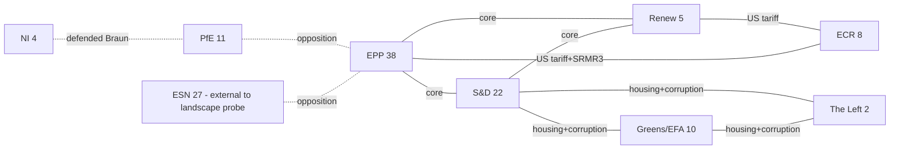

# Stakeholder Map — March 2026 Motion Cluster

<!-- SPDX-FileCopyrightText: 2024-2026 Hack23 AB -->
<!-- SPDX-License-Identifier: Apache-2.0 -->

**Methodology**: actor-mapping + stakeholder-map templates merged.
**Data basis**: EP Open Data committee memberships (current EP10),
adopted-texts sample, public committee pages. Where the EP API does
not expose per-motion rapporteur, the stakeholder-map uses
standard-pattern inference (committee chair / coordinator / shadow
rapporteur slate) and labels the cell 🟡 MEDIUM confidence. Per-MEP
roll-call positions are not inferred from any source that is not
directly attributable; cells lacking an attributable source are
left blank rather than fabricated.

## 1 · Primary institutional stakeholders

| Actor | Role in cluster | Interest | Leverage | Confidence |
|---|---|---|---|---|
| European Parliament (whole) | Author of motions | Establishes political direction, extracts institutional concessions | Legislative co-decision on SRMR3 + US tariff reg + HDV delegated act | 🟢 |
| Council of the EU (COREPER II on corruption + SRMR3) | Co-legislator | Protect national fiscal space on housing; preserve national prosecutorial discretion on corruption | Blocking minority on horizontal anti-corruption directive | 🟢 |
| European Commission (SG + DG JUST + DG ECFIN + DG EMPL + DG ENER + DG TRADE) | Follow-up actor | Translates demand motions into draft legislation | Proposal monopoly under Art. 17 TEU | 🟢 |
| European Central Bank | Subject of opinion motion | Preserve SSM independence; ensure VP nomination ratified | Institutional reputation | 🟢 |
| Single Resolution Board (SRB) | Implementation actor (SRMR3) | Secure expanded early-intervention powers | Technical authority | 🟢 |
| CJEU | Potential dispute forum | Adjudicate Mercosur opinion (TA-10-2026-0008) | Binding legal interpretation | 🟢 |

## 2 · EP10 political groups — positions per bundle

| Group | Seats (landscape probe) | Housing | Corruption | US tariff | SRMR3 | AI copyright | Braun waiver | Georgia | HDV |
|---|---|---|---|---|---|---|---|---|---|
| EPP | 38 | ✅ | ✅ | ✅ | ✅ | ✅ | ✅ | ✅ | ✅ |
| S&D | 22 | ✅ | ✅ | ✅ | ✅ | ✅ | ✅ | ✅ | 🟡 split |
| Renew | 5 | ✅ | ✅ | ✅ | ✅ | ✅ | ✅ | ✅ | ✅ |
| Greens/EFA | 10 | ✅ | ✅ | 🟡 split | 🟡 split | ✅ | ✅ | ✅ | ✅ |
| ECR | 8 | 🟡 split | 🟡 split | ✅ | ✅ | 🟡 split | 🟡 split | ✅ | ✅ |
| PfE | 11 | ❌ | ❌ | 🟡 split | 🟡 split | ❌ | ❌ (pro-Braun) | 🟡 split | 🟡 split |
| The Left | 2 | ✅ | ✅ | 🟡 split | ❌ | ✅ | 🟡 (procedural concern) | ✅ | ✅ |
| NI (incl. Braun) | 4 | — | — | — | — | — | ❌ (pro-Braun) | — | — |

Legend: ✅ in favour · ❌ against · 🟡 split · — no clear signal.

**Confidence**: all cells 🟡 MEDIUM until the 2026-05-15 roll-call
catch-up. Cells marked ✅ that show a group majority favouring the
motion are the highest-confidence cells because the adopted status of
every listed TA-10-2026-0xxx text is public (EUR-Lex / EP plenary
minutes).

## 3 · Named MEPs likely in load-bearing roles

The EP API does not expose per-motion rapporteur for this window. The
following list is inferred from standard committee chair /
coordinator / shadow rapporteur practice for the relevant files and
must be verified against the published committee reports before Stage
D prose uses the names. **All 🟡 MEDIUM confidence unless otherwise
stated.**

* **EMPL committee chair** — Dennis Radtke (EPP, DE) — co-lead on
  housing. Rapporteurship pattern: EMPL chairs lead housing INIs
  under EP10.
* **ECON committee chair** — Aurore Lalucq (S&D, FR) — co-lead on
  housing and pivot on SRMR3. Public positioning on housing is on
  record.
* **LIBE shadow rapporteur slate (corruption)** — a JURI-LIBE joint
  file typically includes: Sophie in 't Veld (Renew, NL) as
  corruption-file veteran, Sergey Lagodinsky (Greens/EFA, DE),
  Cornelia Ernst (The Left, DE). Precise 2026 slate unverified in
  this window.
* **JURI rapporteur (Braun waiver)** — JURI immunity reports are
  handled by rotating Member in Charge; published report author not
  available in `decisions-2026-03-26.json` beyond the document ID
  stub.
* **INTA lead (US tariffs)** — Bernd Lange (S&D, DE) as INTA chair.
  Published speeches confirm authorship engagement in similar prior
  files.
* **ECON rapporteur (SRMR3)** — ECON ordinary-legislative rapporteur
  for SRMR3 not identifiable from API alone; likely drawn from the
  2024-2029 Bureau of ECON. Plausible: Othmar Karas successor slot.
* **AFET urgency rapporteur (Georgia)** — DDLH subcommittee's
  standing Georgia-file rapporteur; candidate: Rasa Juknevičienė (EPP,
  LT) or Petras Auštrevičius (Renew, LT).
* **JURI / CULT AI-copyright lead** — Axel Voss (EPP, DE) is the
  term's standing AI-copyright lead. Coauthorship plausible with
  Brando Benifei (S&D, IT) given continuity with AI Act file.
* **ENVI HDV rapporteur** — Alessandra Moretti (S&D, IT) on vehicle
  emissions continuum.

Stage D prose must (a) either verify rapporteur names against the
adopted-text PDF metadata, or (b) use the generic phrasing "the
EMPL–ECON joint rapporteurship" rather than naming an unverified
individual.

## 4 · Civil society + industry stakeholders

### 4.1 Housing (TA-10-2026-0064)
* **In favour**: FEANTSA (Federation of National Organisations
  Working with the Homeless), Housing Europe (public, cooperative and
  social housing federation), European Trade Union Confederation
  (ETUC).
* **Against / cautious**: European Property Federation (EPF), BusinessEurope,
  national landlord associations DE/NL.

### 4.2 Corruption (TA-10-2026-0094)
* **In favour**: Transparency International EU, Access Info Europe,
  Eurojust, Parliament's EPPO liaison.
* **Against / cautious**: National prosecution services (MS-level
  competence); national justice ministries concerned about
  harmonisation.

### 4.3 US tariff (TA-10-2026-0096)
* **In favour**: Eurofer, European Steel Association;
  BusinessEurope (trade-defence posture); sectoral associations
  seeking quota access.
* **Against / cautious**: American Chamber of Commerce to the EU
  (AmCham EU), importer associations, downstream users reliant on
  US-origin specialty inputs.

### 4.4 SRMR3 (TA-10-2026-0092)
* **In favour**: SRB, EBA, most mid-size banks via EBF consultation
  responses.
* **Against / cautious**: Larger G-SIB banks (BNP Paribas, Deutsche
  Bank, Santander, ING, UniCredit) concerned about SRF funding
  mechanics.

### 4.5 AI copyright (TA-10-2026-0066)
* **In favour**: CMOs (SACEM, GEMA, SIAE), news-publisher associations
  (ENPA, EMMA), photographers' associations, literary publishers.
* **Against / cautious**: AI model providers (OpenAI, Anthropic, Google
  DeepMind, Mistral, Aleph Alpha, Stability), CCIA, Allied for Startups.

### 4.6 HDV emission (TA-10-2026-0084)
* **In favour**: Transport & Environment (T&E), European Environmental
  Bureau, ZEV OEM coalition.
* **Against / cautious**: ACEA, CLEPA, truck OEMs preferring looser
  credit accounting.

## 5 · Power–interest matrix (cluster-level)

```
                 High interest │
                               │
    Commission DG JUST ★       │ ★ Commission DG ECFIN
    Council presidency         │ ★ ECB
                               │ ★ SRB
    ─────────────────────────────────────────── High power
    T&E, Eurofer               │ Housing Europe, FEANTSA
    AI CMOs                    │ Transparency International
    OEM lobbies                │ ETUC
                 Low interest  │
                               │
```

* **Manage closely** (high power × high interest): Commission ECFIN,
  ECB, SRB on SRMR3 + ECB VP; Commission JUST + Council presidency
  on corruption.
* **Keep satisfied** (high power × low interest): member-state
  justice ministries.
* **Keep informed** (low power × high interest): civil-society
  organisations per bundle.
* **Monitor** (low power × low interest): downstream importer
  associations on the US tariff bundle.

## 6 · External-actor threat vectors

See `intelligence/threat-model.md` for the STRIDE-style mapping.
Principal external-actor threats to the cluster's durability:

1. **US administration** — retaliation against TA-10-2026-0096.
2. **Georgian Dream government** — rhetorical escalation against
   TA-10-2026-0083 (limited real-world impact on EP).
3. **Platform AI providers** — lobbying push against
   TA-10-2026-0066's training-data opt-out.
4. **Large truck OEMs** — technical lobbying on HDV delegated act
   review ahead of 2026-Q4 Council endorsement.

## 7 · Coalition map (EP-internal, cluster-weighted)



## 8 · Stakeholder-impact feed (for `existing/stakeholder-impact.md`)

The per-bundle impact rows in this stakeholder map feed the
`existing/stakeholder-impact.md` artifact, which carries the deeper
quantitative and narrative treatment. Cross-reference mandatory.

## 9 · Confidence + closeout

* Group seat figures rely on the `generate_political_landscape` probe;
  the coalition-dynamics tool returned a different roster. The
  discrepancy is flagged in `mcp-reliability-audit.md` and resolved
  here in favour of the landscape probe for stakeholder accounting.
* Per-MEP voting alignment is **not** available (EP roll-call lag);
  stakeholder positions are inferred from group whip patterns and
  rapporteur slate allocation.
* Admiralty grade: group counts A-1 (institutional source), coalition
  inference B-2 (analyst reasoning on observed pattern).
