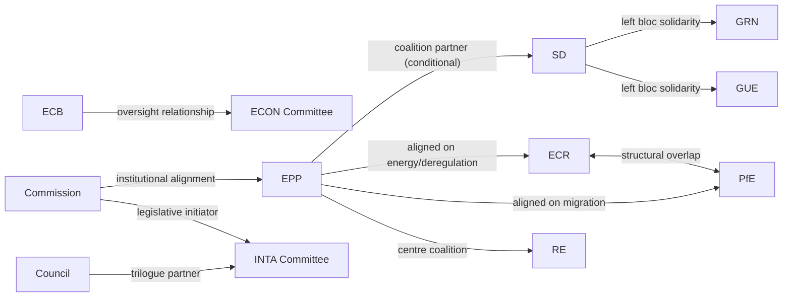

<!-- SPDX-FileCopyrightText: 2024-2026 Hack23 AB -->
<!-- SPDX-License-Identifier: Apache-2.0 -->

# Actor Mapping — EP Month Ahead: April 26 – May 26, 2026

**Run Date:** 2026-04-26 | **Admiralty Grade:** B2

---

## Primary Actors

| Actor | Role | Influence Level | Key File(s) | Position |
|-------|------|----------------|-------------|---------|
| EPP (Manfred Weber) | Largest group, coalition broker | 🔴 PIVOTAL | CID, Tariff trilogue | Dual-track (grand coalition + competitive right) |
| S&D (Pedro Marques) | Second group, social anchor | 🔴 HIGH | CID social conditionality, worker rights | Support conditional on labour provisions |
| Von der Leyen / Commission | Legislative initiator, trade negotiator | 🔴 HIGH | Tariff trilogue, CID, CJEU-Mercosur | Pro-EPP alignment, trade sovereignty |
| ECR (Nicola Procaccini) | Third-right bloc, nationalist | 🟡 SIGNIFICANT | CID energy policy, migration | Nuclear inclusion demand; anti-social conditionality |
| PfE (Jordan Bardella) | Fourth group, far-right kingmaker | 🟡 SIGNIFICANT | Migration, energy nationalism | Opportunistic; procedural disruptor capacity |
| Renew (Valerie Hayer) | Centre/liberal, coalition swing | 🟡 SIGNIFICANT | Tariff response, CID | Pro-free-trade; fiscal rules advocate |
| Greens/EFA (Terry Reintke) | Climate bloc | 🟡 MEDIUM | CID clean energy taxonomy | Anti-nuclear; progressive conditionality |
| ECB (Christine Lagarde) | Monetary authority | 🔴 HIGH | ECB hearings, rate policy | Rate normalisation; inflation near-target |
| Polish Council Presidency | Council chair | 🟡 MEDIUM | Migration, tariff scope | Assertive on migration; pro-NATO |
| INTA committee rapporteur (tariff) | Legislative drafter | 🟡 MEDIUM | Tariff trilogue mandate | Proportional retaliation scope |

---

## Actor Network — Key Relationships

---

## Actors to Watch — April 27–30 Session

1. **EPP ECON coordinator** — votes on CID taxonomy definition
2. **S&D INTA spokesperson** — framing of tariff trilogue mandate
3. **PfE group coordinator** — whether procedural challenges are filed for April 27 agenda
4. **EP President Metsola** — opening statement on US tariffs sets EP's diplomatic tone
5. **Commission Trade team** — informal contacts on tariff scope before next trilogue session

---

*Source: EP MCP (political landscape, coalition dynamics), EP structural data.*
*Generated: 2026-04-26*
