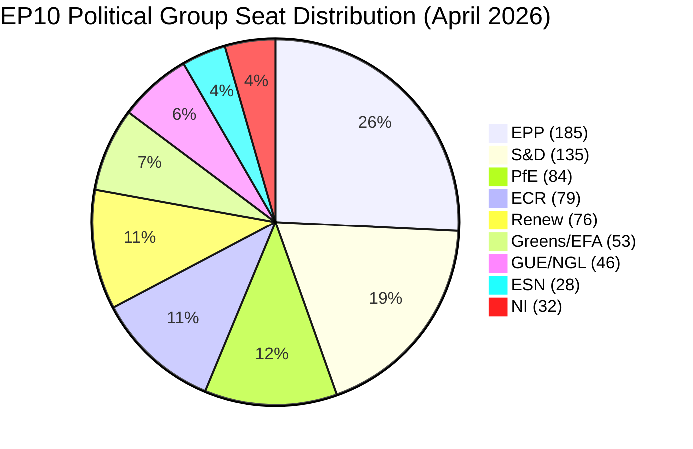

<!-- SPDX-FileCopyrightText: 2024-2026 Hack23 AB -->
<!-- SPDX-License-Identifier: Apache-2.0 -->

# Executive Brief — EP Month Ahead: April 26 – May 26, 2026

**Classification:** Public | **Confidence:** 🟡 Medium | **Admiralty Grade:** B3 (Fairly reliable source, possibly true)
**WEP Band:** 55–65% confidence on primary scenario | **Time Horizon:** 30 days

---

## BLUF — Bottom Line Up Front

The European Parliament enters its most consequential 30-day window since the start of EP10 year 2.
Two Strasbourg plenary sessions (April 27–30 and May 18–21) will handle legislative files directly
shaped by the EU-US tariff war, EU defence posture reform, and the political sustainability of the
Clean Industrial Deal. **The right-wing majority's numerical strength (52.3% of seats) masks
coalition fragility: every legislative majority requires at least 3 political groups, and EPP-ECR
alignment on migration enforcement increasingly diverges on climate and regulatory policy.**

---

## 60-Second Read

**Who:** European Parliament (720 MEPs, 8 political groups, 27 EU countries). EPP leads with 185
seats (25.7%); right-wing bloc (EPP+ECR+PfE+ESN) holds 52.3%; minimum coalition = 3 groups.

**What:** Two Strasbourg plenary sessions, 8 foreseen debate items for April 27–30, ongoing EU-US
tariff trilogue, CJEU opinion requested on EU-Mercosur, BRRD3 banking reform moving to Council,
and the June deadline for Clean Industrial Deal framework legislation.

**When:** April 27–30 (Strasbourg) → May 18–21 (Strasbourg) → next Brussels mini-plenary expected
June 15–18. The May 18–21 session falls immediately before the Labour Day EU summit window.

**Where:** Strasbourg (April 27–30, May 18–21). Brussels committee work intensifies in between.

**Why it matters:** EP10's structural shift rightward (right-wing share up from 42% in 2019 to 52.3%
in 2026) is now encountering real legislative test cases. The EU-US tariff adjustment — procedure
2025/0261(COD) — passed first reading on March 26 and entered trilogue on April 13. A US retaliatory
tariff escalation scenario (see wildcards) could force an emergency mini-plenary within this window.

**So what:** Analysts should monitor: (1) whether EPP President Weber achieves a working EPP-Renew-ECR
"competitive centre-right" majority on the Clean Industrial Deal regulation text; (2) whether PfE
attempts to derail EU-Mercosur CJEU proceedings as a proxy conflict over globalisation; (3) whether
the ECB's new vice-president appointment (March 10) signals a shift on interest rate guidance that
affects the legislative framing of the banking reform file.

---

## Top Trigger Events (next 30 days)

| # | Event | Date | Probability | Impact |
|---|-------|------|------------|--------|
| 1 | April 27–30 Strasbourg plenary (8 debate items) | Apr 27 | 95% | HIGH |
| 2 | EU-US tariff trilogue continuation | Rolling | 85% | HIGH |
| 3 | May 18–21 Strasbourg plenary | May 18 | 95% | HIGH |
| 4 | EU-Mercosur CJEU opinion request proceedings begin | May | 60% | MEDIUM |
| 5 | Clean Industrial Deal ECON/ITRE committee vote | May | 65% | HIGH |
| 6 | Defence Industrial Strategy legislative text circulation | May | 70% | HIGH |
| 7 | ECB rate decision (next expected: June, but May signals possible) | May | 45% | MEDIUM |
| 8 | US tariff escalation triggering emergency EP response | May | 30% | VERY HIGH |

---

## Political Arithmetic Summary

**Key arithmetic:**
- Absolute majority threshold: 361 seats
- EPP alone: 185 (49% of threshold)
- EPP + S&D: 320 (below threshold — grand coalition insufficient)
- EPP + S&D + Renew: 396 (✅ traditional "grand coalition" formula)
- EPP + ECR + PfE: 348 (below threshold — right-wing bloc needs ESN or NI)
- EPP + ECR + PfE + ESN: 376 (✅ far-right coalition viable on specific files)
- **Minimum winning coalition requires 3 groups from different blocs**

---

## Economic Context Headline (IMF WEO April 2026)

EU GDP growth forecast 2026: **+1.3%** (IMF WEO April 2026 — upgrade from 1.1% Oct 2025)
Euro area inflation (HICP): **+2.1%** (approaching ECB 2% target)
EU unemployment: **5.9%** (near historical low, structural labour shortages)
Fiscal deficit (EA average): **-2.8% of GDP** (above 3% SGP threshold in 5 member states)

*The improving but fragile macro environment both enables and complicates the EU's legislative agenda:
stronger growth reduces urgency for fiscal emergency measures but increases appetite for ambitious
investment frameworks like the Clean Industrial Deal. Persistent inflation above target limits ECB
flexibility and complicates borrowing cost assumptions in the Defence Industrial Strategy.*

---

## Key Risk Indicators (WEP confidence bands)

| Risk | Probability | Severity | WEP Band |
|------|------------|----------|---------|
| EU-US tariff escalation stalling trilogue | 35% | HIGH | 30–40% |
| EPP-ECR majority fracture on climate provisions | 40% | MEDIUM | 35–45% |
| PfE blocking EU-Mercosur via procedural challenge | 25% | MEDIUM | 20–30% |
| Defence spending agreement delayed past June | 45% | HIGH | 40–50% |
| ECB surprise hawkish signal affecting legislative mood | 20% | LOW | 15–25% |

---

*Source: EP Open Data Portal, EP Generated Statistics 2024–2026, IMF WEO April 2026, procedure tracking 2025/0261(COD).*
*Generated: 2026-04-26 | Run: month-ahead-2026-04-26*
