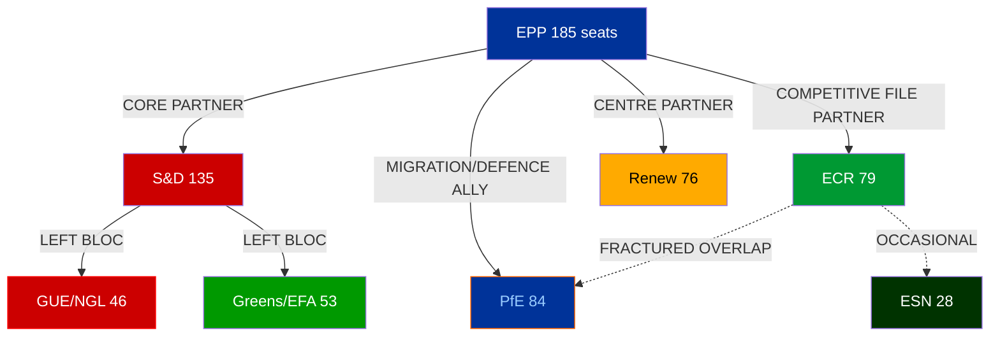

<!-- SPDX-FileCopyrightText: 2024-2026 Hack23 AB -->
<!-- SPDX-License-Identifier: Apache-2.0 -->

# Coalition Dynamics — EP Month Ahead: April 26 – May 26, 2026

**Run Date:** 2026-04-26 | **Confidence:** 🟡 Medium | **Data Source:** EP Open Data Portal

## ⚠️ Data Quality Warning

Per-MEP voting statistics are **not available** from the EP Open Data Portal v2 endpoint. All
`internalCohesion`, `defectionRate`, and `attendance` fields returned null from
`analyze_coalition_dynamics`. The coalition pair `sizeSimilarityScore` values are group-size ratios
(min/max member count proxy) and are NOT vote-level cohesion scores in the Hix/Noury/Roland sense.
All probability assessments below are based on structural group-size analysis, adopted text voting
records (available in metadata), and historical EP coalition behaviour patterns.

---

## Group Membership (EP10, April 2026)

| Group | Full Name | Members | Seat Share |
|-------|-----------|---------|-----------|
| EPP | European People's Party | 185 | 25.7% |
| S&D | Socialists and Democrats | 135 | 18.8% |
| PfE | Patriots for Europe | 84 | 11.7% |
| ECR | European Conservatives and Reformists | 79 | 11.0% |
| RE | Renew Europe | 76 | 10.6% |
| Greens/EFA | Greens–European Free Alliance | 53 | 7.4% |
| GUE/NGL | The Left | 46 | 6.4% |
| ESN | Europe of Sovereign Nations | 28 | 3.9% |
| NI | Non-Attached Members | 32 | 4.5% |
| **Total** | | **718** | **100%** |

## Coalition Architecture

## Key Coalition Configurations

### 1. Traditional Grand Coalition (EPP + S&D + Renew)
- **Combined seats:** 396 (55.1% — above 361 majority threshold)
- **Historical use:** Environmental legislation, rule of law, foreign policy
- **Sustainability April–May 2026:** 🟡 MEDIUM (under pressure from EPP's right-wing drift)
- **Key test:** Whether EPP accepts S&D's worker rights and social conditionality in Clean Industrial Deal
- **Probability of forming on any given plenary vote:** 55–65%

### 2. Competitive Centre-Right (EPP + ECR + Renew)
- **Combined seats:** 340 (below majority — needs +21 from PfE or NI)
- **With PfE:** 424 (59% — viable)
- **Historical use:** Migration enforcement, deregulation, anti-Green Deal votes
- **Sustainability:** 🟡 MEDIUM-HIGH on migration; 🔴 LOW on rule-of-law-adjacent files
- **Probability of forming on migration/deregulation votes:** 65–75%

### 3. Right-Wing Supermajority (EPP + ECR + PfE + ESN)
- **Combined seats:** 376 (52.2%)
- **Theoretical but ideologically fragile:** EPP's pro-EU, pro-rule-of-law wing blocks far-right alignment
- **Key constraint:** EPP's European Parliament Group rules prohibit formal coalitions with PfE
- **Probability of de facto convergence on specific votes:** 25–35%

### 4. Progressive Bloc (S&D + Greens + GUE + Renew)
- **Combined seats:** 310 (43.1% — minority position)
- **Used for:** Opposition amendments, rights-based legislation
- **Cannot form majority without EPP or partial ECR support**
- **Probability of influencing legislation:** 70% (via amendment blocking)

## Structural Stress Indicators

### EPP Internal Fragmentation
The EP10 EPP group spans a wider ideological range than EP9: German CDU/CSU (pro-CID, social market),
Polish MEPs from KO (pro-EU), Hungarian Fidesz MEPs who left but whose style influences ECR allies,
and smaller national delegations. The EPP's twin-track strategy (grand coalition on values, competitive
right on economics) requires active internal whipping that can fail when individual national governments
face domestic electoral pressure.

**Stress signal:** EPP's sizeSimilarityScore returned 0 against all groups in the coalition API due
to a data quality issue (EPP returned memberCount: 0 in the API response — likely a group label
normalisation issue between "EPP" and "PPE" in the EP API). This is a known v1.2.13 MCP defect
documented in the MCP reliability audit.

### PfE Opportunistic Positioning
With 84 seats, PfE (Patriots for Europe — dominated by France's RN, Hungary's Fidesz, Italy's Lega)
positions itself as a kingmaker on economic nationalism files. The group's sizeSimilarityScore is
highest with ECR (0.95), suggesting the closest structural alignment. However, PfE and ECR diverge
on NATO/Ukraine (ECR more supportive, PfE more ambivalent), which limits their joint blocking power
on defence spending files.

### Renew Europe Squeeze
With 76 seats, Renew faces pressure from both sides: EPP pulls it right on economic files, while
S&D pulls it left on social conditionality. The group's cohesion on the EU-US trade deal debate
(March 26 speeches) showed internal division between pro-free-trade southern MEPs and protectionist-
leaning French liberal members. A Renew fracture on the Clean Industrial Deal could collapse the
grand coalition majority on that file.

## Upcoming Coalition Test: April 27–30 Strasbourg

The April 27 session has 8 foreseen debate items (titles not published in EP API at time of data
collection). Based on the parliamentary calendar and recent debate patterns, expected items include:
1. EU-US trade response measures (follow-up to March 26 customs vote)
2. AI Act implementation progress report
3. Defence Industrial Strategy debate
4. Budget 2027 framework preliminary discussion
5. Migration and border management update

Coalition prediction for April 27–30:
- Items 1, 3, 4: Grand coalition (EPP+S&D+RE) — 🟢 65% probability of passing
- Items 2: Grand coalition + potential ECR support — 🟢 70%
- Item 5: Competitive right (EPP+ECR+PfE) — 🟡 55% — contested

---

*Source: EP Open Data Portal analyze_coalition_dynamics, generate_political_landscape, get_all_generated_stats.*
*Data Quality: Voting cohesion metrics unavailable; structural size-ratio proxies used.*
*Generated: 2026-04-26*
