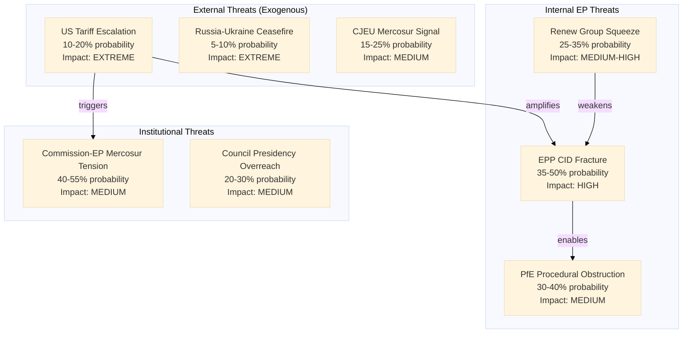

<!-- SPDX-FileCopyrightText: 2024-2026 Hack23 AB -->
<!-- SPDX-License-Identifier: Apache-2.0 -->

# Threat Model — EP Month Ahead: April 26 – May 26, 2026

**Run Date:** 2026-04-26 | **Framework:** CIA-style political threat model | **Admiralty Grade:** B2

---

## Threat Model Overview

---

## Threat Actor Profiles

### Threat Actor 1: US Administration (External State Actor)
- **Capability:** HIGH — can impose tariffs via executive order without Congressional approval
- **Intent:** MEDIUM-HIGH — demonstrable willingness to use tariffs as geopolitical leverage
- **Current activity:** Active — 2025/0261(COD) triggered by US tariff imposition
- **Expected action in 30 days:** Continued trilogue pressure; low probability of new escalation absent specific provocation (automotive sector 232 tariff investigation is the watch signal)

### Threat Actor 2: PfE Group (Internal EP Actor)
- **Capability:** MEDIUM — 84 seats + procedural tools (roll-call requests, referral motions)
- **Intent:** HIGH on disruption — group benefits politically from demonstrating EP dysfunction
- **Current activity:** Moderate — procedural challenges in national parliaments; EP posture TBD
- **Expected action in 30 days:** Test procedural tools in April 27 session; escalation conditional on how agenda items affecting RN/Fidesz interests are structured

### Threat Actor 3: Russian Disinformation Ecosystem (Hybrid Threat)
- **Capability:** MEDIUM — documented capacity to target EP debates via coordinated amplification
- **Intent:** HIGH — EP votes on Ukraine loan, tariff response, and defence spending are targets
- **Current activity:** Background level — no specific campaign detected in data collection
- **Expected action in 30 days:** Opportunistic amplification of EP internal divisions on Ukraine loan and defence spending

---

## Threat Scenarios by Likelihood-Impact

| Threat | Likelihood | Impact | Priority |
|--------|------------|--------|---------|
| US tariff escalation (automotive) | 10–20% | EXTREME | 🔴 MONITOR |
| EPP CID internal fracture | 35–50% | HIGH | 🔴 PRIORITY 1 |
| PfE procedural obstruction | 30–40% | MEDIUM | 🟡 WATCH |
| Trilogue scope narrowing | 55–70% | MEDIUM-HIGH | 🔴 PRIORITY 2 |
| Commission-EP Mercosur tension | 40–55% | MEDIUM | 🟡 WATCH |
| Russia-Ukraine ceasefire shock | 5–10% | EXTREME | 🟡 CONTINGENCY |

---

## Threat Mitigation Architecture

### Legislative Mitigation
1. **Tariff trilogue:** Maintain EP INTA committee's informal Council Presidency contacts
   to identify red lines before formal trilogue sessions. Commission trade team needs
   political pre-authorization to agree on scope before May 8.

2. **CID nuclear question:** EPP Group leadership should seek a technical working group
   with S&D and Greens/EFA coordinators to find a neutral taxonomy language before
   committee markup. "Technology-neutral" framing has historically bridged this divide.

3. **PfE procedural:** EP Presidency's Rules Committee should prepare procedural rulings
   in advance for predictable obstruction patterns on April 27 agenda.

### Institutional Mitigation
4. **Commission-EP Mercosur:** Commissioner Šefčovič should brief INTA committee in private
   session to prevent public adversarial framing. Institutional cooperation norms are
   best maintained through informal briefing before formal committee testimony.

5. **Russia disinformation:** INGE committee rapid response protocol should be activated
   for April 27–30 session given the high-profile nature of the debates.

---

## Threat Model Confidence

**Overall model confidence:** 🟡 MEDIUM
**Limitation:** No threat actor intelligence (signals intelligence, open source monitoring
of specific actors) was available in the data collection. Threat actor assessments are
based on structural behavioral analysis and historical patterns.
**Key assumption:** US Administration intent estimated from public policy signals and
tariff escalation trajectory; no insider information.

---

*Source: EP structural analysis, coalition dynamics, IMF WEO April 2026, EP historical data.*
*Generated: 2026-04-26 | Admiralty Grade: B2*
