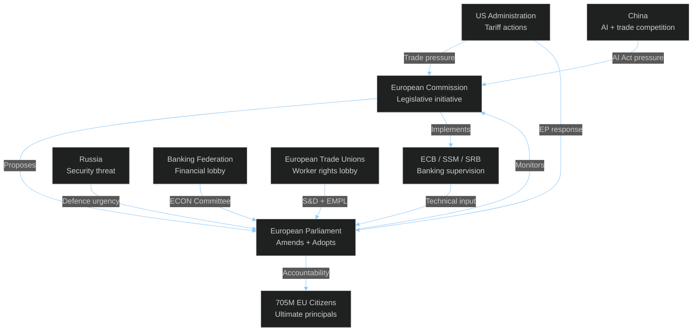

<!-- SPDX-FileCopyrightText: 2024-2026 Hack23 AB -->
<!-- SPDX-License-Identifier: Apache-2.0 -->

# Actor Mapping — EU Parliament Month in Review: March 27 – April 26, 2026

**Framework:** Principal-Agent Theory + Stakeholder Network Analysis  
**Level:** EU Institutional + National Government + Civil Society + External Actors  
**Confidence:** 🟡 Medium  

---

## Institutional Actors (Primary)

### 1. European Parliament — EPP Group (Dominant)
**Role:** Legislative principal; agenda-setter in EP10  
**Seats:** ~186 (26.4%)  
**Key interests:** Banking stability (German/Austrian EPP); AI competitiveness (Nordic/French EPP); Defence integration (Eastern/Baltic EPP)  
**Behavior pattern:** Maximizing legislative output in coalition with S&D/Renew; increasingly willing to use ECR/PfE on defence when S&D insufficient  
**Power:** 🔴 HIGH — No majority achievable without EPP

### 2. European Parliament — S&D Group
**Role:** Senior opposition + indispensable coalition partner  
**Seats:** 135 (19.1%)  
**Key interests:** Social Semester; banking consumer protection; gender pay gap; anti-corruption  
**Behavior pattern:** Supports EPP + Renew on European integration; resists EPP-right cooperation; demands social floor provisions in economic legislation  
**Power:** 🟠 MEDIUM-HIGH — Controls key committee rapporteurships; essential for core coalition majority

### 3. European Commission (von der Leyen II)
**Role:** Legislative initiator; implementation supervisor  
**Key actors:** Von der Leyen (President), Dombrovskis/successor (Finance), Teresa Ribera (Climate), Andrius Kubilius (Defence)  
**Behavior pattern:** Balanced agenda across EPP/S&D preferences; accelerated legislative pipeline in EP10 first 18 months  
**Power:** 🔴 HIGH — Exclusive legislative initiative; delegated acts authority

### 4. European Central Bank / Single Supervisory Mechanism
**Role:** Banking supervision; monetary policy  
**Key actors:** ECB President (Lagarde successor or Lagarde); SRB Chair  
**Behavior pattern:** Welcomed BRRD3/SRMR3; technical input on resolution thresholds  
**Power:** 🟠 MEDIUM-HIGH — Implementation authority for new banking resolution powers

---

## External State Actors (Secondary)

### 5. United States Administration
**Role:** Trade partner / tariff-imposing adversary  
**Behavior pattern 2026:** Section 232/301 tariffs maintained and potentially expanded; bilateral trade dialogue ongoing but progress limited  
**EP Impact:** TA-10-2026-0096 tariff adjustment directly responds to US tariff actions; WTO MC14 position reflects EU preference for multilateral rules over bilateral confrontation  
**Power:** 🔴 HIGH externally — Can inflict significant EU economic cost; cannot directly intervene in EP legislation

### 6. Russian Federation
**Role:** Ongoing military threat; sanctions target  
**Behavior pattern 2026:** War in Ukraine continues; information operations targeting EU public opinion; energy market disruption legacy  
**EP Impact:** Directly motivates defence integration legislation; test of enlargement strategy viability  
**Power:** 🟡 MEDIUM (externally) — Cannot shape EP votes but shapes security agenda

### 7. People's Republic of China
**Role:** Strategic competitor; trade partner; AI governance rival  
**Behavior pattern 2026:** AI governance international proposals differ from EU rights-based framework; EVs — Chinese manufacturers compete directly with EU automotive industry  
**EP Impact:** Background driver for AI Act + WTO position  
**Power:** 🟡 MEDIUM (externally) — Market access terms subject to EP/Commission decision

---

## Civil Society and Lobbying Actors

### 8. European Banking Federation
**Role:** Financial industry lobby  
**Position on March 2026 banking package:** Supported BRRD3 (certainty of resolution rules); opposed some DGSD2 cross-border elements (increased burden sharing)  
**Access points:** EP ECON Committee; Commission DG FISMA

### 9. Digital Economy Association (trade associations)
**Role:** Technology industry lobby on AI governance  
**Position:** Supported AI Act Omnibus simplification; oppose strict liability provisions; advocate for innovation sandboxes  
**Access points:** EP IMCO, JURI; Commission DG CONNECT

### 10. European Trade Union Confederation
**Role:** Worker representative body  
**Position:** Strongly supported Gender Pay Gap transparency; Social Semester social provisions; EU Talent Pool with strong labor standards  
**Access points:** S&D Group; EMPL committee; Commissioner for Employment

---

## Actor Network Map

---

## Power Grid Analysis

**Most influential actors (April 2026):**

1. 🥇 **ECB / SSM** — Banking Union implementation authority; May FSR could trigger BRRD3 powers
2. 🥈 **EPP Group** — Coalition pivot; controls EP presidency and major committee chairs
3. 🥉 **European Commission** — Agenda-setting; implementing act authority on AI Act Omnibus
4. 🏅 **US Administration** — Highest-impact external disruptor via tariff actions

**Weakest actors (relative to stakes):**
- Individual MEPs from small member states — outvoted on banking union despite national bank-specific concerns
- Greens/EFA — Opposed defence resolutions; lost on EPP-right majority
