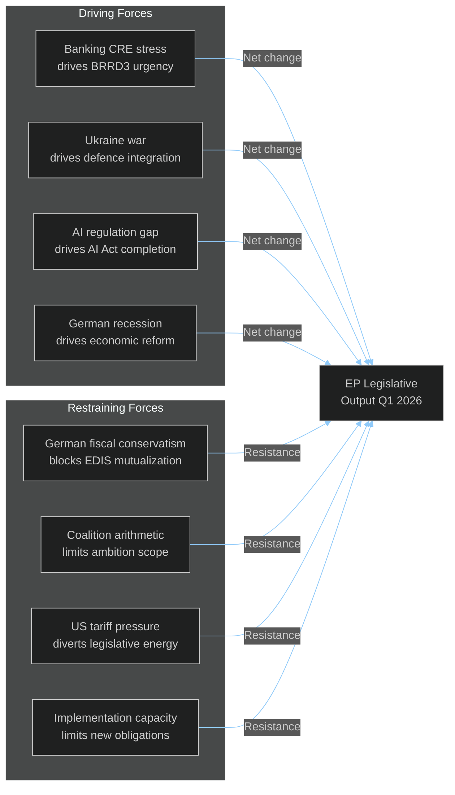

<!-- SPDX-FileCopyrightText: 2024-2026 Hack23 AB -->
<!-- SPDX-License-Identifier: Apache-2.0 -->

# Forces Analysis — EU Parliament Month in Review: March 27 – April 26, 2026

**Framework:** Porter's Five Forces adapted for EU Political Environment  
**Supplementary:** Galbraith Power Analysis; Bachrach-Baratz Two-Face Model  
**Confidence:** 🟡 Medium  

---

## Five Political Forces Analysis

### Force 1: Legislative Rivalry (Intensity of Competition)
**Score:** 🔴 HIGH (8/10)

EP10's political group competition is more intense than EP9 because:
- **More groups, smaller average seat share**: 8 effective groups vs 7 in EP9; average group size ~90 seats vs ~100
- **Multiple viable coalitions**: EPP+S&D+Renew AND EPP+ECR+Renew+PfE can both achieve majority — groups compete to be the marginal coalition member
- **Committee competition**: Banking union legislative report was contested between EPP (ECON chair) and S&D (shadow rapporteur); trade-offs on DGSD2 risk-sharing directly reflect rapporteur competition

**Legislative rivalry consequence**: Competition drove more comprehensive texts (Banking Union package absorbed 30+ amendments) but also slowed process (14 years) and created compromise quality.

### Force 2: Threat of New Political Entrants
**Score:** 🟡 MEDIUM (6/10)

**ESN (Europe of Sovereign Nations)** — launched EP10 as the new far-right grouping beyond ECR and PfE — represents the most recent entrant. With 27 seats, ESN:
- Provides an exit option for MEPs dissatisfied with ECR or PfE discipline
- Creates competitive pressure on ECR/PfE to outbid each other on eurosceptic positions
- Has not yet achieved committee chair despite seats size

**Future entrant threat**: If Italy's Movimento 5 Stelle/France's La France Insoumise-linked MEPs coalesce, a new left-sovereigntist group could emerge, attracting The Left MEPs. Estimated 5-10% probability within EP10 term.

### Force 3: Bargaining Power of National Governments (Suppliers)
**Score:** 🔴 HIGH (9/10)

MEPs are ultimately accountable to national parties, which sit in national governments. National governments exercise power through:
- **European Council mandates**: The Council's position on any piece of legislation shapes what EP can achieve in trilogue
- **MEP selection**: National party lists determine who becomes MEP; poorly-performing MEPs can be de-listed
- **German veto dynamics**: On DGSD2, German CDU/CSU (largest EPP national delegation) resisted further risk-sharing steps; this constraint was transmitted through CDU MEPs' negotiating position

**This month's evidence**: The non-binding character of defence resolutions reflects Council's reluctance to bind member states' defence procurement sovereignty — EP ambition constrained by anticipated Council resistance.

### Force 4: Bargaining Power of Constituents (Buyers)
**Score:** 🟡 MEDIUM (5/10)

EU citizens have limited direct bargaining power over EP legislation between elections (EP elections every 5 years). Indirect channels:
- **Petitions** to EP Committee on Petitions
- **European Citizens' Initiative** (requires 1 million signatures)
- **Public hearings** and committee consultations

**This month**: No major ECI active on banking/defence/AI dossiers. Public visibility low — typically EU citizens learn of banking union completion only through national media, if at all.

### Force 5: Threat from External Regulatory and Geopolitical Substitutes
**Score:** 🔴 HIGH (8/10)

External forces that could substitute or undermine EP's legislative achievements:
- **US non-ratification of WTO rules**: WTO MC14 outcome dependent on US participation; without US, WTO-based trade dispute resolution becomes non-functional
- **AI Act supersession**: If EU AI Act is seen as too burdensome, major AI developers could exit EU market, rendering regulation moot
- **Russian military pressure**: Defence integration legislation becomes more/less relevant depending on frontline trajectory in Ukraine

---

## Galbraith Power Modes Analysis

**Condign Power** (compelling through adverse consequences):
- Commission's enforcement authority: infringement procedures against member states that don't implement banking/AI directives
- ECB/SSM's supervisory powers: enhanced by BRRD3 early intervention

**Compensatory Power** (inducing through reward):
- EU Structural Funds conditioned on Semester compliance
- EU Talent Pool improves member state labor market access in exchange for harmonized immigration rules

**Conditioned Power** (changing beliefs/preferences):
- AI Act Omnibus reflects the Commission successfully conditioning MEPs' beliefs about innovation vs. regulation balance
- ESC Convention AI ratification represents EU successfully projecting conditioned power toward international partners

---

## Force Field Summary

**Net Force Assessment**: Driving forces exceeded restraining forces in March-April 2026, producing an unusually productive legislative session. The productivity rate is unlikely to be sustained in Q2-Q3 2026 as restraining forces intensify (election cycle fatigue, implementation burden, economic headwinds).
