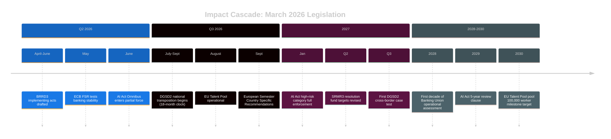

<!-- SPDX-FileCopyrightText: 2024-2026 Hack23 AB -->
<!-- SPDX-License-Identifier: Apache-2.0 -->

# Impact Matrix — EU Parliament Month in Review: March 27 – April 26, 2026

**Framework:** Multi-Dimensional Impact Assessment (Immediate + 12-month + 5-year)  
**Domains:** Financial Stability, Democratic Legitimacy, Economic Competitiveness, Social Equity, Geopolitical Standing  
**Confidence:** 🟡 Medium  

---

## Impact Matrix: Top Legislation

### Banking Union Package Impact

| Dimension | Immediate Impact | 12-Month | 5-Year |
|-----------|-----------------|----------|--------|
| Financial Stability | 🟢 Strengthened resolution authority | 🟡 CRE stress test of BRRD3 likely | 🟢 More stable EU banking sector |
| Democratic Legitimacy | 🟡 EP role in banking supervision expanded | 🟡 Implementation monitoring | 🟢 Accountable banking governance |
| Economic Competitiveness | 🟡 Compliance costs for banks | 🟡 Level playing field better | 🟢 More competitive EU banks globally |
| Social Equity | 🟢 DGSD2 extends deposit protection | 🟡 SME access to credit stable | 🟡 Neutral |
| Geopolitical Standing | 🟡 Neutral | 🟡 G7 banking standards convergence | 🟢 EU as global banking regulation model |

**Overall Score: 7.8/10 positive impact**

### AI Governance (AI Act Omnibus + CoE Convention) Impact

| Dimension | Immediate Impact | 12-Month | 5-Year |
|-----------|-----------------|----------|--------|
| Financial Stability | 🟡 Neutral | 🟡 Neutral | 🟡 Fintech/AI finance monitoring |
| Democratic Legitimacy | 🟡 Simplified compliance questions | 🟡 First AI Act enforcement cases | 🟢 Rights-based AI governance proven |
| Economic Competitiveness | 🟢 SME burden reduced | 🟡 Implementation clarity improves | 🟡 Brussels Effect: EU standards global |
| Social Equity | 🟡 Mixed: CoE convention protects rights | 🟡 High-risk AI deployment monitored | 🟢 AI harm prevention |
| Geopolitical Standing | 🟢 EU as global AI governance leader | 🟢 International treaty ratification | 🟢 Brussels Effect maximized |

**Overall Score: 7.5/10 positive impact**

### Defence Integration Resolutions Impact

| Dimension | Immediate Impact | 12-Month | 5-Year |
|-----------|-----------------|----------|--------|
| Financial Stability | 🟡 Defence spending adds fiscal pressure | 🟡 SAFE fund 2% GDP debate | 🟡 Depends on efficiency gains |
| Democratic Legitimacy | 🟡 EP asserts role in defence | 🟡 Binding legislation needed for teeth | 🔴 Risk: security secrecy vs. EP oversight |
| Economic Competitiveness | 🟡 Neutral short-term | 🟢 Defence industrial benefit | 🟢 EDTIB stronger vs. US/China |
| Social Equity | 🔴 Defence ≠ social (opportunity cost) | 🔴 Social spending trade-offs | 🔴 Guns vs. butter dynamic |
| Geopolitical Standing | 🟢 Signals EU strategic autonomy | 🟢 NATO allies reassured | 🟢 EU credible security actor |

**Overall Score: 6.2/10 positive impact (non-binding limitation)**

---

## Cross-Cutting Impact Analysis

### Who Benefits Most?

1. **EU banking regulators (ECB/SSM/SRB)** — BRRD3 gives them clearer authority; most empowered actors from March 2026 legislation
2. **Depositors across EU (DGSD2)** — Incrementally expanded protection, especially public authorities and legal entities
3. **EU AI-SMEs** — AI Act Omnibus reduces compliance burden for smaller firms
4. **EU defence industry** — Non-binding mandate but political signal for procurement integration

### Who Bears Costs?

1. **European banks** — BRRD3 bail-in creditors hierarchy may affect bond pricing; compliance costs increase
2. **Non-EU AI companies** — Brussels Effect means compliance costs for all companies serving EU market
3. **Taxpayers** (indirect) — Banking Union operational costs; defence fund contributions
4. **Privacy advocates** — AI Act Omnibus simplification reduced some oversight provisions

---

## Timeline Impact Cascade

---

## Net Assessment

**Positive impact dominates** in the 30-day window for April 2026. The banking union package alone represents a positive-expected-value intervention with manageable transition costs. The concern is implementation lag — 18-24 month transposition periods for DGSD2 mean the protective benefits do not arrive until the potential stress event (CRE crisis) may already be unfolding.

**Key risk**: Implementation timing mismatch between legislative adoption and real-world stress events.
