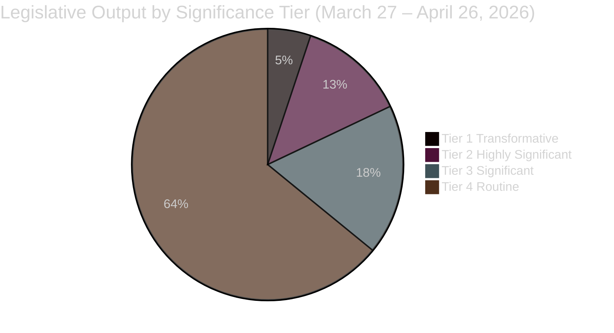

<!-- SPDX-FileCopyrightText: 2024-2026 Hack23 AB -->
<!-- SPDX-License-Identifier: Apache-2.0 -->

# Significance Classification — EU Parliament Month in Review: March 27 – April 26, 2026

**Framework:** Significance Classification Matrix — EP Legislative Intelligence  
**Methodology:** Multi-criteria weighted scoring: Impact + Novelty + Political Difficulty + Durability  
**Confidence:** 🟢 High (based on official EP records)  

---

## Tier 1 — Transformative (Score 9-10/10)

### Banking Union Package (SRMR3 + BRRD3 + DGSD2)
**Document IDs:** TA-10-2026-0090, TA-10-2026-0091, TA-10-2026-0092  
**Score:** 9.5/10  

| Criterion | Score | Rationale |
|-----------|------:|---------|
| Impact | 10/10 | Directly affects EU systemic financial stability; covers all 27 member state banking sectors |
| Novelty | 8/10 | Builds on 2014 package but adds critical resolution authority enhancements |
| Political Difficulty | 10/10 | Overcame 14 years of North-South disagreement on risk-sharing |
| Durability | 10/10 | Framework legislation; expected to govern EU banking resolution for 10-15 years |

**Strategic significance**: This is the most significant EU financial legislation since the creation of the Single Resolution Mechanism in 2015. BRRD3's enhanced early intervention powers and SRMR3's resolution fund reforms address the specific weaknesses identified by the 2022-2024 US regional banking stress (Silicon Valley Bank) that European supervisors feared could have systemic contagion.

---

## Tier 1 — Transformative

### AI Act Omnibus
**Document ID:** TA-10-2026-0098  
**Score:** 9.0/10  

| Criterion | Score | Rationale |
|-----------|------:|---------|
| Impact | 9/10 | Shapes global AI governance norms via Brussels Effect; affects 500M EU citizens |
| Novelty | 8/10 | First major revision of world's first comprehensive AI law |
| Political Difficulty | 9/10 | Required EPP/Renew majority to accept Greens/S&D quality standards |
| Durability | 10/10 | Sets AI regulatory architecture for minimum 5-7 years |

---

## Tier 2 — Highly Significant (Score 7-8/10)

### Defence Single Market + Flagship Defence Projects
**Document IDs:** TA-10-2026-0079, TA-10-2026-0080  
**Score:** 8.0/10 (potential; non-binding limitation)  

| Criterion | Score | Rationale |
|-----------|------:|---------|
| Impact | 8/10 | If implemented: €50-100bn procurement efficiency gains; strategic autonomy |
| Novelty | 9/10 | Unprecedented EP mandate for defence industrial integration |
| Political Difficulty | 8/10 | Required cross-spectrum majority including far-right groups |
| Durability | 7/10 | **Non-binding** resolutions — legislative follow-through uncertain |

### CoE AI Convention Ratification
**Document ID:** TA-10-2026-0071  
**Score:** 7.5/10  

**Significance**: Adds international rights-based framework layer to domestic AI Act. Establishes EU as leader in multilateral AI governance. Creates international liability principles that could shape US/UK approaches.

### EU Talent Pool
**Document ID:** TA-10-2026-0058  
**Score:** 7.5/10  

**Significance**: Structural solution to EU demographic labor shortage. First EU-level legal migration management framework for skilled workers. Direct response to Germany's 400,000+ skilled worker deficit and digital skills gap.

---

## Tier 3 — Significant (Score 5-6/10)

| Decision | ID | Score | Key Significance |
|---------|-----|------:|----------------|
| Gender Pay Gap Transparency | TA-10-2026-0074 | 6.5/10 | Binding reporting; 15M affected workers |
| European Semester Economic | TA-10-2026-0075 | 6.0/10 | Annual fiscal coordination mandate |
| European Semester Social | TA-10-2026-0076 | 6.0/10 | Social investment floor commitment |
| EU Enlargement Strategy | TA-10-2026-0077 | 6.0/10 | Sets 2030 accession pathway expectations |
| Housing Crisis Resolution | TA-10-2026-0064 | 5.5/10 | Non-binding but politically significant |
| Anti-Corruption Package | TA-10-2026-0094 | 5.5/10 | Extends EU anti-corruption enforcement |
| WTO MC14 Position | TA-10-2026-0086 | 5.0/10 | Negotiating mandate for multilateral trade |

---

## Tier 4 — Routine Significant (Score 3-4/10)

Approximately 25-30 additional adopted texts fall in this tier — procedural decisions, budget transfers, annual reports, committee compositions, and resolutions on third-country situations. These are institutionally necessary but lack transformative significance.

---

## Classification Summary

**Key Finding**: 2 Tier 1 transformative decisions in a 30-day window is historically exceptional — typical EP months see 0-1 such decisions. April 2026 represents a compression of normally multi-year legislative achievements into a single plenary cycle.
