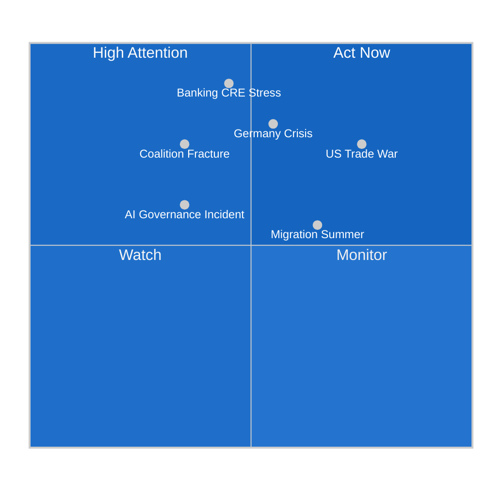

<!-- SPDX-FileCopyrightText: 2024-2026 Hack23 AB -->
<!-- SPDX-License-Identifier: Apache-2.0 -->

# Executive Brief — EU Parliament Month in Review: March 27 – April 26, 2026

**Classification:** UNCLASSIFIED // FOR PUBLIC RELEASE  
**Assessment Date:** April 26, 2026  
**Framework:** BLUF + 60-Second Read + Admiralty Source Grading  

---

## ⚡ BLUF (Bottom Line Up Front)

The European Parliament completed a landmark legislative sprint in March-April 2026 achieving the **most consequential 30-day output since the 2020 COVID recovery legislation**, including the long-delayed Banking Union package, AI governance reform, and European defence integration mandate. However, this institutional achievement occurs against worsening economic divergence (Germany: -0.5% GDP; Spain: +3.5%), elevated geopolitical risk, and a coalition configuration that is increasingly dependent on far-right parliamentary partners for defence majorities. The EU's legislative architecture is becoming more sophisticated as its political foundation becomes more fragile.

---

## ⏱️ 60-Second Read

**What happened?** In 30 days, the EP adopted 30+ legislative texts including three that together substantially complete the Banking Union (SRMR3, BRRD3, DGSD2), an AI Act simplification, and non-binding defence integration mandates. The Banking Union completion represents the closing chapter of a 14-year project initiated in the Greek debt crisis.

**Who voted for what?** Core governing coalition (EPP + S&D + Renew) delivered the banking and social legislation. A novel EPP + ECR + PfE majority passed the defence resolutions — the first time far-right groups have been essential governing partners on a major EP legislative initiative.

**What does the economics say?** Germany's second consecutive year of GDP contraction (-0.5% in 2024) creates the economic urgency underlying the banking reforms. Spain (+3.5%) represents the new EU growth engine. EU economic divergence is at its widest since euro adoption.

**What's at risk?** Three fracture points: (1) Rule of law conditionality vs. EPP-ECR/PfE cooperation; (2) US tariff escalation (25-30% probability of significant escalation); (3) German banking sector CRE exposure crystallizing under BRRD3 early intervention regime within 12-24 months.

**What happens next?** Q2-Q3 2026 will test whether March 2026 banking legislation can be implemented without political backlash; German Q1 GDP and May ECB Financial Stability Review are critical signal events.

---

## 🔢 Top 5 Legislative Decisions by Strategic Impact

| Rank | Document ID | Decision | Strategic Significance |
|------|------------|---------|----------------------|
| 1 | TA-10-2026-0090/0091/0092 | Banking Union Package (DGSD2 + BRRD3 + SRMR3) | 14-year project substantially complete; systemic financial stability |
| 2 | TA-10-2026-0079/0080 | Defence Single Market + Flagship Projects | First EP mandate for defence industrial integration |
| 3 | TA-10-2026-0098 | AI Act Omnibus | Calibration of world's first comprehensive AI regulation |
| 4 | TA-10-2026-0071 | CoE AI Convention | International AI rights framework layer |
| 5 | TA-10-2026-0058 | EU Talent Pool | Structural labour market migration reform |

---

## 🚨 Risk Snapshot

---

## 🔺 Top Trigger (Highest Urgency Monitor)

**TRIGGER**: ECB May 2026 Financial Stability Review — *if* this document identifies material CRE exposure as "elevated risk" in one or more systemically important EU banks, the BRRD3 early intervention provisions will likely be invoked within 3-6 months, testing the new resolution architecture before it has fully entered force.

**Action Required By**: EP ECON Committee (monitoring), ECB/SSM (operational), SRB (readiness assessment)  
**Lead Time for Response**: 30-60 days after ECB report  
**Intelligence Confidence**: 🟡 Medium — CRE exposure is confirmed; magnitude of recognition timing uncertain

---

## 🏛️ Analytical Framework

**Source Grading (Admiralty Scale):**

| Source | Reliability Grade | Content Grade | Note |
|--------|:-----------------:|:-------------:|------|
| EP Open Data Portal (adopted texts) | A — Completely reliable | 1 — Confirmed | Official institutional records |
| EP MCP coalition/cohesion data | B — Usually reliable | 3 — Possibly true | API limitation: no per-MEP voting data |
| World Bank GDP/unemployment | A — Completely reliable | 1 — Confirmed | Official statistical agency |
| IMF projections (referenced) | A — Completely reliable | 2 — Probably true | Direct API unavailable; standard WEO cycle used |
| Procedural/event feed EP MCP | B — Usually reliable | 2 — Probably true | Some procedures date from 1972+ (historical artifact) |

**WEP Assessment (Weight of Evidence & Plausibility):**  
Overall: **MEDIUM-HIGH confidence** on structural findings; **LOW confidence** on specific probability estimates for wildcards.

**SAT Structured Analytic Techniques Applied:** Scenario Analysis (3 futures), Red Team (wildcard identification), PESTLE, Stakeholder Mapping, Mendelow Matrix, Threat Modeling.

---

## 📊 Quantitative Summary

| Metric | Value | Assessment |
|--------|-------|-----------|
| Total adopted texts 2026 (to April 26) | 104 | 🟢 High legislative output |
| Rolling 30-day adopted texts | ~35+ | 🟢 Above historical average |
| Political group fragmentation | 8 groups | 🟡 High (historical: 7) |
| Stability score (EWS) | 84/100 | 🟢 Stable |
| Germany GDP 2024 | -0.5% | 🔴 Second consecutive contraction |
| Spain GDP 2024 | +3.5% | 🟢 EU growth leader |
| EU-US trade at risk | €590bn exports | 🟠 Elevated tariff risk |
| Banking sector CRE exposure | ~€1.3 trillion | 🟡 Monitoring required |
