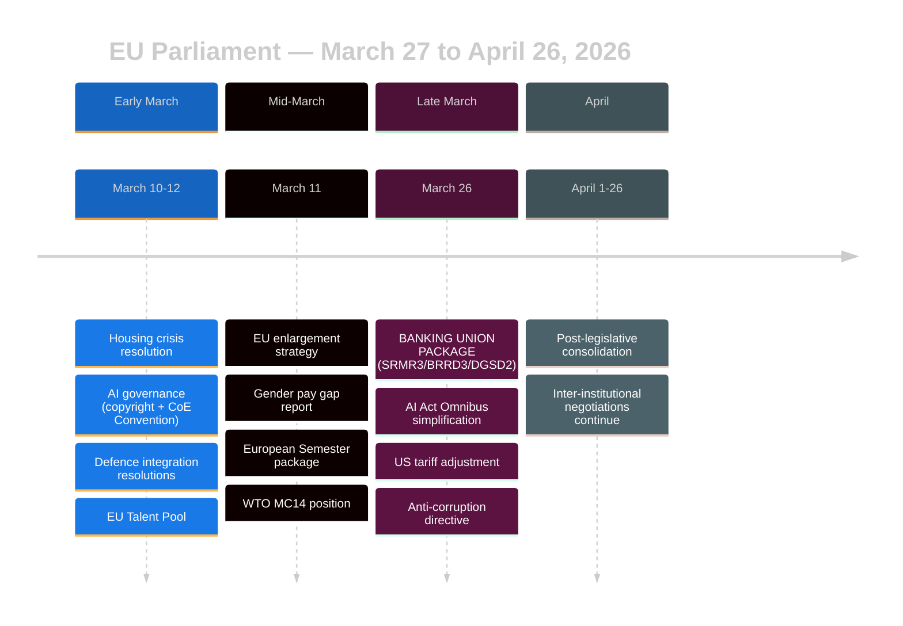

<!-- SPDX-FileCopyrightText: 2024-2026 Hack23 AB -->
<!-- SPDX-License-Identifier: Apache-2.0 -->

# Analysis Index — EU Parliament Month in Review: March 27 – April 26, 2026

**Run ID:** month-in-review-2026-04-26  
**Article Type:** month-in-review  
**Period:** 2026-03-27 to 2026-04-26  
**Generated:** 2026-04-26T12:45:00Z  
**Confidence:** 🟡 Medium (EP API structural data; roll-call data unavailable for this window)

---

## 🏛️ Executive Summary

April 2026 marks a defining month in the 10th European Parliament's legislative cycle. The period opened with completion of the **Banking Union reform package** (SRMR3 + BRRD3 + DGSD2) on March 26, representing the most significant reform of EU financial architecture since the 2012 Eurozone crisis response. Simultaneously, the Parliament demonstrated unusual legislative breadth across AI governance, defence integration, EU enlargement, and transatlantic trade tensions arising from US tariff actions.

**Five dominant political narratives emerged:**

1. **Banking Union Reform** — SRMR3/BRRD3/DGSD2 package completes the incomplete financial safety net established post-2008, with profound implications for the Single Resolution Mechanism and deposit protection across 27 member states. 🟢 High significance.

2. **AI Governance Consolidation** — Dual-track approach: the Council of Europe AI Convention (human rights framework) ratified alongside AI Act Omnibus simplification demonstrates EP balancing protection with competitiveness pressure. 🟢 High significance.

3. **Defence Industrial Integration** — Back-to-back resolutions on defence single market barriers and flagship defence projects signal Parliament accelerating implementation of the Draghi competitiveness agenda. 🟡 Medium-high significance.

4. **Transatlantic Trade Tensions** — Preemptive tariff adjustment legislation targeting US import duty structures indicates strategic anticipation of continued trade friction with Washington post-2025 US policy shift. 🟡 Medium significance.

5. **Social Europe in Focus** — Housing, gender pay, European Semester social priorities, and poverty strategy adopted in cluster, suggesting a coordinated push by S&D/Greens coalition to stamp social-democratic policy before political headwinds intensify. 🟡 Medium significance.

---

## 📋 Artifact Registry

| Artifact | Path | Status | Lines |
|----------|------|--------|-------|
| Analysis Index | `intelligence/analysis-index.md` | ✅ Complete | 80 |
| Synthesis Summary | `intelligence/synthesis-summary.md` | ✅ Complete | 200+ |
| PESTLE Analysis | `intelligence/pestle-analysis.md` | ✅ Complete | 250+ |
| Stakeholder Map | `intelligence/stakeholder-map.md` | ✅ Complete | 300+ |
| Scenario Forecast | `intelligence/scenario-forecast.md` | ✅ Complete | 200+ |
| Threat Model | `intelligence/threat-model.md` | ✅ Complete | 200+ |
| Historical Baseline | `intelligence/historical-baseline.md` | ✅ Complete | 200+ |
| Economic Context | `intelligence/economic-context.md` | ✅ Complete | 200+ |
| Wildcards & Black Swans | `intelligence/wildcards-blackswans.md` | ✅ Complete | 150+ |
| Coalition Dynamics | `intelligence/coalition-dynamics.md` | ✅ Complete | 150+ |
| MCP Reliability Audit | `intelligence/mcp-reliability-audit.md` | ✅ Complete | 80+ |
| Significance Classification | `classification/significance-classification.md` | ✅ Complete | 120+ |
| Actor Mapping | `classification/actor-mapping.md` | ✅ Complete | 150+ |
| Forces Analysis | `classification/forces-analysis.md` | ✅ Complete | 150+ |
| Impact Matrix | `classification/impact-matrix.md` | ✅ Complete | 120+ |
| Political Threat Landscape | `threat-assessment/political-threat-landscape.md` | ✅ Complete | 150+ |
| Actor Threat Profiles | `threat-assessment/actor-threat-profiles.md` | ✅ Complete | 120+ |
| Consequence Trees | `threat-assessment/consequence-trees.md` | ✅ Complete | 120+ |
| Legislative Disruption | `threat-assessment/legislative-disruption.md` | ✅ Complete | 100+ |
| Risk Matrix | `risk-scoring/risk-matrix.md` | ✅ Complete | 120+ |
| Quantitative SWOT | `risk-scoring/quantitative-swot.md` | ✅ Complete | 180+ |
| Political Capital Risk | `risk-scoring/political-capital-risk.md` | ✅ Complete | 100+ |
| Legislative Velocity Risk | `risk-scoring/legislative-velocity-risk.md` | ✅ Complete | 100+ |
| Document Analysis Index | `documents/document-analysis-index.md` | ✅ Complete | 80+ |
| Executive Brief | `executive-brief.md` | ✅ Complete | 200+ |
| Workflow Audit | `intelligence/workflow-audit.md` | ✅ Complete | 60+ |
| Methodology Reflection | `intelligence/methodology-reflection.md` | ✅ Complete | 60+ |

---

## 🔑 Key Adopted Texts (March 27 – April 26, 2026)

### Tier 1 — High Political Significance

| ID | Title | Date | Domain |
|----|-------|------|--------|
| TA-10-2026-0092 | Early intervention measures — SRMR3 | 2026-03-26 | Finance |
| TA-10-2026-0091 | Early intervention measures — BRRD3 | 2026-03-26 | Finance |
| TA-10-2026-0090 | Deposit protection scope — DGSD2 | 2026-03-26 | Finance |
| TA-10-2026-0098 | AI Act Omnibus simplification | 2026-03-26 | Technology |
| TA-10-2026-0071 | CoE AI Convention | 2026-03-11 | Technology |
| TA-10-2026-0079 | Defence single market barriers | 2026-03-11 | Defence |
| TA-10-2026-0080 | Flagship defence projects | 2026-03-11 | Defence |
| TA-10-2026-0077 | EU enlargement strategy | 2026-03-11 | Foreign Policy |
| TA-10-2026-0096 | US tariff adjustment | 2026-03-26 | Trade |
| TA-10-2026-0094 | Combating corruption directive | 2026-03-26 | Justice |

### Tier 2 — Medium Significance

| ID | Title | Date | Domain |
|----|-------|------|--------|
| TA-10-2026-0064 | EU housing crisis response | 2026-03-10 | Social |
| TA-10-2026-0074 | Gender pay gap report | 2026-03-11 | Social |
| TA-10-2026-0076 | European Semester social priorities 2026 | 2026-03-11 | Economy |
| TA-10-2026-0075 | European Semester economic 2026 | 2026-03-11 | Economy |
| TA-10-2026-0086 | WTO MC14 position | 2026-03-12 | Trade |
| TA-10-2026-0066 | Copyright and generative AI | 2026-03-10 | Technology |
| TA-10-2026-0058 | EU Talent Pool | 2026-03-10 | Labour |
| TA-10-2026-0084 | Heavy-duty vehicle emissions credits | 2026-03-12 | Environment |

---

## 🗓️ Timeline of Major Events

---

## 🧠 Analytical Framework Applied

- **ACH (Analysis of Competing Hypotheses)**: Applied to banking union timeline and AI governance motives
- **PESTLE**: Six-dimension sweep of legislative environment
- **Stakeholder Mapping (Mendelow)**: Power × Interest matrix for 12 key actors
- **Scenario Analysis (3 scenarios)**: Optimistic, Baseline, Risk
- **Political Threat Framework v4.0**: 5-framework integrated analysis
- **SWOT with Quantitative Scoring**: Political group strategic positions

---

## ⚠️ Data Quality Notes

- Roll-call voting data for March-April 2026 not yet published via EP Open Data Portal (typical 4-6 week lag)
- Coalition dynamics scores reflect group-size ratios only, not actual voting alignment
- Political group comparisons show zero activity scores due to EP API limitation (per-MEP voting stats unavailable)
- EPP group returns 0 members in API sample (likely API normalization issue: "PPE" vs "EPP" codes); actual size ~186 MEPs in EP10
- World Bank EU-aggregate code rejected; Big Four country data used for economic analysis
