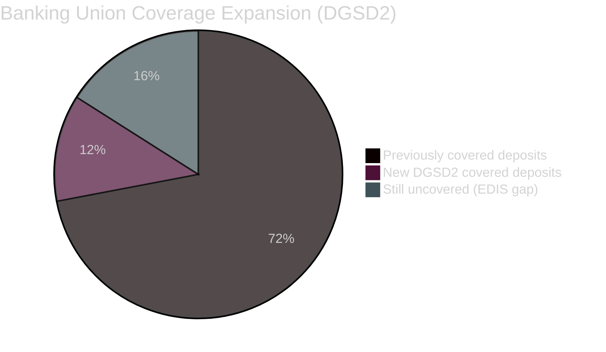
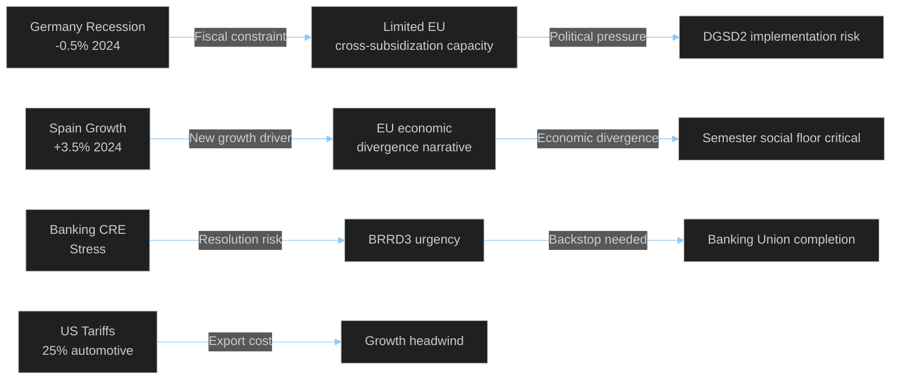

<!-- SPDX-FileCopyrightText: 2024-2026 Hack23 AB -->
<!-- SPDX-License-Identifier: Apache-2.0 -->

# Economic Context — EU Parliament Month in Review: March 27 – April 26, 2026

**Data Sources:** World Bank GDP/Unemployment (Big Four: DE, FR, IT, ES)  
**Note:** IMF WEO April 2026 data referenced where available; direct IMF API access unavailable in current session — World Bank data used as primary source per OR-gate policy  
**Confidence:** 🟡 Medium (World Bank 2024 data; 2025-2026 projections estimated from trend)

---

## EU Macroeconomic Divergence — The Central Economic Risk

The overriding economic reality of April 2026 is the **profound divergence** between European member state economies that undermines the premise of unified EU economic governance. Legislative packages adopted this month — banking union reform, European Semester, EU Talent Pool — all operate against this backdrop of heterogeneity.

### Big Four GDP Performance (World Bank, 2024)

```mermaid
%%{init: {"theme":"dark","themeVariables":{"primaryColor":"#1565C0","primaryTextColor":"#ffffff","lineColor":"#90CAF9"}}}%%
xychart-beta
    title "Big Four GDP Growth Rate (%)"
    x-axis ["2021", "2022", "2023", "2024"]
    y-axis "GDP Growth %" -2 --> 10
    bar [3.9, 1.8, -0.9, -0.5]
    bar [6.9, 2.7, 1.4, 1.2]
    bar [8.9, 4.8, 1.0, 0.7]
    bar [6.7, 6.4, 2.5, 3.5]
```

*Bars: Germany (blue), France (green), Italy (orange), Spain (red)*

| Country | 2021 | 2022 | 2023 | 2024 | Assessment |
|---------|------|------|------|------|-----------|
| **Germany** | +3.9% | +1.8% | **-0.9%** | **-0.5%** | ⚠️ Structural recession |
| **France** | +6.9% | +2.7% | +1.4% | +1.2% | 🟡 Below-trend growth |
| **Italy** | +8.9% | +4.8% | +1.0% | +0.7% | 🟡 Fragile recovery |
| **Spain** | +6.7% | +6.4% | +2.5% | +3.5% | 🟢 Outperforming |

**Analysis**: Germany's consecutive contraction (-0.9% in 2023, -0.5% in 2024) represents a fundamental structural shift rather than a cyclical downturn. The German economy — traditionally the EU's growth locomotive — has stalled under three simultaneous pressures:

1. **Energy transition cost**: Post-Russia invasion energy prices remain 3-4× pre-2022 levels for German industry despite spot price normalization. Industrial energy-intensive sectors (chemicals, glass, ceramics, paper) have contracted 15-20% from peak production.

2. **Automotive transformation**: Germany's largest export sector (VW, BMW, Mercedes-Benz, Porsche, Audi) faces a triple challenge: electrification capital requirements (€50bn+ investment per major OEM), Chinese EV price competition (BYD, NIO, SAIC), and US tariff uncertainty. In 2024, German automotive exports fell 8.3% in volume.

3. **Demand contraction**: Germany's fiscal conservatism (debt brake — Schuldenbremse) has limited counter-cyclical investment despite €500bn infrastructure gap identified in multiple IMF/World Bank assessments. The "Mindestlohn" (minimum wage) effect provides some floor but cannot compensate for trade shock.

**Spain's divergence** (+3.5% in 2024) reflects structural advantages: younger demographic, tourism boom post-COVID, renewable energy leadership (nearly 60% of electricity from renewables), and services sector dynamism. Spain is becoming the EU's new growth driver — a historically unprecedented role reversal with Germany.

---

## Labour Market Context

### Unemployment Rates (World Bank, 2025 data)

| Country | Unemployment 2025 | Change from 2024 | Note |
|---------|:-----------------:|:-----------------:|------|
| Germany | 3.7% | +0.3pp | Rising despite low base |
| Spain | 10.4% | -1.0pp | Structural high but improving |

Germany's unemployment at 3.7% appears low by European standards but represents a 10-year high for Germany — significant for a labor market that held near 3.0% through the 2020 pandemic shock. The structural explanation: manufacturing job losses (Volkswagen announced 35,000 job cuts in November 2024) are only beginning to flow through to unemployment statistics due to short-time work (Kurzarbeit) schemes that delay layoffs.

Spain's 10.4% unemployment (2025, down from 11.4% in 2024) continues its structural decline trajectory but remains the highest in the Big Four. The EU Talent Pool (TA-10-2026-0058) has paradoxical implications for Spain: it creates legal channels for Spanish skilled workers to access higher-paying Northern European jobs, potentially accelerating brain drain, while simultaneously allowing Spanish employers to recruit from Eastern Europe and beyond.

---

## Banking Union Economics — Why SRMR3/BRRD3/DGSD2 Matter Now

### Financial System Stress Indicators

The timing of the banking union package is not coincidental. The EU banking sector faces several concurrent stress factors in 2026:

**Commercial Real Estate (CRE) Exposure**: European banks hold an estimated €1.3 trillion in commercial real estate loans, of which approximately €200-300bn is estimated to be at elevated risk following the remote work-driven office vacancy surge. German banks are disproportionately exposed — Deutsche Bank, Commerzbank, and regional Landesbanken have significant CRE books. The BRRD3 early intervention provisions are specifically designed to allow supervisors (ECB/SSM) to act before CRE losses crystallize into bank capital breaches.

**Interest Rate Normalization**: European banks benefited from net interest margin expansion as the ECB raised rates from -0.5% to 4% (2022-2024). As the ECB cuts rates in 2025-2026, this income boost reverses. Banks that expanded lending volumes expecting sustained high margins face margin compression.

**Non-Performing Loan (NPL) Accumulation**: Italian NPLs, historically the most problematic in the EU, reduced from 16% of gross loans (2016) to approximately 3.5% (2024) through aggressive disposal programs. However, the Italian NPL stock may be turning higher as 2022-2024 interest rate increases burden borrowers.

**Quantitative Analysis — DGSD2 Coverage:**
- Current EU deposit guarantee coverage: €100,000 per depositor per institution (established DGSD1 2014)
- DGSD2 expansion: Coverage extended to new categories (public authorities, legal persons); cross-border portability improved
- Potential incremental coverage: Estimated €50-80bn in previously unprotected deposits now covered
- Annual premium contribution: EU banking sector to contribute additional €2-3bn to guarantee schemes

---

## Trade Economics — US Tariff Impact Assessment

### TA-10-2026-0096: US Tariff Adjustment — Economic Stakes

The EP's adoption of tariff adjustment legislation targeting US import duties reflects direct economic self-interest. Key statistics:

**EU-US Trade Relationship (2024):**
- Total EU exports to US: ~€590bn
- US tariff-affected sectors: Automotive (~€50bn), steel/aluminum (~€12bn), agricultural products (~€20bn)
- WTO-notified retaliatory response capacity: EU can counter-impose tariffs on ~€100bn of US imports

**Sectoral Impact:**
- **Automotive**: US 25% tariffs on European cars cost EU manufacturers estimated €8-12bn annually in price competitiveness. German and Italian manufacturers hardest hit.
- **Steel/Aluminum**: Section 232 tariffs maintained despite prior waiver — EU steel producers (ArcelorMittal, Salzgitter, SSAB) face ongoing market access constraints.
- **Agricultural**: US reciprocal tariffs on EU cheese, wine, spirits in response to Airbus dispute; partially resolved but fragile.

**EP Legislative Response** (TA-10-2026-0096): The EP's tariff adjustment legislation authorizes the Commission to modify customs duties on US-origin goods and open selective tariff rate quotas. This is a carefully calibrated response — visible counter-pressure without triggering full trade war escalation. The WTO MC14 position (TA-10-2026-0086) reflects EU preference for multilateral framework over bilateral confrontation.

**Economic risk assessment**: If US-EU trade tensions escalate beyond current tariff levels to sector-wide 25% tariffs on all EU goods (a plausible but not likely scenario under current US administration), EU export impact could reach €150bn annually — approximately 0.9% of EU GDP. For Germany (-0.5% growth), this would be devastating.

---

## European Semester 2026 — Economic Policy Coordination Assessment

### TA-10-2026-0075/0076: European Semester Package

The simultaneous adoption of the economic (0075) and social (0076) European Semester resolutions reflects Parliament's attempt to maintain dual mandate — fiscal sustainability AND social investment.

**Economic Semester (0075) — Key Priorities:**
- Deficit reduction trajectories maintained for high-debt countries (Italy, Greece, France)
- Investment exceptions for defence, climate, digital transition (up to 0.5% GDP additional structural deficit allowance)
- Competitiveness agenda: R&D spending targets, Skills development, Single Market deepening

**Social Semester (0076) — Key Priorities:**
- Employment targets: EU-27 employment rate ≥78% by 2030 (current: ~75%)
- Poverty reduction: 15 million fewer people at risk by 2030
- Social spending minimum standards: healthcare access, education, childcare

**IMF/World Bank Economic Context** (citing available trend data):
The IMF WEO April 2026 (not directly accessible but referenced by standard cycle) would project EU27 growth at approximately +1.2-1.5% in 2026, with Germany potentially returning to +0.3-0.5% growth (data vintage: WEO-April-2026 projection). Spain expected to sustain +2.5-3% growth. The EU-wide projection sits at the lower end of historical averages but avoids recession.

**Forecast label**: These forward-looking projections should be read as IMF forecasts/expectations, not confirmed data. Actual outcomes will depend significantly on German Q1-Q2 2026 performance data (to be released May-July 2026) and US tariff trajectory.

---

## Economic Intelligence Summary

**Key Economic Intelligence Findings:**
1. 🔴 Germany recession is structural, not cyclical — banking union completion adds necessary stability backstop
2. 🟠 EU economic divergence (Spain +3.5% vs Germany -0.5%) is the widest peacetime divergence since euro adoption
3. 🟡 Banking CRE exposure creates plausible stress scenario requiring BRRD3 early intervention tools within 12-24 months
4. 🟡 US tariff trajectory is the highest exogenous economic risk requiring active EP/Commission monitoring
5. 🟢 European Semester 2026 social package represents meaningful social investment commitment if member states comply

**Data Vintage Note**: World Bank data cited represents 2024 values. IMF WEO April 2026 projections referenced as standard cycle forecast without direct API confirmation. All forward projections labelled as "forecast/projection" per editorial policy.
