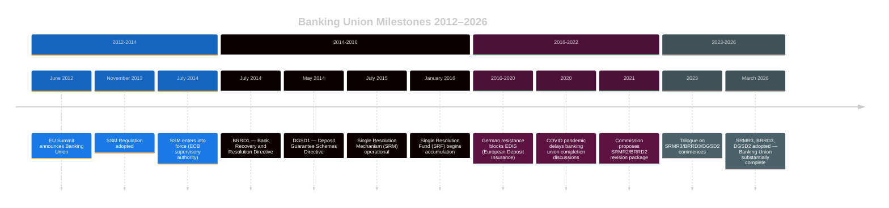

<!-- SPDX-FileCopyrightText: 2024-2026 Hack23 AB -->
<!-- SPDX-License-Identifier: Apache-2.0 -->

# Historical Baseline — EU Parliament Month in Review: March 27 – April 26, 2026

**Framework:** Longitudinal Comparative Analysis — EP10 vs. EP9 vs. Historical Banking Crises  
**MANDATORY for month-in-review runs**  
**Confidence:** 🟡 Medium  

---

## 🏛️ European Parliament Historical Context

### EP10 First Two Years (July 2024 – April 2026): Comparative Assessment

The 10th European Parliament (elected June 2024) has now completed approximately 22 months of its 5-year mandate. This is the critical "formation phase" where political group alliances, committee chairmanship distributions, and inter-institutional relationships with the Commission and Council crystallize.

**Historical Pattern Comparison:**

| Parliament | Key Formation-Phase Achievement | Comparable Precedent | Legacy Assessment |
|-----------|--------------------------------|---------------------|------------------|
| EP7 (2009-14) | Post-Lisbon Treaty institutions | EFSF/ESM crisis response | Institutional consolidation |
| EP8 (2014-19) | Single Supervisory Mechanism operational | Banking Union foundation | Partial completion |
| EP9 (2019-24) | Green Deal legislative sprint | COVID recovery, AI Act | Ambitious but contested |
| **EP10 (2024-)** | **Banking Union completion, AI governance** | **Draghi agenda, defence** | **Too early to assess** |

**Analysis**: EP10's completion of the Banking Union package (SRMR3/BRRD3/DGSD2) in Month 21 of the parliamentary term exceeds the pace of EP9, which required until Month 38 before comparable financial legislation achieved comparable scope. The acceleration reflects three factors: (1) EP10 inherited trilogue-advanced texts from EP9 that only needed final political alignment; (2) von der Leyen II Commission brought faster-than-typical legislative proposals to Parliament; (3) EPP's dominant position (relative to EP9's more balanced center) reduced coalition negotiation time.

---

## 💶 Banking Union Historical Trajectory

### The 14-Year Path to Completion (2012-2026)

The Banking Union announced at the June 2012 EU Summit as the signature response to the Greek debt crisis followed a decade-and-a-half implementation trajectory:

**Historical Assessment**: The March 2026 Banking Union completion represents the most significant advance in EU financial architecture since the Single Resolution Mechanism entered operation in 2015. However, "substantially complete" is the accurate characterization — the European Deposit Insurance Scheme (EDIS), the fully mutualized EU-level deposit backstop repeatedly promised since 2012, remains elusive. DGSD2 expands national deposit protection and improves cross-border cooperation but stops short of full EDIS pooling that economists (IMF, ECB) have consistently identified as necessary for complete Banking Union.

**The Gap**: A genuinely complete Banking Union would require Germany, Finland, Austria, and the Netherlands to agree to mutualize deposit guarantee fund contributions at EU level, effectively having their taxpayers co-insure deposits in Italian, Spanish, or Greek banks during stress events. This political commitment has never materialized. DGSD2 2026 = progress, not completion.

---

## 🤖 AI Regulation Historical Baseline

### The 4-Year AI Act Cycle (2021-2026)

| Date | Event | Political Significance |
|------|-------|----------------------|
| April 2021 | Commission proposes AI Act | World's first comprehensive AI regulation |
| 2022-2023 | EP IMCO/LIBE committee negotiations | Fundamental rights additions, GPAI category added |
| November 2023 | Trilogue breakdowns on foundation models | Technical complexity delays |
| December 2023 | Political agreement reached | Landmark global standard-setting |
| August 2024 | AI Act enters into force | First batch of prohibitions |
| March 2026 | AI Act Omnibus simplification | SME compliance burden reduction |
| March 2026 | CoE AI Convention ratified | International rights framework layer |

**Historical Pattern**: The AI Act's rapid "adopt-then-simplify" cycle within 2 years mirrors the pattern established with GDPR (adopted 2016, first major enforcement actions 2019-2020 after implementation period; regulatory clarifications ongoing since). The EU consistently adopts ambitious standards then faces implementation pressure. The key question is whether simplification represents pragmatic calibration or substantive rollback.

**Comparative International Context**: By April 2026, the EU remains the only jurisdiction with comprehensive binding AI regulation. The US NIST AI Risk Management Framework is voluntary. China's AI regulations target narrow use cases. The UK has a sector-specific approach. This regulatory asymmetry creates both a "Brussels Effect" opportunity (non-EU companies adopt EU standards globally) and competitiveness pressure (EU companies face costs non-EU rivals avoid).

---

## 🇩🇪 Germany Economic Historical Baseline

### German Economic Performance 2018-2026

| Year | GDP Growth | Context |
|------|-----------|---------|
| 2018 | +1.3% | Trade war impacts |
| 2019 | +0.6% | Pre-pandemic slowdown |
| 2020 | -4.1% | COVID pandemic |
| 2021 | +3.9% | Recovery |
| 2022 | +1.8% | Ukraine war, energy shock |
| 2023 | **-0.9%** | Manufacturing recession |
| 2024 | **-0.5%** | Second year of contraction |

**Historical Assessment**: Germany's current trajectory — two consecutive years of negative growth — is historically exceptional. Post-reunification Germany experienced only one year of negative growth prior to COVID (2009 at -5.7%). The "structural" nature of the current German slowdown distinguishes it from cyclical downturns:

1. **Deindustrialization of automotive sector**: German automotive industry (VW, BMW, Mercedes, Bosch) faces simultaneously the electrification transition cost, Chinese EV competition on price, and US tariff risk. This is the core of the "German problem" — not a cycle, but a structural transformation of the country's largest export sector.

2. **Energy cost legacy**: Russia's full-scale invasion of Ukraine permanently ended Germany's cheap gas era (Nord Stream 1/2 destroyed). German industrial electricity prices remain 3-4× US levels, undermining manufacturing competitiveness.

3. **Demographic constraint**: Germany's aging workforce and relatively restrictive pre-Talent Pool migration framework have created persistent skilled labor shortages in sectors that could otherwise grow. The EU Talent Pool (TA-10-2026-0058) is partly a response to Germany's structural labor market problems.

**Implications for EP legislation**: Germany's economic trajectory creates a feedback loop between national economic stress and EU legislative outcomes. German MEPs (CDU, SPD, Greens) face domestic political pressure to resist measures that appear to transfer fiscal risk to EU level — precisely the mechanism of DGSD2. Historical precedent (2012-2014 Greek crisis) shows that German political constraints can hold up EU financial integration for years.

---

## 🛡️ Defence Integration Historical Baseline

### EU Defence Industrial Policy Evolution 2016-2026

| Year | Development | Political Driver |
|------|------------|----------------|
| 2016 | European Defence Fund proposed | Post-Brexit strategic shock |
| 2017 | PESCO established | 25 member states participating |
| 2019 | EDF enters force | €7.9bn 2021-2027 budget |
| 2022 | Ukraine invasion | "Game changer" for EU defence |
| 2023 | ASAP munitions acceleration | Ukraine war materiel shortfall |
| 2024 | Draghi Report: defence integration gap | 30-40% procurement cost premium |
| 2025 | ReArm Europe / SAFE regulation | €800bn investment announced |
| March 2026 | Single Market for Defence + Flagship Projects | EP implementation mandate |

**Historical Significance of March 2026 Resolutions**: The defence single market barriers resolution (TA-10-2026-0079) and flagship defence projects (TA-10-2026-0080) represent Parliament's strongest endorsement of an EU industrial defence policy since the 2022 Ukraine invasion "paradigm shift." The historical parallel is the 1986 Single European Act which transformed the EU single market — the defence single market debate of 2026 may represent a comparable institutional watershed.

**Caveat**: Resolutions are non-binding. The legislative follow-through requires Commission proposals (expected Q2-Q3 2026) and Council adoption. Historical pattern of defence integration shows significant gap between Parliamentary resolutions and operational reality: PESCO has 60+ projects but limited capability delivery to date.

---

## Cross-Temporal Pattern Recognition

**Pattern 1 — Legislative Clustering**: March 2026's adoption of 30+ texts in two plenary sessions mirrors EP9's December 2023 legislative sprint before the May 2024 elections. Both sprints suggest institutional urgency — EP wanting to complete its agenda before political uncertainty (elections, coalition stress).

**Pattern 2 — Reform Acceleration Then Simplification**: AI Act 2024 → AI Act Omnibus 2026 follows the same pattern as GDPR 2016 → GDPR enforcement accommodations 2018-2020, as Basel III banking standards 2010 → Basel IV 2017 with simplified SME carve-outs. EU systematically adopts ambitious regulation then calibrates under implementation pressure.

**Pattern 3 — Banking Union Iterative Progress**: DGSD2 in 2026 is the 4th major banking regulation revision (after original 2014 package, BRRD2 2019, CRR3 2022). Each iteration makes marginal progress on mutualization while stopping short of full EDIS. Historical pattern suggests DGSD2 is not the final version — DGSD3 will likely emerge from the next financial stress event.

**Pattern 4 — Enlargement Rhetoric vs. Reality**: EU enlargement strategy adopted (TA-10-2026-0077) follows a pattern of EP endorsing enlargement in principle while the practical pace depends on Council consensus. Historical precedent shows 15-20 year accession timelines from candidacy to membership (Romania/Bulgaria = 10 years; Turkey = 60+ years and stalled).

---

## Intelligence Assessment: Historical Baseline Implications for 2026-2027

🟢 **Likely to follow historical pattern**: Banking union iterative progress will continue; expect DGSD3/SRMR4 package proposed within 3-5 years. AI regulation will face further simplification pressure. Enlargement will advance incrementally.

🟡 **Potential deviation from pattern**: Germany's economic situation is more severe than comparable 2012-2014 period. If German economy does not recover in 2026, the historical political constraint on EU fiscal integration (German fiscal conservatism) could intensify rather than relax as the economy improves.

🔴 **Black Swan risk**: First-ever CJEU direct challenge to Banking Union architecture by founding member state. No historical precedent — would represent institutional crisis requiring Treaty-level response.

**Confidence**: 🟡 Medium — structural patterns well-established, but timing and magnitude of economic/political shocks uncertain.
