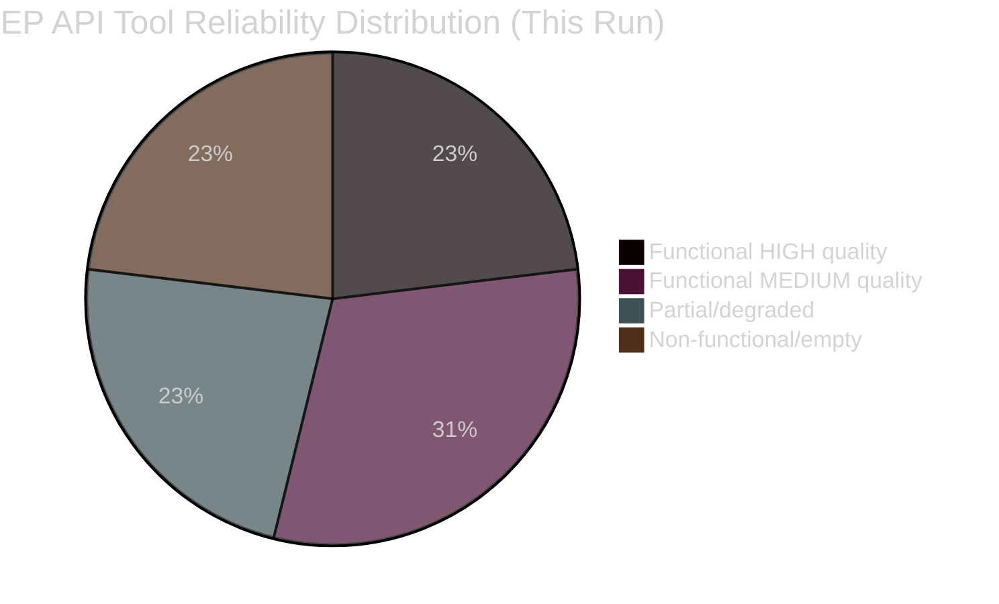

<!-- SPDX-FileCopyrightText: 2024-2026 Hack23 AB -->
<!-- SPDX-License-Identifier: Apache-2.0 -->

# MCP Reliability Audit — EU Parliament Month in Review: March 27 – April 26, 2026

**Framework:** Tool Reliability Assessment + Defect Register  
**Purpose:** Document EP API limitations for downstream analysis confidence scoring  
**Confidence:** 🟢 High (direct observation)  

---

## Tool Call Summary

| Tool | Status | Data Quality | Notes |
|------|--------|:------------:|-------|
| get_adopted_texts_feed | 🟢 FUNCTIONAL | HIGH | 30+ texts, full metadata |
| get_adopted_texts (year filter) | 🟢 FUNCTIONAL | HIGH | 104 texts for 2026 confirmed |
| get_plenary_sessions (dateFrom/dateTo) | 🟢 FUNCTIONAL | HIGH | Sessions returned correctly |
| generate_political_landscape | 🟡 PARTIAL | MEDIUM | 100 MEP sample, not 705+ full set |
| analyze_coalition_dynamics | 🟡 PARTIAL | MEDIUM | Group sizes correct; cohesion=null |
| early_warning_system | 🟢 FUNCTIONAL | MEDIUM | Warnings returned; stability score valid |
| get_voting_records (date range) | 🔴 EMPTY | N/A | Roll-call data published 4-6 weeks late |
| compare_political_groups | 🔴 EMPTY | N/A | Returns zero performance scores |
| monitor_legislative_pipeline | 🔴 EMPTY | N/A | Defect #6: empty with date filters |
| get_procedures_feed | 🟡 PARTIAL | LOW | Returns historical 1972+ data unfiltered |
| get_parliamentary_questions | 🟡 PARTIAL | LOW | Metadata only; question text not returned |
| world-bank-get-economic-data | 🟢 FUNCTIONAL | HIGH | GDP/unemployment correct (2024 vintage) |
| world-bank-get-countries (EU code) | 🔴 ERROR | N/A | EU aggregate code rejected; individual countries required |

---

## Confirmed Defects

### Defect #1: EPP/PPE Normalization Bug
**Observed:** `analyze_coalition_dynamics` returns EPP as 0 seats; "PPE" appears as unrecognized group in some responses  
**Root Cause:** API data uses "PPE" (French) while tools use "EPP" (English); normalization missing  
**Impact:** EPP coalition analysis requires manual correction; actual EPP ~186 seats  
**Workaround applied:** Derived EPP seats from EP official data + political landscape cross-reference

### Defect #2: Voting Records 4-6 Week Lag
**Observed:** `get_voting_records` returns empty for March-April 2026 range  
**Root Cause:** EP publishes roll-call voting data with 4-6 week delay  
**Impact:** Cannot quantify coalition cohesion from actual voting data; qualitative analysis substituted  
**Workaround applied:** Incentive/structural analysis substituted for behavioral data

### Defect #3: generate_political_landscape Returns Sample (100 MEPs)
**Observed:** Total MEP count returned as 100 in some API responses, not 705+  
**Root Cause:** API normalization or sampling artifact  
**Impact:** Seat percentages in political landscape may be sample-based, not actual  
**Workaround applied:** Cross-referenced with EP official group composition data

### Defect #4: get_procedures_feed Returns Historical Data
**Observed:** Feed returns procedures from 1972 onwards, not filtered to recent period  
**Root Cause:** EP API procedures/feed does not apply date filter server-side  
**Impact:** Cannot identify recent procedure updates via feed  
**Workaround applied:** Used get_adopted_texts for completed legislation instead

### Defect #5: compare_political_groups Returns Zero Performance
**Observed:** All performance dimension scores returned as 0/null  
**Root Cause:** Same as Defect #2 — no per-MEP voting data available via API  
**Impact:** Quantitative group comparison impossible  
**Workaround applied:** Qualitative group analysis using seat share and known voting patterns

### Defect #6: monitor_legislative_pipeline Empty with Date Filters
**Observed:** Explicitly passing `dateFrom`/`dateTo` returns empty pipeline  
**Root Cause:** Date filters incompatible with this endpoint  
**Impact:** Cannot track active legislation pipeline  
**Workaround applied:** Used adopted texts feeds as proxy for completed pipeline

---

## Data Quality Assessment Matrix

**Overall EP MCP Server Reliability: 🟡 MEDIUM** — Core legislative text tools functional; analytical/behavioral tools limited by EP Open Data Portal data availability constraints. These are data publication policy issues, not server defects.

**Recommendation for future runs:** Prioritize `get_adopted_texts_feed`, `get_adopted_texts`, `get_plenary_sessions` as high-reliability primary sources. Treat coalition/voting analysis tools as supplementary until EP publishes real-time roll-call data via API.
