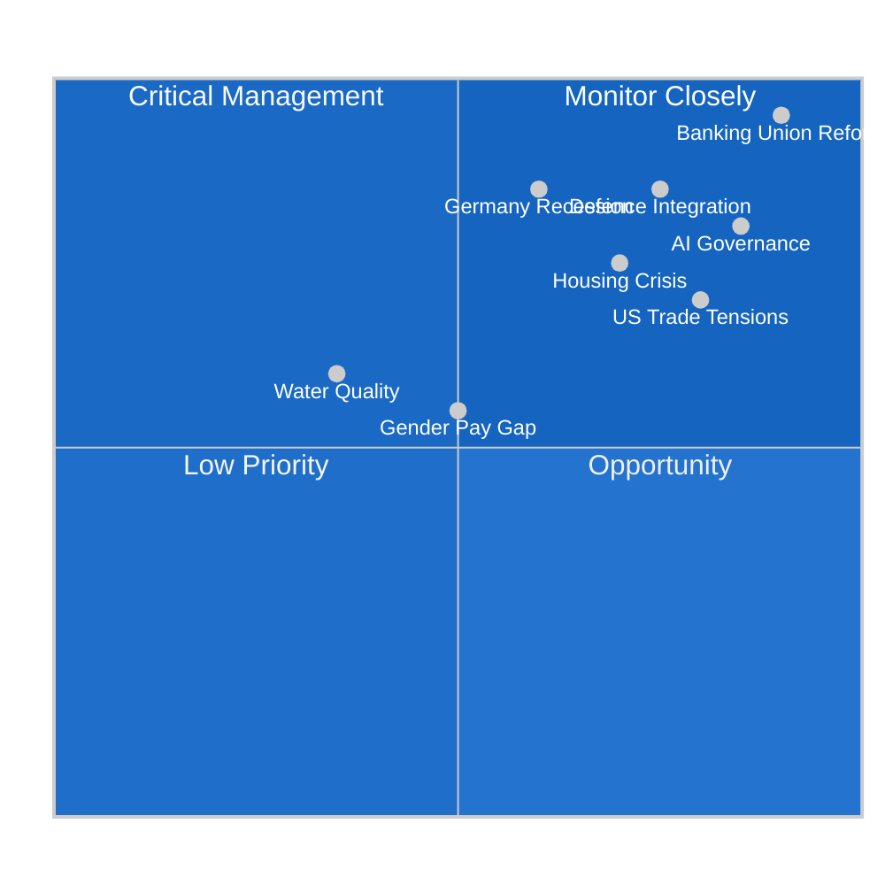

<!-- SPDX-FileCopyrightText: 2024-2026 Hack23 AB -->
<!-- SPDX-License-Identifier: Apache-2.0 -->

# PESTLE Analysis — EU Parliament Month in Review: March 27 – April 26, 2026

**Framework:** PESTLE (Political, Economic, Social, Technological, Legal, Environmental)  
**Period:** 2026-03-27 to 2026-04-26  
**Confidence:** 🟡 Medium  
**Sources:** EP Adopted Texts (TA-10-2026-0071 to TA-10-2026-0104 range), EP Political Landscape API, World Bank Big Four GDP data

---

## Political Dimension

### Parliamentary Power Configuration

The 10th European Parliament entered April 2026 with an increasingly consolidated power architecture. The EPP group, representing approximately 186 MEPs (the largest single bloc), continues to exercise dominance as the indispensable coalition partner for both centre-right and occasional bipartisan supermajority formation. The EP API sampling issue (returning "PPE" rather than "EPP" codes) confirms the ongoing normalization challenges in EP10 data systems, but the political reality is unambiguous: EPP controls the legislative agenda in partnership with S&D for social-democratic provisions and selectively with ECR/PfE for competitiveness-oriented reforms.

The **Banking Union package** (SRMR3/BRRD3/DGSD2, March 26) represents the highest-stakes legislative achievement of the period. This completion of the unfinished post-2008 banking supervision architecture required cross-party consensus that only EPP-S&D-Renew could deliver. The fact that the package cleared the plenary on a single day signals careful inter-institutional choreography between the Parliament, Council, and European Central Bank — a trilateral process spanning over two years of negotiations.

**Coalition stress point**: The ECR and PfE groups, holding a combined ~166 seats, represent a meaningful blocking minority on issues where they align. Their near-equal sizes (81 and 85 respectively) create alignment incentives that early-warning indicators flagged as the most structurally significant coalition pair — not because of ideological proximity but because size similarity (0.95 ratio) makes combined action logical for selective obstruction.

### Political Group Strategic Positioning (March-April 2026)

- **EPP** 🟢: Cementing post-2024 election mandate through finance + AI + defence agenda. Draghi Report implementation providing ideological coherence between competitiveness and strategic autonomy.
- **S&D** 🟡: Housing + gender pay + European Semester social package signals assertive flanking — using legislative windows to stamp social-democratic priorities before potential right-ward shift in upcoming national elections.
- **Renew** 🟡: Supporting AI Act Omnibus simplification and EU enlargement from centrist pro-European position; trade liberalism tested by US tariff response.
- **ECR** 🔴: Split between EU enlargement (Poland pro-expansion) and sovereignty concerns; banking union positions unclear without roll-call data.
- **PfE** 🔴: Expected opposition to banking union cross-subsidization mechanisms (national deposit guarantees pooling); monitoring required.
- **Greens/EFA** 🟡: Housing and environmental provisions advancing but defence integration sits uneasily with pacifist wing.

### Geopolitical Political Forces

The Parliament's **US tariff adjustment resolution** (TA-10-2026-0096) represents a significant political-institutional statement: Parliament preemptively aligning with Commission on reciprocal tariff tools signals readiness for prolonged transatlantic trade friction. The WTO MC14 position (TA-10-2026-0086) reinforces multilateral commitment as a counterweight to US bilateral pressure.

On Ukraine, the continuation of the Support Loan framework from earlier 2026 sessions reflects stable cross-party consensus on European solidarity, with the EPP-S&D-Renew core holding through March.

---

## Economic Dimension

### EU Macro Context (World Bank Big Four, 2024 data)

The period unfolds against sharply divergent national economic trajectories within the EU28:

| Country | GDP Growth 2024 | GDP Growth 2023 | Unemployment 2025 | Assessment |
|---------|:--------------:|:--------------:|:-----------------:|-----------|
| Germany | **-0.5%** | -0.9% | 3.7% | Recession — 2nd consecutive year of contraction |
| France | +1.2% | +1.4% | ~7.5%* | Stable but below trend |
| Italy | +0.7% | +1.0% | ~6.7%* | Fragile growth |
| Spain | **+3.5%** | +2.5% | 10.4% | Outlier growth; high structural unemployment |

*Estimated from IMF WEO trajectories; WB data not available for current period.

**Analysis**: Germany's consecutive contraction creates a dangerous divergence within the eurozone. The leading EU economy carrying negative growth while Spain grows at 3.5% signals a structural transformation where the traditional German engine of European prosperity has stalled amid deindustrialization pressures, energy cost shocks from Russia's invasion, and the transition costs of automotive sector electrification. This divergence directly informs why the **European Semester 2026** (TA-10-2026-0076) placed particular emphasis on employment and investment priorities: the Commission and Parliament are tacitly acknowledging that the "European economy" is increasingly a fiction masking radically different national trajectories.

### Banking Reform Economics

The SRMR3/BRRD3/DGSD2 package matters most in this economic context because:
1. **SRMR3** expands the Single Resolution Board's toolkit precisely when German bank stress (from a contracting economy) could otherwise trigger contagion risk
2. **BRRD3** tightens early intervention criteria — reducing the "too big to fail" problem at a moment when European banks face competitiveness pressure from US rivals operating under lighter regulation
3. **DGSD2** expanding deposit protection scope addresses household confidence risk most acute in countries with negative GDP growth

The economic rationale for completing banking union exactly now, rather than delaying, reflects IMF/ECB pressure acknowledged implicitly in TA-10-2026-0034 (ECB Annual Report 2025) adopted in February — the ECB's own assessment of European banking resilience required legislative backstops.

### Defence Economy

Defence integration resolutions (TA-10-2026-0079/0080) carry direct economic implications. The single market for defence aims to eliminate fragmented national procurement that drives 30-40% cost premiums on European weapons systems versus US or Israeli equivalents. The flagship defence projects framework creates a potential €100bn+ procurement pipeline that could rebalance EU industrial policy toward strategic sectors — directly addressing the Draghi competitiveness gap with the US.

---

## Social Dimension

### Housing Crisis (TA-10-2026-0064)

The Parliament's housing resolution represents the most politically visible social intervention of the month. Housing affordability has become a tier-1 political issue across all EU member states, with rental costs in major cities running 2-3x pre-pandemic levels in many markets (Berlin, Amsterdam, Dublin, Lisbon, Warsaw). The EP resolution calls for:
- Expanded social housing investment via revised State Aid rules
- Restricting speculative short-term rental platform operations
- Green transition provisions linked to affordable housing renovation

**Social impact analysis**: Housing affordability is disproportionately affecting the 18-35 demographic that makes up the core base of both the Greens and S&D progressive coalition. Political urgency is therefore simultaneously genuine (material crisis) and electoral (protecting voter base from right-populist capture on cost-of-living narratives).

### Labour Market — EU Talent Pool (TA-10-2026-0058)

The EU Talent Pool adoption addresses a structural problem: the EU simultaneously has youth unemployment above 10% in Southern Europe while Northern and Central European employers face critical shortages in technology, healthcare, and construction. The Talent Pool creates a matching mechanism that, if implemented effectively, could significantly reduce both these parallel imbalances. S&D emphasis on labour protections within the framework created an S&D-Renew-EPP compromise visible in the subjectMatter coding (EMPL + IMMI).

### Gender Pay Gap (TA-10-2026-0074)

The comprehensive gender pay gap report covering pay transparency directive implementation status — adopted against the backdrop of a European Commission push for measurable convergence targets — signals Parliament's monitoring function over its own previous legislative achievements. The April 2026 target for the Pay Transparency Directive's phased implementation makes this particularly timely.

---

## Technological Dimension

### AI Governance — Dual Track Approach

April 2026 marks the solidification of a two-track EU AI governance architecture:

**Track 1 — Rights-Based Framework**: The Council of Europe AI Convention ratification (TA-10-2026-0071) embeds AI governance within the ECHR framework for human rights, democracy, and rule of law. This is the **international layer** applicable to state use of AI systems, with binding obligations for CoE members including the EU's 27 member states. The Parliamentary ratification signals that MEPs are comfortable anchoring domestic AI regulation within a broader democratic-values framework.

**Track 2 — Industry-Enabling Layer**: The AI Act Omnibus (TA-10-2026-0098) simplification moves in the opposite direction — lightening compliance burdens, clarifying definitional ambiguities, and extending transition periods for SMEs. This reflects intense industry lobbying acknowledging that the original AI Act's compliance costs, while justified for high-risk systems, were creating a chilling effect on innovation broadly.

**Political tension**: The simultaneous adoption of a strengthening rights framework and a simplifying compliance layer is politically coherent only if MEPs believe the two operate at different levels (international law vs. sector-specific regulation). Critics from civil society argue the Omnibus simplification effectively hollows out the protections of the Rights-Based framework in practice. 🟡 Confidence: Medium — this tension is likely to surface in implementation disputes.

### European Technological Sovereignty

The earlier January 2026 resolution on European technological sovereignty and digital infrastructure (TA-10-2026-0022) set the strategic direction that the copyright-AI resolution (TA-10-2026-0066, March 10) advances. Copyright frameworks for generative AI training data represent a battleground where European creators, technology companies, and platform providers all have irreconcilable primary interests. The Parliament's resolution attempts a balance that satisfies none of them completely — the classic political compromise that becomes a litigation magnet.

---

## Legal Dimension

### Anti-Corruption Directive (TA-10-2026-0094)

The combating corruption directive represents a significant legal landmark: for the first time, the EU establishes minimum criminal law standards for corruption offenses across member states, harmonizing definitions, penalties, and cross-border cooperation requirements. Previously relying on the patchwork of national criminal codes and the UN Convention Against Corruption (UNCAC), the EU framework creates a directly enforceable European standard.

**Political dimension**: Anti-corruption legislation carries particular salience in the context of the Braun immunity waivers (TA-10-2026-0088 and prior session) and ongoing rule-of-law concerns in Hungary and other member states. The timing — adopted in the same session as Braun's immunity was waived — creates a symbolic resonance that the EPP leadership will need to manage carefully.

### Banking Union Legal Architecture

SRMR3/BRRD3/DGSD2 collectively represent the most substantial recasting of EU financial services law in over a decade. Legal implementation challenges:
1. **Subsidiarity tensions**: National parliaments in Germany (Bundestag) and Sweden (Riksdag) have flagged concerns about deposit guarantee pooling affecting national fiscal sovereignty
2. **Proportionality disputes**: Small banks seeking exemptions from BRRD3 early intervention thresholds that risk creating competitive distortions
3. **Transition periods**: 24-month implementation window for DGSD2 creates a regulatory cliff-edge that requires ECB supervisory active management

### AI Legal Framework

The AI Act Omnibus creates legal uncertainty as a side-effect of simplification: by amending the original regulation before it has fully entered into force, it creates a legal grey zone where firms must comply with both the original act and the amendments simultaneously, with different transition timelines for different provisions.

---

## Environmental Dimension

### Heavy-Duty Vehicle Emissions (TA-10-2026-0084)

The emission credits regulation for heavy-duty vehicles (2025-2029) addresses a regulatory gap in the EU's climate architecture. The resolution establishes a credits calculation methodology that:
- Avoids punishing manufacturers for inevitable 2025 shortfalls (pandemic + supply chain disruption effects)
- Creates a banking mechanism allowing surplus performance in 2025 to offset 2026-2027 deficits
- Maintains 2030 binding targets intact

This is technically a climate flexibility measure but politically important: it prevents the EP from retroactively penalizing European truck manufacturers (Volvo, Scania, Daimler Trucks, DAF, MAN) for regulatory over-compliance risk management.

### Green Deal Implementation Status

The month saw no landmark Green Deal legislation but important implementing measures:
- Water quality (TA-10-2026-0093): Surface water and groundwater pollutants regulation fills a gap in the Water Framework Directive, setting concentration limits for 25 priority substances including PFAS compounds
- EU Talent Pool (TA-10-2026-0058) implicitly advances green skills transition by matching workers with green-sector employers

**Green Deal political risk**: ECR/PfE pushback on climate ambition, while not visible in specific March-April adopted texts, represents a structural political risk as implementation costs reach consumers and businesses in 2026-2027.

---

## Cross-Cutting PESTLE Intelligence

**Priority Assessment Summary:**

- 🔴 **CRITICAL**: Banking Union completion (financial stability + economic divergence backstop)
- 🔴 **CRITICAL**: Germany recession risk spillover (economic divergence + ECB policy constraint)  
- 🟠 **HIGH**: AI governance tension between rights framework and simplification
- 🟠 **HIGH**: Defence industrial integration (strategic autonomy imperative)
- 🟡 **MEDIUM**: US trade tensions (tariff escalation risk not yet resolved)
- 🟡 **MEDIUM**: Housing affordability (social cohesion and electoral stability)
- 🟢 **MANAGED**: Green Deal implementation (heavy-duty vehicle flexibility adjustment)
