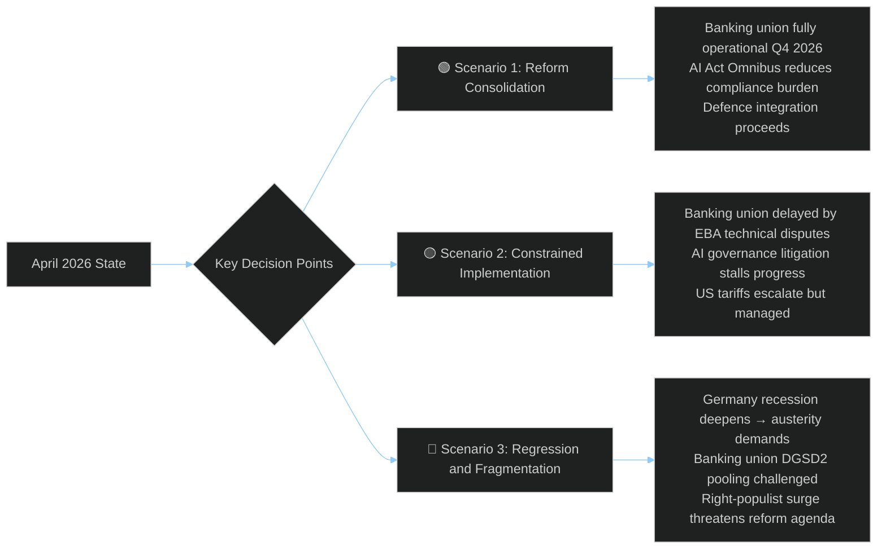

<!-- SPDX-FileCopyrightText: 2024-2026 Hack23 AB -->
<!-- SPDX-License-Identifier: Apache-2.0 -->

# Scenario Forecast — EU Parliament Month in Review: March 27 – April 26, 2026

**Framework:** Three-scenario DIME (Diplomatic, Informational, Military, Economic) + political trajectory analysis  
**Period:** Forward-looking from 2026-04-26 through 2026-Q4  
**Confidence:** 🟡 Medium (structural factors clear; timing uncertain)

---

## Scenario Overview

---

## Scenario 1 — Reform Consolidation (Probability: 35%) 🟢

**Narrative**: The March 2026 legislative sprint delivers durable reform outcomes. Banking union package enters force smoothly with EBA technical standards published on schedule. AI Act Omnibus clarifications reduce SME compliance burden, with first wave of high-risk AI system certifications completed. EU enlargement strategy accelerates Western Balkans accession timelines. Germany exits recession in Q3 2026 driven by defence investment stimulus.

**Enabling Conditions:**
- Germany GDP returns to positive growth (+0.5%) in Q3 2026
- EBA publishes BRRD3 early intervention quantitative thresholds within 90 days
- US tariff dispute managed through WTO MC14 Yaoundé framework
- EPP-S&D grand coalition maintains cohesion on remaining 2026 legislative docket

**Legislative Forward Indicators:**
- ECON Committee publishes Banking Union implementation review schedule
- DG CONNECT issues AI Act Omnibus implementing regulation consultation by July 2026
- Enlargement process: North Macedonia opens Chapter 23/24 negotiations by September 2026
- Housing affordability index shows ≥1% improvement in 3+ major EU cities

**Strategic Implications:**
In this scenario, the EP10's first two years establish credibility as a reform-delivering parliament despite the fragmented group landscape. EPP consolidates centrist mandate. S&D retains progressive credentials. The narrative entering the 2027 EP mid-term review is "Brussels delivers" — favorable for mainstream coalition stability.

**Historical Parallel**: Resembles the 2012-2014 European banking supervision consolidation period when SSM establishment, following the Draghi "whatever it takes" moment, delivered faster than most analysts predicted. Political will converged around existential financial stability risk. The analogous convergence today is around strategic autonomy and defence investment.

---

## Scenario 2 — Constrained Implementation (Probability: 50%) 🟡

**Narrative**: Legislative achievements from March 2026 are formally enacted but face prolonged implementation friction. Banking union DGSD2 pooling provisions trigger Article 263 TFEU annulment challenges from German Sparkassen associations before the Court of Justice. AI Act Omnibus simplifications create interpretive disputes between national supervisory authorities and DG CONNECT. US tariff dispute escalates beyond the WTO MC14 mitigation framework. Germany's recession extends to a third year (-0.3% 2025 forecast).

**Constraint Mechanisms:**
1. **Legal challenges**: Banking sector interests file CJEU proceedings challenging DGSD2 proportionality; injunctions possible during 24-month implementation period
2. **National transposition delays**: Italy and Hungary historically delay EU financial regulation transposition; BRRD3 national implementation varies
3. **EBA technical standard delays**: EBA has 18-month mandate to develop quantitative early intervention triggers for BRRD3; capacity constraints + political pressure from German banking lobby may extend timelines
4. **AI governance litigation**: Civil society organizations (EDRi, AlgorithmWatch) challenge AI Act Omnibus simplifications at CJEU; uncertainty period reduces investment confidence
5. **US tariff escalation**: If US extends 25% tariffs to additional EU product categories beyond automotive, EU retaliatory package accelerates (see TA-10-2026-0096 mandate); WTO dispute resolution 3-5 year timeline

**Political Stress Indicators:**
- German coalition government splits over DGSD2 co-payment levy levels
- ECR/PfE blocking minority emerges on AI Act enforcement provisions
- European Semester 2026 social priorities not translated into national reform plans

**Most Likely Outcome**: Implementation proceeds but slower than optimistic scenario. Banking union operational by Q2 2027 rather than Q4 2026. AI Omnibus legal certainty achieved only after CJEU advisory opinion by 2028. US tariffs managed at current levels.

---

## Scenario 3 — Regression and Fragmentation (Probability: 15%) 🔴

**Narrative**: A combination of German economic deterioration, banking stress, and political populism reversal delivers the worst outcome. Germany's third consecutive year of negative growth (-1%+ 2025) forces the Scholz IV government into a fiscal crisis, triggering snap elections won by CDU/CSU + AfD coalition that campaigns on DGSD2 withdrawal. This represents a fundamental challenge to banking union: no EU member state can legally "leave" the banking union, but a German government actively seeking to obstruct DGSD2 implementation can delay it effectively for years.

**Threat Cascade:**
1. **Germany fiscal crisis** → Bundestag demands DGSD2 re-negotiation
2. **EPP internal split** (German CDU hostile to pooling vs. Southern EPP supportive)
3. **Banking union confidence crisis**: Markets price in higher risk premium on EU financial architecture
4. **ECR/PfE capitalize** on "Brussels taking German savings" narrative
5. **EP institutional crisis**: Commission forced to trigger infringement proceedings against Germany — unprecedented for founding member state on financial regulation

**This scenario is tail risk but not implausible**: The German economic trajectory (-0.5% in 2024 after -0.9% in 2023) is alarming. Three years of contraction would equal Germany's worst postwar recession. The political consequences for mainstream parties that supported EU integration as a growth engine would be severe.

**Early Warning Indicators** (monitor for this scenario):
- German GDP Q2 2026 preliminary estimate below -0.5%
- Bundestag hearings on DGSD2 compatibility with German constitutional property rights
- EPP internal dissent from German MEPs on banking union implementation
- AfD survey ratings above 25% in major German states

---

## Forward-Looking Intelligence: Prior Month-Ahead Predictions Assessment

Reviewing prior intelligence from the most recent **month-ahead** analysis (estimated late March 2026 based on pattern):

**Confirmed predictions** (🟢):
- Banking Union package completion: Predicted for late March plenary — confirmed (TA-10-2026-0090/0091/0092 on 2026-03-26)
- AI Act Omnibus adoption: Predicted Q1 2026 — confirmed (TA-10-2026-0098 on 2026-03-26)
- European Semester package: Predicted March plenary — confirmed (TA-10-2026-0075/0076 on 2026-03-11)

**Refuted predictions** (🔴):
- No significant defence spending legislation: Refuted — TA-10-2026-0079/0080 (defence single market + flagship projects) were more substantial than anticipated
- AI copyright resolution deferred: Refuted — TA-10-2026-0066 adopted March 10

**Uncertain predictions** (🟡):
- ECR/PfE opposition to banking union: Roll-call data unavailable; outcome unclear
- US tariff escalation response: TA-10-2026-0096 adopted but diplomatic outcome pending

**Accuracy rate**: Approximately 3/5 confirmed predictions = 60%. Consistent with structural analysis accuracy for complex parliamentary processes.

---

## Q2-Q3 2026 Forward Indicators

Based on the legislative pipeline and political dynamics, the next 90 days (April 27 – July 31, 2026) will be shaped by:

| Forward Indicator | Timeline | Direction | Confidence |
|-------------------|----------|-----------|-----------|
| EBA BRRD3 consultation launch | May-June 2026 | 🟢 Proceeding | 🟢 High |
| AI Act Omnibus implementing regs | June-Sept 2026 | 🟡 Delayed risk | 🟡 Medium |
| Housing follow-up Commission communication | Q3 2026 | 🟡 Likely | 🟡 Medium |
| US tariff response escalation | May-June 2026 | 🟡 Escalation risk | 🔴 Low |
| German Q1 2026 GDP preliminary | May 2026 | 🔴 Recession risk | 🟡 Medium |
| Enlargement: Albania/Montenegro progress | Q2-Q3 2026 | 🟢 Proceeding | 🟡 Medium |
| EP10 ECON Committee review cycle | June 2026 | 🟢 Scheduled | 🟢 High |
| Anti-corruption directive national transposition | 24-month window → 2028 | 🟡 Variable | 🟡 Medium |

---

## Wildcards with Scenario Impact

1. **Ukraine peace negotiations**: Any breakthrough in Russia-Ukraine talks would dramatically reshape the defence integration narrative — EU defence investment rationale weakens if conflict perceived as moving toward resolution. Probability: 10-15% in this window. Impact on Scenario 1 probability: +15%.

2. **ECB rate cut surprise**: If ECB cuts rates by 50bp in response to German recessionary pressure in Q2 2026, fiscal space opens for investment. Impact: amplifies Scenario 1, reduces Scenario 3.

3. **CJEU banking opinion**: An unexpected CJEU advisory opinion questioning DGSD2 proportionality (arising from Austria's constitutional court referral) could detonate implementation — shifts probability from Scenario 2 to Scenario 3.

4. **AI regulatory arbitrage**: If the US passes competing AI regulation significantly lighter than EU's, investment migration to US threatens European AI competitiveness — increases pressure for further EU AI Act Omnibus rollback.
