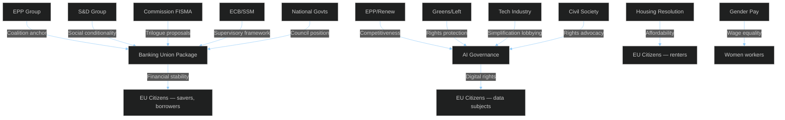

<!-- SPDX-FileCopyrightText: 2024-2026 Hack23 AB -->
<!-- SPDX-License-Identifier: Apache-2.0 -->

# Stakeholder Map — EU Parliament Month in Review: March 27 – April 26, 2026

**Framework:** Mendelow Power × Interest Matrix  
**Period:** 2026-03-27 to 2026-04-26  
**Confidence:** 🟡 Medium  

---

## 🗺️ Power × Interest Matrix

```mermaid
%%{init: {"theme":"dark","themeVariables":{"primaryColor":"#1565C0","primaryTextColor":"#ffffff","lineColor":"#90CAF9","secondaryColor":"#2E7D32"}}}%%
quadrantChart
    title Stakeholder Power × Interest Matrix — April 2026
    x-axis Low Interest --> High Interest
    y-axis Low Power --> High Power
    quadrant-1 Key Players (Manage Closely)
    quadrant-2 Keep Satisfied
    quadrant-3 Monitor
    quadrant-4 Keep Informed
    EPP Group: [0.95, 0.92]
    S&D Group: [0.90, 0.82]
    European Commission: [0.88, 0.88]
    ECB: [0.70, 0.90]
    Renew Group: [0.80, 0.72]
    ECR Group: [0.75, 0.70]
    National Governments: [0.82, 0.85]
    Banking Sector: [0.85, 0.65]
    Civil Society: [0.75, 0.40]
    EU Citizens: [0.60, 0.30]
    Tech Industry: [0.82, 0.60]
    Trade Unions: [0.70, 0.45]
```

---

## 1. EPP Political Group (~186 MEPs)

**Power:** 🔴 Very High | **Interest:** 🔴 Very High  
**Quadrant:** Key Player — Manage Closely

**Mechanism of Impact:** EPP functions as the indispensable coalition anchor for all major legislation in EP10. Without EPP support, no QMV legislation can pass. EPP President Weber operates as the effective EP majority-builder, determining which Social-Democrat proposals receive EPP blessing (typically social policy with fiscal constraints) versus which right-populist demands are deflected.

**EP Data Evidence:** EPP is the majority holder in the Banking Union package negotiations, the driver of the Draghi competitiveness implementation (AI Act Omnibus, defence resolutions), and the key broker of the EU enlargement strategy that required balancing expansion enthusiasts (Poland, Baltics) with enlargement skeptics (France, Netherlands).

**Likely Response:** EPP will claim credit for the banking union completion as a "financial stability achievement" ahead of the 2027 EP mid-term review cycle. On AI governance, EPP will emphasize the Omnibus simplification as business-friendly while deflecting CoE Convention provisions as "external treaty obligations" not directly constraining EU regulatory autonomy.

**Strategic Assessment:** 🟢 EPP's position is consolidated and dominant. The risk scenario is an internal split between Northern fiscal hawks (German CDU, Dutch VVD) and Southern growth advocates (Spanish PP, Italian FI) over deposit guarantee pooling. This split is managed but structurally persistent.

---

## 2. S&D Political Group (~135 MEPs)

**Power:** 🟠 High | **Interest:** 🔴 Very High  
**Quadrant:** Key Player

**Mechanism of Impact:** S&D provides the social-democratic legislative mandate, particularly on housing, labour, gender pay, and anti-poverty measures. S&D's leverage is amplified in centrist coalition formation where EPP-Renew alone cannot reach 376 votes (absolute majority threshold). S&D is increasingly using the banking union architecture negotiations to extract social conditionality commitments.

**EP Data Evidence:** S&D drove TA-10-2026-0064 (housing), TA-10-2026-0074 (gender pay), TA-10-2026-0076 (Semester social), TA-10-2026-0049 (anti-poverty strategy). The thematic clustering across one month signals coordinated S&D legislative sprint.

**Likely Response:** S&D will frame the month as a "Social March" — deploying April 2026 adopted texts in national campaign materials for the 2027 electoral cycle. Risk: the banking union legal architecture, while broadly supported by S&D, contains elements (resolution financing cross-subsidization) that German SPD will struggle to sell domestically amid recession politics.

**Strategic Assessment:** 🟡 S&D is consolidating social policy achievements but faces electoral headwinds if Germany's recession deepens and public mood shifts toward fiscal conservatism.

---

## 3. European Commission (DG FISMA, DG CONNECT, DG EMPL)

**Power:** 🔴 Very High | **Interest:** 🔴 Very High  
**Quadrant:** Key Player

**Mechanism of Impact:** The Commission's legislative monopoly on initiating EU law means it frames the parameters of every parliamentary debate. Banking reform (Commission proposals from 2023-2024), AI Act and Omnibus (2021 and 2024 proposals), and housing recommendations all originated from Commission papers. The Parliament's role is reactive — shaping, amending, and approving Commission initiatives. The institutional dynamics shifted in 2025-2026 as von der Leyen II Commission navigated between the Draghi competitiveness agenda and the Green Deal implementation pressure.

**EP Data Evidence:** Commission involvement visible in procedure references across all Tier-1 adopted texts. The same-day adoption of three banking union texts (SRMR3/BRRD3/DGSD2) required Commission active orchestration of Council-Parliament trilogues.

**Likely Response:** Commission will publish implementation guidance on BRRD3 and DGSD2 within 90 days; AI Act Omnibus implementing regulations to follow within 6 months. Commission will use the EU enlargement strategy adoption as diplomatic leverage in accession country reform negotiations.

**Strategic Assessment:** 🟢 Commission-Parliament institutional balance is stable. The Omnibus simplification approach reflects Commission learning from AI Act implementation challenges.

---

## 4. European Central Bank

**Power:** 🔴 Very High | **Interest:** 🟠 High  
**Quadrant:** Keep Satisfied

**Mechanism of Impact:** ECB does not formally participate in EP legislative procedures but its supervisory assessments (via SSM for significant institutions), its Emergency Liquidity Assistance frameworks, and its inflation-targeting mandate create the constraint environment within which banking union legislation must operate. ECB Vice-Chair appointment (TA-10-2026-0033, Feb 2026) and the annual report (TA-10-2026-0034) were both processed in February, creating the institutional credibility backdrop for March's banking union package.

**EP Data Evidence:** ECB subjectMatter codes (BCE, INST) appearing in TA-10-2026-0033/0034/0060 confirm the ECB appointment cycle aligning with Parliament's consent procedure — unusual coincidence of Vice-Chair appointment (February) and banking legislative package (March) likely deliberate sequencing.

**Likely Response:** ECB will publish supervisory expectations guidance on BRRD3 early intervention triggers within 180 days. The DGSD2 expansion of protection scope may require ECB liquidity calibration adjustments. ECB President Lagarde likely to cite banking union completion in next scheduled testimony before ECON Committee.

**Strategic Assessment:** 🟢 ECB operational relationship with EP is well-managed. Principal risk is divergence over deposit guarantee pooling — ECB favors fuller mutualization (financial stability argument) while national central banks hedge.

---

## 5. National Governments (Germany, France, Italy, Spain focus)

**Power:** 🔴 Very High | **Interest:** 🟠 High  
**Quadrant:** Keep Satisfied

**Mechanism of Impact:** Council of the EU represents national governments in co-decision. The banking union package required Council qualified majority approval — meaning the texts that Parliament adopted already incorporated Council positions through trilogue negotiations. German resistance to deposit guarantee mutualization (DGSD2) was the principal negotiating friction point.

**Germany (Scholz IV Government):** Economic recession context (-0.5% GDP 2024) creates political pressure to demonstrate fiscal responsibility. German finance ministry sought carve-outs in DGSD2 that would limit Sparkassen and Volksbanken exposure to mutualized deposit guarantee levies. Final text reflects partial German concession in exchange for extended transition periods. Unemployment at 3.7% (2025) is creeping higher — political sensitivity on bank stability is acute.

**France (Second Macron term, ongoing):** Broadly supportive of banking union completion as demonstration of EU institutional progress. French banking sector (BNP, Société Générale, Crédit Agricole) benefits from harmonized resolution standards that level competitive playing field. GDP +1.2% (2024) provides less fiscal urgency than Germany's situation.

**Spain (Sánchez coalition):** Spain's +3.5% GDP growth makes it the creditor of goodwill within the EU. Spanish banking sector (Santander, BBVA) already operates at scale requiring cross-border resolution tools. Spain strongly supportive of both banking union and EU Talent Pool (addresses emigration of skilled Spanish workers to Northern Europe while drawing new skills inward).

**Italy (Meloni government):** Technical support for banking union but political messaging challenges — Italian right-wing coalition must justify "European federalism" in financial governance to a eurosceptic base. Italy GDP +0.7% (2024) shows economic vulnerability that makes deposit protection improvements domestically popular.

**Likely Response:** Germany will seek implementation concessions via EBA technical standards. France will claim co-authorship of the political success. Spain will use EP Talent Pool adoption to advance bilateral skill-sharing agreements with Latin American countries.

---

## 6. EU Citizens — Housing, Labour, and Economic Stress

**Power:** 🟡 Medium | **Interest:** 🔴 Very High  
**Quadrant:** Keep Informed

**Mechanism of Impact:** EU citizens' democratic influence operates through election cycles (next EP election 2029) and through the political pressure they exert on MEPs via national party systems. In the current period, three specific citizen populations are most politically salient:

**Young Europeans (18-35 years):** The housing crisis (TA-10-2026-0064) and anti-poverty strategy (TA-10-2026-0049) directly address this group's material situation. A 28-year-old German engineer in Munich paying €1,800/month for a 55m² flat — consuming 45% of their post-tax income — represents the political pressure that drove housing onto the EP agenda. This demographic has the highest potential for political disengagement or capture by either far-left or far-right alternatives if mainstream parties do not deliver tangible housing improvements.

**Polish Workers in Germany:** The EU Talent Pool (TA-10-2026-0058) and the broader free movement architecture affects an estimated 600,000 Polish workers in Germany. As Germany's recession reduces demand for manufacturing workers (automotive, chemicals), mobility patterns are shifting. The Talent Pool creates new legal channels but also regulatory obligations that may not be familiar to informally mobile workers.

**Eastern European Women and Gender Pay:** The gender pay gap resolution (TA-10-2026-0074) matters particularly in EU member states where the gender pay gap exceeds 15% (Czech Republic 17.7%, Latvia 18.9%, Estonia 21.7%). A Czech female nurse earning 25% less than her male equivalent doing comparable work represents the human reality behind the statistics that drove this resolution.

**Strategic Assessment:** 🟡 Citizen engagement with EU legislation remains low but the housing and labour market measures create potential for positive perception shift if implementation follows adoption.

---

## 7. Banking Sector (European banks)

**Power:** 🟠 High | **Interest:** 🔴 Very High  
**Quadrant:** Key Player (Manage Closely on banking union issues)

**Mechanism of Impact:** The European banking sector exercises influence through multiple channels: direct ECB supervisory dialogue, national banking association lobbying in Council preparatory bodies, European Banking Federation engagement with European Commission, and MEP outreach in ECON Committee. The SRMR3/BRRD3/DGSD2 package directly affects bank capital requirements, resolution trigger thresholds, and deposit guarantee premium contributions.

**Sectoral Response Analysis:**
- **Large pan-European banks** (HSBC EU, BNP, Société Générale, Deutsche Bank, UniCredit, Santander): Net beneficiaries of BRRD3 clarity on early intervention — reduces regulatory uncertainty premium. Resolution framework improvements reduce "too big to fail" discount on borrowing costs.
- **Savings banks and credit cooperatives** (Sparkassen, Caisses d'Épargne, Italian cooperative banks): Concerned about DGSD2 premium pooling that effectively subsidizes larger institutions' resolution costs. Political vulnerability: these institutions are closely tied to local economies and rural communities with strong national political representation.
- **Nordic banks** (Nordea, SEB, Handelsbanken): Support harmonization that reduces multi-jurisdiction compliance costs for banks operating across multiple EU markets.

**Likely Response:** Banking sector will engage EBA on implementing technical standards for BRRD3 early intervention quantitative thresholds. Expect significant lobbying effort to shape Commission delegated acts within the 18-month implementing regulation window.

---

## 8. Technology Industry (AI, Digital)

**Power:** 🟠 High | **Interest:** 🟠 High  
**Quadrant:** Key Player

**Mechanism of Impact:** Technology companies — particularly hyperscalers (Google, Microsoft, Amazon), European AI champions (Mistral AI, Aleph Alpha), and platform companies — exercise influence through DG CONNECT consultation processes, Digital Markets Act compliance negotiations, and direct MEP engagement on AI governance provisions.

**AI Act Omnibus beneficiaries:**
- **SMEs** (< 250 employees): Extended compliance timelines reduce disproportionate burden on smaller AI developers
- **Open-source model providers**: Clarified exemptions reduce legal uncertainty that was causing some European open-source AI projects to relocate to US/UK jurisdictions
- **General-purpose AI providers**: Modified risk classification criteria reduce number of providers subject to full Tier-3 oversight

**CoE AI Convention concerns:**
- **State-sector deployers** of AI (predictive policing, social benefit assessment, health diagnosis): Now bound by ECHR-equivalent rights obligations when using AI in public sector decision-making
- **Private sector**: Convention only directly applies to state actors, but sets normative standard that courts may apply through general legal principles

**Likely Response:** European tech associations (DigitalEurope, AlphaCode Alliance) will publish compliance guidance on Omnibus. Civil society organizations (EDRi, AlgorithmWatch) will challenge specific Omnibus simplifications at CJEU level within 18 months.

---

## 9. Civil Society and NGOs

**Power:** 🟡 Medium | **Interest:** 🟠 High  
**Quadrant:** Keep Informed

**Mechanism of Impact:** Civil society organizations shape the normative framing of legislation through public advocacy, EP committee testimony, and media engagement. Key organizations active in April 2026 debates:

- **Housing Europe**: Provided technical evidence for housing resolution; pushing for co-operative housing legal frameworks in Commission follow-up
- **Transparency International Europe**: Actively monitored anti-corruption directive negotiations; concerned about carve-outs for political party funding
- **EDRi (European Digital Rights)**: Critical of AI Act Omnibus; monitoring CoE Convention implementation
- **ETUC (European Trade Union Confederation)**: Supportive of gender pay and European Semester social priorities; concerned about EU Talent Pool labour protection standards
- **Bankwatch**: Monitoring banking union for environmental conditionality in resolution frameworks

**Likely Response:** Civil society will mobilize public opinion pressure on implementation shortfalls in housing and anti-corruption measures. AI civil society organizations will coordinate litigation strategy.

---

## 10. Trade Unions and Labour Organizations

**Power:** 🟡 Medium | **Interest:** 🟠 High  
**Quadrant:** Keep Informed

**Mechanism of Impact:** ETUC and national trade union confederations maintain direct channels to S&D and Greens MEPs. The European Semester social priorities (TA-10-2026-0076) and EU Talent Pool (TA-10-2026-0058) are both areas where trade union input shaped the legislative compromise.

**Key concern — EU Talent Pool**: Trade unions insist on equivalent treatment provisions ensuring migrant workers accessing the Talent Pool receive the same wages, social security entitlements, and collective bargaining rights as domestic workers. Without these protections, the Talent Pool risks becoming a mechanism for wage undercutting. The final text includes provisions requiring "terms and conditions of employment no less favourable than those applicable to comparable workers in the host Member State" — but enforcement remains a national competence gap.

**Strategic Assessment:** 🟡 Trade unions achieved meaningful social conditionality in both Talent Pool and Semester provisions but face structural weakness in EP10 where ECR/PfE voting blocks hold significant seats relative to their union-aligned S&D bloc partners.

---

## Stakeholder Interaction Map


