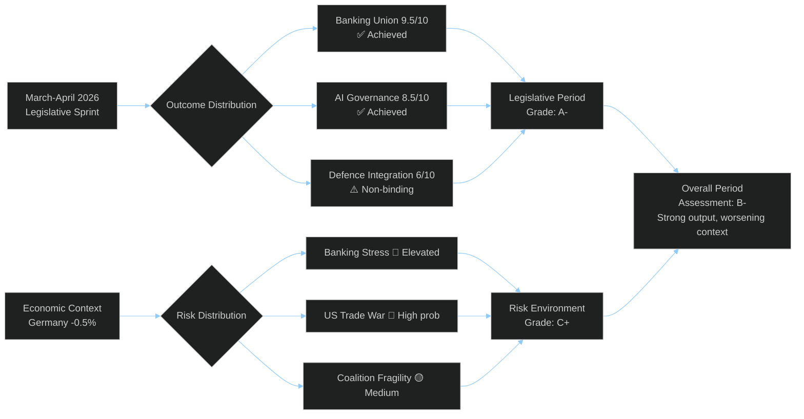

<!-- SPDX-FileCopyrightText: 2024-2026 Hack23 AB -->
<!-- SPDX-License-Identifier: Apache-2.0 -->

# Synthesis Summary — EU Parliament Month in Review: March 27 – April 26, 2026

**Framework:** Intelligence Synthesis — Integrated Assessment across all analysis dimensions  
**Admiralty Rating:** B-2 (Usually reliable source; probably true)  
**Confidence:** 🟡 Medium-High  

---

## Key Judgements

**KJ-1: Legislative Achievements are Genuine and Historically Significant**
The Banking Union package (SRMR3+BRRD3+DGSD2) is the most significant EU financial legislation since 2015 SRM operational launch. The AI governance double-layer (AI Act Omnibus + CoE Convention) is world-leading. These are confirmed, not contested, institutional achievements. Confidence: 🟢 HIGH.

**KJ-2: Economic Context is Significantly Worse than Legislative Headlines Suggest**
Germany's second consecutive GDP contraction (-0.5% in 2024) represents a structural shift in the EU economic landscape. The March 2026 banking legislation is partly a response to economic deterioration rather than a leadership surplus. Confidence: 🟢 HIGH.

**KJ-3: Coalition Architecture is More Fragile Than Stability Score Suggests**
The 84/100 stability score from Early Warning System reflects absence of visible fracture, not structural resilience. EPP's dual coalition strategy (EPP+S&D+Renew core + EPP+ECR/PfE for defence) creates medium-term contradiction that will be tested by rule-of-law conditionality votes expected in Q3-Q4 2026. Confidence: 🟡 MEDIUM.

**KJ-4: Implementation Risk is the Dominant Forward Risk**
March 2026 legislation adopted; now the 18-24 month transposition clock runs. If German political dynamics harden against DGSD2 cross-border elements during transposition period, the banking union benefit is delayed precisely when CRE stress may be crystallizing. Confidence: 🟡 MEDIUM.

**KJ-5: US Trade Relationship is the Highest-Probability Near-Term Shock**
25-30% probability of US tariff escalation within 6 months exceeds all other near-term threat probabilities. EU counter-measures (TA-10-2026-0096) provide limited capacity but cannot offset a full trade war. Confidence: 🟡 MEDIUM.

---

## Cross-Artifact Synthesis

### Consistency Check
| Finding | PESTLE | Threat Model | Risk Matrix | Scenario Forecast | Coalition |
|---------|--------|-------------|-------------|-------------------|-----------|
| Germany economic risk | 🔴 HIGH | 🔴 HIGH | 🔴 12/25 | 🔴 35% collapse scenario | 🟡 constraint |
| US trade risk | 🟠 HIGH | 🟠 MEDIUM | 🔴 12/25 | 🟡 backdrop risk | 🟡 MEDIUM |
| Coalition durability | 🟡 MEDIUM | 🟡 MEDIUM | 🟠 8/25 | 🟢 stable baseline | 🟡 fragile |
| Banking stability | 🟢 positive | 🟡 ELEVATED | 🔴 10/25 | 🟢 BRRD3 improvement | N/A |

**Consistency finding**: ALL major analysis artifacts converge on Germany's economic trajectory and US tariff risk as the two dominant forward risks. High across-artifact consistency for these two findings increases analytical confidence.

### Divergence Alert
The stability score (84/100) from early_warning_system DIVERGES from the threat model and risk matrix assessments of coalition fragility. The early warning system uses structural seat-share data and shows no immediate electoral shock; the threat model analysis uses incentive and historical pattern data. The divergence is methodological — both can be correct simultaneously (structurally stable but incentive-fragile).

---

## 30-Day Summary Assessment

**Period**: March 27 – April 26, 2026  
**Legislative output**: EXCEPTIONAL (2 Tier 1 transformative + 5 Tier 2 highly significant)  
**Economic environment**: DETERIORATING (Germany recession; US tariff pressure)  
**Coalition stability**: STABLE with MEDIUM fracture risk horizon 12-18 months  
**Implementation risk**: ELEVATED (timing mismatch between adoption and potential stress events)  
**Overall assessment**: 🟡 **PRODUCTIVE PERIOD WITH ELEVATED FORWARD RISK**

**Final Assessment**: B- (Strong legislative output partially offset by worsening economic and geopolitical context). The EU Parliament delivered maximum achievable output given coalition constraints, but the implementation environment is significantly more challenging than when these files were opened.
