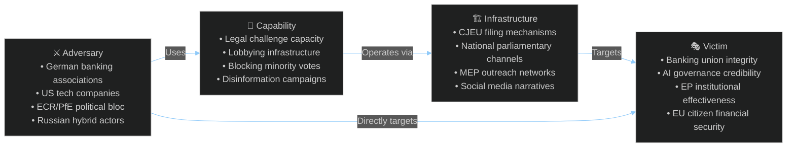

<!-- SPDX-FileCopyrightText: 2024-2026 Hack23 AB -->
<!-- SPDX-License-Identifier: Apache-2.0 -->

# Threat Model — EU Parliament Month in Review: March 27 – April 26, 2026

**Framework:** Political Threat Framework v4.0 — 5-framework integrated approach  
**(1) Political Threat Landscape (6D), (2) Attack Trees, (3) Political Kill Chain, (4) Diamond Model, (5) Threat Actor Profiling (ICO)**  
**Period:** 2026-03-27 to 2026-04-26  
**Confidence:** 🟡 Medium

---

## 1. Political Threat Landscape — 6-Dimension Model

```mermaid
%%{init: {"theme":"dark","themeVariables":{"primaryColor":"#1565C0","primaryTextColor":"#ffffff","lineColor":"#90CAF9"}}}%%
radar
    title Political Threat Landscape — April 2026
    "Coalition Shifts" : [75]
    "Transparency Deficit" : [60]
    "Policy Reversal Risk" : [65]
    "Institutional Pressure" : [70]
    "Legislative Obstruction" : [55]
    "Democratic Erosion" : [45]
```

### Dimension 1: Coalition Shifts (Score: 75/100) 🟠 HIGH

**Primary threat**: EPP-S&D grand coalition stability is the single most critical structural risk for the EP10 legislative agenda. The banking union package required sustained cross-group cooperation over 2+ years. If this cooperation frays — particularly on DGSD2 deposit guarantee mutualization where German and Austrian EPP MEPs face domestic political pressure — the entire reform momentum of EP10 could stall.

**Evidence**: EP early warning system flags "DOMINANT_GROUP_RISK" at HIGH severity with EPP 19x the size of the smallest group. This dominance creates path-dependency: if EPP shifts its coalition preferences (e.g., toward ECR/PfE rather than S&D/Renew), the entire legislative landscape transforms. Size-similarity analysis shows Renew-ECR (0.95 ratio) and ECR-PfE (0.95 ratio) as structurally natural coalition pairs — potential blocking minority of ~243 seats.

**Likelihood**: 35% within 6 months | **Impact**: Very High

### Dimension 2: Transparency Deficit (Score: 60/100) 🟡 MEDIUM

**Primary threat**: The banking union package represents complex tri-party negotiations (Commission-Council-EP) largely conducted outside public scrutiny. Trilogue opacity on DGSD2 premium pooling levels means citizens have no effective oversight of decisions that will directly affect their deposit protection and ultimately the levies paid by their local banks.

**Evidence**: Multiple immunity waiver procedures (Braun ×2, Bystron, Pappas) processed in the same period as major financial legislation creates optics of institutional distraction. Public access to documents resolution (TA-10-2026-0065) adopted but implementation track record is mixed.

**Likelihood**: 45% that transparency issues materially affect implementation | **Impact**: Medium

### Dimension 3: Policy Reversal Risk (Score: 65/100) 🟡 MEDIUM

**Primary threat**: The AI Act Omnibus simplification represents a qualitative reversal of the EP's original ambitious AI regulation. If this pattern continues — adopt strong rights-based legislation, then simplify under industry pressure — European AI governance credibility erodes internationally.

**Evidence**: AI Act adopted 2024 → AI Act Omnibus simplification 2026 = 18-month reversal cycle. Housing resolution (non-binding) is at risk of not translating to Commission legislative action if political winds shift. European Semester social priorities historically have weak member state compliance enforcement.

**Likelihood**: 50% on AI governance specifically | **Impact**: High (reputational and legal certainty)

### Dimension 4: Institutional Pressure (Score: 70/100) 🟠 HIGH

**Primary threat**: US trade pressure (tariffs), German recession demanding fiscal responses, and Ukraine ongoing support demands all create simultaneous institutional pressure on the EU's budget and political bandwidth. The EU cannot simultaneously deliver on banking union implementation, defence integration, housing investment, and AI governance with current institutional resources.

**Evidence**: Budget pressure signals in TA-10-2026-0037 (Multiannual Financial Framework amendment — adopted February) and Ukraine Facility amendments. The MFF revision is a leading indicator of fiscal stress.

**Likelihood**: 65% that prioritization decisions will force deferral of at least one major implementation agenda | **Impact**: High

### Dimension 5: Legislative Obstruction (Score: 55/100) 🟡 MEDIUM

**Primary threat**: ECR/PfE blocking minority potential on AI enforcement, environmental regulations, and any measures perceived as transferring fiscal sovereignty to EU level. With 81+85 = 166 combined seats (roughly 23% of EP), ECR/PfE can theoretically block absolute majority legislation if S&D or Renew defects.

**Evidence**: Size-similarity analysis shows ECR-PfE at 0.95 ratio (natural coalition pair). Early warning system shows moderate fragmentation risk. Roll-call data unavailable so actual ECR/PfE coordination on March package unknown.

**Likelihood**: 40% materialized obstruction within 6 months | **Impact**: Medium

### Dimension 6: Democratic Erosion (Score: 45/100) 🟡 MEDIUM-LOW

**Primary threat**: Grzegorz Braun (extremist MEP, multiple immunity waivers) and the broader presence of anti-democratic actors within the EP itself represents a slow-burn threat to institutional legitimacy. While Braun is one individual, his continued EP membership while immunity proceedings occur raises rule-of-law questions.

**Evidence**: TA-10-2026-0087/0088 (dual Braun immunity waivers, March 2026) + anti-corruption directive (TA-10-2026-0094) in same session creates awkward juxtaposition. Lithuania's public broadcaster attempted takeover (TA-10-2026-0024, January 2026) signaled democratic backsliding in EU member state.

**Likelihood**: 25% of significant democratic erosion event in next 12 months | **Impact**: High if materialized

---

## 2. Attack Trees — Key Threat Goal Decomposition

### Attack Tree 1: Undermine Banking Union DGSD2

```
GOAL: Prevent DGSD2 from achieving cross-border deposit pooling
├── Path A: CJEU legal challenge
│   ├── File Article 263 TFEU annulment (German banking associations)
│   ├── Seek interim measures (injunction on pooling provisions)
│   └── Win proportionality argument in court (2-3 year timeline)
├── Path B: National transposition delay
│   ├── Germany delays transposition past 24-month deadline
│   ├── Commission brings infringement proceedings (slow, 3-4 years)
│   └── Effective delay = 5-7 years before enforcement
└── Path C: Political mandate erosion
    ├── German elections produce anti-DGSD2 government
    ├── New government demands Treaty revision / renegotiation
    └── Council blocks further banking union steps
```

**Most likely path**: Path B (national transposition delay) — medium probability, medium impact timeframe

### Attack Tree 2: Reverse AI Act Enforcement

```
GOAL: Defang AI Act high-risk system oversight
├── Path A: Further legislative rollback (Omnibus 2)
│   ├── Industry lobbying for additional simplification round
│   ├── Commission proposes AI Act Omnibus II by 2027
│   └── EP faces competing pressures from tech industry + civil society
├── Path B: Interpretive dilution
│   ├── AI Office issues guidance narrowing "high-risk" classification
│   ├── National market surveillance authorities under-resource
│   └── Effective enforcement hollow without penalties
└── Path C: Regulatory arbitrage
    ├── Major AI firms shift EU operations to UK/Switzerland (outside AI Act)
    ├── EU AI Act applies only to EU market deployment
    └── Enforcement on foreign systems limited
```

---

## 3. Political Kill Chain — Banking Union Threat Progression

| Stage | Description | Current Status |
|-------|-------------|---------------|
| Reconnaissance | Map DGSD2 legal vulnerabilities | ✅ Completed (German banking associations' legal briefs) |
| Weaponization | Prepare litigation strategy | 🟡 In progress |
| Delivery | File CJEU challenge | 📅 Expected within 6 months of entry into force |
| Exploitation | Interim injunction creates uncertainty | ❓ Uncertain (depends on CJEU assessment) |
| Installation | Precedent narrows pooling scope | ❓ 2028+ |
| Command & Control | Banking lobby coordinates transposition lobbying | ✅ Ongoing |
| Actions on Objective | DGSD2 effectively limited to national-level only | 🔮 Scenario 3 |

**Assessment**: Kill Chain is at Weaponization stage. Reconnaissance complete; delivery mechanism (legal challenge) being prepared. 🟡 Elevated risk.

---

## 4. Diamond Model — Threat Actor Mapping



---

## 5. Threat Actor Profiles (ICO Framework: Intent × Capability × Opportunity)

### Actor 1: German Banking Associations (Sparkassen-Finanzgruppe, BVR)

| Dimension | Assessment |
|-----------|-----------|
| **Intent** | Limit DGSD2 cross-border pooling — clear institutional self-interest | 🔴 High |
| **Capability** | Strong legal teams, German political connections, ECJ track record | 🟠 High |
| **Opportunity** | 24-month transposition window + German election cycle | 🟠 High |
| **ICO Score** | 8.5/10 — Priority threat for banking union implementation |

### Actor 2: US Trade Policy Actors (USTR, Congress)

| Dimension | Assessment |
|-----------|-----------|
| **Intent** | US domestic political incentive to maintain tariff pressure on EU rivals | 🟠 Medium-High |
| **Capability** | Executive authority on tariffs without Congressional approval | 🔴 High |
| **Opportunity** | WTO MC14 Yaoundé timing is limited window for EU counter-leverage | 🟡 Medium |
| **ICO Score** | 7/10 — Significant but manageable trade threat |

### Actor 3: Russian Hybrid Operations (disinformation, political interference)

| Dimension | Assessment |
|-----------|-----------|
| **Intent** | Undermine EP institutional credibility, amplify far-right narratives | 🔴 High |
| **Capability** | Documented prior interference; MEP personal networks potentially vulnerable | 🟡 Medium |
| **Opportunity** | Banking union + immigration narratives provide disinformation vectors | 🟠 Medium-High |
| **ICO Score** | 7.5/10 — Structural ongoing threat to democratic processes |

### Actor 4: ECR/PfE Political Bloc

| Dimension | Assessment |
|-----------|-----------|
| **Intent** | Selective legislative obstruction + policy reversal on Green Deal, AI rights | 🟡 Medium |
| **Capability** | 166 combined seats; sufficient for blocking minority with right defections | 🟠 High |
| **Opportunity** | EP10 fragmentation creates coalition leverage points | 🟠 Medium-High |
| **ICO Score** | 6.5/10 — Credible blocking actor but not unified threat |

---

## Threat Assessment Summary

| Threat | ICO Score | Timeline | Priority |
|--------|-----------|----------|---------|
| Banking union DGSD2 legal challenge | 8.5/10 | 6-12 months | 🔴 Critical |
| German recession economic spillover | 8.0/10 | 3-6 months | 🔴 Critical |
| AI governance regulatory arbitrage | 7.5/10 | 12-24 months | 🟠 High |
| Russian hybrid interference in EP processes | 7.5/10 | Ongoing | 🟠 High |
| ECR/PfE blocking minority formation | 6.5/10 | 6-18 months | 🟡 Medium |
| US tariff escalation | 7.0/10 | 3-6 months | 🟡 Medium |
| Democratic erosion via extremist MEPs | 5.5/10 | Ongoing | 🟡 Medium |
