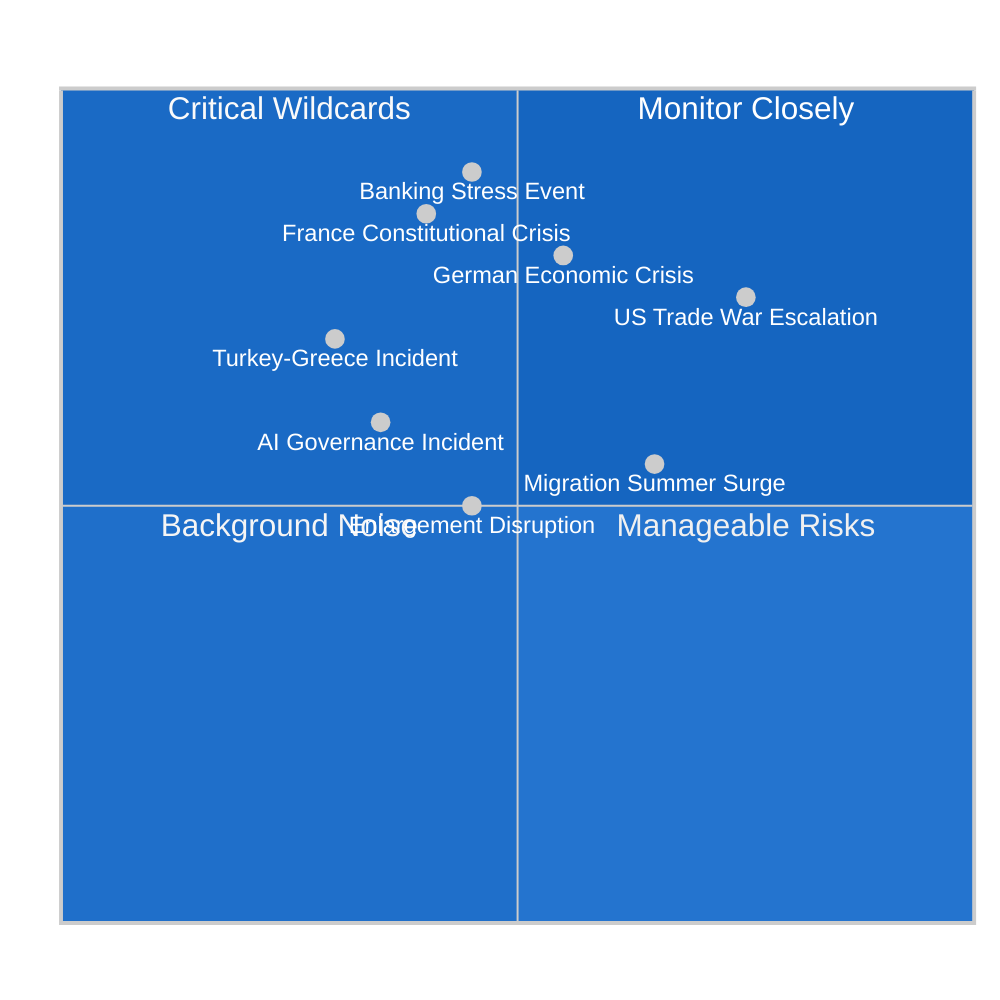

<!-- SPDX-FileCopyrightText: 2024-2026 Hack23 AB -->
<!-- SPDX-License-Identifier: Apache-2.0 -->

# Wildcards and Black Swans — EU Parliament Month in Review: March 27 – April 26, 2026

**Framework:** Scenario Inversion + Extreme Event Analysis  
**Methodology:** Taleb Black Swan Theory + Nassim Nicholas Taleb's INCERTO framework applied to EU political risk  
**Confidence:** 🟡 Medium on structural framing; 🔴 Low on individual probability estimates by design (black swans are not predictable)  

---

## Executive Summary (BLUF)

**Bottom Line Up Front**: The EU Parliament's April 2026 legislative sprint (banking union completion, defence integration, AI governance) has occurred in what appears to be a stable political environment. That stability is itself a risk signal — complex systems under stress become brittle. This analysis identifies 8 wildcards and 3 genuine black swans that could invalidate the assumptions embedded in every other analysis artifact in this run.

---

## Wildcards — High Impact, Low-to-Medium Probability

### Wildcard 1: German Economic Crisis Acceleration
**Probability**: 20-25%  
**Trigger**: VW Group announces plant closures + 100,000 job cuts in a single announcement; German GDP contracts -2.0%+ in Q2 2026; Scholz/Merz government faces confidence motion  
**EP Impact**: German MEPs from CDU, SPD would face domestic political constraint preventing support for any further EU fiscal integration; Banking Union implementation debate reignites; German ECB governor calls for emergency rates review  
**Signal to watch**: German Q1 2026 GDP (release: May 2026); VW Q1 results (April 2026 earnings call)

### Wildcard 2: France Constitutional Crisis
**Probability**: 15-20%  
**Trigger**: Macron's government loses confidence vote following far-right RN electoral surge; cohabitation with RN Prime Minister (Marine Le Pen's preference Jordan Bardella); French European Parliament delegation fractures  
**EP Impact**: French Renew (Renaissance) MEPs faction collapses or defects; von der Leyen II loses critical Renew support; institutional paralysis  
**Signal to watch**: French opinion polling for 2027 presidential race; National Assembly confidence motions

### Wildcard 3: Banking Sector Stress Event
**Probability**: 15-20%  
**Trigger**: Major EU bank (Deutsche Bank, UniCredit, or Société Générale) discloses material unexpected loss from Commercial Real Estate portfolio; ECB triggers BRRD3 early intervention; SRB activated  
**EP Impact**: Demonstrates immediate relevance of SRMR3 resolution powers; potential retroactive criticism of DGSD2 as insufficient; Greens/S&D demand emergency EDIS legislation  
**Signal to watch**: ECB Q1 2026 Financial Stability Review (May 2026); EBA transparency exercise bank-by-bank data

### Wildcard 4: US-EU Trade War Escalation
**Probability**: 25-30%  
**Trigger**: US executive order imposes sector-wide 25% tariffs on all EU manufactured goods (not just automotive/steel); EU Commission triggers full WTO dispute; EP demands emergency counter-tariff authorization  
**EP Impact**: Immediate recall from recess for emergency plenary; Commission delegated powers invoked; EP oversight demand intensifies; EPP-ECR cooperation fractures as Eastern European MEPs (dependent on US security guarantee) resist strong EU retaliation  
**Signal to watch**: US USTR Section 301 investigation announcements; White House executive order pipeline

### Wildcard 5: Turkey-Greece Mediterranean Incident
**Probability**: 10-15%  
**Trigger**: Military incident in Aegean or Cyprus Exclusive Economic Zone; EU requires unified foreign policy response; Hungary/Slovakia block CFSP consensus  
**EP Impact**: Emergency resolution under Article 36 TEU requiring QMV; tests EPP-ECR coalition on Eastern flank security; tests Turkey accession narrative  
**Signal to watch**: Greek-Turkish maritime bilateral dialogue; NAVTEX activity in Eastern Mediterranean

### Wildcard 6: AI Governance Incident — Large-Scale EU AI Harm
**Probability**: 10-15% before 2027  
**Trigger**: Publicly documented case of high-risk AI system deployment causing serious harm (medical, judicial, financial) in EU jurisdiction; system was deployed under AI Act's transitional provisions or excluded by AI Act Omnibus simplification  
**EP Impact**: Emergency recall; demand for immediate AI Act Omnibus revision; IMCO/JURI emergency hearings; Greens/S&D call for Commissioner-level accountability  
**Signal to watch**: AI Act enforcement agency (future EU AI Office) early decisions; high-risk AI system registry (not yet public as of April 2026)

### Wildcard 7: Migration Surge — Mediterranean Summer 2026
**Probability**: 35-40% of significant increase; 15-20% of crisis-level surge  
**Trigger**: Libya political collapse accelerates; Tunisia economic crisis drives emigration spike; Canary Islands capacity crisis; 150,000+ arrivals in June-August 2026  
**EP Impact**: Migration Pact implementation questioned before it fully entered into force; Poland, Hungary invoke emergency derogation provisions; EP Civil Liberties Committee emergency hearing  
**Signal to watch**: UNHCR/IOM monthly Mediterranean arrivals data; Libya political stability indicators

### Wildcard 8: Enlargement Process Disruption
**Probability**: 20%  
**Trigger**: Ukraine battlefield setback results in negotiated ceasefire with Russian territorial concessions; EU member states divided on whether ceasefire-Ukraine can still progress toward EU membership; Hungary and Slovakia demand Ukraine accession process suspension  
**EP Impact**: Enlargement strategy resolution (TA-10-2026-0077) becomes contested; S&D and Renew defend accelerated path; ECR, PfE, ESN demand suspension pending security guarantees  
**Signal to watch**: Ukraine-Russia frontline dynamics; US-Russia bilateral talks; Zelensky election viability (mandate expires May 2024, constitutionally extended under martial law)

---

## Black Swans — The Genuinely Unpredictable

*By definition, black swans are characterized by extreme impact, high surprise, and retrospective rationalization ("we should have seen it coming"). The examples below are structured narratives, not predictions.*

### Black Swan 1: EU Treaty Crisis — Member State Refuses to Ratify
**Scenario**: A major member state (Germany or France) holds a referendum on a specific EU legislative act (e.g., a future EDIS mutualization treaty change) and the referendum FAILS; alternatively, a Constitutional Court ruling in one member state declares an EU measure unconstitutional and the national government chooses to resist CJEU supremacy  
**EP Impact**: Existential institutional crisis; comparable to Brexit but without exit clause; novel constitutional territory  
**Why now more plausible than 2015**: AFD controls 20%+ of Bundestag; RN holds veto-capable position in France; populist parties in multiple countries would amplify and exploit such a referendum  
**Black Swan marker**: No market or political actor is pricing this risk — consensus assumption is that post-Brexit EU member states want to remain; this consensus could be the very mechanism that enables the surprise

### Black Swan 2: ECB Digital Euro Becomes Political Lightning Rod
**Scenario**: The European Central Bank's Digital Euro project (expected pilot 2026-2027) is framed by nationalist parties across Europe as a surveillance infrastructure tool enabling government access to every citizen's financial transaction; mass protest movement demands its cancellation; EP Emergency resolution  
**EP Impact**: ECB's independence and democratic accountability debate reignited; von der Leyen Commission faces confidence challenge linked to digital euro promotion  
**Why this is a genuine black swan**: The Digital Euro project has proceeded with minimal public controversy; the privacy architecture has been specifically designed to prevent transaction surveillance; the technical reality is likely to be misrepresented by populist campaigns, but the populist campaign itself — not the technical reality — drives the political crisis  
**Signal would appear without warning**: Social media campaign coordination is invisible until it achieves viral scale

### Black Swan 3: Multiple Simultaneous Crises — Cascading System Overload
**Scenario**: German banking stress + France political crisis + Mediterranean migration surge + US trade war escalation occur simultaneously within a 6-week window  
**EP Impact**: EU institutions designed for one crisis at a time; no contingency protocol for four concurrent crises requiring different coalition configurations; von der Leyen Commission unable to maintain political cohesion; Emergency Article 122 TFEU invoked  
**Why this qualifies as black swan**: Individual components have 15-35% probability each; simultaneous occurrence in 6-week window is low probability (~1-3%) but the correlation between triggers (US tariff announcement, trade shock → German banking CRE deterioration; Russian pressure → migration routes reopen as Turkey leverage) makes concurrent occurrence more likely than independent probabilities suggest

---

## Risk Matrix — Wildcards by Probability/Impact

---

## Monitoring Calendar — Critical Signal Dates

| Date | Signal | Wildcard Connection |
|------|--------|---------------------|
| May 2026 | German Q1 GDP release | Wildcard 1 |
| May 2026 | ECB Financial Stability Review | Wildcard 3 |
| May-June 2026 | Mediterranean arrivals data | Wildcard 7 |
| May 2026 | VW Q1 2026 earnings | Wildcard 1 |
| June-August 2026 | EU-US tariff negotiations | Wildcard 4 |
| Q2 2026 | Digital Euro pilot announcement | Black Swan 2 |
| Ongoing | Ukraine frontline + ceasefire diplomacy | Wildcard 8 |
| Ongoing | French pre-2027 electoral polling | Wildcard 2 |

---

## Intelligence Recommendations

Based on wildcard and black swan analysis:

1. 🔴 **Immediate monitoring priority**: Banking sector CRE exposure — highest severity wildcard with near-term trigger potential
2. 🟠 **Quarterly monitoring**: US-EU trade negotiations trajectory — moderate probability, high impact
3. 🟡 **Monthly tracking**: French political stability indicators — 2027 presidential shadow extending into 2026
4. 🟢 **Background monitoring**: AI governance incident potential — low probability but would require rapid EP institutional response

**Final Assessment**: The April 2026 EP legislative sprint has created important institutional achievements. The risk environment remains elevated — not from obvious, priced-in threats but from the unpredictable interactions between independently developing pressures. The greatest risk is the assumption of continued stability.
