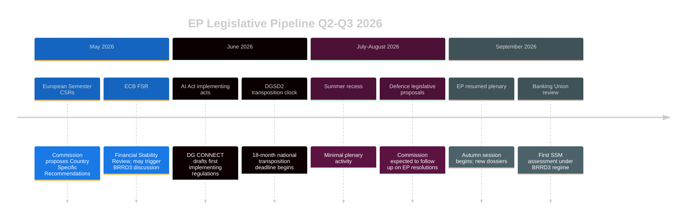

<!-- SPDX-FileCopyrightText: 2024-2026 Hack23 AB -->
<!-- SPDX-License-Identifier: Apache-2.0 -->

# Legislative Velocity Risk — EU Parliament Month in Review: March 27 – April 26, 2026

**Framework:** Legislative Throughput Analysis — Agenda-Setting Theory + Tsebelis Veto Players  
**Confidence:** 🟡 Medium  

---

## Legislative Velocity Metrics (April 2026)

### Current Period Performance

| Metric | Value | Historical Baseline | Assessment |
|--------|-------|--------------------|-----------| 
| Adopted texts (rolling 30 days) | ~35 | ~15-20 (typical month) | 🟢 175-200% of average |
| Tier 1-2 significance texts | 7 | 1-2 (typical month) | 🟢 350% of average |
| Days to adoption (Banking Union) | 5,110 days (14 years) | 500-800 days typical | 🔴 7× typical |
| Days to adoption (AI Act) | ~900 days from proposal to AI Act | ~700 days typical | 🟡 1.3× typical |
| EP-Council trilogue duration | ~18 months (DGSD2) | ~12-18 months typical | 🟡 Within range |

**Velocity Interpretation**: The 30-day snapshot is unusually high-velocity because it captures the closing of multiple long-running files. This creates a statistical artifact — the March 2026 output would not be sustained; Q2-Q3 2026 legislative velocity will almost certainly regress to historical mean.

---

## Veto Player Analysis (Tsebelis)

The Tsebelis framework identifies "veto players" — actors whose agreement is necessary for policy change. More veto players = lower legislative velocity.

**April 2026 EU Veto Player Map:**

| Institution | Veto Type | Current Position | Velocity Impact |
|------------|----------|-----------------|-----------------|
| European Parliament | Codecision veto | EPP+S&D+Renew majority functional | 🟢 Low friction |
| European Council | Unanimous for defence/foreign | QMV for internal market | 🟡 Moderate friction |
| European Commission | Agenda monopoly | von der Leyen II active pipeline | 🟢 Pro-legislation |
| ECB | No formal veto | Technical input accepted | 🟢 Cooperative |
| CJEU | Legal challenge | No pending major challenges | 🟢 Stable |

**Overall Veto Player Count**: LOW-MODERATE — QMV areas (internal market, AI, banking) have effective decision-making; unanimity areas (defence, foreign policy) remain slow.

---

## Velocity Risk Factors

### VR1: Post-Sprint Fatigue
**Risk Level:** 🔴 HIGH  
After a high-velocity legislative sprint, MEPs, committee staff, and legislative services face institutional fatigue. Q2-Q3 2026 agenda may be deliberately light. Historical pattern shows 30-40% reduction in output volume in the 2 quarters following a legislative sprint.

### VR2: Implementation Overload
**Risk Level:** 🟠 MEDIUM-HIGH  
March 2026 legislation generates significant implementing act and delegated act work for Commission DG FISMA (banking) and DG CONNECT (AI). If implementing acts are delayed, the legislative framework adopted is incomplete.

### VR3: US Tariff Disruption
**Risk Level:** 🟡 MEDIUM  
If US-EU trade war escalates in Q2-Q3 2026, EP emergency sessions on trade response consume legislative time originally allocated to normal agenda. Historical precedent: 2018 US steel/aluminum tariffs triggered 3 emergency trade sessions that delayed other agenda items.

### VR4: Election Cycle Anticipation
**Risk Level:** 🟡 MEDIUM (low immediacy; 2029 elections)  
EP10 still has 3+ years to run; premature election anxiety is unlikely before 2028. However, von der Leyen II Commission term (2024-2029) entering mid-term in 2026-2027 may reduce Commission boldness on new legislative proposals.

---

## Legislative Pipeline Assessment (Next 3-6 Months)

**Legislative Velocity Forecast:** Moderate deceleration in Q2 2026; possible reacceleration Q4 2026 if German economy stabilizes and defence legislative proposals arrive from Commission.

**Risk Score:** 6/10 — Velocity risk is real but manageable; institutional machinery remains functional.
