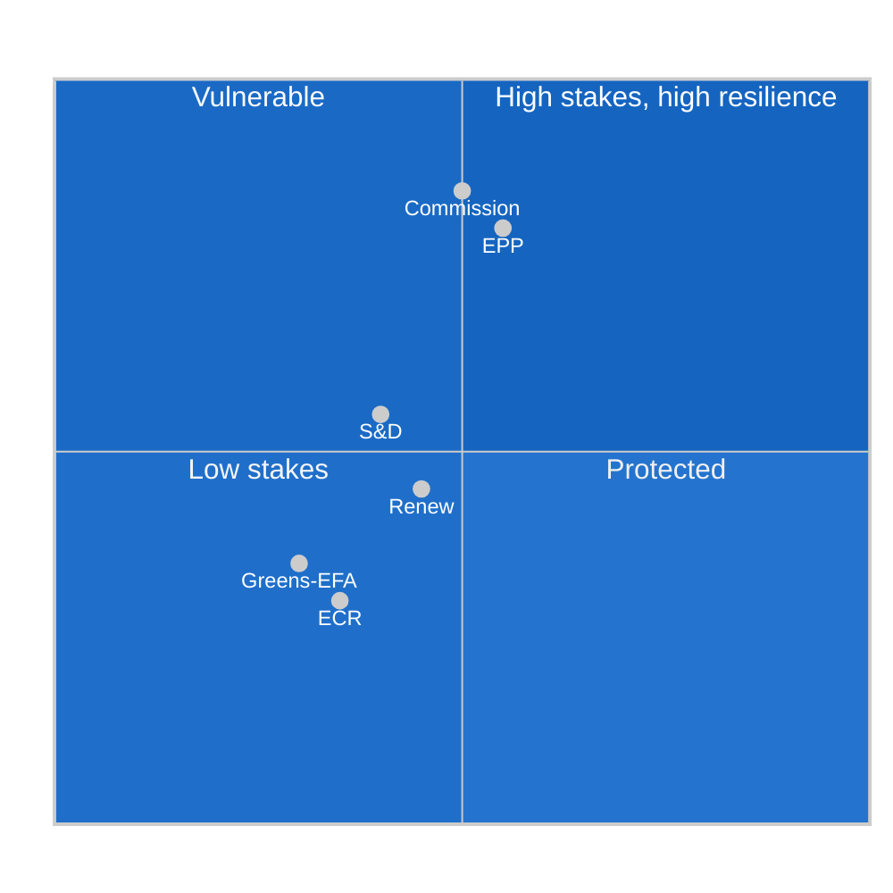

<!-- SPDX-FileCopyrightText: 2024-2026 Hack23 AB -->
<!-- SPDX-License-Identifier: Apache-2.0 -->

# Political Capital Risk — EU Parliament Month in Review: March 27 – April 26, 2026

**Framework:** Political Capital Theory (Weber + Bourdieu) applied to EU Parliamentary Politics  
**Confidence:** 🟡 Medium  

---

## Political Capital Framework

Political capital is defined as the accumulated authority, credibility, and influence that political actors spend to achieve legislative outcomes. It is finite, depleted through use, and replenished through electoral success and institutional trust accumulation.

### Political Capital Audit — Key Actors

**EPP Group:**
- **Capital Spent (March 2026):** HIGH — Banking Union completion required EPP to accept DGSD2 cross-border elements opposed by German CDU; defence cooperation with ECR/PfE required accepting far-right legitimization
- **Capital Gained (March 2026):** HIGH — Legislative productivity enhances EPP's reputation as effective governing force; AI Act Omnibus wins EPP business community gratitude
- **Net Capital Change:** +MEDIUM (gains exceed costs marginally)
- **Risk:** EPP-far right cooperation creates long-term institutional capital cost — normalization of far-right governance participation undermines EPP's "responsible centre-right" brand

**S&D Group:**
- **Capital Spent:** LOW-MEDIUM — Social Semester, Gender Pay Gap, Banking consumer protection achieved with limited coalition cost
- **Capital Gained:** MEDIUM — Social provisions in banking package demonstrate S&D relevance to financial legislation
- **Net Capital Change:** +MEDIUM-LOW
- **Risk:** Being excluded from defence majority coalition signals S&D marginalization on security issues; failure to capitalize on defence vote loss before 2029 elections

**European Commission (von der Leyen II):**
- **Capital Spent:** MEDIUM — Moving banking package required Commission to accept reduced EDIS ambitions; AI Act Omnibus required accepting simplification demanded by EPP/Renew
- **Capital Gained:** HIGH — Both packages adopted = Commission legislative record strengthened significantly
- **Net Capital Change:** +HIGH (banking + AI = transformative legacy items)

---

## Political Capital Risk Scenarios

### Scenario A: Coalition Fracture (Capital Destruction Event)
If EPP-S&D coalition fractures over rule of law conditionality, the political capital accumulated through the March 2026 legislative sprint would be retroactively reframed as "pre-fracture coalition management" rather than genuine partnership. Both EPP and S&D would suffer capital loss.  
**Probability:** 15-20% within 18 months  
**Capital Impact:** -30 to -50% for both groups

### Scenario B: BRRD3 Successful Crisis Management
If BRRD3 early intervention prevents a banking crisis, the political capital of EPP (as banking union completer) and Commission (as policy initiator) increases dramatically. Historical precedent: euro rescue 2012 increased Merkel and Draghi political capital by significant measurable amounts.  
**Probability:** 25% (requires both banking stress AND successful intervention)  
**Capital Impact:** +20 to +30% for EPP + Commission

### Scenario C: AI Harm Incident Under Simplified Act
If AI Act Omnibus's simplified framework enables deployment of an AI system that causes documented harm, political capital cost falls primarily on:
- EPP (for pushing simplification)
- Renew (for supporting)
- Von der Leyen Commission (for proposing)  
**Probability:** 10-15%  
**Capital Impact:** -15 to -25% for EPP + Commission

---

## Political Capital Risk Matrix

**Assessment**: EPP and Commission have both high capital base and meaningful risk exposure — they gained the most from March 2026 legislation but also bear the most implementation risk. S&D and Renew have lower stakes given smaller legislative ownership. ECR and Greens/EFA are in the "low stakes" quadrant because they were not central to March 2026 legislative outcomes.
