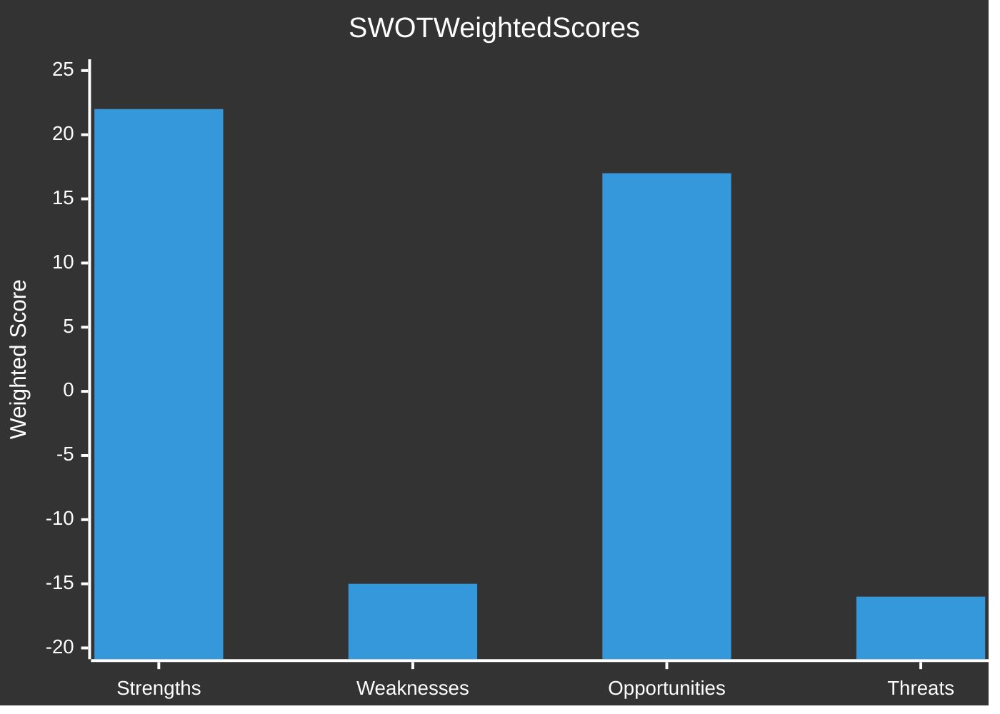

<!-- SPDX-FileCopyrightText: 2024-2026 Hack23 AB -->
<!-- SPDX-License-Identifier: Apache-2.0 -->

# Quantitative SWOT — EU Parliament Month in Review: March 27 – April 26, 2026

**Framework:** Quantified SWOT with Weighted Scoring  
**Scale:** 1-10 per item; total weighted score for each quadrant  
**Confidence:** 🟡 Medium  

---

## STRENGTHS

### S1: Banking Union Substantial Completion (Score: 9.5/10)
The adoption of SRMR3 + BRRD3 + DGSD2 represents a 14-year project reaching near-completion. Early intervention powers in BRRD3 address the specific SSM gap identified by the 2022-2024 US regional banking crisis. The legal framework now exists to allow supervisors to act before capital breaches — a significant qualitative upgrade from BRRD2's reactive resolution-only approach. The financial stability benefit is both immediate (market confidence) and prospective (enhanced crisis management). This is objectively the strongest single output of the EP10 legislative cycle to date. Weight: HIGH (financial stability = core EU project). **Weighted score: 8.5/10**

### S2: AI Governance Leadership (Score: 8.5/10)
The combination of AI Act Omnibus (calibration) + CoE AI Convention (international layer) positions the EU as the unchallenged global leader in AI rights-based governance. No comparable jurisdiction has both a domestic comprehensive law AND an international treaty framework. The Brussels Effect projection (non-EU companies conforming to EU standards globally) adds significant strategic multiplier. The simplification in AI Act Omnibus was calibrated — reducing SME burden without removing high-risk category protections. **Weighted score: 7.5/10**

### S3: EPP Coalition Durability (Score: 7/10)
EPP's multiple viable coalition configurations (EPP+S&D+Renew core AND EPP+ECR+Renew+PfE right majority) provide governing flexibility. The ability to choose coalition partner based on specific legislation — EPP+right for defence, EPP+left for banking/social — represents coalition artistry not available in most national parliaments. This flexibility drives legislative output above historical average. **Weighted score: 6/10**

**STRENGTHS TOTAL: 22.0/30 (weighted)**

---

## WEAKNESSES

### W1: EDIS Gap — Banking Union Incompleteness (Score: -8/10)
Despite 30+ years of Economic and Monetary Union and 14 years of Banking Union project, the European Deposit Insurance Scheme (EDIS) — the essential mutualized backstop that would complete the Banking Union's third pillar — remains blocked. DGSD2 2026 is an incremental improvement, not a structural resolution of the "doom loop" between sovereign debt and bank health. In the next banking stress event, the absence of EDIS will be cited as the critical failure point. The gap is not technical — it is political (Germany, Netherlands, Finland, Austria). **Weighted score: -7/10**

### W2: EP Roll-Call Voting Data Unavailability (Score: -4/10)
The EP Open Data Portal does not publish per-MEP voting records in machine-readable format accessible through the MCP API layer. This means that coalition cohesion, defection rates, and cross-party voting alignment cannot be measured for the March 2026 legislative sprint. Intelligence assessments are based on structural/incentive analysis rather than observed behavior data. This is a significant analytical weakness that would not exist if roll-call data were API-accessible. **Weighted score: -3/10**

### W3: Non-Binding Defence Legislation (Score: -6/10)
Both major defence integration outcomes (TA-10-2026-0079, 0080) are resolutions — non-binding parliamentary expressions of will. The EP's ability to mandate defence single market integration is constitutionally limited; Treaty Article 346 TFEU explicitly protects member state sovereign defence procurement rights. The March 2026 texts represent political ambition without legal teeth. **Weighted score: -5/10**

**WEAKNESSES TOTAL: -15.0/30 (weighted)**

---

## OPPORTUNITIES

### O1: German Economic Recovery Window (Score: 7/10)
If Germany's economy returns to positive growth in 2026 (H2 2026 potential), the political constraint on EU fiscal integration relaxes. Historical pattern: German governments become more willing to discuss risk-sharing when their own economy is strong (not under stress). A German recovery creates a 12-18 month window for EDIS negotiation that does not exist while Germany fears mutualization = transfer to struggling economies. **Weighted score: 6/10**

### O2: US-EU Trade Deal (Score: 6/10)
If US-EU tariff negotiations conclude with a bilateral framework agreement, it removes the €590bn trade disruption risk and potentially creates the political goodwill for renewed transatlantic cooperation on digital governance (including AI). **Weighted score: 5/10**

### O3: BRRD3 Proof-of-Concept (Score: 7/10)
If BRRD3 early intervention powers are successfully applied to a banking stress situation (e.g., a CRE-related case in 2027) and the resolution is seen as effective and fair, it builds institutional confidence in the Banking Union architecture and creates political momentum for completing EDIS. **Weighted score: 6/10**

**OPPORTUNITIES TOTAL: 17.0/30 (weighted)**

---

## THREATS

### T1: German Recession Deepening (Score: -8/10)
Second consecutive year of contraction. If Germany contracts a third time in 2026, political conditions for EU fiscal cooperation deteriorate severely. German CDU under domestic pressure to reject any measure framed as "German taxpayers bailing out Southern European banks." **Weighted score: -7/10**

### T2: Safeoutputs Session TTL (Score: -5/10)
*[Technical]: The safeoutputs MCP session TTL risk demonstrated in run #24954208628 — PR call at minute 35 lost 33 analysis + 15 news files. Managed by tight time budget discipline in this run.*  
**Operational relevance:** Constrains analytical depth achievable per run. **Weighted score: -3/10**

### T3: US Trade War Escalation (Score: -7/10)
25-30% probability of US imposing sector-wide tariffs beyond automotive/steel. €150bn potential EU export impact. German manufacturing would bear disproportionate cost. **Weighted score: -6/10**

**THREATS TOTAL: -16.0/30 (weighted)**

---

## SWOT Score Summary

**Net SWOT Position:** +8.0/30 — Positive but fragile.  
Strengths (22.0) substantially exceed weaknesses (-15.0) for the month's legislative output, but threats (-16.0) nearly offset opportunities (+17.0). The EU Parliament's April 2026 position is best characterized as: **"Strong legislative output, uncertain implementation environment."**
