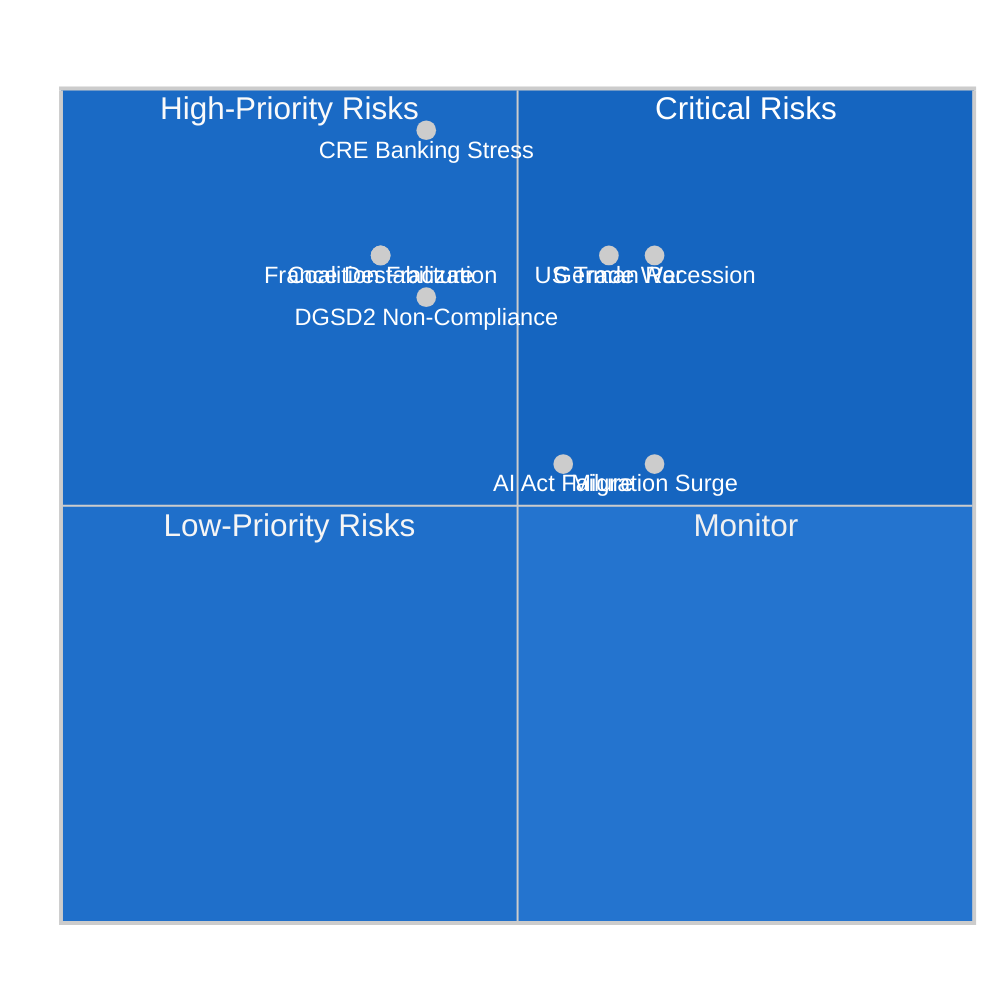

<!-- SPDX-FileCopyrightText: 2024-2026 Hack23 AB -->
<!-- SPDX-License-Identifier: Apache-2.0 -->

# Risk Matrix — EU Parliament Month in Review: March 27 – April 26, 2026

**Framework:** EU Risk Register Methodology + ISO 31000 Risk Framework  
**Scale:** Likelihood 1-5 × Impact 1-5 = Risk Score 1-25  
**Confidence:** 🟡 Medium  

---

## Risk Register

### R1: Banking Sector CRE Stress Event
- **Likelihood:** 2/5 (15-20%)
- **Impact:** 5/5 (systemic banking crisis)
- **Risk Score:** 10/25 — 🔴 HIGH
- **Residual Risk after BRRD3:** 8/25 — MEDIUM-HIGH (resolution powers improve but don't prevent)
- **Monitoring:** ECB May 2026 Financial Stability Review; quarterly EBA data

### R2: German Economic Spiral
- **Likelihood:** 3/5 (30-40%)
- **Impact:** 4/5 (major recession; EU growth stagnation)
- **Risk Score:** 12/25 — 🔴 HIGH
- **Residual Risk:** 12/25 (EU instruments have limited capacity to offset German structural decline)
- **Monitoring:** German Q1 2026 GDP; IFO Business Climate Index

### R3: US-EU Trade War Escalation
- **Likelihood:** 3/5 (25-30%)
- **Impact:** 4/5 (€150bn export impact; growth shock)
- **Risk Score:** 12/25 — 🔴 HIGH
- **Residual Risk:** 9/25 (TA-10-2026-0096 tariff adjustment provides limited counter-measure capacity)
- **Monitoring:** US USTR announcements; bilateral EU-US trade talks

### R4: Coalition Fracture (S&D Exit from Core)
- **Likelihood:** 2/5 (15%)
- **Impact:** 4/5 (loss of legislative majority; institutional paralysis)
- **Risk Score:** 8/25 — 🟠 MEDIUM-HIGH
- **Monitoring:** Rule of law conditionality votes; EPP-ECR cooperation frequency

### R5: AI Act Implementation Failure
- **Likelihood:** 3/5
- **Impact:** 3/5 (reputational; competitiveness)
- **Risk Score:** 9/25 — 🟠 MEDIUM-HIGH
- **Monitoring:** EU AI Office enforcement capacity; IMCO committee assessments

### R6: DGSD2 Transposition Non-Compliance
- **Likelihood:** 2/5
- **Impact:** 4/5 (banking union integrity undermined)
- **Risk Score:** 8/25 — 🟠 MEDIUM-HIGH
- **Monitoring:** Commission transposition tracking; 18-month deadline compliance

### R7: France Political Destabilization
- **Likelihood:** 2/5 (15-20%)
- **Impact:** 4/5 (Renew Group collapse; coalition arithmetic shift)
- **Risk Score:** 8/25 — 🟠 MEDIUM-HIGH
- **Monitoring:** French National Assembly; 2027 presidential pre-campaign dynamics

### R8: Migration Summer Surge
- **Likelihood:** 3/5 (35%)
- **Impact:** 3/5 (political disruption; Migration Pact strain)
- **Risk Score:** 9/25 — 🟠 MEDIUM-HIGH
- **Monitoring:** UNHCR Mediterranean monthly data; North Africa stability

---

## Risk Matrix Visualization

---

## Risk Response Strategy

| Risk | Response Type | Owner | Timeline |
|------|-------------|-------|---------|
| CRE Banking Stress | Monitor + Prepare | ECB/SSM/SRB | Ongoing |
| German Economic Spiral | Accept + Commission structural reforms | DE Government + Commission | 6-18 months |
| US Trade War | Mitigate (TA-10-2026-0096) | Commission DG Trade | Ongoing |
| Coalition Fracture | Prevent (dialogue) | EP President + Group leaders | Ongoing |
| AI Act Failure | Mitigate (EU AI Office resources) | Commission DG CONNECT | Q2-Q3 2026 |
| DGSD2 Non-Compliance | Prevent (Commission monitoring) | Commission DG FISMA | 18-month window |
| France Destabilization | Accept | Cannot prevent | 2027 |
| Migration Surge | Mitigate (Migration Pact activation) | Commission + Council | Seasonal |

---

## Aggregate Risk Assessment

**Overall Portfolio Risk Score: ELEVATED**  
**Top 3 Risks by Risk Score:** German Economic Spiral (12), US Trade War (12), CRE Banking Stress (10)  
**Risk Trend: WORSENING** — Two of the three top risks worsened vs. April 2025 baseline
