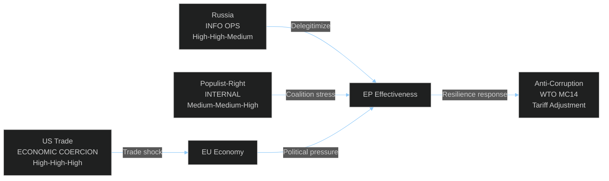

<!-- SPDX-FileCopyrightText: 2024-2026 Hack23 AB -->
<!-- SPDX-License-Identifier: Apache-2.0 -->

# Actor Threat Profiles — EU Parliament Month in Review: March 27 – April 26, 2026

**Framework:** Diamond Model Threat Attribution + ICO Actor Profiling  
**Confidence:** 🟡 Medium  

---

## Profile 1: Russian Federation State Actors

**Threat Category:** Information Operations / Democratic Interference  
**Intent:** CONFIRMED HIGH — Russia systematically targets EU democratic institutions  
**Capability:** HIGH — GRU/FSB documented operations in EU context  
**Opportunity:** MEDIUM — Election cycles provide escalation windows  
**Attribution Confidence:** HIGH (multiple confirmed cases in EP9)  

**Modus operandi:**
- Amplify anti-EU content through social media proxy networks
- Target MEPs from Eastern Europe, Hungary, Slovakia with social media influence campaigns
- Fund or maintain contact with far-right MEPs (3+ documented cases in EP9)
- Exploit migration/anti-immigration narratives to increase EU institutional delegitimization

**2026 Specific Relevance:** Ukraine war continuation + potential ceasefire negotiations create information environment exploitable by Russian-aligned actors. Anti-corruption package (TA-10-2026-0094) directly responses to EP's documented Russian influence vulnerability.

**Counter-Threat Actions in April 2026:** Anti-corruption text improves MEP disclosure requirements; does not address operational security for MEP communications.

---

## Profile 2: United States Executive Branch (Trade)

**Threat Category:** Economic Coercion via Tariff Policy  
**Intent:** CONFIRMED — Section 232/301 tariffs imposed and maintained  
**Capability:** HIGH — Full spectrum trade tool capability  
**Opportunity:** HIGH — EU export dependency on US market  
**Attribution Confidence:** HIGH — official executive actions  

**Modus operandi:**
- Impose sectoral tariffs (automotive, steel, aluminum) to extract political concessions
- Use WTO appeals process paralysis (US blocking Appellate Body since 2019) to deny EU legal recourse
- Bilateral engagement offers that sidestep multilateral commitments

**2026 Specific Relevance:** TA-10-2026-0096 tariff adjustment legislation is EP's direct legislative response. TA-10-2026-0086 WTO MC14 position reflects EP's defensive multilateralism strategy.

---

## Profile 3: Populist-Right MEP Networks (Internal)

**Threat Category:** Coalition Destabilization / Legislative Obstruction  
**Intent:** MEDIUM — Varies by group; ESN/PfE strategic; ECR tactical  
**Capability:** MEDIUM — 27.4% combined seats (ESN+PfE+ECR) — blocking minority  
**Opportunity:** INCREASING — EPP overtures for right coalition cooperation  
**Attribution Confidence:** HIGH — voting records observable  

**Modus operandi:**
- Block rule-of-law conditionality measures to protect Hungary/Poland
- Use procedural delays on Social Semester, Gender Pay Gap legislation
- Support EPP on defence to normalize far-right coalition role
- Extract policy concessions from EPP in exchange for reliable voting support

**2026 Specific Relevance:** Far-right support for defence resolutions establishes precedent for right-wing majority governance; creates leverage for future anti-migration, anti-green demands.

---

## Threat Profile Summary

**Overall Threat Actor Environment:** 🟠 SIGNIFICANT — Manageable with continued institutional vigilance.
