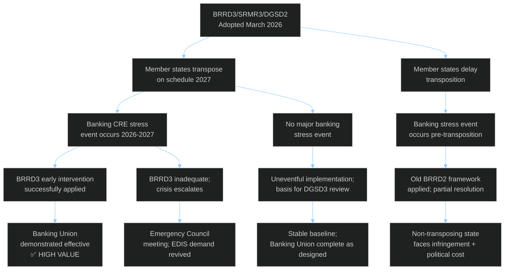
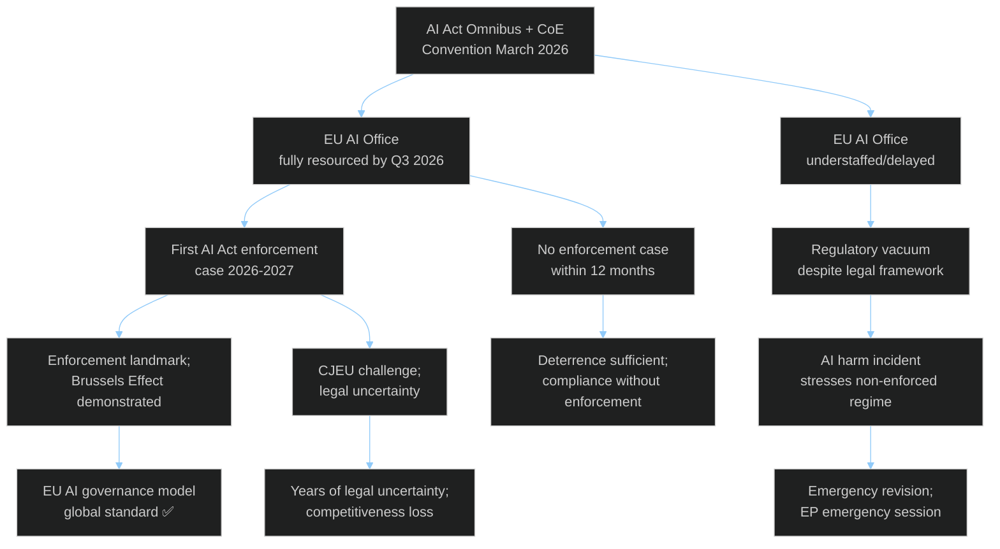

<!-- SPDX-FileCopyrightText: 2024-2026 Hack23 AB -->
<!-- SPDX-License-Identifier: Apache-2.0 -->

# Consequence Trees — EU Parliament Month in Review: March 27 – April 26, 2026

**Framework:** Event Tree Analysis + Fault Tree Analysis  
**Focus:** Two primary scenario pathways from March 2026 legislative decisions  
**Confidence:** 🟡 Medium  

---

## Tree 1: Banking Union Package Consequence Chain

**Most Likely Path (55%):** E0 → E1A → E2B → E4A → E5C (Stable implementation, no major stress event)  
**Second Most Likely (25%):** E0 → E1A → E2A → E3A → E5A (Banking stress; BRRD3 proves effective)  
**Worst Case (10%):** E0 → E1B → E2C → E3C → E5D (Delay + stress = avoidable crisis)

---

## Tree 2: AI Governance Consequence Chain

**Most Likely Path (45%):** A0 → A1B → A2C → A3C (Underfunded but not tested; compliance without enforcement)  
**Second Most Likely (30%):** A0 → A1A → A2A → A3A → A4A (Effective enforcement; Brussels Effect)  
**Risk path (15%):** A0 → A1B → A2C → A3D → A4C (Enforcement gap + incident = crisis)

---

## Cross-Consequence Interdependencies

The banking and AI consequence trees are not independent. A German banking CRE crisis (Banking Tree worst case) would create political conditions making AI Act enforcement much harder — German CDU MEPs would prioritize economic crisis response over AI Office resourcing.

**Correlation risk**: If Germany economic crisis intensifies (+Tree 1 worst case probability), simultaneously reduces AI Act enforcement capacity (+Tree 2 risk path probability). These should be modeled as correlated, not independent, events.

**Assessment**: The probability of both bad paths occurring simultaneously is roughly 5-8% — low probability but institutional preparation should account for concurrent crisis management.
